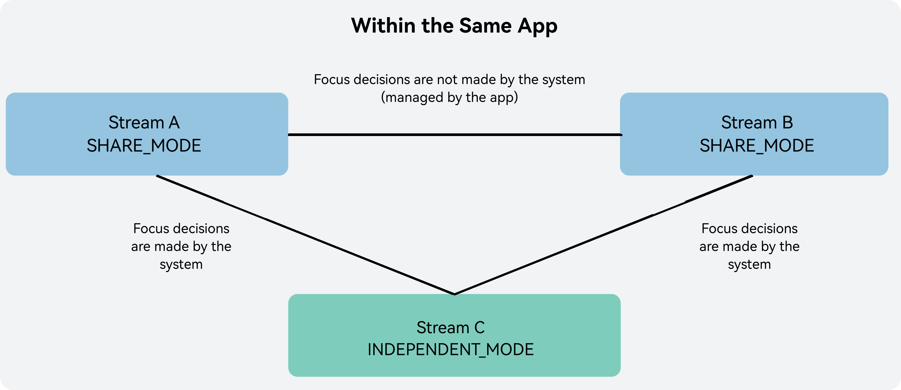

# Introduction to Audio Focus

<!--Kit: Audio Kit-->
<!--Subsystem: Multimedia-->
<!--Owner: @funny_sunix-->
<!--Designer: @hao-liangfei-->
<!--Tester: @Filger-->
<!--Adviser: @w_Machine_cc-->
<!-- md-trans-meta sourceCommit=249567c57853ff4ccedf632ba69d388b5f14b19c translatedAt=2026-08-06T01:46:34.828Z pushedAt=2026-08-06T07:10:07.439Z -->

## Audio Focus Overview

When an application plays or records a sound, conflicts with other audio streams may occur, adversely affecting user experience. For example, when a video starts playing while music is playing in the background, users expect the music to pause to prioritize the video's audio. This is where audio focus comes into play. For applications that provide audio services, it is important to properly manage audio focus, which can significantly improve the audio experience of users.

This document describes the system's audio focus policy and how to respond to focus changes. The system also provides an [audio session management](audio-session-management.md) mechanism, allowing apps to customize the focus policy for their audio streams.

## Cross-App Audio Focus Management

The system has a default [audio focus strategy](#audio-focus-strategy) that manages all playback and recording audio streams based on their types and the order in which they initiate.

When starting playback or recording, the system automatically [requests audio focus](#requesting-audio-focus) for the corresponding audio stream. After playback or recording ends, the system automatically [releases audio focus](#releasing-audio-focus). During playback or recording, focus may be lost due to the intervention of other audio streams. In this case, the app must take appropriate measures based on the focus change to [handle audio focus changes](#handling-audio-focus-changes).

To ensure a superior audio focus experience for users, applications should:

- Before starting playback, [select an appropriate playback stream type](using-right-streamusage-for-playback.md) based on the specific use of the audio, by accurately setting [StreamUsage](../../reference/apis-audio-kit/arkts-apis-audio-e.md#streamusage).

- During playback or recording, [handle audio focus changes](#handling-audio-focus-changes) by monitoring audio focus events, and take appropriate measures when receiving an audio focus interrupt event ([InterruptEvent](../../reference/apis-audio-kit/arkts-apis-audio-i.md#interruptevent9)).

- To actively manage audio focus, use the APIs related to [audio session management](audio-session-management.md).

### Requesting Audio Focus

When an application starts to play or record audio, the system automatically requests audio focus for that audio stream.

For example, when an app [uses AudioRenderer for audio playback (ArkTS)](using-audiorenderer-for-playback.md) and calls [start](../../reference/apis-audio-kit/arkts-apis-audio-AudioRenderer.md#start8) of AudioRenderer, the system automatically requests audio focus for the app.

If the audio focus request is successful, the audio stream starts normally; otherwise, the audio stream fails to start.

It is recommended that the app proactively [handles audio focus changes](#handling-audio-focus-changes) by monitoring audio focus events. If the audio focus request is rejected, the app receives an audio focus event ([InterruptEvent](../../reference/apis-audio-kit/arkts-apis-audio-i.md#interruptevent9)).

If an app wants to request focus only once and play multiple audio streams consecutively without interruption, it can use the APIs related to [audio session management](audio-session-management.md).

**Special scenarios:**

1. **Short sound playback**: If the app [uses SoundPool to play short sounds (ArkTS)](../media/using-soundpool-for-playback.md) and [StreamUsage](../../reference/apis-audio-kit/arkts-apis-audio-e.md#streamusage) is set to Music, Movie, AudioBook, or other types for short sound playback, the focus request defaults to concurrent mode and does not affect other audio.

2. **Silent playback**: If an application starts to play audio (or video) in mute mode and intends to avoid affecting other audio during the mute phase, and then seeks audio focus with a standard strategy when unmuting, it can call APIs related to the silent concurrent playback mode. For details, see:

   - [setMediaMuted](../../reference/apis-media-kit/arkts-apis-media-AVPlayer.md#setmediamuted12) function: [Using AVPlayer to Play Audio (ArkTS)](../media/using-avplayer-for-playback.md)

   - [Use AudioRenderer for audio playback (ArkTS)](using-audiorenderer-for-playback.md) and call the [setSilentModeAndMixWithOthers](../../reference/apis-audio-kit/arkts-apis-audio-AudioRenderer.md#setsilentmodeandmixwithothers12) function.

   - [Use OHAudio for audio playback (C/C++)](using-ohaudio-for-playback.md) and call the [OH_AudioRenderer_SetSilentModeAndMixWithOthers](../../reference/apis-audio-kit/capi-native-audiorenderer-h.md#oh_audiorenderer_setsilentmodeandmixwithothers) function.

### Releasing Audio Focus

When an application stops playing or recording audio, the system automatically releases audio focus for that audio stream.

For example, when an app [uses AudioRenderer for audio playback (ArkTS)](using-audiorenderer-for-playback.md) and calls [pause](../../reference/apis-audio-kit/arkts-apis-audio-AudioRenderer.md#pause8), [stop](../../reference/apis-audio-kit/arkts-apis-audio-AudioRenderer.md#stop8), or [release](../../reference/apis-audio-kit/arkts-apis-audio-AudioRenderer.md#release8) of AudioRenderer, the system releases audio focus for it.

After the audio focus is released, other audio streams (for example, streams with reduced volume or paused streams) affected by the audio stream will be resumed.

If an app prefers not to release audio focus immediately when the audio stream stops, it can use the APIs related to [audio session management](audio-session-management.md) to delay the release of audio focus.

If an app has requested focus by activating an [audio session](audio-session-management.md), it must deactivate the AudioSession to release focus.

### Audio Focus Strategy

When an audio stream requests or releases audio focus, the system manages focus for all audio streams (including playback and recording) based on the audio focus strategy to determine which audio streams can run properly and which need to be interrupted or perform other operations.

The system's default audio focus strategy is determined based on the audio stream type ([StreamUsage](../../reference/apis-audio-kit/arkts-apis-audio-e.md#streamusage) for playback streams and [SourceType](../../reference/apis-audio-kit/arkts-apis-audio-e.md#sourcetype8) for recording streams) and the sequence in which the audio streams start.

To prevent unexpected focus changes, accurately set StreamUsage based on the usage of the audio stream before starting playback. For details about each type, see [Choosing the Right Playback Stream Type](using-right-streamusage-for-playback.md).

Common audio focus scenarios are as follows:

- When a Movie stream starts playing, the Music stream that is playing will be paused. When the Movie stream ends, the Music stream will not receive any resume notification.

- When a Navigation stream starts playing, the Music stream that is playing will be ducked. When the Navigation stream ends, the volume of the Music stream will be restored.

- A Music stream and a Game stream can be mixed and played concurrently without affecting each other.

- When a VoiceCommunication stream starts playing, the Music stream that is playing will be paused. When the VoiceCommunication stream ends, the Music stream will receive a notification to resume playback.

- When a VoiceMessage stream starts recording, the Music stream will be paused. When the VoiceMessage recording ends, the Music stream will receive a notification to resume playback.

If the default audio focus policy cannot meet the requirements of specific scenarios, the app can use [audio session management](audio-session-management.md) to adjust the audio focus policy used by its audio streams.

### Handling Audio Focus Changes

During audio playback or recording, if another audio stream requests focus, the system handles focus based on the [audio focus strategy](#audio-focus-strategy). If it determines that the focus of this audio stream has changed and operations such as pause, resume, duck, or unduck are required, the system automatically performs necessary operations and notifies the app through an audio focus event ([InterruptEvent](../../reference/apis-audio-kit/arkts-apis-audio-i.md#interruptevent9)).

To maintain state consistency between the application and system and ensure a positive user experience, it is recommended that the application listen for audio focus events (specified by [InterruptEvent](../../reference/apis-audio-kit/arkts-apis-audio-i.md#interruptevent9)) and respond appropriately to the event when focus changes.

The manners for listening for audio focus events vary according to the development modes:

- If you [use AVPlayer for audio playback (ArkTS)](../media/using-avplayer-for-playback.md), call [on('audioInterrupt')](../../reference/apis-media-kit/arkts-apis-media-AVPlayer.md#onaudiointerrupt9) to listen for [InterruptEvent](../../reference/apis-audio-kit/arkts-apis-audio-i.md#interruptevent9).

- If you [use AVPlayer for audio playback (C/C++)](../media/using-ndk-avplayer-for-playback.md), call [OH_AVPlayer_SetOnInfoCallback()](../../reference/apis-media-kit/capi-avplayer-h.md#oh_avplayer_setoninfocallback) to listen for [OH_AVPlayerOnInfoCallback](../../reference/apis-media-kit/capi-avplayer-base-h.md#oh_avplayeroninfocallback).

- If you [use AudioRenderer for audio playback (ArkTS)](using-audiorenderer-for-playback.md), call [on('audioInterrupt')](../../reference/apis-audio-kit/arkts-apis-audio-AudioRenderer.md#onaudiointerrupt9) to monitor the audio focus event [InterruptEvent](../../reference/apis-audio-kit/arkts-apis-audio-i.md#interruptevent9).

- If you [use OHAudio for audio playback (C/C++)](using-ohaudio-for-playback.md), call [OH_AudioStreamBuilder_SetRendererCallback](../../reference/apis-audio-kit/capi-native-audiostreambuilder-h.md#oh_audiostreambuilder_setrenderercallback) to monitor the audio focus event [OH_AudioRenderer_OnInterruptEvent](../../reference/apis-audio-kit/capi-ohaudio-oh-audiorenderer-callbacks-struct.md#oh_audiorenderer_oninterruptevent).

- If you [use AudioCapturer for audio recording (ArkTS)](using-audiocapturer-for-recording.md), call [on('audioInterrupt')](../../reference/apis-audio-kit/arkts-apis-audio-AudioCapturer.md#onaudiointerrupt10) to monitor the audio focus event [InterruptEvent](../../reference/apis-audio-kit/arkts-apis-audio-i.md#interruptevent9).

- If you [use OHAudio for audio recording (C/C++)](using-ohaudio-for-recording.md), call [OH_AudioStreamBuilder_SetCapturerCallback](../../reference/apis-audio-kit/capi-native-audiostreambuilder-h.md#oh_audiostreambuilder_setcapturercallback) to monitor the audio focus event [OH_AudioCapturer_OnInterruptEvent](../../reference/apis-audio-kit/capi-ohaudio-oh-audiocapturer-callbacks-struct.md#oh_audiocapturer_oninterruptevent).

When receiving an audio focus event (specified by [InterruptEvent](../../reference/apis-audio-kit/arkts-apis-audio-i.md#interruptevent9)), applications must perform corresponding processing based on the information in the event to maintain consistency with the system state and deliver a quality audio experience to users.

In an audio focus event, applications should pay attention to two key pieces of information: **InterruptForceType** and **InterruptHint**.

- [InterruptForceType](../../reference/apis-audio-kit/arkts-apis-audio-e.md#interruptforcetype9):

  This parameter specifies whether the focus change is forcibly performed by the system.

  - **INTERRUPT_FORCE**: enforced by the system. After receiving an interruption notification, the application does not need to call any system API. It just needs to perform necessary processing, such as updating the status and UI display.

  - **INTERRUPT_SHARE**: managed by the application, which can choose to respond or ignore, without system interference.

  By default, the system preferentially uses **INTERRUPT_FORCE**.

  > **NOTE**
  >
  > For operations that cannot be forcibly performed by the system (for example, **INTERRUPT_HINT_RESUME**), **INTERRUPT_SHARE** is used.

- [InterruptHint](../../reference/apis-audio-kit/arkts-apis-audio-e.md#interrupthint):

  This parameter is used to notify the application of the audio stream status.

  - Resume (**INTERRUPT_HINT_RESUME**): The audio stream can resume playback or recording. This is received only after a PAUSE event.

    This operation cannot be forcibly performed by the system, and the corresponding **InterruptForceType** must be **INTERRUPT_SHARE**.

  - **INTERRUPT_HINT_PAUSE**: The audio stream is paused and audio focus is lost temporarily. When focus is available, **INTERRUPT_HINT_RESUME** will be received.

  - **INTERRUPT_HINT_STOP**: The audio stream stops and audio focus is lost.

  - **INTERRUPT_HINT_DUCK**: The audio stream should lower its volume but continue playing, defaulting to 20% of the normal volume.

  - **INTERRUPT_HINT_UNDUCK**: The audio stream should return to its normal volume.

### Typical Scenarios

The following table lists typical focus adaptation scenarios.

| Audio Type of Application A      | Recommended Stream Type        | Audio Type of Application B| Recommended Stream Type           | Recommended User Experience                                                    | Adaptation Solution                                                    |
| ---------------- | ------------------ | ------------ | --------------------- | ------------------------------------------------------------ | ------------------------------------------------------------ |
| Music        | STREAM_USAGE_MUSIC | Music        | STREAM_USAGE_MUSIC    | Application A stops playing the music, and the UI displays the stopped state. Application B plays the music normally.| Application A listens for audio focus events. When it receives the **INTERRUPT_HINT_STOP** event, it stops music playback and updates its UI.|
| Music        | STREAM_USAGE_MUSIC | Navigation        | STREAM_USAGE_NAVIGATION    | The navigation is played properly, and the music volume is decreased.<br>After the navigation ends, the music volume is restored to normal.| Application A listens for audio focus events. When it receives the **INTERRUPT_HINT_DUCK** and **INTERRUPT_HINT_UNDUCK** events, it updates its UI.|
| Video          | STREAM_USAGE_MOVIE | Alarm        | STREAM_USAGE_ALARM    | When the alarm rings, the video playback pauses.<br>When the alarm ends, the video playback resumes.        | Application A listens for audio focus events. When it receives the INTERRUPT_HINT_PAUSE event, it pauses video playback and updates its UI.<br>When the alarm ends, application A receives the **INTERRUPT_HINT_RESUME** event and restarts the playback.|
| Music        | STREAM_USAGE_MUSIC | Ringtone    | STREAM_USAGE_RINGTONE | When the phone rings, the music playback pauses.<br>When the call is not connected or the call is connected and then ended, the music playback resumes.| Application A listens for audio focus events. When it receives the INTERRUPT_HINT_PAUSE event, it pauses music playback and updates its UI.<br>When the call ends, application A receives the **INTERRUPT_HINT_RESUME** event and restarts the playback.|
| Music        | STREAM_USAGE_MUSIC | VoIP call    | STREAM_USAGE_VOICE_COMMUNICATION | When a call is connected, the music playback pauses.<br>When the call ends, the music playback resumes.| Application A listens for audio focus events.<br>When it receives the INTERRUPT_HINT_PAUSE event, it pauses music playback and updates its UI.<br>When the call ends, application A receives the **INTERRUPT_HINT_RESUME** event and restarts the playback.|

**Example of handling audio focus:**

To deliver a better audio experience for users, the app must perform corresponding processing based on different audio focus event content. The following uses [AudioRenderer for audio playback (ArkTS)](using-audiorenderer-for-playback.md) as an example to demonstrate the recommended processing approach, with pseudocode for your reference.

Before listening for audio playback focus change events, you must obtain an [AudioRenderer](../../reference/apis-audio-kit/arkts-apis-audio-f.md#audiocreateaudiorenderer8) instance. If you use other APIs to develop audio playback or recording, the processing method is similar. You can compile the code based on service requirements or adjust the processing methods as needed.

<!-- @[renderer_interrupt](https://gitcode.com/openharmony/applications_app_samples/blob/master/code/DocsSample/Media/Audio/AudioSessionSampleJS/entry/src/main/ets/pages/Index.ets) -->  

``` TypeScript
import { audio } from '@kit.AudioKit';
import { BusinessError } from '@kit.BasicServicesKit';
// ...

let isPlaying: boolean; // Whether audio is playing. In actual development, this corresponds to the module related to the audio playback state.
let isDucked: boolean; // Whether the volume is lowered. In actual development, this corresponds to the module related to the audio volume.
let started: boolean; // An identifier specifying whether the start operation is successful.

async function onAudioInterrupt(): Promise<void> {
  if (audioRenderer == undefined) {
    return;
  }
  // The AudioRenderer is used as an example to describe how to develop audio playback. The audioRenderer variable is the AudioRenderer instance created for playback.
  audioRenderer.on('audioInterrupt', async(interruptEvent: audio.InterruptEvent) => {
    // ...
    // When audio focus changes, the AudioRenderer receives the interruptEvent callback and performs processing based on the content in the callback.
    // 1. (Optional) The AudioRenderer reads the value of interruptEvent.forceType to see whether the system has forcibly performed the operation.
    // Note: In the default focus strategy, INTERRUPT_HINT_RESUME maps to the force type INTERRUPT_SHARE, and others map to INTERRUPT_FORCE. Therefore, the value of forceType does not need to be checked.
    // 2. (Mandatory) The AudioRenderer then reads the value of interruptEvent.hintType and performs corresponding processing.
    if (interruptEvent.forceType === audio.InterruptForceType.INTERRUPT_FORCE) {
      // If the value of interruptEvent.forceType is INTERRUPT_FORCE, the system has performed audio-related processing, and the application needs to update its state and make adjustments accordingly.
      switch (interruptEvent.hintType) {
        case audio.InterruptHint.INTERRUPT_HINT_PAUSE:
          // The system has paused the audio stream (focus is temporarily lost). To ensure state consistency, the application needs to switch to the audio paused state.
          // Temporarily losing focus: After other audio streams release focus, the current audio stream will receive the audio focus event corresponding to resume and automatically resume the playback.
          isPlaying = false; // This line is a simplified representation of the operations for switching the app to the audio pause state.
          break;
        case audio.InterruptHint.INTERRUPT_HINT_STOP:
          // The system has stopped the audio stream (focus is permanently lost). To ensure state consistency, the application needs to switch to the audio paused state.
          // Permanently losing focus: No audio focus event will be received. The user must manually trigger the operation to resume playback.
          isPlaying = false; // This line is a simplified representation of the operations for switching the app to the audio pause state.
          break;
        case audio.InterruptHint.INTERRUPT_HINT_DUCK:
          // The system has ducked the volume down (to 20% of the normal volume by default).
          isDucked = true; // A simplified processing indicating several operations for switching the application to the volume decreased state.
          break;
        case audio.InterruptHint.INTERRUPT_HINT_UNDUCK:
          // The system has restored the audio volume to normal.
          isDucked = false; // A simplified processing indicating several operations for switching the application to the normal volume state.
          break;
        default:
          break;
      }
    } else if (interruptEvent.forceType === audio.InterruptForceType.INTERRUPT_SHARE) {
      // If the value of interruptEvent.forceType is INTERRUPT_SHARE, the application can take action or ignore as required.
      switch (interruptEvent.hintType) {
        case audio.InterruptHint.INTERRUPT_HINT_RESUME:
          // The paused audio stream can be played. It is recommended that the application continue to play the audio stream and switch to the audio playing state.
          // If the application does not want to continue the playback, it can ignore the event.
          // To continue the playback, the application needs to call start(), and use the identifier variable started to record the execution result of start().
          if (audioRenderer == undefined) {
            return;
          }
          try {
            await audioRenderer.start();
            started = true;
          } catch (err) {
            let error = err as BusinessError;
            console.error(`Failed to start audio renderer. Code: ${error.code}, message: ${error.message}`);
            started = false;
          }
          // If calling start() is successful, the application needs to switch to the audio playing state.
          if (started) {
            isPlaying = true; // This line is a simplified representation of the operations for switching the app to the audio playback state.
          } else {
            // Resuming the audio playback fails.
          }
          break;
        default:
          break;
      }
    }
  });
}
```

## In-App Focus Management

For multiple audio streams created by the same app, the app can set the focus mode ([InterruptMode](../../reference/apis-audio-kit/arkts-apis-audio-e.md#interruptmode9)) to either self-manage them or allow the system to manage them uniformly.

The system preset focus modes are as follows:

| Focus Mode | Description | Specification |
|---------|----------|-------------------|
| SHARE_MODE (default, recommended) | **Shared focus mode**: The system does not make focus decisions. The app decides the playback, pause, duck, and other operations of each stream on its own. | No focus decisions are made between this stream and other SHARE_MODE streams within the same app; the app manages them on its own.<br>Focus decisions between INDEPENDENT_MODE streams within the same app are made by the system. |
| INDEPENDENT_MODE | **Independent focus mode**: The system makes focus decisions and manages streams based on the cross-app focus policy. | Focus decisions are made by the system for all streams within the same app (whether SHARE_MODE or INDEPENDENT_MODE). |

**Specification legend:**



The shared focus mode (**SHARE_MODE**) is recommended. The app can manage the playback, pause, and resume operations of each stream as needed, avoiding the situation where the system default policy (such as **STOP**) prevents audio streams from being resumed.

Methods for setting the focus mode:

- If you [use AVPlayer for audio playback (ArkTS)](../media/using-avplayer-for-playback.md), set it by modifying the [audioInterruptMode](../../reference/apis-media-kit/arkts-apis-media-AVPlayer.md#attributes) attribute of AVPlayer.

- If you [use AVPlayer for audio playback (C/C++)](../media/using-ndk-avplayer-for-playback.md), call the [OH_AVPlayer_SetAudioInterruptMode](../../reference/apis-media-kit/capi-avplayer-h.md#oh_avplayer_setaudiointerruptmode) function to set it.

- If you [use AudioRenderer for audio playback (ArkTS)](using-audiorenderer-for-playback.md), call the [setInterruptMode](../../reference/apis-audio-kit/arkts-apis-audio-AudioRenderer.md#setinterruptmode9) function to set it.

- If you [use OHAudio for audio playback (C/C++)](using-ohaudio-for-playback.md), call the [OH_AudioStreamBuilder_SetRendererInterruptMode](../../reference/apis-audio-kit/capi-native-audiostreambuilder-h.md#oh_audiostreambuilder_setrendererinterruptmode) function to set it.

Common in-app focus management practices are as follows. You can refer to these practices to manage streams in other scenarios.

**Practice: Music interrupting music within the same app**

Stream A is playing music (**STREAM_USAGE_MUSIC**), and stream B is about to start playing music (**STREAM_USAGE_MUSIC**). In this case, two media audio streams are concurrent within the same app, and the focus conflict between them must be handled.

Recommended approach: Use the default focus mode (**SHARE_MODE**), where the app manages the playback and resumption of each stream on its own. When stream B starts playing, the app actively pauses stream A. When stream B stops playing, the app actively resumes stream A. This is superior to the independent focus mode (**INDEPENDENT_MODE**), where the system stops the stream without resuming it.

<!-- @[toggle_stream_b](https://gitcode.com/openharmony/applications_app_samples/blob/master/code/DocsSample/Media/Audio/AudioIntraAppFocusSample/entry/src/main/ets/pages/MusicVsMusicPage.ets) -->

``` TypeScript
async toggleStreamB() { // Toggle the playback state of stream B.
  await this.initStreams(); // Lazily initialize the two audio streams. Create the Renderer only on first playback.
  if (this.streamBPlaying) { // Stream B is playing. The user wants to stop stream B.
    // ...
    if (this.streamAPausedByApp) { // Stream A was paused by the app's own management. After stopping stream B, stream A should be automatically resumed.
      this.streamAPausedByApp = false; // Clear the flag. Stream A is about to resume and is no longer in the managed-pause state.
      await this.streamA.startPlay(); // Resume the audio output of stream A, completing the pause-to-resume transition.ume.
      this.promptAction.showToast({
        message: $r('app.string.app_control_stream_a_auto_resume'),
        duration: TOAST_DURATION
      });
    }
  } else { // Stream B is not playing. The user wants to start playback of stream B.
    if (this.appControl && this.currentMode === InterruptMode.SHARE_MODE && 
    this.streamAPlaying) { // Stream A is playing. Pause stream A.
      await this.streamA.pausePlay(); // Actively pause stream A so that it can be resumed later, rather than letting the system stop stream A, which would make it unrecoverable.
      this.streamAPausedByApp = true; // Mark stream A as paused by the app's management. After stream B stops, stream A needs to be automatically resumed.
      this.promptAction.showToast({ message: $r('app.string.app_control_stream_a_pause'),
       duration: TOAST_DURATION });
    }
    await this.streamB.startPlay(); // Start the audio output of stream B.
  }
}
```

In independent focus mode (**INDEPENDENT_MODE**), the policy between music streams is stop — the subsequently playing stream stops the previously playing stream, and the previously playing stream does not receive a resume event and cannot be automatically resumed.