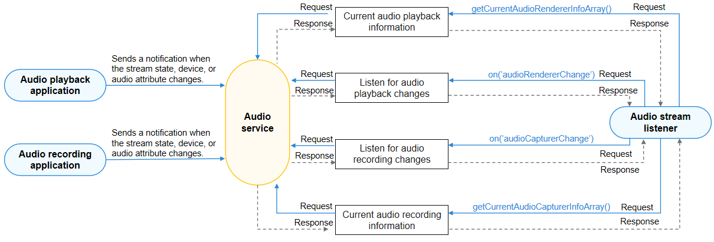

# Audio Playback Stream Management
<!--Kit: Audio Kit-->
<!--Subsystem: Multimedia-->
<!--Owner: @songshenke-->
<!--Designer: @caixuejiang; @hao-liangfei; @zhanganxiang-->
<!--Tester: @Filger-->
<!--Adviser: @zengyawen-->

An audio playback application must notice audio stream state changes and perform corresponding operations. For example, when detecting that an audio stream is being played or paused, the application must change the UI display of the **Play** button.

## Reading or Listening for Audio Stream State Changes in the Application

Create an AudioRenderer by referring to [Using AudioRenderer for Audio Playback](using-audiorenderer-for-playback.md) or [audio.createAudioRenderer](../../reference/apis-audio-kit/arkts-apis-audio-f.md#audiocreateaudiorenderer8). Then obtain the audio stream state changes in either of the following ways:

- Check the [state](../../reference/apis-audio-kit/arkts-apis-audio-AudioRenderer.md#properties) of the AudioRenderer.
    
  ```ts
  import { audio } from '@kit.AudioKit';
  
  let audioRendererState: audio.AudioState = audioRenderer.state;
  console.info(`Current state is: ${audioRendererState }`)
  ```

- Register **stateChange** to listen for state changes of the AudioRenderer.
    
  ```ts
  import { audio } from '@kit.AudioKit';
  
  audioRenderer.on('stateChange', (rendererState: audio.AudioState) => {
    console.info(`State change to: ${rendererState}`)
  });
  ```

The application then performs an operation, for example, changing the display of the **Play** button, by comparing the obtained state with [AudioState](../../reference/apis-audio-kit/arkts-apis-audio-e.md#audiostate8).

## Reading or Listening for Changes in All Audio Streams

If an application needs to obtain the change information about all audio streams, it can use AudioStreamManager to read or listen for the changes of all audio streams.

<!--Del-->
> **NOTE**
> 
> The audio stream change information marked as the system API can be viewed only by system applications.
<!--DelEnd-->

The figure below shows the call relationship of audio stream management.



During application development, first use **getStreamManager()** to create an AudioStreamManager instance. Then call **on('audioRendererChange')** to listen for audio stream changes and obtain a notification when the audio stream state or device changes. To cancel the listening for these changes, call **off('audioRendererChange')**. You can also call **getCurrentAudioRendererInfoArray()** to obtain information such as the unique ID of the playback stream, UID of the playback stream client, and stream status.

For details about the APIs, see [AudioStreamManager](../../reference/apis-audio-kit/arkts-apis-audio-AudioStreamManager.md).

## How to Develop

1. Create an AudioStreamManager instance.
   
   Before using AudioStreamManager APIs, you must use **getStreamManager()** to create an AudioStreamManager instance.

   ```ts
   import { audio } from '@kit.AudioKit';
   
   let audioManager = audio.getAudioManager();
   let audioStreamManager = audioManager.getStreamManager();
   ```

2. Use **on('audioRendererChange')** to listen for audio playback stream changes. If the application needs to receive a notification when the audio playback stream state or device changes, it can subscribe to this event.
     
   ```ts
   import { audio } from '@kit.AudioKit';
   
   audioStreamManager.on('audioRendererChange',  (AudioRendererChangeInfoArray: audio.AudioRendererChangeInfoArray) => {
     for (let i = 0; i < AudioRendererChangeInfoArray.length; i++) {
       let AudioRendererChangeInfo = AudioRendererChangeInfoArray[i];
       console.info(`## RendererChange on is called for ${i} ##`);
       console.info(`StreamId for ${i} is: ${AudioRendererChangeInfo.streamId}`);
       console.info(`Content ${i} is: ${AudioRendererChangeInfo.rendererInfo.content}`);
       console.info(`Stream ${i} is: ${AudioRendererChangeInfo.rendererInfo.usage}`);
       console.info(`Flag ${i} is: ${AudioRendererChangeInfo.rendererInfo.rendererFlags}`); 
       for (let j = 0;j < AudioRendererChangeInfo.deviceDescriptors.length; j++) {
         console.info(`Id: ${i} : ${AudioRendererChangeInfo.deviceDescriptors[j].id}`);
         console.info(`Type: ${i} : ${AudioRendererChangeInfo.deviceDescriptors[j].deviceType}`);
         console.info(`Role: ${i} : ${AudioRendererChangeInfo.deviceDescriptors[j].deviceRole}`);
         console.info(`Name: ${i} : ${AudioRendererChangeInfo.deviceDescriptors[j].name}`);
         console.info(`Address: ${i} : ${AudioRendererChangeInfo.deviceDescriptors[j].address}`);
         console.info(`SampleRates: ${i} : ${AudioRendererChangeInfo.deviceDescriptors[j].sampleRates[0]}`);
         console.info(`ChannelCount ${i} : ${AudioRendererChangeInfo.deviceDescriptors[j].channelCounts[0]}`);
         console.info(`ChannelMask: ${i} : ${AudioRendererChangeInfo.deviceDescriptors[j].channelMasks}`);
       }
     }
   });
   ```

3. (Optional) Use **off('audioRendererChange')** to cancel listening for audio playback stream changes.
     
   ```ts
   audioStreamManager.off('audioRendererChange');
   console.info('RendererChange Off is called ');
   ```

4. (Optional) Call **getCurrentAudioRendererInfoArray()** to obtain the information about all audio playback streams.

     This API can be used to obtain the unique ID of the audio playback stream, UID of the audio playback client, audio status, and other information about the audio player.
   > **NOTE**
   >
   > Before listening for state changes of all audio streams, the application must [declare the ohos.permission.USE_BLUETOOTH permission](../../security/AccessToken/declare-permissions.md), for the device name and device address (Bluetooth related attributes) to be displayed correctly.
   
   ```ts
   import { audio } from '@kit.AudioKit';
   import { BusinessError } from '@kit.BasicServicesKit';
   
   async function getCurrentAudioRendererInfoArray(): Promise<void> {
     await audioStreamManager.getCurrentAudioRendererInfoArray().then((AudioRendererChangeInfoArray: audio.AudioRendererChangeInfoArray) => {
       console.info(`getCurrentAudioRendererInfoArray  Get Promise is called `);
       if (AudioRendererChangeInfoArray != null) {
         for (let i = 0; i < AudioRendererChangeInfoArray.length; i++) {
           let AudioRendererChangeInfo = AudioRendererChangeInfoArray[i];
           console.info(`StreamId for ${i} is: ${AudioRendererChangeInfo.streamId}`);
           console.info(`Content ${i} is: ${AudioRendererChangeInfo.rendererInfo.content}`);
           console.info(`Stream ${i} is: ${AudioRendererChangeInfo.rendererInfo.usage}`);
           console.info(`Flag ${i} is: ${AudioRendererChangeInfo.rendererInfo.rendererFlags}`);  
           for (let j = 0;j < AudioRendererChangeInfo.deviceDescriptors.length; j++) {
             console.info(`Id: ${i} : ${AudioRendererChangeInfo.deviceDescriptors[j].id}`);
             console.info(`Type: ${i} : ${AudioRendererChangeInfo.deviceDescriptors[j].deviceType}`);
             console.info(`Role: ${i} : ${AudioRendererChangeInfo.deviceDescriptors[j].deviceRole}`);
             console.info(`Name: ${i} : ${AudioRendererChangeInfo.deviceDescriptors[j].name}`);
             console.info(`Address: ${i} : ${AudioRendererChangeInfo.deviceDescriptors[j].address}`);
             console.info(`SampleRates: ${i} : ${AudioRendererChangeInfo.deviceDescriptors[j].sampleRates[0]}`);
             console.info(`ChannelCount ${i} : ${AudioRendererChangeInfo.deviceDescriptors[j].channelCounts[0]}`);
             console.info(`ChannelMask: ${i} : ${AudioRendererChangeInfo.deviceDescriptors[j].channelMasks}`);
           }
         }
       }
     }).catch((err: BusinessError ) => {
       console.error(`Invoke getCurrentAudioRendererInfoArray failed, code is ${err.code}, message is ${err.message}`);
     });
   }
   ```
