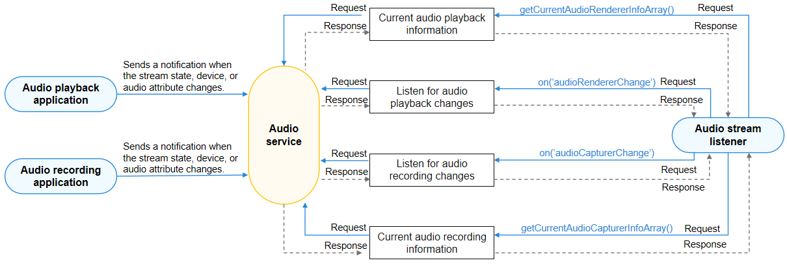

# Audio Playback Stream Management

<!--Kit: Audio Kit-->
<!--Subsystem: Multimedia-->
<!--Owner: @boxwall-->
<!--Designer: @magekkkk-->
<!--Tester: @Filger-->
<!--Adviser: @w_Machine_cc-->
<!-- md-trans-meta sourceCommit=c09285db249e68c19c1d19142b2fb6f53de954f7 translatedAt=2026-08-06T01:44:30.006Z pushedAt=2026-08-06T07:14:29.815Z -->

An audio playback application must notice audio stream state changes and perform corresponding operations. For example, when detecting that an audio stream is being played or paused, the application must change the UI display of the **Play** button.

The examples in each of the following steps are code snippets. You can click the link at the bottom right of the sample code to obtain the [complete sample codes](https://gitcode.com/openharmony/applications_app_samples/blob/master/code/DocsSample/Media/Audio/AudioRendererSampleJS).

## Reading or Listening for Audio Stream State Changes in the Application

Refer to [Using AudioRenderer for Audio Playback (ArkTS)](using-audiorenderer-for-playback.md) or [audio.createAudioRenderer](../../reference/apis-audio-kit/arkts-apis-audio-f.md#audiocreateaudiorenderer8) to create an AudioRenderer, and then use either of the following methods to check audio stream state changes.

- Obtain the [property](../../reference/apis-audio-kit/arkts-apis-audio-AudioRenderer.md#properties) state of the **AudioRenderer**.

  <!-- @[check_renderstate](https://gitcode.com/openharmony/applications_app_samples/blob/master/code/DocsSample/Media/Audio/AudioRendererSampleJS/entry/src/main/ets/pages/renderer.ets) -->

  ``` TypeScript
  import { audio } from '@kit.AudioKit';
  // ...
      let audioRendererState: audio.AudioState = audioRenderer.state;
      console.info(`Current state is: ${audioRendererState}`);
  ```

- Register **stateChange** to listen for state changes of the AudioRenderer.

  <!-- @[regist_listeningrendererchange](https://gitcode.com/openharmony/applications_app_samples/blob/master/code/DocsSample/Media/Audio/AudioRendererSampleJS/entry/src/main/ets/pages/renderer.ets) -->

  ``` TypeScript
  import { audio } from '@kit.AudioKit';
  // ...
      audioRenderer.on('stateChange', (rendererState: audio.AudioState) => {
        console.info(`Succeeded in using on function, state change to: ${rendererState}`);
        // ...
      });
  ```

The application then performs an operation, for example, changing the display of the **Play** button, by comparing the obtained state with [AudioState](../../reference/apis-audio-kit/arkts-apis-audio-e.md#audiostate8).

## Reading or Listening for Changes in All Audio Streams

If an application needs to obtain the change information about all audio streams, it can use **AudioStreamManager** to read or listen for the changes of all audio streams.

<!--Del-->

> **NOTE**
>
> For audio stream change information involving system APIs, only system-level apps can view it. If the app is not a system app, accurate information cannot be obtained.

<!--DelEnd-->

The figure below shows the call relationship of audio stream management.



During application development, you must call [getStreamManager](../../reference/apis-audio-kit/arkts-apis-audio-AudioManager.md#getstreammanager9) to create an **AudioStreamManager** instance, through which you can manage audio streams.

For details about the APIs, see [AudioStreamManager](../../reference/apis-audio-kit/arkts-apis-audio-AudioStreamManager.md).

## How to Develop

1. Create an **AudioStreamManager** instance.

   <!-- @[create_streammanager](https://gitcode.com/openharmony/applications_app_samples/blob/master/code/DocsSample/Media/Audio/AudioRendererSampleJS/entry/src/main/ets/pages/renderer.ets) -->

   ``` TypeScript
   import { audio } from '@kit.AudioKit';
   // ...
   let audioManager = audio.getAudioManager();
   // ...
   let audioStreamManager = audioManager.getStreamManager();
   ```

2. Use [on('audioRendererChange')](../../reference/apis-audio-kit/arkts-apis-audio-AudioStreamManager.md#onaudiorendererchange9) to listen for audio playback stream changes. If the application needs to receive a notification when the audio playback stream state or device changes, it can subscribe to this event.

   <!-- @[regist_renderchangechallback](https://gitcode.com/openharmony/applications_app_samples/blob/master/code/DocsSample/Media/Audio/AudioRendererSampleJS/entry/src/main/ets/pages/renderer.ets) -->

   ``` TypeScript
   import { audio } from '@kit.AudioKit';
   // ...
     audioStreamManager.on('audioRendererChange',  (audioRendererChangeInfoArray: audio.AudioRendererChangeInfoArray) => {
       console.info(`Succeeded in using on function. AudioRendererChangeInfoArray: ${JSON.stringify(audioRendererChangeInfoArray)}`);
       globalLogUpdate(`Succeeded in using on function. AudioRendererChangeInfoArray: ${JSON.stringify(audioRendererChangeInfoArray)}`, false);
     });
   ```

3. (Optional) Use [off('audioRendererChange')](../../reference/apis-audio-kit/arkts-apis-audio-AudioStreamManager.md#offaudiorendererchange9) to cancel listening for audio playback stream changes.

   <!-- @[unregist_renderchangechallback](https://gitcode.com/openharmony/applications_app_samples/blob/master/code/DocsSample/Media/Audio/AudioRendererSampleJS/entry/src/main/ets/pages/renderer.ets) -->  

   ``` TypeScript
   audioStreamManager.off('audioRendererChange');
   console.info('Succeeded in using off function.');
   ```

4. (Optional) Use [getCurrentAudioRendererInfoArray](../../reference/apis-audio-kit/arkts-apis-audio-AudioStreamManager.md#getcurrentaudiorendererinfoarray9) to obtain the information about all audio playback streams. This API can be used to obtain the unique ID of the audio playback stream, audio renderer information, and audio playback device information.

> **NOTE**
>
> An app that listens for all audio stream state changes must [declare the permission](../../security/AccessToken/declare-permissions.md) `ohos.permission.USE_BLUETOOTH`. Otherwise, the actual device name and device address cannot be obtained, and the queried device name and device address (Bluetooth device attributes) will be empty strings.

   <!-- @[get_allstreaminfo](https://gitcode.com/openharmony/applications_app_samples/blob/master/code/DocsSample/Media/Audio/AudioRendererSampleJS/entry/src/main/ets/pages/renderer.ets) -->  

   ``` TypeScript
   import { audio } from '@kit.AudioKit';
   // ...
   import { BusinessError } from '@kit.BasicServicesKit';
   // ...
   async function getCurrentAudioRendererInfoArray(): Promise<void> {
     await audioStreamManager.getCurrentAudioRendererInfoArray()
       .then((audioRendererChangeInfoArray: audio.AudioRendererChangeInfoArray) => {
         console.info(`Succeeded in getting current audio renderer info array. AudioRendererChangeInfoArray: ${JSON.stringify(audioRendererChangeInfoArray)}`);
         globalLogUpdate(`Succeeded in getting current audio renderer info array. AudioRendererChangeInfoArray: ${JSON.stringify(audioRendererChangeInfoArray)}`, false);
       }).catch((err: BusinessError ) => {
         console.error(`Failed to get current audio renderer info array. Code: ${err.code}, message: ${err.message}`);
         // ...
       });
   }
   ```