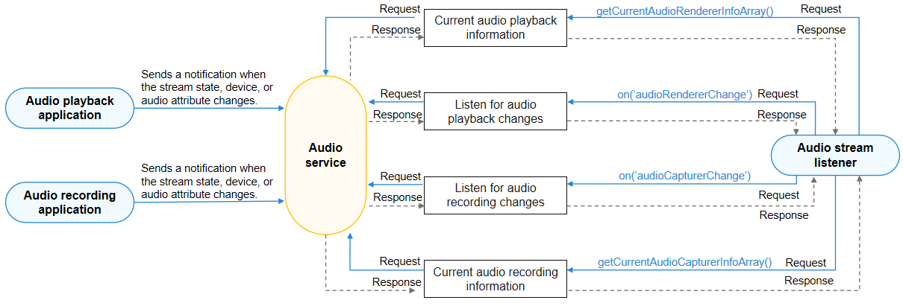

# Querying and Listening for the Recording Status of Other Applications

<!--Kit: Audio Kit-->
<!--Subsystem: Multimedia-->
<!--Owner: @zyy0412-->
<!--Designer: @weixin_41398971-->
<!--Tester: @Filger-->
<!--Adviser: @w_Machine_cc-->
<!-- md-trans-meta sourceCommit=1a54a360c8f76b2eaba0f57f594468c4d52d1ec1 translatedAt=2026-08-06T01:45:36.415Z pushedAt=2026-08-06T07:42:35.876Z -->

An audio recording application must notice audio stream state changes and perform corresponding operations. For example, when detecting that the user stops recording, the application must notify the user that the recording finishes.

The example code in the following steps is a snippet. You can obtain the [complete sample](https://gitcode.com/openharmony/applications_app_samples/tree/master/code/DocsSample/Media/Audio/AudioCaptureSampleJS) via the link at the bottom right of the code snippet.

## Reading or Listening for Audio Stream State Changes in the Application

Refer to [Using AudioCapturer for Audio Recording (ArkTS)](using-audiocapturer-for-recording.md) or [audio.createAudioCapturer](../../reference/apis-audio-kit/arkts-apis-audio-f.md#audiocreateaudiocapturer8) to create an **AudioCapturer** instance, and then use either of the following methods to check audio stream state changes.

- Obtain the [property](../../reference/apis-audio-kit/arkts-apis-audio-AudioCapturer.md#properties) state of the **AudioCapturer**.

  <!-- @[view_AudioCapturerState](https://gitcode.com/openharmony/applications_app_samples/blob/master/code/DocsSample/Media/Audio/AudioCaptureSampleJS/entry/src/main/ets/pages/AudioCapture.ets) -->

  ``` TypeScript
  let audioCapturerState: audio.AudioState = audioCapturer.state;
  console.info(`Current state is: ${audioCapturerState }`)
  ```

- Register **stateChange** to listen for state changes of the AudioCapturer.

  <!-- @[listen_AudioCapturerState](https://gitcode.com/openharmony/applications_app_samples/blob/master/code/DocsSample/Media/Audio/AudioCaptureSampleJS/entry/src/main/ets/pages/AudioCapture.ets) -->

  ``` TypeScript
  audioCapturer.on('stateChange', (capturerState: audio.AudioState) => {
    console.info(`State change to: ${capturerState}`)
    // ...
  });
  ```

After obtaining the state, you can perform corresponding operations based on [AudioState](../../reference/apis-audio-kit/arkts-apis-audio-e.md#audiostate8), such as displaying a prompt indicating that recording has ended.

## Reading or Listening for Changes in All Audio Streams

If some apps need to query the change information about all audio streams, they can use **AudioStreamManager** to read or listen for the changes of all audio streams.

### Determining Whether the Microphone Is Occupied

Before starting audio capture, services such as audio recording, speech recognition, real-time voice calls, short voice messages, and live streaming co-hosting typically need to determine whether the microphone is occupied. If the microphone is already occupied by another recording stream, the new recording stream may fail to start properly. Alternatively, even if the recording starts successfully, it may be interrupted or enter a muted recording state during operation due to system audio focus or recording concurrency policies, leading to issues such as incomplete recording files or missing speech recognition results.

You can choose either of the following methods based on your service scenario:

- Query the current capturer and input device amplitude: If you need to proactively query whether any input device is currently capturing sound, you can use [getCurrentAudioCapturerInfoArray](../../reference/apis-audio-kit/arkts-apis-audio-AudioStreamManager.md#getcurrentaudiocapturerinfoarray9) together with [getMaxAmplitudeForInputDevice](../../reference/apis-audio-kit/arkts-apis-audio-AudioVolumeGroupManager.md#getmaxamplitudeforinputdevice12). First, call `getCurrentAudioCapturerInfoArray` to obtain the current audio capturer information. Then, iterate over the input devices used by each capturer and call `getMaxAmplitudeForInputDevice` to obtain the maximum amplitude of the audio stream, which ranges from [0, 1]. When the maximum amplitude is greater than 0, it indicates that the device has captured sound and is recording, meaning the microphone is occupied.

- Determine whether a specified recording request can be started: If you need to determine whether a recording request of a specified source type can be started before recording begins, call [isRecordingAvailable](../../reference/apis-audio-kit/arkts-apis-audio-AudioStreamManager.md#isrecordingavailable20) and pass in the [AudioCapturerInfo](../../reference/apis-audio-kit/arkts-apis-audio-i.md#audiocapturerinfo8) to be used by the service. If `true` is returned, the microphone can be used for recording. If `false` is returned, the microphone may already be occupied. For sample code, see [isRecordingAvailable](../../reference/apis-audio-kit/arkts-apis-audio-AudioStreamManager.md#isrecordingavailable20).

> **NOTE**
>
> - `isRecordingAvailable` is used to determine whether a specified recording request can be started, and does not return details of the current recording stream.
> - `getMaxAmplitudeForInputDevice` must be used together with `getCurrentAudioCapturerInfoArray`. First obtain the input device information used by the audio capturer, and then query the maximum amplitude of the corresponding device.
> - The information returned by `getCurrentAudioCapturerInfoArray` may include internal system recording streams. You can use `capturerInfo.source` in combination with the service scenario to determine whether a recording stream belongs to the microphone occupancy scenario that the current service needs to identify.

<!--Del-->

> **NOTE**
> 
> The audio stream change information marked as the system API can be viewed only by system applications.

<!--DelEnd-->

The figure below shows the call relationship of audio stream management.



During application development, you must call [getStreamManager](../../reference/apis-audio-kit/arkts-apis-audio-AudioManager.md#getstreammanager9) to create an **AudioStreamManager** instance, through which you can manage audio streams.

For details about the APIs, see [AudioStreamManager](../../reference/apis-audio-kit/arkts-apis-audio-AudioStreamManager.md).

## How to Develop

1. Create an **AudioStreamManager** instance.

   <!-- @[get_StreamManager](https://gitcode.com/openharmony/applications_app_samples/blob/master/code/DocsSample/Media/Audio/AudioCaptureSampleJS/entry/src/main/ets/pages/AudioStreamManager.ets) -->

   ``` TypeScript
   import { audio } from '@kit.AudioKit';
   import { BusinessError } from '@kit.BasicServicesKit';
   
   let audioManager = audio.getAudioManager();
   let audioStreamManager = audioManager.getStreamManager();
   ```

2. Use [on('audioCapturerChange')](../../reference/apis-audio-kit/arkts-apis-audio-AudioStreamManager.md#onaudiocapturerchange9) to listen for audio recording stream change events. If the app needs to receive notifications when the audio recording stream state or device changes, it can subscribe to this event.

   <!-- @[audioStreamManager_on](https://gitcode.com/openharmony/applications_app_samples/blob/master/code/DocsSample/Media/Audio/AudioCaptureSampleJS/entry/src/main/ets/pages/AudioStreamManager.ets) -->

   ``` TypeScript
   audioStreamManager.on('audioCapturerChange', (audioCapturerChangeInfoArray: audio.AudioCapturerChangeInfoArray) =>  {
     // ...
     for (let i = 0; i < audioCapturerChangeInfoArray.length; i++) {
       console.info(`## CapChange on is called for element ${i} ##`);
       console.info(`StreamId for ${i} is: ${audioCapturerChangeInfoArray[i].streamId}`);
       console.info(`Source for ${i} is: ${audioCapturerChangeInfoArray[i].capturerInfo.source}`);
       console.info(`Flag  ${i} is: ${audioCapturerChangeInfoArray[i].capturerInfo.capturerFlags}`);
   
       // ...
   
       let devDescriptor: audio.AudioDeviceDescriptors = audioCapturerChangeInfoArray[i].deviceDescriptors;
       for (let j = 0; j < audioCapturerChangeInfoArray[i].deviceDescriptors.length; j++) {
         console.info(`Id: ${i} : ${audioCapturerChangeInfoArray[i].deviceDescriptors[j].id}`);
         console.info(`Type: ${i} : ${audioCapturerChangeInfoArray[i].deviceDescriptors[j].deviceType}`);
         console.info(`Role: ${i} : ${audioCapturerChangeInfoArray[i].deviceDescriptors[j].deviceRole}`);
         console.info(`Name: ${i} : ${audioCapturerChangeInfoArray[i].deviceDescriptors[j].name}`);
         console.info(`Address: ${i} : ${audioCapturerChangeInfoArray[i].deviceDescriptors[j].address}`);
         console.info(`SampleRates: ${i} : ${audioCapturerChangeInfoArray[i].deviceDescriptors[j].sampleRates[0]}`);
         console.info(`ChannelCounts ${i} : ${audioCapturerChangeInfoArray[i].deviceDescriptors[j].channelCounts[0]}`);
         console.info(`ChannelMask: ${i} : ${audioCapturerChangeInfoArray[i].deviceDescriptors[j].channelMasks}`);
       }
     }
     // ...
   });
   ```

3. (Optional) Use [off('audioCapturerChange')](../../reference/apis-audio-kit/arkts-apis-audio-AudioStreamManager.md#offaudiocapturerchange9) to cancel listening for audio recording stream changes.

   <!-- @[cancel_ListenAudioStreamManager](https://gitcode.com/openharmony/applications_app_samples/blob/master/code/DocsSample/Media/Audio/AudioCaptureSampleJS/entry/src/main/ets/pages/AudioStreamManager.ets) -->

   ``` TypeScript
   audioStreamManager.off('audioCapturerChange');
   console.info('CapturerChange Off is called');
   ```

4. (Optional) Use [getCurrentAudioCapturerInfoArray](../../reference/apis-audio-kit/arkts-apis-audio-AudioStreamManager.md#getcurrentaudiocapturerinfoarray9) to obtain the information about all audio recording streams. This API can be used to obtain the unique ID of the audio recording stream, audio capturer information, and audio capturer device information.

   > **NOTE**
   > 
   > Before listening for state changes of all audio streams, the application must [declare the ohos.permission.USE_BLUETOOTH permission](../../security/AccessToken/declare-permissions.md), for the device name and device address (Bluetooth related attributes) to be displayed correctly.
   > Starting from API version 20, you can call [isRecordingAvailable](../../reference/apis-audio-kit/arkts-apis-audio-AudioStreamManager.md#isrecordingavailable20) before audio recording starts to determine whether the recording can be successfully started based on the audio source type in the input **AudioCapturer** information.

   <!-- @[get_CurrentAudioCapturerInfoArray](https://gitcode.com/openharmony/applications_app_samples/blob/master/code/DocsSample/Media/Audio/AudioCaptureSampleJS/entry/src/main/ets/pages/AudioStreamManager.ets) --> 

   ``` TypeScript
   async function getCurrentAudioCapturerInfoArray(updateCallback?:
     (msg: string, isError: boolean) => void): Promise<void>{
     // ...
   
     await audioStreamManager.getCurrentAudioCapturerInfoArray()
       .then((audioCapturerChangeInfoArray: audio.AudioCapturerChangeInfoArray) => {
         console.info('getCurrentAudioCapturerInfoArray Get Promise Called');
         // ...
         if (audioCapturerChangeInfoArray != null) {
           for (let i = 0; i < audioCapturerChangeInfoArray.length; i++) {
             console.info(`StreamId for ${i} is: ${audioCapturerChangeInfoArray[i].streamId}`);
             console.info(`Source for ${i} is: ${audioCapturerChangeInfoArray[i].capturerInfo.source}`);
             console.info(`Flag  ${i} is: ${audioCapturerChangeInfoArray[i].capturerInfo.capturerFlags}`);
   
             // ...
   
             for (let j = 0; j < audioCapturerChangeInfoArray[i].deviceDescriptors.length; j++) {
               console.info(`Id: ${i} : ${audioCapturerChangeInfoArray[i].deviceDescriptors[j].id}`);
               console.info(`Type: ${i} : ${audioCapturerChangeInfoArray[i].deviceDescriptors[j].deviceType}`);
               console.info(`Role: ${i} : ${audioCapturerChangeInfoArray[i].deviceDescriptors[j].deviceRole}`);
               console.info(`Name: ${i} : ${audioCapturerChangeInfoArray[i].deviceDescriptors[j].name}`);
               console.info(`Address: ${i} : ${audioCapturerChangeInfoArray[i].deviceDescriptors[j].address}`);
               console.info(`SampleRates: ${i} : ${audioCapturerChangeInfoArray[i].deviceDescriptors[j].sampleRates[0]}`);
               console.info(`ChannelCounts ${i} : ${audioCapturerChangeInfoArray[i]
                 .deviceDescriptors[j].channelCounts[0]}`);
               console.info(`ChannelMask: ${i} : ${audioCapturerChangeInfoArray[i].deviceDescriptors[j].channelMasks}`);
             }
           }
         }
         // ...
       }).catch((err: BusinessError) => {
         console.error(`Invoke getCurrentAudioCapturerInfoArray failed, code is ${err.code}, message is ${err.message}`);
         // ...
       });
     // ...
   }
   ```