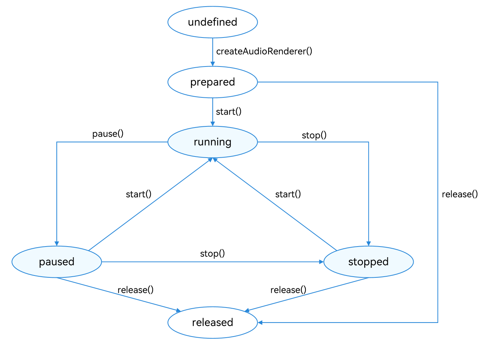

# Using AudioRenderer for Audio Playback (ArkTS)

<!--Kit: Audio Kit-->
<!--Subsystem: Multimedia-->
<!--Owner: @boxwall-->
<!--Designer: @magekkkk-->
<!--Tester: @Filger-->
<!--Adviser: @w_Machine_cc-->
<!-- md-trans-meta sourceCommit=3a7084fa36f3aa40ad1ae670f066e28c8494300a translatedAt=2026-08-06T10:47:06.824Z pushedAt=2026-08-06T10:59:45.597Z -->

The **AudioRenderer** is used to play Pulse Code Modulation (PCM) audio data. Unlike the [AVPlayer](../media/using-avplayer-for-playback.md), the **AudioRenderer** can perform data preprocessing before audio input. Therefore, it is more suitable if you have extensive audio development experience and want to implement more flexible playback features.

## Development Guidelines

Using AudioRenderer to play audio involves creating an AudioRenderer instance, configuring audio rendering parameters, starting and stopping rendering, and releasing resources. This development guide walks you through the process of audio rendering with AudioRenderer, using a complete rendering session as an example. It is recommended to read this guide together with the API reference of [AudioRenderer](../../reference/apis-audio-kit/arkts-apis-audio-AudioRenderer.md).

The figure below shows the state changes of the **AudioRenderer**. After an **AudioRenderer** instance is created, different APIs can be called to switch the **AudioRenderer** to different states and trigger the required behavior. If an API is called when the **AudioRenderer** is not in the given state, the system may throw an exception or generate other undefined behavior. Therefore, you are advised to check the **AudioRenderer** state before triggering state transition.

To prevent the UI thread from being blocked, most **AudioRenderer** calls are asynchronous. Each API provides the callback and promise functions. The following examples use the callback functions.

During application development, you are advised to use [on('stateChange')](../../reference/apis-audio-kit/arkts-apis-audio-AudioRenderer.md#onstatechange8) to subscribe to state changes of the **AudioRenderer**. This is because some operations can be performed only when the **AudioRenderer** is in a given state. If the application performs an operation when the **AudioRenderer** is not in the given state, the system may throw an exception or generate other undefined behavior.

- **prepared**: The **AudioRenderer** enters this state by calling [audio.createAudioRenderer](../../reference/apis-audio-kit/arkts-apis-audio-f.md#audiocreateaudiorenderer8).

- **running**: The **AudioRenderer** enters this state by calling [start](../../reference/apis-audio-kit/arkts-apis-audio-AudioRenderer.md#start8) when it is in the **prepared**, **paused**, or **stopped** state.

- **paused**: The **AudioRenderer** enters this state by calling [pause](../../reference/apis-audio-kit/arkts-apis-audio-AudioRenderer.md#pause8) when it is in the **running** state. When the audio playback is paused, it can call [start](../../reference/apis-audio-kit/arkts-apis-audio-AudioRenderer.md#start8) to resume the playback.

- **stopped**: The **AudioRenderer** enters this state by calling [stop](../../reference/apis-audio-kit/arkts-apis-audio-AudioRenderer.md#stop8) when it is in the **paused** or **running** state.

- **released**: In the **prepared**, **paused**, or **stopped** state, you can call [release](../../reference/apis-audio-kit/arkts-apis-audio-AudioRenderer.md#release8) to release all occupied hardware and software resources, and the AudioRenderer will not enter any other state afterward.

When an audio stream is in the working state (not in the released state), it occupies system audio stream resources. Because the system imposes a limit on the number of audio streams, you should call `release()` to reclaim audio resources when the audio stream is temporarily not in use, so as to ensure proper resource utilization and avoid failures when creating subsequent audio streams.

**Figure 1** AudioRenderer state transition



### How to Develop

The following examples are code snippets. For the [complete sample](https://gitcode.com/openharmony/applications_app_samples/tree/master/code/DocsSample/Media/Audio/AudioRendererSampleJS), click the link at the bottom right of the example.

1. Set audio rendering parameters and create an **AudioRenderer** instance. For details about the parameters, see [AudioRendererOptions](../../reference/apis-audio-kit/arkts-apis-audio-i.md#audiorendereroptions8).

   <!-- @[create_audiorender](https://gitcode.com/openharmony/applications_app_samples/blob/master/code/DocsSample/Media/Audio/AudioRendererSampleJS/entry/src/main/ets/pages/renderer.ets) -->

   ``` TypeScript
   import { audio } from '@kit.AudioKit';
   // ...
   // Starting from API version 26.0.0, the samplingRate parameter supports the number type.
   // The audio rendering extension supports sampling rate values from 8000 Hz to 384000 Hz in 10 Hz steps. The supported sampling rate specifications may vary depending on the specific device.
   let audioStreamInfo: audio.AudioStreamInfo = {
     samplingRate: audio.AudioSamplingRate.SAMPLE_RATE_48000, // Sampling rate.
     channels: audio.AudioChannel.CHANNEL_2, // Channel.
     sampleFormat: audio.AudioSampleFormat.SAMPLE_FORMAT_S16LE, // Sampling format.
     encodingType: audio.AudioEncodingType.ENCODING_TYPE_RAW // Encoding format.
   };
   let audioRendererInfo: audio.AudioRendererInfo = {
     usage: audio.StreamUsage.STREAM_USAGE_MUSIC, // Audio stream usage type: music. Set this parameter based on the service scenario.
     rendererFlags: 0 // AudioRenderer flag.
   };
   let audioRendererOptions: audio.AudioRendererOptions = {
     streamInfo: audioStreamInfo,
     rendererInfo: audioRendererInfo
   };
   // ...
     audio.createAudioRenderer(audioRendererOptions, (err, renderer) => { // Create an AudioRenderer instance.
       if (!err) {
         console.info('Succeeded in creating audio renderer.');
         // ...
         audioRenderer = renderer;
         if (audioRenderer !== undefined) {
           audioRenderer.on('writeData', writeDataCallback);
           // ...
         }
       } else {
         console.error(`Failed to create audio renderer. Code: ${err.code}, message: ${err.message}`);
         globalLogUpdate(`Failed to create audio renderer. Code: ${err.code}, message: ${err.message}`, false);
       }
     });
   ```

2. Call [on('writeData')](../../reference/apis-audio-kit/arkts-apis-audio-AudioRenderer.md#onwritedata11) to subscribe to the callback for audio data writing. You are advised to use this function in API version 12, since it returns a callback result.

   - From API version 12, this function returns a callback result, enabling the system to determine whether to play the data in the callback based on the value returned.

     > **NOTE**
     > 
     > - When the amount of data is sufficient to meet the required buffer length of the callback, you should return **audio.AudioDataCallbackResult.VALID**, and the system uses the entire data buffer for playback. Do not return **audio.AudioDataCallbackResult.VALID** when the buffer is not fully filled, as this leads to audio artifacts such as noise and playback stuttering.
     > 
     > - When the amount of data is insufficient to meet the required buffer length of the callback, you are advised to return **audio.AudioDataCallbackResult.INVALID**. In this case, the system does not process this portion of audio data but requests data from the application again. Once the buffer is adequately filled, you can return **audio.AudioDataCallbackResult.VALID**.
     > 
     > - Once the callback function finishes its execution, the audio service queues the data in the buffer for playback. Therefore, do not change the buffered data outside the callback. Regarding the last frame, if there is insufficient data to completely fill the buffer, you must concatenate the available data with padding to ensure that the buffer is full. This prevents any residual dirty data in the buffer from adversely affecting the playback effect.

     <!-- @[init_oncallback](https://gitcode.com/openharmony/applications_app_samples/blob/master/code/DocsSample/Media/Audio/AudioRendererSampleJS/entry/src/main/ets/pages/renderer.ets) -->

     ``` TypeScript
     import { audio } from '@kit.AudioKit';
     import { BusinessError } from '@kit.BasicServicesKit';
     import { fileIo as fs } from '@kit.CoreFileKit';
     import { common } from '@kit.AbilityKit';
     // ...
     class Options {
       public offset?: number;
       public length?: number;
     }
     // ...
       let bufferSize: number = 0;
       let file = await context.resourceManager.getRawFd('S16LE_2_48000.pcm');
       writeDataCallback = (buffer: ArrayBuffer) => {
         let options: Options = {
           offset: bufferSize + file.offset,
           length: buffer.byteLength
         };
         if (bufferSize > file.length) {
           return audio.AudioDataCallbackResult.INVALID;
         }
         try {
           let bufferLength = fs.readSync(file.fd, buffer, options);
           bufferSize += buffer.byteLength;
           // The system determines the buffer is valid and plays it normally.
           // ...
           return audio.AudioDataCallbackResult.VALID;
         } catch (error) {
           console.error(`Failed to read file. Code: ${error.code}, message: ${error.message}`);
           // The system determines the buffer is invalid and does not play it.
           // ...
           return audio.AudioDataCallbackResult.INVALID;
         }
       };
       // ...
             audioRenderer.on('writeData', writeDataCallback);
     ```

   - In API version 11, this function does not return a callback result, and the system treats all data in the callback as valid by default.

     > **NOTE**
     >
     > - You should avoid registering callbacks on the main thread, as this may cause delayed callback responses and freezes due to blocking by other service processes. You are advised to use an independent asynchronous thread pool to handle callbacks.
     > - Ensure that the callback's data buffer is completely filled to the necessary length to prevent issues such as audio noise and playback stuttering.
     > - If the amount of data is insufficient to fill the data buffer, you are advised to temporarily halt data writing (without pausing the audio stream), block the callback function, and wait until enough data accumulates before resuming writing, thereby ensuring that the buffer is fully filled. If you need to call **AudioRenderer** APIs after the callback function is blocked, unblock the callback function first.
     > - If you do not want to play the audio data in this callback function, you can nullify the data block in the callback function. (Once nullified, the system still regards this as part of the written data, leading to silent frames during playback).
     > - Once the callback function finishes its execution, the audio service queues the data in the buffer for playback. Therefore, do not change the buffered data outside the callback. Regarding the last frame, if there is insufficient data to completely fill the buffer, you must concatenate the available data with padding to ensure that the buffer is full. This prevents any residual dirty data in the buffer from adversely affecting the playback effect.
     > - In the data writing callback, avoid coupling with time-consuming service logic or waiting for other service operations (e.g., do not wait for UI rendering while writing data). Otherwise, it may cause delayed data transmission, leading to stuttering.

     <!-- @[init_callback](https://gitcode.com/openharmony/applications_app_samples/blob/master/code/DocsSample/Media/Audio/AudioRendererSampleJS/entry/src/main/ets/pages/renderer.ets) --> 

     ``` TypeScript	
     import { BusinessError } from '@kit.BasicServicesKit';	
     import { fileIo as fs } from '@kit.CoreFileKit';	
     import { common } from '@kit.AbilityKit';	
     // ...	
     class Options {	
       public offset?: number;	
       public length?: number;	
     }	
     // ...	
       let bufferSize: number = 0;	
       let file = await context.resourceManager.getRawFd('S16LE_2_48000.pcm');
       writeDataCallback = (buffer: ArrayBuffer) => {	
         let options: Options = {	
           offset: bufferSize + file.offset,
           length: buffer.byteLength	
         };	
         // ...	
             audioRenderer.on('writeData', writeDataCallback);
     ```

3. Call [start](../../reference/apis-audio-kit/arkts-apis-audio-AudioRenderer.md#start8) to switch the AudioRenderer to the running state and start rendering.

   <!-- @[render_start](https://gitcode.com/openharmony/applications_app_samples/blob/master/code/DocsSample/Media/Audio/AudioRendererSampleJS/entry/src/main/ets/pages/renderer.ets) -->

   ``` TypeScript
   import { BusinessError } from '@kit.BasicServicesKit';
   // ...
       audioRenderer.start((err: BusinessError) => {
         if (err) {
           console.error(`Failed to start audio renderer. Code: ${err.code}, message: ${err.message}`);
           // ...
         } else {
           console.info('Succeeded in starting audio renderer.');
           // ...
         }
       });
   ```

4. Call [stop](../../reference/apis-audio-kit/arkts-apis-audio-AudioRenderer.md#stop8) to stop rendering.

   <!-- @[render_stop](https://gitcode.com/openharmony/applications_app_samples/blob/master/code/DocsSample/Media/Audio/AudioRendererSampleJS/entry/src/main/ets/pages/renderer.ets) -->

   ``` TypeScript
   import { BusinessError } from '@kit.BasicServicesKit';
   // ...
       audioRenderer.stop((err: BusinessError) => {
         if (err) {
           console.error(`Failed to stop audio renderer. Code: ${err.code}, message: ${err.message}`);
           // ...
         } else {
           console.info('Succeeded in stopping audio renderer.');
           // ...
         }
       });
   ```

5. Call [release](../../reference/apis-audio-kit/arkts-apis-audio-AudioRenderer.md#release8) to destroy the instance and release resources.

    Applications must properly manage **AudioRenderer** instances according to their needs, creating them as needed and releasing them promptly. This prevents excessive consumption of audio resources, which can lead to exceptions.

   <!-- @[render_release](https://gitcode.com/openharmony/applications_app_samples/blob/master/code/DocsSample/Media/Audio/AudioRendererSampleJS/entry/src/main/ets/pages/renderer.ets) -->

   ``` TypeScript
   import { BusinessError } from '@kit.BasicServicesKit';
   // ...
       audioRenderer.release((err: BusinessError) => {
         if (err) {
           console.error(`Failed to release audio renderer. Code: ${err.code}, message: ${err.message}`);
           // ...
         } else {
           console.info('Succeeded in releasing audio renderer.');
           // ...
         }
       });
       // ` wrapper preserved.
</analysis>

<translation>
<seg id="0">Close the sandbox file.
       await context.resourceManager.closeRawFd('S16LE_2_48000.pcm');
   ```

### Selecting the Correct Stream Usage

When creating an AudioRenderer instance, you must specify the `StreamUsage` of the player based on the use case. Selecting the correct `StreamUsage` helps prevent unexpected behavior.

The recommended use cases are described in [StreamUsage](../../reference/apis-audio-kit/arkts-apis-audio-e.md#streamusage). For example, **STREAM_USAGE_MUSIC** is recommended for music scenarios, **STREAM_USAGE_MOVIE** is recommended for movie or video scenarios, and **STREAM_USAGE_GAME** is recommended for gaming scenarios.

An incorrect configuration of **StreamUsage** may cause unexpected behavior. Example scenarios are as follows:

- When **STREAM_USAGE_MUSIC** is incorrectly used in a game scenario, the game cannot be played simultaneously with music applications. However, games usually can coexist with music playback.

- When `STREAM_USAGE_MUSIC` is incorrectly used in a navigation scenario, any playing music is interrupted when the navigation app provides audio guidance. However, in navigation scenarios, it is generally expected that the playing music only lowers its volume.

### Configuring the Appropriate Audio Sampling Rate

The sampling rate refers to the number of samples captured per second for a single audio channel, measured in Hz.

Resampling involves upsampling (adding samples through interpolation) or downsampling (removing samples through decimation) when there is a mismatch between the input and output audio sampling rates.

AudioRenderer supports all sampling rates defined in the enum [AudioSamplingRate](../../reference/apis-audio-kit/arkts-apis-audio-e.md#audiosamplingrate8).

If the input audio sampling rate configured by **AudioRenderer** is different from the output sampling rate of the device, the system resamples the input audio to match the output sampling rate.

To minimize power consumption from resampling, it is best to use input audio with a sampling rate that matches the output sampling rate of the device. A sampling rate of 48 kHz is highly recommended.

### Complete Sample Code

Refer to the sample code below to render an audio file using **AudioRenderer**.

<!-- @[render_process](https://gitcode.com/openharmony/applications_app_samples/blob/master/code/DocsSample/Media/Audio/AudioRendererSampleJS/entry/src/main/ets/pages/renderer.ets) -->  

``` TypeScript
import { audio } from '@kit.AudioKit';
import { BusinessError } from '@kit.BasicServicesKit';
import { fileIo as fs } from '@kit.CoreFileKit';
import { common } from '@kit.AbilityKit';
// ...
class Options {
  public offset?: number;
  public length?: number;
}
// ...

let audioRenderer: audio.AudioRenderer | undefined = undefined;
// Starting from API version 26.0.0, the samplingRate parameter supports the number type.
// The audio rendering extension supports sampling rate values from 8000 Hz to 384000 Hz in 10 Hz steps. The supported sampling rate specifications vary by device.
let audioStreamInfo: audio.AudioStreamInfo = {
  samplingRate: audio.AudioSamplingRate.SAMPLE_RATE_48000, // Sampling rate.
  channels: audio.AudioChannel.CHANNEL_2, // Channel.
  sampleFormat: audio.AudioSampleFormat.SAMPLE_FORMAT_S16LE, // Sampling format.
  encodingType: audio.AudioEncodingType.ENCODING_TYPE_RAW // Encoding format.
};
let audioRendererInfo: audio.AudioRendererInfo = {
  usage: audio.StreamUsage.STREAM_USAGE_MUSIC, // Audio stream usage type: music. Set this parameter based on the service scenario.
  rendererFlags: 0 // AudioRenderer flag.
};
let audioRendererOptions: audio.AudioRendererOptions = {
  streamInfo: audioStreamInfo,
  rendererInfo: audioRendererInfo
};
let writeDataCallback: audio.AudioRendererWriteDataCallback;

async function initArguments(context: common.UIAbilityContext) {
  let bufferSize: number = 0;
  let file = await context.resourceManager.getRawFd('S16LE_2_48000.pcm');
  writeDataCallback = (buffer: ArrayBuffer) => {
    let options: Options = {
      offset: bufferSize + file.offset,
      length: buffer.byteLength
    };
    if (bufferSize > file.length) {
      return audio.AudioDataCallbackResult.INVALID;
    }
    try {
      let bufferLength = fs.readSync(file.fd, buffer, options);
      bufferSize += buffer.byteLength;
      // The system determines that the buffer is valid and plays it normally.
      if (bufferSize > file.length) {
        let view = new DataView(buffer);
        for (let i = bufferSize - file.length; i < buffer.byteLength; i++) {
          // Blank areas are filled with silence data. When the audio sampling format is SAMPLE_FORMAT_U8, 0x80 represents silence data; for other sampling formats, 0 represents silence data.
          view.setUint8(i, 0);
        }
      }
      // This function does not return a callback result in API version 11, but does so in API version 12 and later versions.
      // If you do not want to play a certain buffer, return audio.AudioDataCallbackResult.INVALID.
      return audio.AudioDataCallbackResult.VALID;
    } catch (error) {
      console.error(`Failed to read file. Code: ${error.code}, message: ${error.message}`);
      // ...
      // This function does not return a callback result in API version 11, but does so in API version 12 and later versions.
      return audio.AudioDataCallbackResult.INVALID;
    }
  };
}

// Create an AudioRenderer instance, and set the events to listen for.
async function init() {
  audio.createAudioRenderer(audioRendererOptions, (err, renderer) => { // Create an AudioRenderer instance.
    if (!err) {
      console.info('Succeeded in creating audio renderer.');
      // ...
      audioRenderer = renderer;
      if (audioRenderer !== undefined) {
        audioRenderer.on('writeData', writeDataCallback);
        // ...
      }
    } else {
      console.error(`Failed to create audio renderer. Code: ${err.code}, message: ${err.message}`);
      // ...
    }
  });
}

// Start audio rendering.
async function start() {
  if (audioRenderer !== undefined) {
    let stateGroup = [audio.AudioState.STATE_PREPARED, audio.AudioState.STATE_PAUSED, audio.AudioState.STATE_STOPPED];
    if (stateGroup.indexOf(audioRenderer.state.valueOf()) === -1) { // Rendering can be started only when the AudioRenderer is in the prepared, paused, or stopped state.
      console.error('Audio renderer state is invalid.');
      // ...
      return;
    }
    // Start rendering.
    audioRenderer.start((err: BusinessError) => {
      if (err) {
        console.error(`Failed to start audio renderer. Code: ${err.code}, message: ${err.message}`);
        // ...
      } else {
        console.info('Succeeded in starting audio renderer.');
        // ...
      }
    });
  }
}

async function pause() {
  // Pause the rendering.
  if (audioRenderer !== undefined) {
    // Rendering can be paused only when the AudioRenderer is in the running state.
    if (audioRenderer.state.valueOf() !== audio.AudioState.STATE_RUNNING) {
      console.info('Audio renderer state is not running.');
      // ...
      return;
    }
    // Pause the rendering.
    audioRenderer.pause((err: BusinessError) => {
      if (err) {
        console.error(`Failed to pause audio renderer. Code: ${err.code}, message: ${err.message}`);
        // ...
      } else {
        console.info('Succeeded in pausing audio renderer.');
        // ...
      }
    });
  }
}

// Stop rendering.
async function stop() {
  if (audioRenderer !== undefined) {
    // Rendering can be stopped only when the AudioRenderer is in the running or paused state.
    if (audioRenderer.state.valueOf() !== audio.AudioState.STATE_RUNNING &&
      audioRenderer.state.valueOf() !== audio.AudioState.STATE_PAUSED) {
      console.info('Audio renderer state is not running or paused.');
      // ...
      return;
    }
    // Stop rendering.
    audioRenderer.stop((err: BusinessError) => {
      if (err) {
        console.error(`Failed to stop audio renderer. Code: ${err.code}, message: ${err.message}`);
        // ...
      } else {
        console.info('Succeeded in stopping audio renderer.');
        // ...
      }
    });
  }
}

// Release the instance.
async function release(context: common.UIAbilityContext) {
  if (audioRenderer !== undefined) {
    // The AudioRenderer can be released only when it is not in the released state.
    if (audioRenderer.state.valueOf() === audio.AudioState.STATE_RELEASED) {
      console.info('Audio renderer state is released.');
      // ...
      return;
    }

    // ...

    // Release the resources.
    audioRenderer.release((err: BusinessError) => {
      if (err) {
        console.error(`Failed to release audio renderer. Code: ${err.code}, message: ${err.message}`);
        // ...
      } else {
        console.info('Succeeded in releasing audio renderer.');
        // ...
      }
    });
    // Close the sandbox file.
    await context.resourceManager.closeRawFd('S16LE_2_48000.pcm');
  }
}
```

When audio streams with the same or higher priority need to use the output device, the current audio playback will be interrupted. The application can respond to and handle the interruption event. For details, see [Processing Audio Interruption Events](audio-playback-concurrency.md).