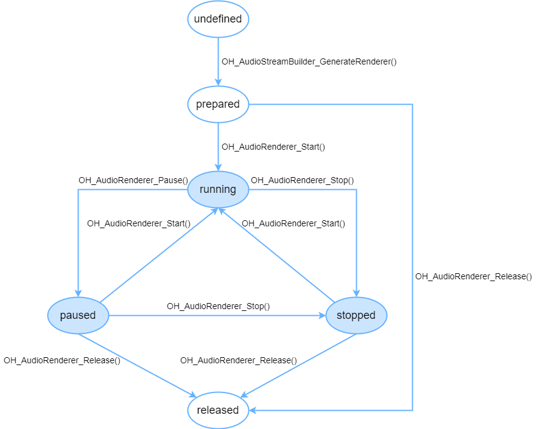

# Using OHAudio for Audio Playback (C/C++)

**OHAudio** is a set of C APIs introduced in API version 10. These APIs are normalized in design and support both common and low-latency audio channels. They support the PCM format only. They are suitable for playback applications that implement audio output at the native layer.

OHAudio audio playback state transition



## Prerequisites

To use the playback capability of **OHAudio**, you must first import the corresponding header files.

### Linking the Dynamic Library in the CMake Script

``` cmake
target_link_libraries(sample PUBLIC libohaudio.so)
```

### Adding Header Files

To use APIs for audio playback, import <[native_audiostreambuilder.h](../../reference/apis-audio-kit/native__audiostreambuilder_8h.md)> and <[native_audiorenderer.h](../../reference/apis-audio-kit/native__audiorenderer_8h.md)>.

```cpp
#include <ohaudio/native_audiorenderer.h>
#include <ohaudio/native_audiostreambuilder.h>
```

## Building Audio Streams

**OHAudio** provides the **OH_AudioStreamBuilder** class, which complies with the builder design pattern and is used to build audio streams. You need to specify [OH_AudioStream_Type](../../reference/apis-audio-kit/_o_h_audio.md#oh_audiostream_type) based on your service scenarios.

**OH_AudioStream_Type** can be set to either of the following:

- AUDIOSTREAM_TYPE_RENDERER
- AUDIOSTREAM_TYPE_CAPTURER

The following code snippet shows how to use [OH_AudioStreamBuilder_Create](../../reference/apis-audio-kit/_o_h_audio.md#oh_audiostreambuilder_create) to create a builder:

```
OH_AudioStreamBuilder* builder;
OH_AudioStreamBuilder_Create(&builder, streamType);
```

After the audio service is complete, call [OH_AudioStreamBuilder_Destroy](../../reference/apis-audio-kit/_o_h_audio.md#oh_audiostreambuilder_destroy) to destroy the builder.

```
OH_AudioStreamBuilder_Destroy(builder);
```

## How to Develop

Read [OHAudio](../../reference/apis-audio-kit/_o_h_audio.md) for the API reference.

The following walks you through how to implement simple playback:

1. Create an audio stream builder.

    ```c++
    OH_AudioStreamBuilder* builder;
    OH_AudioStreamBuilder_Create(&builder, AUDIOSTREAM_TYPE_RENDERER);
    ```

2. Set audio stream parameters.

    After creating the builder for audio playback, set the parameters required.

    ```c++
    // Set the audio sampling rate.
    OH_AudioStreamBuilder_SetSamplingRate(builder, 48000);
    // Set the number of audio channels.
    OH_AudioStreamBuilder_SetChannelCount(builder, 2);
    // Set the audio sampling format.
    OH_AudioStreamBuilder_SetSampleFormat(builder, AUDIOSTREAM_SAMPLE_S16LE);
    // Set the encoding type of the audio stream.
    OH_AudioStreamBuilder_SetEncodingType(builder, AUDIOSTREAM_ENCODING_TYPE_RAW);
    // Set the usage scenario of the audio renderer.
    OH_AudioStreamBuilder_SetRendererInfo(builder, AUDIOSTREAM_USAGE_MUSIC);
    ```

    Note that the audio data to play is written through callbacks. You must call **OH_AudioStreamBuilder_SetRendererCallback** to implement the callbacks. For details about the declaration of the callback functions, see [OH_AudioRenderer_Callbacks](../../reference/apis-audio-kit/_o_h_audio.md#oh_audiorenderer_callbacks).


3. Set the callback functions.

    For details about concurrent processing of multiple audio streams, see [Processing Audio Interruption Events](audio-playback-concurrency.md). The procedure is similar, and the only difference is the API programming language in use.

    ```c++
    // Customize a data writing function.
    int32_t MyOnWriteData(
        OH_AudioRenderer* renderer,
        void* userData,
        void* buffer,
        int32_t length)
    {
        // Write the data to be played to the buffer by length.
        return 0;
    }
    // Customize an audio stream event function.
    int32_t MyOnStreamEvent(
        OH_AudioRenderer* renderer,
        void* userData,
        OH_AudioStream_Event event)
    {
        // Update the player status and UI based on the audio stream event information indicated by the event.
        return 0;
    }
    // Customize an audio interruption event function.
    int32_t MyOnInterruptEvent(
        OH_AudioRenderer* renderer,
        void* userData,
        OH_AudioInterrupt_ForceType type,
        OH_AudioInterrupt_Hint hint)
    {
        // Update the player status and UI based on the audio interruption information indicated by type and hint.
        return 0;
    }
    // Customize an exception callback function.
    int32_t MyOnError(
        OH_AudioRenderer* renderer,
        void* userData,
        OH_AudioStream_Result error)
    {
        // Perform operations based on the audio exception information indicated by error.
        return 0;
    }

    OH_AudioRenderer_Callbacks callbacks;
    // Set the callbacks.
    callbacks.OH_AudioRenderer_OnWriteData = MyOnWriteData;
    callbacks.OH_AudioRenderer_OnStreamEvent = MyOnStreamEvent;
    callbacks.OH_AudioRenderer_OnInterruptEvent = MyOnInterruptEvent;
    callbacks.OH_AudioRenderer_OnError = MyOnError;

    // Set callbacks for the audio renderer.
    OH_AudioStreamBuilder_SetRendererCallback(builder, callbacks, nullptr);
    ```

    To avoid unexpected behavior, ensure that each callback of [OH_AudioRenderer_Callbacks](../../reference/apis-audio-kit/_o_h_audio.md#oh_audiorenderer_callbacks) is initialized by a custom callback method or null pointer when being set.

    ```c++
    // Customize a data writing function.
    int32_t MyOnWriteData(
        OH_AudioRenderer* renderer,
        void* userData,
        void* buffer,
        int32_t length)
    {
        // Write the data to be played to the buffer by length.
        return 0;
    }
    // Customize an audio interruption event function.
    int32_t MyOnInterruptEvent(
        OH_AudioRenderer* renderer,
        void* userData,
        OH_AudioInterrupt_ForceType type,
        OH_AudioInterrupt_Hint hint)
    {
        // Update the player status and UI based on the audio interruption information indicated by type and hint.
        return 0;
    }
    OH_AudioRenderer_Callbacks callbacks;

    // Configure a callback function. If listening is required, assign a value.
    callbacks.OH_AudioRenderer_OnWriteData = MyOnWriteData;
    callbacks.OH_AudioRenderer_OnInterruptEvent = MyOnInterruptEvent;

    // (Mandatory) If listening is not required, use a null pointer for initialization.
    callbacks.OH_AudioRenderer_OnStreamEvent = nullptr;
    callbacks.OH_AudioRenderer_OnError = nullptr;
    ```

4. Create an audio renderer instance.

    ```c++
    OH_AudioRenderer* audioRenderer;
    OH_AudioStreamBuilder_GenerateRenderer(builder, &audioRenderer);
    ```

5. Use the audio renderer.

    You can use the APIs listed below to control the audio streams.
    
    | API                                                        | Description        |
    | ------------------------------------------------------------ | ------------ |
    | OH_AudioStream_Result OH_AudioRenderer_Start(OH_AudioRenderer* renderer) | Starts the audio renderer.    |
    | OH_AudioStream_Result OH_AudioRenderer_Pause(OH_AudioRenderer* renderer) | Pauses the audio renderer.    |
    | OH_AudioStream_Result OH_AudioRenderer_Stop(OH_AudioRenderer* renderer) | Stops the audio renderer.    |
    | OH_AudioStream_Result OH_AudioRenderer_Flush(OH_AudioRenderer* renderer) | Flushes written audio data.|
    | OH_AudioStream_Result OH_AudioRenderer_Release(OH_AudioRenderer* renderer) | Releases the audio renderer instance.|

6. Destroy the audio stream builder.

    When the builder is no longer used, release related resources.

    ```c++
    OH_AudioStreamBuilder_Destroy(builder);
    ```

## Setting the Low Latency Mode

If the device supports the low-latency channel, you can use the low-latency mode to create a player for a higher-quality audio experience.

The development process is similar to that in the common playback scenario. The only difference is that you need to set the low delay mode by calling [OH_AudioStreamBuilder_SetLatencyMode()](../../reference/apis-audio-kit/_o_h_audio.md#oh_audiostreambuilder_setlatencymode) when creating an audio stream builder.

The code snippet is as follows:

```C
OH_AudioStreamBuilder_SetLatencyMode(builder, AUDIOSTREAM_LATENCY_MODE_FAST);
```

## Setting the Audio Channel Layout

In the case of audio file playback, you can set the audio channel layout to specify the speaker position during rendering or playing for a better audio experience.

The development process is similar to that in the common playback scenario. The only difference is that you need to set the audio channel layout by calling [OH_AudioStreamBuilder_SetChannelLayout()](../../reference/apis-audio-kit/_o_h_audio.md#oh_audiostreambuilder_setchannellayout) when creating an audio stream builder.

If the audio channel layout does not match the number of audio channels, audio streams fail to be created. Therefore, you must ensure that the audio channel layout setting is correct.

If you do not know the accurate audio channel layout or you want to use the default audio channel layout, do not call the API to set the audio channel layout. Alternatively, deliver **CH_LAYOUT_UNKNOWN** to use the default audio channel layout, which is specific to the number of audio channels.

For audio in HOA format, to obtain the correct rendering and playback effect, you must specify the audio channel layout.

The code snippet is as follows:

```C
OH_AudioStreamBuilder_SetChannelLayout(builder, CH_LAYOUT_STEREO);
```

## Playing Audio Files in AudioVivid Format

In the case of audio file playback in AudioVivid format, the callback function used for writing data is different from that in the common playback scenario. This callback function can write PCM data and metadata at the same time.

The development process is similar to that in the common playback scenario. The only difference is that you need to call [OH_AudioStreamBuilder_SetWriteDataWithMetadataCallback()](../../reference/apis-audio-kit/_o_h_audio.md#oh_audiostreambuilder_setwritedatawithmetadatacallback) to set the callback function and call [OH_AudioStreamBuilder_SetEncodingType()](../../reference/apis-audio-kit/_o_h_audio.md#oh_audiostreambuilder_setencodingtype) to set the encoding type to **AUDIOSTREAM_ENCODING_TYPE_AUDIOVIVID** when creating an audio stream builder.

When an audio file in AudioVivid format is played, the frame size is fixed. Therefore, do not call [OH_AudioStreamBuilder_SetFrameSizeInCallback()](../../reference/apis-audio-kit/_o_h_audio.md#oh_audiostreambuilder_setframesizeincallback) to set the frame size in the callback. In addition, when setting the number of audio channels and the audio channel layout, use the sum of the number of sound beds written into the audio source and the number of objects.

The code snippet is as follows:

```C
// Customize a callback function for simultaneously writing PCM data and metadata.
int32_t MyOnWriteDataWithMetadata(
    OH_AudioRenderer* renderer,
    void* userData,
    void* audioData,
    int32_t audioDataSize,
    void* metadata,
    int32_t metadataSize)
{
    // Write the PCM data and metadata to be played to the buffer by audioDataSize and metadataSize, respectively.
    return 0;
}

// Set the encoding type.
OH_AudioStreamBuilder_SetEncodingType(builder, AUDIOSTREAM_ENCODING_TYPE_AUDIOVIVID);
// Set the callbacks.
OH_AudioRenderer_WriteDataWithMetadataCallback metadataCallback = MyOnWriteDataWithMetadata;
// Set the callback function for writing both PCM data and metadata.
OH_AudioStreamBuilder_SetWriteDataWithMetadataCallback(builder, metadataCallback, nullptr);
```

<!--RP1-->
<!--RP1End-->
