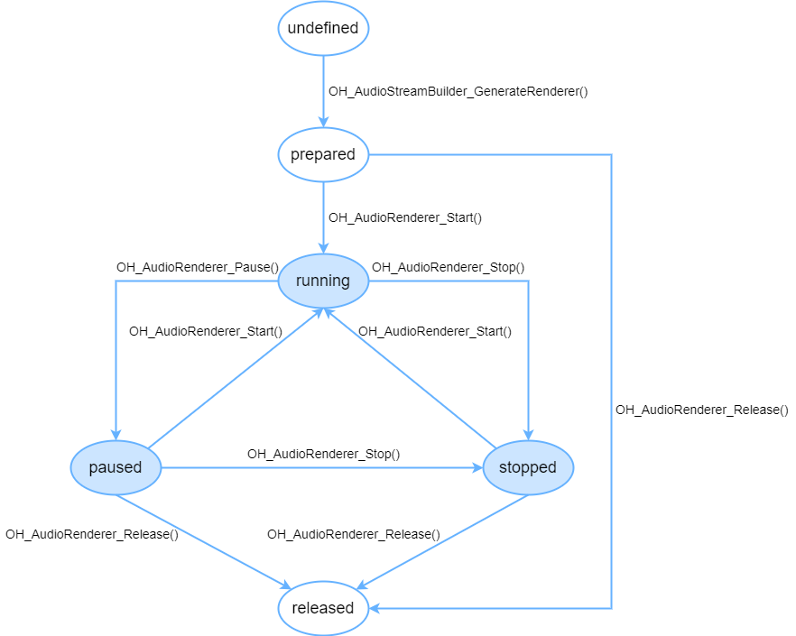

# (Recommended) Using OHAudio for Audio Playback (C/C++)

<!--Kit: Audio Kit-->
<!--Subsystem: Multimedia-->
<!--Owner: @boxwall-->
<!--Designer: @magekkkk-->
<!--Tester: @Filger-->
<!--Adviser: @w_Machine_cc-->
<!-- md-trans-meta sourceCommit=1ff9e9cd1ebb6561090ad32be99073f8301559bf translatedAt=2026-08-06T01:53:42.353Z pushedAt=2026-08-06T09:21:01.938Z -->

OHAudio is a set of C APIs introduced in API version 10. These APIs are normalized in design and support both common and low-latency audio channels. They support the PCM format only and are suitable for applications that implement audio output at the native layer.

When an audio stream is in the working state (not released), it occupies system audio stream resources. Since the system limits the number of audio streams, call `OH_AudioRenderer_Release()` to release audio resources when the client temporarily does not use the audio stream. This ensures proper resource utilization and prevents failures in creating subsequent audio streams.

OHAudio audio playback state transition



## Prerequisites

To use the playback capability of OHAudio, you must first import the corresponding header files.

The following examples are code snippets. You can obtain the [complete sample](https://gitcode.com/openharmony/applications_app_samples/tree/master/code/DocsSample/Media/Audio/AudioRendererSampleC) via the link at the bottom right of each code snippet.

### Linking the Dynamic Library in the CMake Script

``` cmake
target_link_libraries(sample PUBLIC libohaudio.so)
```

### Adding Header Files

Include the <[native_audiostreambuilder.h](../../reference/apis-audio-kit/capi-native-audiostreambuilder-h.md)> and <[native_audiorenderer.h](../../reference/apis-audio-kit/capi-native-audiorenderer-h.md)> header files so that the application can use the functions related to audio playback.

<!-- @[Render_headFile](https://gitcode.com/openharmony/applications_app_samples/blob/master/code/DocsSample/Media/Audio/AudioRendererSampleC/entry/src/main/cpp/renderer.cpp) -->

``` C++
#include <ohaudio/native_audiorenderer.h>
#include <ohaudio/native_audiostreambuilder.h>
```

## How to Develop

Read [OHAudio](../../reference/apis-audio-kit/capi-ohaudio.md) for the API reference.

### Building Audio Streams

OHAudio provides the **OH_AudioStreamBuilder** class, which complies with the builder design pattern and is used to build audio streams. You need to specify [OH_AudioStream_Type](../../reference/apis-audio-kit/capi-native-audiostream-base-h.md#oh_audiostream_type) based on your service scenarios.

**OH_AudioStream_Type** can be set to either of the following:

- AUDIOSTREAM_TYPE_RENDERER

- AUDIOSTREAM_TYPE_CAPTURER

The following code snippet shows how to use [OH_AudioStreamBuilder_Create](../../reference/apis-audio-kit/capi-native-audiostreambuilder-h.md#oh_audiostreambuilder_create) to create a builder:

<!-- @[Render_Create](https://gitcode.com/openharmony/applications_app_samples/blob/master/code/DocsSample/Media/Audio/AudioRendererSampleC/entry/src/main/cpp/renderer.cpp) -->

``` C++
OH_AudioStreamBuilder* builder;
// ...
    OH_AudioStreamBuilder_Create(&builder, AUDIOSTREAM_TYPE_RENDERER);
```

After the audio service is complete, call [OH_AudioStreamBuilder_Destroy](../../reference/apis-audio-kit/capi-native-audiostreambuilder-h.md#oh_audiostreambuilder_destroy) to destroy the builder.

<!-- @[Render_Destroy](https://gitcode.com/openharmony/applications_app_samples/blob/master/code/DocsSample/Media/Audio/AudioRendererSampleC/entry/src/main/cpp/renderer.cpp) -->

``` C++
OH_AudioStreamBuilder_Destroy(builder);
```

The following walks you through how to implement simple playback:

### Implementing Audio Playback

1. Create an audio stream builder.

   <!-- @[Render_Create](https://gitcode.com/openharmony/applications_app_samples/blob/master/code/DocsSample/Media/Audio/AudioRendererSampleC/entry/src/main/cpp/renderer.cpp) -->

   ``` C++
   OH_AudioStreamBuilder* builder;
   // ...
       OH_AudioStreamBuilder_Create(&builder, AUDIOSTREAM_TYPE_RENDERER);
   ```

2. Set audio stream parameters.

   For details about the audio sampling rate, see [Configuring the Appropriate Audio Sampling Rate](using-audiorenderer-for-playback.md#configuring-the-appropriate-audio-sampling-rate).<br>
   After creating the builder for audio playback, set the parameters required.

   <!-- @[Render_ConfigStream](https://gitcode.com/openharmony/applications_app_samples/blob/master/code/DocsSample/Media/Audio/AudioRendererSampleC/entry/src/main/cpp/renderer.cpp) -->

   ``` C++
   // Set the audio sampling rate.
   // Starting from API version 26.0.0, audio rendering supports sample rates ranging from 8000 Hz to 384000 Hz in 10 Hz increments. The supported sample rate specifications may vary depending on the specific device.
   const int SAMPLING_RATE_48K = 48000;
   OH_AudioStreamBuilder_SetSamplingRate(builder, SAMPLING_RATE_48K);
   // Set the number of audio channels.
   const int channelCount = 2;
   OH_AudioStreamBuilder_SetChannelCount(builder, channelCount);
   // Set the audio sampling format.
   OH_AudioStreamBuilder_SetSampleFormat(builder, AUDIOSTREAM_SAMPLE_S16LE);
   // Set the encoding type of the audio stream.
   OH_AudioStreamBuilder_SetEncodingType(builder, AUDIOSTREAM_ENCODING_TYPE_RAW);
   // Set the usage scenario of the audio renderer.
   OH_AudioStreamBuilder_SetRendererInfo(builder, AUDIOSTREAM_USAGE_MUSIC);
   ```

   The audio data for playback must be written through a callback function, and you must implement the callback function. Starting from API version 12, you can use [OH_AudioStreamBuilder_SetRendererWriteDataCallback](../../reference/apis-audio-kit/capi-native-audiostreambuilder-h.md#oh_audiostreambuilder_setrendererwritedatacallback) to set the data callback function. For details about its declaration, see [OH_AudioRenderer_OnWriteDataCallback](../../reference/apis-audio-kit/capi-native-audiostream-base-h.md#oh_audiorenderer_onwritedatacallback).

3. Set the callback functions.

   For details about concurrent processing of multiple audio streams, see [Processing Audio Interruption Events](audio-playback-concurrency.md). The procedure is similar, and the only difference is the API programming language in use.

   - Starting from API version 12, you are advised to use [OH_AudioRenderer_OnWriteDataCallback](../../reference/apis-audio-kit/capi-native-audiostream-base-h.md#oh_audiorenderer_onwritedatacallback) to write audio data.

     > **NOTE**
     > 
     > - When the amount of data is sufficient to meet the required buffer length of the callback, you should return **AUDIO_DATA_CALLBACK_RESULT_VALID**, and the system uses the entire data buffer for playback. Do not return **AUDIO_DATA_CALLBACK_RESULT_VALID** when the buffer is not fully filled, as this leads to audio artifacts such as noise and playback stuttering.
     > 
     > - When the amount of data is insufficient to meet the required buffer length of the callback, you are advised to return **AUDIO_DATA_CALLBACK_RESULT_INVALID**. In this case, the system does not process this portion of audio data but requests data from the application again. Once the buffer is adequately filled, you can return **AUDIO_DATA_CALLBACK_RESULT_VALID**.
     > 
     > - Once the callback function finishes its execution, the audio service queues the data in the buffer for playback. Therefore, do not change the buffered data outside the callback. Regarding the last frame, if there is insufficient data to completely fill the buffer, you must concatenate the available data with padding to ensure that the buffer is full. This prevents any residual dirty data in the buffer from adversely affecting the playback effect.

    - Starting from API version 12, you can set audioDataSize through [OH_AudioStreamBuilder_SetFrameSizeInCallback](../../reference/apis-audio-kit/capi-native-audiostreambuilder-h.md#oh_audiostreambuilder_setframesizeincallback).

   <!-- @[Render_Callback](https://gitcode.com/openharmony/applications_app_samples/blob/master/code/DocsSample/Media/Audio/AudioRendererSampleC/entry/src/main/cpp/renderer.cpp) -->

   ``` C++
   // Customize a data writing function.
   static OH_AudioData_Callback_Result MyOnWriteData_New(
       OH_AudioRenderer* renderer,
       void* userData,
       void* audioData,
       int32_t audioDataSize)
   {
       // Write the data to be played to audioData by audioDataSize.
       // If you do not want to play a segment of audioData, return AUDIO_DATA_CALLBACK_RESULT_INVALID.
       size_t readCount = fread(audioData, audioDataSize, 1, g_fp);
       if (readCount == 0) {
           return AUDIO_DATA_CALLBACK_RESULT_INVALID;
       }
       if (feof(g_fp)) {
           fseek(g_fp, 0, SEEK_SET);
       }
       return AUDIO_DATA_CALLBACK_RESULT_VALID;
   }

   // Customize an audio interruption event function.
   void MyOnInterruptEvent_New(
       OH_AudioRenderer* renderer,
       void* userData,
       OH_AudioInterrupt_ForceType type,
       OH_AudioInterrupt_Hint hint)
   {
       // Update the player status and UI based on the audio interruption information indicated by type and hint.
   }

   // Customize an exception callback function.
   void MyOnError_New(
       OH_AudioRenderer* renderer,
       void* userData,
       OH_AudioStream_Result error)
   {
       // Perform operations based on the audio exception information indicated by error.
   }
   // ...
       // Configure the callback function for interruption events.
       OH_AudioRenderer_OnInterruptCallback OnInterruptCb = MyOnInterruptEvent_New;
       OH_AudioStreamBuilder_SetRendererInterruptCallback(builder, OnInterruptCb, nullptr);
       
       // Configure the callback function for audio exceptions.
       OH_AudioRenderer_OnErrorCallback OnErrorCb = MyOnError_New;
       OH_AudioStreamBuilder_SetRendererErrorCallback(builder, OnErrorCb, nullptr);
       
       // Configure the callback function for writing audio data.
       OH_AudioRenderer_OnWriteDataCallback writeDataCb = MyOnWriteData_New;
       OH_AudioStreamBuilder_SetRendererWriteDataCallback(builder, writeDataCb, nullptr);
   ```

4. Create an audio renderer instance.

   <!-- @[Render_GenerateRenderer](https://gitcode.com/openharmony/applications_app_samples/blob/master/code/DocsSample/Media/Audio/AudioRendererSampleC/entry/src/main/cpp/renderer.cpp) -->

   ``` C++
   OH_AudioRenderer* audioRenderer;
   // ...
       OH_AudioStreamBuilder_GenerateRenderer(builder, &audioRenderer);
   ```

5. Use the audio renderer.

   You can use the APIs listed below to control the audio streams.

    | API                                                        | Description        |
    | ------------------------------------------------------------ | ------------ |
    | OH_AudioStream_Result OH_AudioRenderer_Start(OH_AudioRenderer* renderer) | Starts the audio renderer.    |
    | OH_AudioStream_Result OH_AudioRenderer_Pause(OH_AudioRenderer* renderer) | Pauses the audio renderer.    |
    | OH_AudioStream_Result OH_AudioRenderer_Stop(OH_AudioRenderer* renderer) | Stops the audio renderer.    |
    | OH_AudioStream_Result OH_AudioRenderer_Flush(OH_AudioRenderer* renderer) | Flushes obtained audio data.|
    | OH_AudioStream_Result OH_AudioRenderer_Release(OH_AudioRenderer* renderer) | Releases the audio renderer instance.|

    > **NOTE**
    >
    > The execution of audio stream control APIs is time-consuming (for example, a single execution of **OH_AudioRenderer_Stop** generally takes more than 50 ms as it needs to play through the cache). Direct calls to these APIs on the main thread should be avoided to prevent interface display freezes.

6. Destroy the builder.

   When the builder is no longer used, release related resources.

   Applications must properly manage builders according to their needs, creating them as needed and releasing them promptly. This prevents excessive consumption of audio resources, which can lead to exceptions.

   <!-- @[Render_Destroy](https://gitcode.com/openharmony/applications_app_samples/blob/master/code/DocsSample/Media/Audio/AudioRendererSampleC/entry/src/main/cpp/renderer.cpp) -->

   ``` C++
   OH_AudioStreamBuilder_Destroy(builder);
   ```

### Setting the Volume for an Audio Stream

You can use [OH_AudioRenderer_SetVolume](../../reference/apis-audio-kit/capi-native-audiorenderer-h.md#oh_audiorenderer_setvolume) to set the volume for the current audio stream.

<!-- @[Render_SetVolume](https://gitcode.com/openharmony/applications_app_samples/blob/master/code/DocsSample/Media/Audio/AudioRendererSampleC/entry/src/main/cpp/renderer.cpp) -->  

``` C++
static float volume = 0.1f;
volume = volume > 0.5f ? 0.1f : 0.8f;

// Set the volume for the audio stream.
OH_AudioRenderer_SetVolume(audioRenderer, volume);
```

### Setting the Low Latency Mode

If the device supports the low-latency channel and the sampling rate is set to 48000 Hz, you can use the low-latency mode to create a player for a higher-quality audio experience.

The development process is similar to that in the common playback scenario (described in [Implementing Audio Playback](#implementing-audio-playback)). The only difference is that you need to set the low delay mode by calling [OH_AudioStreamBuilder_SetLatencyMode()](../../reference/apis-audio-kit/capi-native-audiostreambuilder-h.md#oh_audiostreambuilder_setlatencymode) when creating an audio stream builder in step 1.

> **NOTE**
>
> - When [OH_AudioStream_Usage](../../reference/apis-audio-kit/capi-native-audiostream-base-h.md#oh_audiostream_usage) is set to `AUDIOSTREAM_USAGE_VOICE_COMMUNICATION` or `AUDIOSTREAM_USAGE_VIDEO_COMMUNICATION` in an audio playback scenario, the low-latency mode cannot be actively set. The system determines the output audio path based on the device capabilities.
> - The low-latency path requires high data processing performance. Slow data generation by the app can easily cause stuttering. This mode is not recommended for common music or video playback scenarios. It is recommended only for latency-sensitive apps such as gaming and karaoke.

<!-- @[Render_SetLatencyMode](https://gitcode.com/openharmony/applications_app_samples/blob/master/code/DocsSample/Media/Audio/AudioRendererSampleC/entry/src/main/cpp/renderer.cpp) -->  

``` C++
OH_AudioStream_LatencyMode latencyMode = g_mode == 0 ? AUDIOSTREAM_LATENCY_MODE_NORMAL :
    AUDIOSTREAM_LATENCY_MODE_FAST;
OH_AudioStreamBuilder_SetLatencyMode(builder, latencyMode);
```

### Setting the Audio Channel Layout

In the case of audio file playback, you can set the audio channel layout to specify the speaker position during rendering or playing for a better audio experience.

The development process is similar to that in the common playback scenario (described in [Implementing Audio Playback](#implementing-audio-playback)). The only difference is that you need to set the audio channel layout by calling [OH_AudioStreamBuilder_SetChannelLayout()](../../reference/apis-audio-kit/capi-native-audiostreambuilder-h.md#oh_audiostreambuilder_setchannellayout) when creating an audio stream builder in step 1.

If the audio channel layout does not match the number of audio channels, audio streams fail to be created. Therefore, you must ensure that the audio channel layout setting is correct.

If you do not know the accurate channel layout information or you want to use the default channel layout, you can skip calling the channel layout setting API, or set it to CH_LAYOUT_UNKNOWN to use the default channel layout based on the channel count.

For audio in Higher Order Ambisonics (HOA) format, to obtain the correct rendering and playback effect, you must specify the audio channel layout.

<!-- @[Render_SetChannelLayout](https://gitcode.com/openharmony/applications_app_samples/blob/master/code/DocsSample/Media/Audio/AudioRendererSampleC/entry/src/main/cpp/renderer.cpp) -->

``` C++
OH_AudioStreamBuilder_SetChannelLayout(builder, CH_LAYOUT_STEREO);
```

### Playing Audio Files in Audio Vivid Format

In the case of audio file playback in Audio Vivid format, the callback function used for writing data is different from that in the common playback scenario. This callback function can write Pulse Code Modulation (PCM) data and metadata at the same time.

The development process is similar to that in the common playback scenario (described in [Implementing Audio Playback](#implementing-audio-playback)). The only difference is that you need to call [OH_AudioStreamBuilder_SetWriteDataWithMetadataCallback()](../../reference/apis-audio-kit/capi-native-audiostreambuilder-h.md#oh_audiostreambuilder_setwritedatawithmetadatacallback) to set the callback function and call [OH_AudioStreamBuilder_SetEncodingType()](../../reference/apis-audio-kit/capi-native-audiostreambuilder-h.md#oh_audiostreambuilder_setencodingtype) to set the encoding type to **AUDIOSTREAM_ENCODING_TYPE_AUDIOVIVID** when creating an audio stream builder in step 1.

When an audio file in Audio Vivid format is played, the frame size is fixed. Therefore, do not call [OH_AudioStreamBuilder_SetFrameSizeInCallback()](../../reference/apis-audio-kit/capi-native-audiostreambuilder-h.md#oh_audiostreambuilder_setframesizeincallback) to set the frame size in the callback. In addition, when setting the number of audio channels and the audio channel layout, use the sum of the number of sound beds written into the audio source and the number of objects.

<!-- @[Render_SetWriteDataWithMetadataCallback](https://gitcode.com/openharmony/applications_app_samples/blob/master/code/DocsSample/Media/Audio/AudioRendererSampleC/entry/src/main/cpp/renderer.cpp) -->

``` C++
// Customize a callback function for simultaneously writing PCM data and metadata.
int32_t MyOnWriteDataWithMetadata_New(
    OH_AudioRenderer* renderer,
    void* userData,
    void* audioData,
    int32_t audioDataSize,
    void* metadata,
    int32_t metadataSize)
{
    // Write the PCM data and metadata to be played to the buffer by audioDataSize and metadataSize, respectively.
    return 0;
}
// ...
    // Set the encoding type.
    OH_AudioStreamBuilder_SetEncodingType(builder, AUDIOSTREAM_ENCODING_TYPE_AUDIOVIVID);
    // Set the callbacks.
    OH_AudioRenderer_WriteDataWithMetadataCallback metadataCallback = MyOnWriteDataWithMetadata_New;
    // Set the callback function for writing both PCM data and metadata.
    OH_AudioStreamBuilder_SetWriteDataWithMetadataCallback(builder, metadataCallback, nullptr);
```

### Samples

For details about the sample related to OHAudio audio playback, see [OHAudio Recording and Playback](https://gitcode.com/openharmony/applications_app_samples/tree/master/code/DocsSample/Media/Audio/OHAudio).

## Precautions

Starting from API version 12, using [OH_AudioRenderer_Callbacks](../../reference/apis-audio-kit/capi-ohaudio-oh-audiorenderer-callbacks-struct.md) to set audio callback functions is **no longer recommended**. If you must use it, configure it in one of the following two ways to avoid unexpected behavior.

- Initialize each callback in [OH_AudioRenderer_Callbacks](../../reference/apis-audio-kit/capi-ohaudio-oh-audiorenderer-callbacks-struct.md) by a custom callback method or a null pointer.

  <!-- @[Render_CustomCallback](https://gitcode.com/openharmony/applications_app_samples/blob/master/code/DocsSample/Media/Audio/AudioRendererSampleC/entry/src/main/cpp/renderer.cpp) -->

  ``` C++
  OH_AudioRenderer_Callbacks callbacks;
  // ...
  // Customize a data writing function.
  int32_t MyOnWriteData_Legacy(
      OH_AudioRenderer* renderer,
      void* userData,
      void* buffer,
      int32_t length)
  {
      // Write the data to be played to the buffer by length.
      return 0;
  }

  // Customize an audio interruption event function.
  int32_t MyOnInterruptEvent_Legacy(
      OH_AudioRenderer* renderer,
      void* userData,
      OH_AudioInterrupt_ForceType type,
      OH_AudioInterrupt_Hint hint)
  {
      // Update the player status and UI based on the audio interruption information indicated by type and hint.
      return 0;
  }
  // ...
      // Configure a callback function. If listening is required, assign a value.
      callbacks.OH_AudioRenderer_OnWriteData = MyOnWriteData_Legacy;
      callbacks.OH_AudioRenderer_OnInterruptEvent = MyOnInterruptEvent_Legacy;
  
      // (Mandatory) If no callback is triggered, use a null pointer for initialization. From API version 11, if you need to listen to device changes,
      // you can use OH_AudioRenderer_OutputDeviceChangeCallback instead.
      callbacks.OH_AudioRenderer_OnStreamEvent = nullptr;
      // (Mandatory) If listening is not required, use a null pointer for initialization.
      callbacks.OH_AudioRenderer_OnError = nullptr;
  ```

- Initialize and clear the struct before using it.

  <!-- @[Render_callBackInit](https://gitcode.com/openharmony/applications_app_samples/blob/master/code/DocsSample/Media/Audio/AudioRendererSampleC/entry/src/main/cpp/renderer.cpp) -->

  ``` C++
  OH_AudioRenderer_Callbacks callbacks;
  // ...
  // Customize a data writing function.
  int32_t MyOnWriteData_Legacy(
      OH_AudioRenderer* renderer,
      void* userData,
      void* buffer,
      int32_t length)
  {
      // Write the data to be played to the buffer by length.
      return 0;
  }

  // Customize an audio interruption event function.
  int32_t MyOnInterruptEvent_Legacy(
      OH_AudioRenderer* renderer,
      void* userData,
      OH_AudioInterrupt_ForceType type,
      OH_AudioInterrupt_Hint hint)
  {
      // Update the player status and UI based on the audio interruption information indicated by type and hint.
      return 0;
  }
  // ...
      // Initialize and clear the struct before using it.
      OH_AudioRenderer_Callbacks callbacks = {0};
  
      // Configure the required callback functions.
      callbacks.OH_AudioRenderer_OnWriteData = MyOnWriteData_Legacy;
      callbacks.OH_AudioRenderer_OnInterruptEvent = MyOnInterruptEvent_Legacy;
  ```

<!--RP1-->
<!--RP1End-->