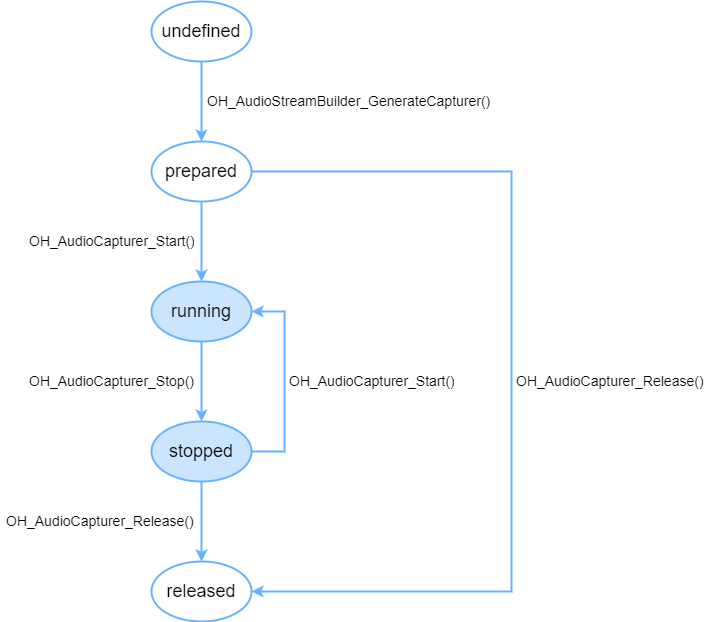

# (Recommended) Using OHAudio for Audio Recording (C/C++)

<!--Kit: Audio Kit-->
<!--Subsystem: Multimedia-->
<!--Owner: @zyy0412-->
<!--Designer: @weixin_41398971-->
<!--Tester: @Filger-->
<!--Adviser: @w_Machine_cc-->
<!-- md-trans-meta sourceCommit=e5ffacb738adcbcbdef8bb46a1f51b91ed565ad8 translatedAt=2026-08-06T01:54:36.184Z pushedAt=2026-08-06T09:45:51.610Z -->

OHAudio is a set of C APIs introduced in API version 10. These APIs are designed with a unified approach and support both regular audio paths and low-latency paths. Only PCM format is supported, making OHAudio suitable for scenarios where audio input is implemented at the native layer.

When an audio stream is in the working state (non-released), it occupies system audio stream resources. Because the system imposes a limit on the number of audio streams, you should call `OH_AudioCapturer_Release()` to release audio resources when the audio stream is temporarily not in use. This ensures proper resource utilization and prevents failures when creating audio streams later.

The following figure shows the state changes of OHAudio audio recording:



## Prerequisites

To use the recording capabilities provided by OHAudio, you need to add the corresponding header files.

The examples below are code snippets. You can obtain the [complete sample](https://gitcode.com/openharmony/applications_app_samples/tree/master/code/DocsSample/Media/Audio/AudioCapturerSampleC) via the link at the lower-right corner of each snippet.

### Linking the Dynamic Library in the CMake Script

``` cmake
target_link_libraries(sample PUBLIC libohaudio.so)
```

### Adding Header Files

You can use audio recording APIs by importing the <[native_audiostreambuilder.h](../../reference/apis-audio-kit/capi-native-audiostreambuilder-h.md)> and <[native_audiocapturer.h](../../reference/apis-audio-kit/capi-native-audiocapturer-h.md)> header files.

<!-- @[header_file](https://gitcode.com/openharmony/applications_app_samples/blob/master/code/DocsSample/Media/Audio/AudioCapturerSampleC/entry/src/main/cpp/AudioCapture.cpp) -->

``` C++
#include <ohaudio/native_audiocapturer.h>
#include <ohaudio/native_audiostreambuilder.h>
```

## How to Develop

For detailed API descriptions, see [OHAudio](../../reference/apis-audio-kit/capi-ohaudio.md).

### Audio Stream Builder

OHAudio provides the OH_AudioStreamBuilder interface, which follows the builder design pattern for constructing audio streams. You need to specify the corresponding [OH_AudioStream_Type](../../reference/apis-audio-kit/capi-native-audiostream-base-h.md#oh_audiostream_type) based on your service scenario.

`OH_AudioStream_Type` includes two types:

- AUDIOSTREAM_TYPE_RENDERER

- AUDIOSTREAM_TYPE_CAPTURER

Use [OH_AudioStreamBuilder_Create](../../reference/apis-audio-kit/capi-native-audiostreambuilder-h.md#oh_audiostreambuilder_create) to create a builder instance:

<!-- @[create_StreamType](https://gitcode.com/openharmony/applications_app_samples/blob/master/code/DocsSample/Media/Audio/AudioCapturerSampleC/entry/src/main/cpp/AudioCapture.cpp) -->

``` C++
OH_AudioStreamBuilder* builder;
OH_AudioStreamBuilder_Create(&builder, streamType);
```

After the audio operations are complete, call [OH_AudioStreamBuilder_Destroy](../../reference/apis-audio-kit/capi-native-audiostreambuilder-h.md#oh_audiostreambuilder_destroy) to destroy the builder.

<!-- @[Destroy_Capture](https://gitcode.com/openharmony/applications_app_samples/blob/master/code/DocsSample/Media/Audio/AudioCapturerSampleC/entry/src/main/cpp/AudioCapture.cpp) -->

``` C++
OH_AudioStreamBuilder_Destroy(builder);
```

You can implement basic audio recording by following these steps.

### Implementing Audio Recording

1. Create a builder.

   <!-- @[Create_Capture](https://gitcode.com/openharmony/applications_app_samples/blob/master/code/DocsSample/Media/Audio/AudioCapturerSampleC/entry/src/main/cpp/AudioCapture.cpp) -->

   ``` C++
   OH_AudioStreamBuilder* builder;
   OH_AudioStreamBuilder_Create(&builder, AUDIOSTREAM_TYPE_CAPTURER);
   ```

2. Configure audio stream parameters.

   After creating the audio recording constructor, you can set the parameters required by the audio stream. Refer to the following example.

   <!-- @[Configure_Capture](https://gitcode.com/openharmony/applications_app_samples/blob/master/code/DocsSample/Media/Audio/AudioCapturerSampleC/entry/src/main/cpp/AudioCapture.cpp) -->

   ``` C++
   // Set the audio sample rate.
   const int SAMPLING_RATE_48K = 48000;
   OH_AudioStreamBuilder_SetSamplingRate(builder, SAMPLING_RATE_48K);
   // Set the audio channel.
   const int channelCount = 2;
   OH_AudioStreamBuilder_SetChannelCount(builder, channelCount);
   // Set the audio sample format.
   OH_AudioStreamBuilder_SetSampleFormat(builder, AUDIOSTREAM_SAMPLE_S16LE);
   // Set the encoding type of the audio stream.
   OH_AudioStreamBuilder_SetEncodingType(builder, AUDIOSTREAM_ENCODING_TYPE_RAW);
   // Set the usage scenario of the input audio stream.
   OH_AudioStreamBuilder_SetCapturerInfo(builder, AUDIOSTREAM_SOURCE_TYPE_MIC);
   ```

During audio recording, audio data must be read in through a callback interface. You must implement the callback interface. Starting from API version 12, you can use [OH_AudioStreamBuilder_SetCapturerReadDataCallback](../../reference/apis-audio-kit/capi-native-audiostreambuilder-h.md#oh_audiostreambuilder_setcapturerreaddatacallback) to set the callback function. For the callback function declaration, see [OH_AudioCapturer_OnReadDataCallback](../../reference/apis-audio-kit/capi-native-audiocapturer-h.md#oh_audiocapturer_onreaddatacallback).

3. Set the audio callback functions.

For concurrent audio processing, refer to [Introduction to Audio Focus](audio-playback-concurrency.md). The only difference lies in the API language used.

   <!-- @[Set_AudioCallbackFunction](https://gitcode.com/openharmony/applications_app_samples/blob/master/code/DocsSample/Media/Audio/AudioCapturerSampleC/entry/src/main/cpp/AudioCapture.cpp) -->

   ``` C++
   void MyOnReadData_NewAPI(
       OH_AudioCapturer* capturer,
       void* userData,
       void* audioData,
       int32_t audioDataSize)
   {
       // Obtain recording data of the specified length from the buffer.
   }
   
   void MyOnInterruptEvent_NewAPI(
       OH_AudioCapturer* capturer,
       void* userData,
       OH_AudioInterrupt_ForceType type,
       OH_AudioInterrupt_Hint hint)
   {
       // Update the capturer state and UI based on the audio interruption information indicated by type and hint.
   }
   
   void MyOnError_NewAPI(
       OH_AudioCapturer* capturer,
       void* userData,
       OH_AudioStream_Result error)
   {
       // Handle the audio exception based on the error information.
   }
   // ...
       // Configure the audio interrupt event callback.
       OH_AudioCapturer_OnInterruptCallback OnInterruptCb = MyOnInterruptEvent_NewAPI;
       OH_AudioStreamBuilder_SetCapturerInterruptCallback(builder, OnInterruptCb, nullptr);
   
       // Configure the audio error callback.
       OH_AudioCapturer_OnErrorCallback OnErrorCb = MyOnError_NewAPI;
       OH_AudioStreamBuilder_SetCapturerErrorCallback(builder, OnErrorCb, nullptr);
   
       // Configure the audio input stream callback.
       OH_AudioCapturer_OnReadDataCallback OnReadDataCb = MyOnReadData_NewAPI;
       OH_AudioStreamBuilder_SetCapturerReadDataCallback(builder, OnReadDataCb, nullptr);
   ```

4. Construct the recording audio stream.

   <!-- @[GenerateCapturer_Capture](https://gitcode.com/openharmony/applications_app_samples/blob/master/code/DocsSample/Media/Audio/AudioCapturerSampleC/entry/src/main/cpp/AudioCapture.cpp) -->

   ``` C++
   OH_AudioCapturer* audioCapturer;
   OH_AudioStreamBuilder_GenerateCapturer(builder, &audioCapturer);
   ```

5. Use the audio stream.

   The recording audio stream includes the following APIs for controlling the audio stream.

    | API                                                         | Description         |
    | ------------------------------------------------------------ | ------------ |
    | OH_AudioStream_Result OH_AudioCapturer_Start(OH_AudioCapturer* capturer) | Starts recording.    |
    | OH_AudioStream_Result OH_AudioCapturer_Pause(OH_AudioCapturer* capturer) | Pauses recording.     |
    | OH_AudioStream_Result OH_AudioCapturer_Stop(OH_AudioCapturer* capturer) | Stops recording.     |
    | OH_AudioStream_Result OH_AudioCapturer_Flush(OH_AudioCapturer* capturer) | Releases cached data. |
    | OH_AudioStream_Result OH_AudioCapturer_Release(OH_AudioCapturer* capturer) | Releases the recording instance. |

    > **NOTE**
    >
    > Audio stream control APIs may take time to execute (for example, a single call to OH_AudioCapturer_Stop typically exceeds 50 ms). Avoid calling them directly on the main thread to prevent UI lag.

6. Release the builder.

   When the builder is no longer needed, release the related resources.

   <!-- @[Destroy_Capture](https://gitcode.com/openharmony/applications_app_samples/blob/master/code/DocsSample/Media/Audio/AudioCapturerSampleC/entry/src/main/cpp/AudioCapture.cpp) -->

   ``` C++
   OH_AudioStreamBuilder_Destroy(builder);
   ```

### Setting the Low Latency Mode

When the device supports a low-latency path, you can use low latency mode to create an audio recording constructor for a lower-latency audio experience.

The development process is the same as that of normal recording ([Implementing Audio Recording](#implementing-audio-recording)), except that in step 1, when creating the audio recording constructor, you need to call [OH_AudioStreamBuilder_SetLatencyMode()](../../reference/apis-audio-kit/capi-native-audiostreambuilder-h.md#oh_audiostreambuilder_setlatencymode) to set the low latency mode.

> **NOTE**
>
> - When the audio recording scenario [OH_AudioStream_SourceType](../../reference/apis-audio-kit/capi-native-audiostream-base-h.md#oh_audiostream_sourcetype) is `AUDIOSTREAM_SOURCE_TYPE_VOICE_COMMUNICATION`, actively setting low latency mode is not supported. The system determines the input audio path based on the device capabilities.
> - In certain scenarios (such as incoming calls), system capabilities are limited and the mode falls back to the normal audio path mode, where the buffer size also changes. In this case, you must read all data from the buffer at once based on the buffer size, just as in the normal audio path mode. Otherwise, the recorded data will be discontinuous, resulting in noise.

<!-- @[latencyMode_Capture](https://gitcode.com/openharmony/applications_app_samples/blob/master/code/DocsSample/Media/Audio/AudioCapturerSampleC/entry/src/main/cpp/AudioCapture.cpp) -->

``` C++
OH_AudioStream_LatencyMode latencyMode = AUDIOSTREAM_LATENCY_MODE_FAST;
OH_AudioStreamBuilder_SetLatencyMode(builder, latencyMode);
```

### Capturing Loopback Audio Effect Data

Starting from API version 26.0.0, when an app has enabled ear monitor and configured ear monitor effects such as reverb through [hardware loopback mode](../../media/audio/audio-ear-monitor-loopback.md#how-to-develop) in the same process, you can call [OH_AudioStreamBuilder_SetCapturerLoopbackEffectEnabled](../../reference/apis-audio-kit/capi-native-audiostreambuilder-h.md#oh_audiostreambuilder_setcapturerloopbackeffectenabled) when creating a recording stream to set the recording stream to capture audio data processed by ear monitor effects. This capability is suitable for scenarios such as karaoke and live streaming where the ear monitor effect processing result needs to be recorded.

This API must be called before [OH_AudioStreamBuilder_GenerateCapturer](../../reference/apis-audio-kit/capi-native-audiostreambuilder-h.md#oh_audiostreambuilder_generatecapturer) generates the recording stream, and the target recording stream must be configured in [AUDIOSTREAM_LATENCY_MODE_FAST](../../reference/apis-audio-kit/capi-native-audiostream-base-h.md#oh_audiostream_latencymode) low latency mode.

<!-- @[SetCapturerLoopbackEffectEnabled](https://gitcode.com/openharmony/applications_app_samples/blob/master/code/DocsSample/Media/Audio/AudioCapturerSampleC/entry/src/main/cpp/AudioCapture.cpp) -->

``` C++
OH_AudioStream_Result result = OH_AudioStreamBuilder_SetCapturerLoopbackEffectEnabled != nullptr ?
    OH_AudioStreamBuilder_SetCapturerLoopbackEffectEnabled(builder, true) :
    AUDIOSTREAM_ERROR_ILLEGAL_STATE;
```

### Setting the Mute Interruption Mode

The mute-on-interruption mode provides the capability to switch the interruption policy from stopping recording to muted recording, so that the recording session is not interrupted by the system based on audio focus concurrency rules, and other apps can still start recording during the session. When creating an audio recording constructor, call [OH_AudioStreamBuilder_SetCapturerWillMuteWhenInterrupted](../../reference/apis-audio-kit/capi-native-audiostreambuilder-h.md#oh_audiostreambuilder_setcapturerwillmutewheninterrupted) to set whether to enable the mute-on-interruption mode. This mode is disabled by default, in which case the audio focus policy manages the execution order of concurrent audio streams. When enabled, if the recording is stopped or paused due to interruption by another app, the capturer enters the muted recording state, where the recorded audio contains no sound.

### Setting Mute Hint for Recording Stream

Starting from API version 24, when an app has muted a recording stream on the service side, it can call [OH_AudioCapturer_SetMuteHint](../../reference/apis-audio-kit/capi-native-audiocapturer-h.md#oh_audiocapturer_setmutehint) to report this state to the system audio module. The system audio module then adjusts its policies based on the reported state to reduce power consumption. Note: This feature is currently effective only on certain PCs/2-in-1 devices. This API does not actually trigger muting, nor does it apply mute processing to the recording data. It only informs the system audio module that the app has muted the current recording stream. The app must still handle the recording data on its own, for example, by not sending captured data or by sending silent data.

This API can only be called when the recording stream is in the running state; otherwise, `AUDIOSTREAM_ERROR_ILLEGAL_STATE` is returned. If both stream-level mute hint and session-level mute hint [OH_AudioSessionManager_SetCaptureMuteHint](../../reference/apis-audio-kit/capi-native-audio-session-manager-h.md#oh_audiosessionmanager_setcapturemutehint) are set for the same recording stream, the stream-level mute hint takes precedence, and the stream-level setting is used. No system query API is currently provided. If the mute hint state needs to be displayed on the UI, the app must maintain the most recently set successful state on its own.

<!-- @[cset_mute_hint](https://gitcode.com/openharmony/applications_app_samples/blob/master/code/DocsSample/Media/Audio/AudioCapturerSampleC/entry/src/main/cpp/AudioCapture.cpp) --> 

``` C++
bool mute = true;
OH_AudioStream_Result setResult = OH_AudioCapturer_SetMuteHint(audioCapturer, mute);
if (setResult != AUDIOSTREAM_SUCCESS) {
    // Handle the exception based on the return value, for example, AUDIOSTREAM_ERROR_ILLEGAL_STATE.
}

mute = false;
OH_AudioStream_Result unsetResult = OH_AudioCapturer_SetMuteHint(audioCapturer, mute);
```

### Echo Cancellation

The echo cancellation feature effectively eliminates echo interference during recording on supported devices, improving audio capture quality. You can enable this feature by specifying a specific audio source type [OH_AudioStream_SourceType](../../reference/apis-audio-kit/capi-native-audiostream-base-h.md#oh_audiostream_sourcetype) (`AUDIOSTREAM_SOURCE_TYPE_VOICE_COMMUNICATION` or `AUDIOSTREAM_SOURCE_TYPE_LIVE`). The system then automatically performs echo cancellation processing on the captured audio signal.

Before enabling this feature, you are advised to call [OH_AudioStreamManager_IsAcousticEchoCancelerSupported](../../reference/apis-audio-kit/capi-native-audio-stream-manager-h.md#oh_audiostreammanager_isacousticechocancelersupported) (supported from API version 20) to check whether the current device supports echo cancellation for the audio source type [OH_AudioStream_SourceType](../../reference/apis-audio-kit/capi-native-audiostream-base-h.md#oh_audiostream_sourcetype), ensuring feature availability. If supported, you can set the corresponding audio source type through [OH_AudioStreamBuilder_SetCapturerInfo](../../reference/apis-audio-kit/capi-native-audiostreambuilder-h.md#oh_audiostreambuilder_setcapturerinfo) when creating the audio recording constructor, thereby activating the echo cancellation processing pipeline.

### Samples

For samples related to audio recording development with OHAudio, see [OHAudio Recording and Playback](https://gitcode.com/openharmony/applications_app_samples/tree/master/code/DocsSample/Media/Audio/OHAudio).

## Precautions

Starting from API version 12, using [OH_AudioCapturer_Callbacks](../../reference/apis-audio-kit/capi-ohaudio-oh-audiocapturer-callbacks-struct.md) to set audio callback functions is **no longer recommended**. If you must use it, set the audio callback functions in either of the following two ways to avoid unexpected behavior.

- Method 1: Ensure that every callback in [OH_AudioCapturer_Callbacks](../../reference/apis-audio-kit/capi-ohaudio-oh-audiocapturer-callbacks-struct.md) is initialized with either a **custom callback method** or a **null pointer**.

  <!-- @[callback_Capture](https://gitcode.com/openharmony/applications_app_samples/blob/master/code/DocsSample/Media/Audio/AudioCapturerSampleC/entry/src/main/cpp/AudioCapture.cpp) -->

  ``` C++
  int32_t MyOnReadData_Legacy(
      OH_AudioCapturer* capturer,
      void* userData,
      void* buffer,
      int32_t length)
  {
      // Obtain the recorded audio data of length bytes from the buffer.
      return 0;
  }
  int32_t MyOnInterruptEvent_Legacy(
      OH_AudioCapturer* capturer,
      void* userData,
      OH_AudioInterrupt_ForceType type,
      OH_AudioInterrupt_Hint hint)
  {
      // Update the capturer state and UI based on the audio interruption information indicated by type and hint.
      return 0;
  }
  // ...
      // Configure callback functions. Assign values if listening is required.
      callbacks.OH_AudioCapturer_OnReadData = MyOnReadData_Legacy;
      callbacks.OH_AudioCapturer_OnInterruptEvent = MyOnInterruptEvent_Legacy;
      
      // (Required) If listening is not required, initialize with null pointers.
      callbacks.OH_AudioCapturer_OnStreamEvent = nullptr;
      callbacks.OH_AudioCapturer_OnError = nullptr;
  ```

- Method 2: Before use, initialize and zero out the structure.

  <!-- @[callbackNullptr_Capture](https://gitcode.com/openharmony/applications_app_samples/blob/master/code/DocsSample/Media/Audio/AudioCapturerSampleC/entry/src/main/cpp/AudioCapture.cpp) -->

  ``` C++
  int32_t MyOnReadData_Legacy(
      OH_AudioCapturer* capturer,
      void* userData,
      void* buffer,
      int32_t length)
  {
      // Obtain the recorded data of length bytes from the buffer.
      return 0;
  }
  int32_t MyOnInterruptEvent_Legacy(
      OH_AudioCapturer* capturer,
      void* userData,
      OH_AudioInterrupt_ForceType type,
      OH_AudioInterrupt_Hint hint)
  {
      // Update the capturer state and UI based on the audio interruption information indicated by type and hint.
      return 0;
  }
  // ...
      // Before use, initialize and zero out the structure.
      OH_AudioCapturer_Callbacks callbacks = {0};
      // Configure the required callback functions.
      callbacks.OH_AudioCapturer_OnReadData = MyOnReadData_Legacy;
      callbacks.OH_AudioCapturer_OnInterruptEvent = MyOnInterruptEvent_Legacy;
  ```

<!--RP1-->
<!--RP1End-->

<!--no_check-->
