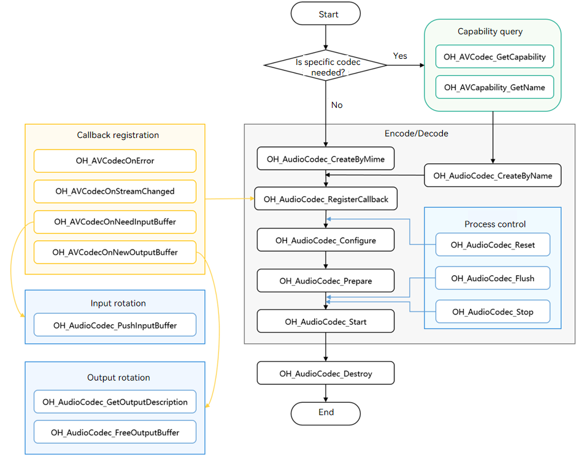

# Audio Decoding

<!--Kit: AVCodec Kit-->
<!--Subsystem: Multimedia-->
<!--Owner: @mr-chencxy-->
<!--Designer: @dpy2650--->
<!--Tester: @baotianhao-->
<!--Adviser: @w_Machine_cc-->
<!-- md-trans-meta sourceCommit=14d7d94ba4d5fb1bb765105b84453f4f7210b670 translatedAt=2026-08-06T13:42:40.831Z pushedAt=2026-08-07T10:50:31.851Z -->

You can call the Native APIs of this module to perform audio decoding, that is, to decode media data into a PCM stream.

For supported decoding capabilities, see [AVCodec Supported Formats](avcodec-support-formats.md#audio-decoding).

**When to Use**

- Audio playback

  Before playing audio, you need to decode the audio first and then send the data to the hardware speaker for playback.

- Audio rendering

Before applying audio effects to an audio file, you need to decode it first and then render it through the audio processing module.

- Audio editing

Audio editing (such as adjusting the playback speed of a single channel) must be performed based on PCM streams, so you need to decode the audio file first.
> **NOTE**
>
> A stream generated through the MP3 audio encoding process cannot be directly decoded through the MP3 audio decoding process. It is recommended to use the following process: PCM stream -> MP3 audio encoding -> muxing -> demuxing -> MP3 audio decoding.

## Development Guidelines

For detailed API descriptions, see [native_avcodec_audiocodec.h](../../reference/apis-avcodec-kit/capi-native-avcodec-audiocodec-h.md).

Refer to the following sample code to complete the full audio decoding process, including: creating a decoder, setting decoding parameters (sample rate/bitrate/number of channels, etc.), starting, flushing, resetting, and destroying resources.

During app development, you must call methods in a specific order to perform corresponding operations. Otherwise, the system may throw exceptions or produce other undefined behaviors. For the specific sequence, refer to the following development steps and their descriptions.

The following figure shows the audio decoding call relationship:

- Dashed lines indicate optional operations.

- Solid lines indicate mandatory operations.



### Linking the Dynamic Libraries in the CMake Script

```cmake
target_link_libraries(sample PUBLIC libnative_media_codecbase.so)
target_link_libraries(sample PUBLIC libnative_media_core.so)
target_link_libraries(sample PUBLIC libnative_media_acodec.so)
```

> **NOTE**
>
> The word **sample** above is only an example. Replace it with the actual project directory name as needed.

### How to Develop

1. Add the required header files.

   ```cpp
   #include <multimedia/player_framework/native_avcodec_audiocodec.h>
   #include <multimedia/native_audio_channel_layout.h>
   #include <multimedia/player_framework/native_avcapability.h>
   #include <multimedia/player_framework/native_avcodec_base.h>
   #include <multimedia/player_framework/native_avformat.h>
   #include <multimedia/player_framework/native_avbuffer.h>
   ```

2. Create a decoder instance object. `OH_AVCodec *` is the pointer to the decoder instance.

   An app can create a decoder by media type or codec name.

   Method 1: Create a decoder by MIME type.

   ```cpp
   // Set the encoding flag; false indicates decoding.
   bool isEncoder = false;
   // Create a decoder by MIME type.
   OH_AVCodec *audioDec_ = OH_AudioCodec_CreateByMime(OH_AVCODEC_MIMETYPE_AUDIO_AAC, isEncoder);
   ```

Method 2: Create a decoder by codec name.

   ```cpp
   // Create a decoder by codec name.
   OH_AVCapability *capability = OH_AVCodec_GetCapability(OH_AVCODEC_MIMETYPE_AUDIO_AAC, false);
   const char *name = OH_AVCapability_GetName(capability);
   OH_AVCodec *audioDec_ = OH_AudioCodec_CreateByName(name);
   ```

Add the header file and namespace:

   ```cpp
   #include <mutex>
   #include <queue>
   // C++ standard library namespace.
   using namespace std;
   ```

   Example:

   ```cpp
   // Initialize the queue.
   class ADecBufferSignal {
   public:
       std::mutex inMutex_;
       std::mutex outMutex_;
       std::mutex startMutex_;
       std::condition_variable inCond_;
       std::condition_variable outCond_;
       std::condition_variable startCond_;
       std::queue<uint32_t> inQueue_;
       std::queue<uint32_t> outQueue_;
       std::queue<OH_AVBuffer *> inBufferQueue_;
       std::queue<OH_AVBuffer *> outBufferQueue_;
   };
   ADecBufferSignal *signal_;
   ```

3. Call `OH_AudioCodec_RegisterCallback()` to register callback functions.

   Register the callback function pointer set `OH_AVCodecCallback`, including:

   - `OH_AVCodecOnError`: decoder error.

   - `OH_AVCodecOnStreamChanged`: callback for stream information changes, including sample rate change, channel count change, and audio sample format change. The decoding formats that support detecting these changes are: <!--RP5--><!--RP5End-->AAC, FLAC, MP3, VORBIS. (Supported since API version 15)

   - `OH_AVCodecOnNeedInputBuffer`: callback indicating that new input data is needed during operation, meaning the decoder is ready and can accept data input.

   - `OH_AVCodecOnNewOutputBuffer`: callback indicating that new output data has been generated during operation, meaning decoding is complete.

   You can handle the information reported by this callback to ensure the decoder operates properly.

   > **NOTE**
   >
   > Do not call decoder-related APIs or perform time-consuming operations in the callback.

   ```cpp
   // Implementation of the OH_AVCodecOnError callback function.
   static void OnError(OH_AVCodec *codec, int32_t errorCode, void *userData)
   {
       (void)codec;
       (void)errorCode;
       (void)userData;
   }
   // Implementation of the OH_AVCodecOnStreamChanged callback function.
   static void OnOutputFormatChanged(OH_AVCodec *codec, OH_AVFormat *format, void *userData)
   {
       (void)codec;
       (void)userData;
       // Callback handling after decoding output parameter changes. Process based on the actual situation.
       int32_t sampleRate;
       int32_t channelCount;
       int32_t sampleFormat;
       if (OH_AVFormat_GetIntValue(format, OH_MD_KEY_AUD_SAMPLE_RATE, &sampleRate)) {
           // Check whether the sample rate has changed and handle accordingly.
       }
       if (OH_AVFormat_GetIntValue(format, OH_MD_KEY_AUD_CHANNEL_COUNT, &channelCount)) {
           // Check whether the channel count has changed and handle accordingly.
       }
       if (OH_AVFormat_GetIntValue(format, OH_MD_KEY_AUDIO_SAMPLE_FORMAT, &sampleFormat)) {
           // Determine whether the audio sample format has changed and handle accordingly.
       }
   }
   // Implementation of the OH_AVCodecOnNeedInputBuffer callback function.
   static void OnInputBufferAvailable(OH_AVCodec *codec, uint32_t index, OH_AVBuffer *data, void *userData)
   {
       (void)codec;
       ADecBufferSignal *signal = static_cast<ADecBufferSignal *>(userData);
       unique_lock<mutex> lock(signal->inMutex_);
       signal->inQueue_.push(index);
       signal->inBufferQueue_.push(data);
       signal->inCond_.notify_all();
       // Send the decoded input stream to the inBufferQueue_ queue.
   }
   // Implementation of the OH_AVCodecOnNewOutputBuffer callback function.
   static void OnOutputBufferAvailable(OH_AVCodec *codec, uint32_t index, OH_AVBuffer *data, void *userData)
   {
       (void)codec;
       ADecBufferSignal *signal = static_cast<ADecBufferSignal *>(userData);
       unique_lock<mutex> lock(signal->outMutex_);
       signal->outQueue_.push(index);
       signal->outBufferQueue_.push(data);
       signal->outCond_.notify_all();
       // Send the index of the corresponding output buffer to the outQueue_ queue.
       // Send the decoded data to the outBufferQueue_ queue.
   }
   ```

   Configure the callbacks:

   ```cpp
   signal_ = new ADecBufferSignal();
   OH_AVCodecCallback cb_ = {&OnError, &OnOutputFormatChanged, &OnInputBufferAvailable, &OnOutputBufferAvailable};
   // Configure the asynchronous callback.
   int32_t ret = OH_AudioCodec_RegisterCallback(audioDec_, cb_, signal_);
   if (ret != AV_ERR_OK) {
       // Handle the exception.
   }
   ```

4. (Optional) Call `OH_AudioCodec_SetDecryptionConfig` to set the decryption configuration.

   After obtaining DRM information (see step 4 in [Media Data Demultiplexing](audio-video-demuxer.md)), configure decryption through this API.

   For details about DRM-related APIs, see [DRM API Reference](../../reference/apis-drm-kit/capi-drm.md).

   This API must be called before `Prepare`.

   Add the header files:

   ```c++
   #include <multimedia/drm_framework/native_mediakeysystem.h>
   #include <multimedia/drm_framework/native_mediakeysession.h>
   #include <multimedia/drm_framework/native_drm_err.h>
   #include <multimedia/drm_framework/native_drm_common.h>
   ```

   Link the dynamic library in the CMake script:

   ``` cmake
   target_link_libraries(sample PUBLIC libnative_drm.so)
   ```

   Usage example:

   ```c++
   // Create the specified DRM system based on DRM information. Here, "com.clearplay.drm" is used as an example.
   MediaKeySystem *system = nullptr;
   int32_t ret = OH_MediaKeySystem_Create("com.clearplay.drm", &system);
   if (system == nullptr) {
       printf("create media key system failed");
       return;
   }
   
   // Create a decryption session.
   MediaKeySession *session = nullptr;
   DRM_ContentProtectionLevel contentProtectionLevel = CONTENT_PROTECTION_LEVEL_SW_CRYPTO;
   ret = OH_MediaKeySystem_CreateMediaKeySession(system, &contentProtectionLevel, &session);
   if (ret != DRM_ERR_OK) {
       // If creation fails, check the DRM API documentation and log information.
       printf("create media key session failed.");
       return;
   }
   if (session == nullptr) {
       printf("media key session is nullptr.");
       return;
   }
   // Obtain the license request, set the license response, and so on.
   // Set the decryption configuration, that is, set the decryption session and the secure channel flag (currently audio decryption does not support secure channels, so set it to false) in the decoder.
   bool secureAudio = false;
   ret = OH_AudioCodec_SetDecryptionConfig(audioDec_, session, secureAudio);
   ```

5. Call `OH_AudioCodec_Configure()` to configure the decoder.

The following describes the configuration option keys:

   <!--RP6-->


   <!--RP6End-->

The following describes the parameter ranges for each audio decoding type:

   <!--RP7-->

   

   <!--RP7End-->

   Starting from API version 20, you can query the sample rate range capability through the [OH_AVCapability_GetAudioSupportedSampleRateRanges](../../reference/apis-avcodec-kit/capi-native-avcapability-h.md#oh_avcapability_getaudiosupportedsamplerateranges) API. The following audio decoding types support decoding at any sample rate within the range:

   | Audio Decoding Type | Sample Rate (Hz) |
   | ------------------- | ---------------- |
   | Flac                | 8000 ~ 384000    |
   | Vorbis              | 8000 ~ 192000    |
   | APE                 | 1 ~ 2147483647   |

   ```cpp
   // The following configuration values are examples only. Set them based on the actual decoding capabilities.
   // Configure the audio sample rate (mandatory).
   constexpr uint32_t DEFAULT_SAMPLERATE = 44100;
   // Configure the audio bitrate (optional).
   constexpr uint32_t DEFAULT_BITRATE = 32000;
   // Configure the number of audio channels (required).
   constexpr uint32_t DEFAULT_CHANNEL_COUNT = 2;
   // Configure the maximum input length (optional).
   constexpr uint32_t DEFAULT_MAX_INPUT_SIZE = 1152;
   // Configure whether it is ADTS decoding (optional for AAC decoding).
   constexpr uint32_t DEFAULT_AAC_TYPE = 1;
   // Configure the block alignment in bytes for audio data. Supported since API version 22. Required only for WMAV1, WMAV2, and WMA PRO decoding.
   constexpr int32_t DEFAULT_BLOCK_ALIGN = 1;
   OH_AVFormat *format = OH_AVFormat_Create();
   // Write the format.
   OH_AVFormat_SetIntValue(format, OH_MD_KEY_AUD_SAMPLE_RATE, DEFAULT_SAMPLERATE);
   OH_AVFormat_SetIntValue(format, OH_MD_KEY_BITRATE, DEFAULT_BITRATE);
   OH_AVFormat_SetIntValue(format, OH_MD_KEY_AUD_CHANNEL_COUNT, DEFAULT_CHANNEL_COUNT);
   OH_AVFormat_SetIntValue(format, OH_MD_KEY_MAX_INPUT_SIZE, DEFAULT_MAX_INPUT_SIZE);
   OH_AVFormat_SetIntValue(format, OH_MD_KEY_AAC_IS_ADTS, DEFAULT_AAC_TYPE);
   OH_AVFormat_SetIntValue(format, OH_MD_KEY_BLOCK_ALIGN, DEFAULT_BLOCK_ALIGN);
   // Configure the decoder.
   int32_t ret = OH_AudioCodec_Configure(audioDec_, format);
   if (ret != AV_ERR_OK) {
       // Handle the exception.
   }
   ```

6. Call `OH_AudioCodec_Prepare()` to prepare the decoder.

   ```cpp
   int32_t ret = OH_AudioCodec_Prepare(audioDec_);
   if (ret != AV_ERR_OK) {
       // Handle the exception.
   }
   ```

7. Call `OH_AudioCodec_Start()` to start the decoder and enter the running state.

   Add the header file:

   ```c++
   #include <fstream>
   ```

   Usage example:

   ```c++
   ifstream inputFile_;
   ofstream outFile_;
   
   // Enter the input file path based on actual usage.
   const char* inputFilePath = "/";
   // Enter the output file path based on actual usage.
   const char* outputFilePath = "/";
   // Open the binary file to be decoded.
   inputFile_.open(inputFilePath, ios::in | ios::binary); 
   // Configure the output path for the decoded file.
   outFile_.open(outputFilePath, ios::out | ios::binary);
   // Start decoding.
   int32_t ret = OH_AudioCodec_Start(audioDec_);
   if (ret != AV_ERR_OK) {
       // Handle the exception.
   }
   ```

8. (Optional) Call `OH_AVCencInfo_SetAVBuffer()` to set cencInfo.

   If the currently playing program is a DRM-encrypted program and the upper-layer app performs [media demuxing](audio-video-demuxer.md), you must call `OH_AVCencInfo_SetAVBuffer()` to set cencInfo to the AVBuffer for decrypting the media data in the AVBuffer.

   Add the header file:

   ```c++
   #include <multimedia/player_framework/native_cencinfo.h>
   ```

   Link the dynamic library in the CMake script:

   ``` cmake
   target_link_libraries(sample PUBLIC libnative_media_avcencinfo.so)
   ```

   Usage example:

   ```c++
   auto buffer = signal_->inBufferQueue_.front();
   uint32_t keyIdLen = DRM_KEY_ID_SIZE;
   uint8_t keyId[] = {
       0xd4, 0xb2, 0x01, 0xe4, 0x61, 0xc8, 0x98, 0x96,
       0xcf, 0x05, 0x22, 0x39, 0x8d, 0x09, 0xe6, 0x28};
   uint32_t ivLen = DRM_KEY_IV_SIZE;
   uint8_t iv[] = {
       0xbf, 0x77, 0xed, 0x51, 0x81, 0xde, 0x36, 0x3e,
       0x52, 0xf7, 0x20, 0x4f, 0x72, 0x14, 0xa3, 0x95};
   uint32_t encryptedBlockCount = 0;
   uint32_t skippedBlockCount = 0;
   uint32_t firstEncryptedOffset = 0;
   uint32_t subsampleCount = 1;
   DrmSubsample subsamples[1] = { {0x10, 0x16} };
   // Create a CencInfo instance.
   OH_AVCencInfo *cencInfo = OH_AVCencInfo_Create();
   if (cencInfo == nullptr) {
       // Handle the exception.
   }
   // Set the decryption algorithm.
   OH_AVErrCode errNo = OH_AVCencInfo_SetAlgorithm(cencInfo, DRM_ALG_CENC_AES_CTR);
   if (errNo != AV_ERR_OK) {
       // Handle the exception.
   }
   // Set the KeyId and Iv.
   errNo = OH_AVCencInfo_SetKeyIdAndIv(cencInfo, keyId, keyIdLen, iv, ivLen);
   if (errNo != AV_ERR_OK) {
       // Handle the exception.
   }
   // Set the sample information.
   errNo = OH_AVCencInfo_SetSubsampleInfo(cencInfo, encryptedBlockCount, skippedBlockCount, firstEncryptedOffset,
       subsampleCount, subsamples);
   if (errNo != AV_ERR_OK) {
       // Handle the exception.
   }
   // Set the mode: KeyId, Iv, and SubSamples have been set.
   errNo = OH_AVCencInfo_SetMode(cencInfo, DRM_CENC_INFO_KEY_IV_SUBSAMPLES_SET);
   if (errNo != AV_ERR_OK) {
       // Handle the exception.
   }
   // Set CencInfo to the AVBuffer.
   errNo = OH_AVCencInfo_SetAVBuffer(cencInfo, buffer);
   if (errNo != AV_ERR_OK) {
       // Handle the exception.
   }
   // Destroy the CencInfo instance.
   errNo = OH_AVCencInfo_Destroy(cencInfo);
   if (errNo != AV_ERR_OK) {
       // Handle the exception.
   }
   ```

9. Call `OH_AudioCodec_PushInputBuffer()` to write the data to be decoded.

   Call this API after filling in the complete input data.

At the end, set the flags to `AVCODEC_BUFFER_FLAGS_EOS`.

   ```c++
   uint32_t index = signal_->inQueue_.front();
   auto buffer = signal_->inBufferQueue_.front();
   int32_t size;
   int64_t pts;
   // size is the frame length of each frame of data to be decoded. pts is the timestamp of each frame, used to indicate when the audio should be played.
   // Sources for obtaining size and pts: audio/video resource files or the data stream to be decoded.
   // If decoding an audio/video resource file, obtain them from the buffer of OH_AVDemuxer_ReadSampleBuffer.
   // If decoding a data stream, obtain them from the data stream provider.
   // For demonstration purposes, the size and pts saved in the test file are used as an example.
   inputFile_.read(reinterpret_cast<char *>(&size), sizeof(size));
   inputFile_.read(reinterpret_cast<char *>(&pts), sizeof(pts));
   inputFile_.read((char *)OH_AVBuffer_GetAddr(buffer), size);
   OH_AVCodecBufferAttr attr = {0};
   if (inputFile_.eof()) {
       attr.size = 0;
       attr.flags = AVCODEC_BUFFER_FLAGS_EOS;
   } else {
       attr.size = size;
       attr.flags = AVCODEC_BUFFER_FLAGS_NONE;
   }
   attr.pts = pts;
   OH_AVBuffer_SetBufferAttr(buffer, &attr);
   int32_t ret = OH_AudioCodec_PushInputBuffer(audioDec_, index);
   if (ret != AV_ERR_OK) {
       // Exception handling.
   }
   ```

10. Call `OH_AudioCodec_FreeOutputBuffer()` to release the decoded data.

    After obtaining the decoded PCM stream, call `OH_AudioCodec_FreeOutputBuffer()` to release it in a timely manner.

    ```c++
    uint32_t index = signal_->outQueue_.front();
    OH_AVBuffer *data = signal_->outBufferQueue_.front();
    if (data == nullptr) {
        // Exception handling
    }
    // Obtain the buffer attributes.
    OH_AVCodecBufferAttr attr = {0};
    int32_t ret = OH_AVBuffer_GetBufferAttr(data, &attr);
    if (ret != AV_ERR_OK) {
        // Handle the exception.
    }
    // Write the decoded data to the corresponding output file.
    outFile_.write(reinterpret_cast<char *>(OH_AVBuffer_GetAddr(data)), attr.size);
    ret = OH_AudioCodec_FreeOutputBuffer(audioDec_, index);
    if (ret != AV_ERR_OK) {
        // Handle the exception.
    }
    if (attr.flags == AVCODEC_BUFFER_FLAGS_EOS) {
        // End.
    }
    ```

    <!--RP3-->
    <!--RP3End-->

11. (Optional) Call `OH_AudioCodec_Flush()` to flush the decoder.

    After calling `OH_AudioCodec_Flush()`, the decoder remains in the running state, but the current queue is cleared and decoded data is released.

    In this case, you need to call `OH_AudioCodec_Start()` to restart decoding.

    When to use:

    * After the decoding output buffer property is `AVCODEC_BUFFER_FLAGS_EOS`, if you want to resume decoding with the same configuration, you need to call flush.

    * If a recoverable error occurs during execution (that is, `OH_AudioCodec_IsValid()` returns `true`), you can call flush and then call `OH_AudioCodec_Start()` to restart decoding.

    ```c++
    // Flush the decoder audioDec_.
    int32_t ret = OH_AudioCodec_Flush(audioDec_);
    if (ret != AV_ERR_OK) {
        // Handle the exception.
    }
    // Restart decoding.
    ret = OH_AudioCodec_Start(audioDec_);
    if (ret != AV_ERR_OK) {
        // Handle the exception.
    }
    ```

12. (Optional) Call `OH_AudioCodec_Reset()` to reset the decoder.

    After calling `OH_AudioCodec_Reset()`, the decoder returns to the initialized state. All input/output buffers obtained before the reset become invalid. You must call `OH_AudioCodec_Configure()` to reconfigure the decoder, and then call `OH_AudioCodec_Start()` to restart decoding. After the decoder starts, obtain new input/output buffers.

    ```c++
    // Reset the decoder audioDec_.
    int32_t ret = OH_AudioCodec_Reset(audioDec_);
    if (ret != AV_ERR_OK) {
        // Handle the exception.
    }
    // Reconfigure the decoder parameters.
    ret = OH_AudioCodec_Configure(audioDec_, format);
    if (ret != AV_ERR_OK) {
        // Handle the exception.
    }
    ```

13. Call `OH_AudioCodec_Stop()` to stop the decoder.

After stopping, you can call `OH_AudioCodec_Start()` to re-enter the started state. The input/output buffers obtained before stopping can no longer be used. You must obtain new input/output buffers after restarting.

    ```c++
    // Stop the decoder audioDec_.
    int32_t ret = OH_AudioCodec_Stop(audioDec_);
    if (ret != AV_ERR_OK) {
        // Handle the exception.
    }
    ```

14. Call `OH_AudioCodec_Destroy()` to destroy the decoder instance and release resources.

> **NOTE**
>
> Do not destroy the decoder repeatedly.

    ```c++
    // Call OH_AudioCodec_Destroy to destroy the decoder.
    int32_t ret = OH_AudioCodec_Destroy(audioDec_);
    if (ret != AV_ERR_OK) {
        // Handle the exception.
    } else {
        audioDec_ = NULL; // Do not destroy repeatedly.
    }
    ```

## Samples

For audio decoding, the following sample is available for reference:

- [Audio Decoding](https://gitcode.com/openharmony/multimedia_av_codec/blob/master/test/nativedemo/audio_demo/avcodec_audio_avbuffer_decoder_demo.cpp)