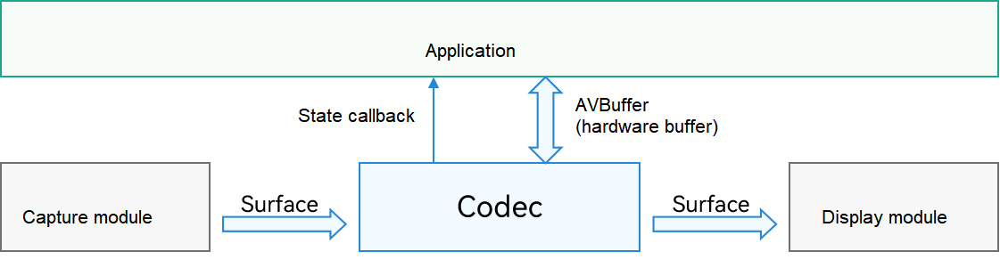
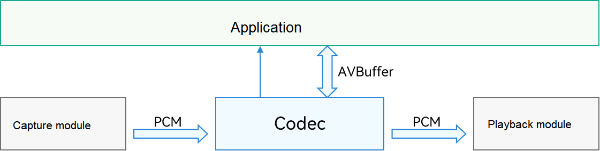
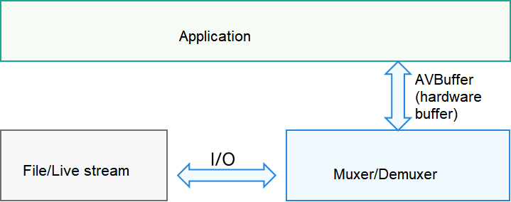

# About This Kit

<!--Kit: AVCodec Kit-->
<!--Subsystem: Multimedia-->
<!--Owner: @zhanghongran; @mr-chencxy-->
<!--Designer: @dpy2650--->
<!--Tester: @cyakee; @baotianhao-->
<!--Adviser: @w_Machine_cc-->
<!-- md-trans-meta sourceCommit=0b0b919feb897ec43ac7fdad1144cd1226ef164c translatedAt=2026-08-06T13:42:42.667Z pushedAt=2026-08-07T06:02:28.610Z -->

Audio and Video Codec (AVCodec) Kit provides atomic capabilities in the media system, including audio and video encoding/decoding, media file multiplexing and demultiplexing, and media data input.

For performance reasons, AVCodec Kit provides only C APIs.

## Capability Scope

- Media data input: Media applications can pass a file descriptor (fd) or a streaming media URL for subsequent processing such as media information demultiplexing.

- Media foundation: provides common basic types for media data processing, including [AVBuffer](../../reference/apis-avcodec-kit/capi-native-avbuffer-h.md) and [AVFormat](../../reference/apis-avcodec-kit/capi-native-avformat-h.md).

- Audio encoding: Audio applications (such as audio calling and audio recording applications) can send uncompressed audio data to the audio encoder for encoding. The applications can set parameters such as the encoding format, bit rate, and sample rate to obtain compressed audio files in desired formats.

- Video encoding: Video applications (such as video calling and video recording applications) can send uncompressed video data to the video encoder for encoding. The applications can set parameters such as the encoding format, bit rate, and frame rate to obtain compressed video files in desired formats.

- Audio decoding: Audio applications (such as audio calling application and audio player) can send audio streams to the audio decoder for decoding. The decoded data can be sent to audio devices for playback.

- Video decoding: Video applications (such as video calling application and video player) can send video streams to the video decoder for decoding. The decoded image data can be sent to display devices for display.

- Media file multiplexing: Media applications (such as audio and video recording application) can multiplex stream data encoded by the encoder into media files (in MP4 or M4A format), and write the audio and video streams, presentation time, encoding format, and basic file attributes into the specified file in a certain format.

- Media file demultiplexing: In media applications (such as audio and video players), locally stored or network-received media files can be demultiplexed to obtain audio and video streams, presentation timestamps, encoding formats, and basic file attribute information.

## Highlights

- Zero copy of internal data: During video decoding, the AVCodec provides an AVBuffer through a callback function. The application writes the sample data to be decoded to the AVBuffer. In this way, data in the AVCodec is directly sent to the decoder, rather than being copied from the memory.

- Hardware acceleration for video codecs: H.264, H.265, and H.265 10-bit hardware codecs are supported.

## Basic Concepts

- Media file: file that carries media data such as audio, video, and subtitles. Examples are .mp4 and .m4a files.

- Streaming media: media transmission mode that supports simultaneous download and playback. The supported download protocols include HTTP/HTTPS and HLS.

- Audio and video encoding: process of converting uncompressed audio and video data into another format, such as H.264 and AAC.

- Audio and video decoding: process of converting a data format into an uncompressed original sequence of audio or video data, such as YUV and PCM.

- Media file multiplexing: process of writing media data (such as audio, video, and subtitles) and description information to a file in a given format, for example, .mp4.

- Media file demultiplexing: process of reading media data (such as audio, video, and subtitles) from a file and parsing the description information.

- sample: a group of data with the same timing attributes.

  In the case of audio and video, a sample typically means compressed data that has the same decoding timestamp.

  In the case of subtitles, it generally includes the content that is meant to be displayed at certain time points.

  At the end of all tracks, the sample is considered to be empty.

## Usage

- Video codec

  The input of video encoding and the output of video decoding are in surface mode.

  During encoding and decoding, an application is notified of the data processing status through a callback function. For example, during encoding, the application is notified once a frame is encoded and an AVBuffer is output. During decoding, the application is notified once a frame of stream arrives at the decoder. When the decoding is complete, the application is also notified and can perform subsequent processing on the data.

  The following figure shows the video encoding and decoding logic.

  

  For details about the development guide, see [Video Decoding in Surface Mode](video-decoding.md#surface-mode) and [Video Encoding in Surface Mode](video-encoding.md#surface-mode).

- Audio codec

  The input of audio encoding and the output of audio decoding are in PCM format.

  During encoding and decoding, an application is notified of the data processing status through a callback function. For example, during encoding, the application is notified once a frame is encoded and an AVBuffer is output. During decoding, the application is notified once a frame of stream arrives at the decoder. When the decoding is complete, the application is also notified and can perform subsequent processing on the data.

  The following figure shows the audio encoding and decoding logic.

  

  For details about the development guide, see [Audio Decoding](audio-decoding.md) and [Audio Encoding](audio-encoding.md).

- File multiplexing and demultiplexing

  During file multiplexing, an application sends an AVBuffer to the corresponding codec interface for multiplexing. The AVBuffer can be that output in the preceding encoding process or an AVBuffer created by the application. The AVBuffer must carry valid stream data and related time description.

  During file demultiplexing, the application obtains the AVBuffer that carries stream data from the corresponding codec interface. The AVBuffer can then be sent to the video or audio codec interface mentioned above.

  The following figure shows the file multiplexing and demultiplexing logic.

  

  For details about the development guide, see [Media Data Multiplexing](audio-video-muxer.md) and [Media Data Demultiplexing](audio-video-demuxer.md).

<!--RP1--> <!--RP1End-->