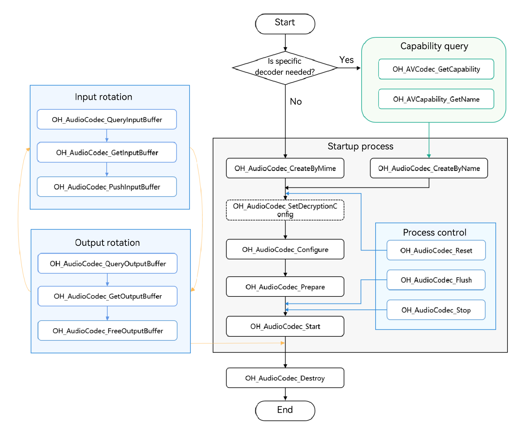

# Synchronous Audio Encoding

<!--Kit: AVCodec Kit-->
<!--Subsystem: Multimedia-->
<!--Owner: @mr-chencxy-->
<!--Designer: @dpy2650--->
<!--Tester: @baotianhao-->
<!--Adviser: @zengyawen-->

Starting from API version 20, audio encoding in synchronous mode is supported.

You can call native APIs to perform audio encoding, which compresses audio PCM data into a desired format.

PCM data can be from any source. For example, you can use a microphone to record audio data or import edited PCM data. After audio encoding, you can output streams in the desired format and encapsulate the streams into a target file.

For details about the supported encoding capabilities, see [AVCodec Supported Formats](avcodec-support-formats.md#audio-encoding).

**When to Use**

Asynchronous mode is generally recommended for most use cases. For details, see [Audio Encoding](audio-encoding.md). Synchronous mode can be used if you need to actively request buffers for PCM encoding.
- Audio recording

  Record PCM data, encode it into the desired format, and then multiplex it in the target file format. For details about multiplexing, see [Media Data Multiplexing](audio-video-muxer.md).
- Audio editing

  Export edited PCM data, encode it into the corresponding audio format, and then multiplex it into a file. For details about multiplexing, see [Media Data Multiplexing](audio-video-muxer.md).
> **NOTE**
>
> AAC encoders adopt the VBR mode by default. This may result in differences from the expected bit rate.

## Development Guidelines

Read [AudioCodec](../../reference/apis-avcodec-kit/capi-native-avcodec-audiocodec-h.md) for the API reference.

Refer to the code snippet below to complete the entire audio encoding process, including creating an encoder, setting encoding parameters (such as the sample rate, bit rate, and audio channel count), and starting, refreshing, resetting, and destroying the encoder.

During application development, you must call the APIs in the defined sequence. Otherwise, an exception or undefined behavior may occur.

The figure below shows the call relationship of audio encoding in synchronous mode.

- The dotted line indicates an optional operation. Audio encoding does not involve decryption. Therefore, you do not need to call **OH_AudioCodec_SetDecryptionConfig**.

- The solid line indicates a mandatory operation.



### Linking the Dynamic Libraries in the CMake Script

```cmake
target_link_libraries(sample PUBLIC libnative_media_codecbase.so)
target_link_libraries(sample PUBLIC libnative_media_core.so)
target_link_libraries(sample PUBLIC libnative_media_acodec.so)
```
> **NOTE**
>
> The word **sample** in the preceding code snippet is only an example. Use the actual project directory name.

### How to Develop

1. Add the header files and namespace.

    ```cpp
    #include <multimedia/player_framework/native_avcodec_audiocodec.h>
    #include <multimedia/native_audio_channel_layout.h>
    #include <multimedia/player_framework/native_avcapability.h>
    #include <multimedia/player_framework/native_avcodec_base.h>
    #include <multimedia/player_framework/native_avformat.h>
    #include <multimedia/player_framework/native_avbuffer.h>

    // Namespace of the C++ standard library.
    using namespace std;
    ```

2. Create an encoder instance. In the code snippet below, **OH_AVCodec *** is the pointer to the encoder instance created.

   You can create an encoder by MIME type or codec name.

   Method 1: Create an encoder by MIME type.
    ```cpp
    // Create an encoder by MIME type. The following example creates an AAC encoder. The second parameter is set to true to indicate encoding.
    OH_AVCodec *audioEnc_ = OH_AudioCodec_CreateByMime(OH_AVCODEC_MIMETYPE_AUDIO_AAC, true);
    ```
   Method 2: Create an encoder by codec name.
    ```cpp
    // Create an encoder by name.
    OH_AVCapability *capability = OH_AVCodec_GetCapability(OH_AVCODEC_MIMETYPE_AUDIO_AAC, true);
    const char *name = OH_AVCapability_GetName(capability);
    OH_AVCodec *audioEnc_ = OH_AudioCodec_CreateByName(name);
    ```

3. Call **OH_AudioCodec_Configure** to configure the encoder.

   Key values of configuration options are described as follows:

   <!--RP1-->
   |             Key              |       Description      |  AAC  |  FLAC| MPEG (MP3) | G711mu |
   | ----------------------------- | :--------------: | :---: | :---: | :------: | :---: |
   | OH_MD_KEY_AUD_SAMPLE_RATE     |      Sample rate.     |  Mandatory |  Mandatory|   Mandatory  |  Mandatory |
   | OH_MD_KEY_AUD_CHANNEL_COUNT   |      Audio channel count.     |  Mandatory |  Mandatory|   Mandatory  |  Mandatory |
   | OH_MD_KEY_AUDIO_SAMPLE_FORMAT |  Output audio stream format.  |  Mandatory |  Mandatory|   Mandatory  |  Mandatory |
   | OH_MD_KEY_BITRATE             |       Bit rate.      |  Optional |  Mandatory|   Mandatory  |   -   |
   | OH_MD_KEY_CHANNEL_LAYOUT      |     Audio channel layout.    |  Optional |  Mandatory|    -     |   -   |
   | OH_MD_KEY_MAX_INPUT_SIZE      |   Maximum input size.   |  Optional |  Optional|   Optional  |  Optional |
   | OH_MD_KEY_AAC_IS_ADTS         |     ADTS or not.    |  Optional |   -   |    -    |   -    |
   | OH_MD_KEY_COMPLIANCE_LEVEL    |    Compatibility level.    |  -    |  Optional|    -     |   -    |
   <!--RP1End-->

   The sample below lists the value range of each audio encoding type.
   | Audio Encoding Type| Sample Rate (Hz)                                                                      |       Audio Channel Count      |
   | ----------- | ------------------------------------------------------------------------------- | :----------------: |
   | <!--DelRow-->AAC         | 8000, 11025, 12000, 16000, 22050, 24000, 32000, 44100, 48000, 64000, 88200, 96000| 1, 2, 3, 4, 5, 6, and 8|
   | FLAC       | 8000, 11025, 12000, 16000, 22050, 24000, 32000, 44100, 48000, 64000, 88200, 96000|        1–8        |
   | MP3         | 8000, 11025, 12000, 16000, 22050, 24000, 32000, 44100, 48000                    |        1–2        |
   | G711mu      | 8000                                                                            |         1          |
   <!--RP2--><!--RP2End-->

   The code snippet below shows the API call process, where AAC encoding at the bit rate of 32000 bit/s is carried out on the PCM audio with the 44100 Hz sample rate, 2-channel stereo, and SAMPLE_S16LE sample format.
    <!--RP3-->
    ```cpp
    OH_AVErrCode ret;
    // (Mandatory) Configure the audio sample rate.
    constexpr uint32_t DEFAULT_SAMPLERATE = 44100;
    // (Mandatory) Configure the audio bit rate.
    constexpr uint64_t DEFAULT_BITRATE = 32000;
    // (Mandatory) Configure the audio channel count.
    constexpr uint32_t DEFAULT_CHANNEL_COUNT = 2;
    // (Mandatory) Configure the audio bit depth.
    constexpr OH_BitsPerSample SAMPLE_FORMAT = OH_BitsPerSample::SAMPLE_S16LE;
    // (Optional) Configure the layout of audio channels.
    constexpr OH_AudioChannelLayout CHANNEL_LAYOUT = OH_AudioChannelLayout::CH_LAYOUT_STEREO;

    OH_AVFormat *format = OH_AVFormat_Create();
    // Set the format.
    OH_AVFormat_SetIntValue(format, OH_MD_KEY_AUD_CHANNEL_COUNT, DEFAULT_CHANNEL_COUNT);
    OH_AVFormat_SetIntValue(format, OH_MD_KEY_AUD_SAMPLE_RATE, DEFAULT_SAMPLERATE);
    OH_AVFormat_SetLongValue(format, OH_MD_KEY_BITRATE, DEFAULT_BITRATE);
    OH_AVFormat_SetIntValue(format, OH_MD_KEY_AUDIO_SAMPLE_FORMAT, SAMPLE_FORMAT);
    OH_AVFormat_SetLongValue(format, OH_MD_KEY_CHANNEL_LAYOUT, CHANNEL_LAYOUT);
    OH_AVFormat_SetIntValue(format, OH_MD_KEY_ENABLE_SYNC_MODE, 1); // Set the synchronous mode.
    // Configure the encoder.
    ret = OH_AudioCodec_Configure(audioEnc_, format);
    if (ret != AV_ERR_OK) {
        // Handle exceptions.
    }
    ```
    <!--RP3End-->
    FLAC encoding example:

    ```cpp
    OH_AVErrCode ret;
    // (Mandatory) Configure the audio sample rate.
    constexpr uint32_t DEFAULT_SAMPLERATE = 44100;
    // (Mandatory) Configure the audio bit rate.
    constexpr uint64_t DEFAULT_BITRATE = 261000;
    // (Mandatory) Configure the audio channel count.
    constexpr uint32_t DEFAULT_CHANNEL_COUNT = 2;
    // (Mandatory) Configure the layout of audio channels.
    // The value can be CH_LAYOUT_MONO, CH_LAYOUT_STEREO, CH_LAYOUT_SURROUND, CH_LAYOUT_QUAD, CH_LAYOUT_5POINT0, CH_LAYOUT_5POINT1, CH_LAYOUT_6POINT1, or CH_LAYOUT_7POINT1.
    constexpr OH_AudioChannelLayout CHANNEL_LAYOUT = OH_AudioChannelLayout::CH_LAYOUT_STEREO;
    // (Mandatory) Configure the audio bit depth. Only SAMPLE_S16LE and SAMPLE_S32LE are available for FLAC encoding.
    constexpr OH_BitsPerSample SAMPLE_FORMAT = OH_BitsPerSample::SAMPLE_S32LE;
    // Configure the audio compliance level. The default value is 0, and the value range is [-2,2].
    constexpr int32_t COMPLIANCE_LEVEL = 0;

    OH_AVFormat *format = OH_AVFormat_Create();
    // Set the format.
    OH_AVFormat_SetIntValue(format, OH_MD_KEY_AUD_CHANNEL_COUNT, DEFAULT_CHANNEL_COUNT);
    OH_AVFormat_SetIntValue(format, OH_MD_KEY_AUD_SAMPLE_RATE, DEFAULT_SAMPLERATE);
    OH_AVFormat_SetLongValue(format, OH_MD_KEY_BITRATE, DEFAULT_BITRATE);
    OH_AVFormat_SetIntValue(format, OH_MD_KEY_AUDIO_SAMPLE_FORMAT, SAMPLE_FORMAT); 
    OH_AVFormat_SetLongValue(format, OH_MD_KEY_CHANNEL_LAYOUT, CHANNEL_LAYOUT);
    OH_AVFormat_SetLongValue(format, OH_MD_KEY_COMPLIANCE_LEVEL, COMPLIANCE_LEVEL); 
    OH_AVFormat_SetIntValue(format, OH_MD_KEY_ENABLE_SYNC_MODE, 1); // Set the synchronous mode.
    // Configure the encoder.
    ret = OH_AudioCodec_Configure(audioEnc_, format);
    if (ret != AV_ERR_OK) {
        // Handle exceptions.
    }
    ```

4. Call **OH_AudioCodec_Prepare()** to prepare internal resources for the encoder.

    ```cpp
    OH_AVErrCode ret = OH_AudioCodec_Prepare(audioEnc_);
    if (ret != AV_ERR_OK) {
        // Handle exceptions.
    }
    ```

5. Call **OH_AudioCodec_Start()** to start the encoder.

   Add the header file.
    ```c++
    #include <fstream>
    ```
   The sample code is as follows:
    ```c++
    ifstream inputFile_;
    ofstream outFile_;

    // Set the input file path based on the actual situation.
    const char* inputFilePath = "/";
    // Set the output file path based on the actual situation.
    const char* outputFilePath = "/";
    // Open the path of the binary file to be encoded. (A PCM file is used as an example.)
    inputFile_.open(inputFilePath, ios::in | ios::binary); 
    // Set the path of the output file. (In this example, the output file is an encoded stream file, instead of a playable audio file. To create a playable audio file, you must encapsulate the audio bit stream into a container).
    outFile_.open(outputFilePath, ios::out | ios::binary);
    // Start encoding.
    OH_AVErrCode ret = OH_AudioCodec_Start(audioEnc_);
    if (ret != AV_ERR_OK) {
        // Handle exceptions.
    }
    ```

6. Invoke synchronous mode to write PCM samples to encode and obtain the encoded audio frames.

   The method for determining the number of samples per frame (**SAMPLES_PER_FRAME**) is as follows:

   AAC-LC encodes 1024 PCM samples per frame. Therefore, you are advised to input exactly 1024 samples at a time.

   <!--RP4--><!--RP4End-->

   For FLAC encoding, set **SAMPLES_PER_FRAME** based on the table below.

   | Sample Rate| Sample Count|
   | :----: | :----: |
   |  8000  |  576  |
   | 16000 |  1152  |
   | 22050 |  2304  |
   | 24000 |  2304  |
   | 32000 |  2304  |
   | 44100 |  4608  |
   | 48000 |  4608  |
   | 88200 |  8192  |
   | 96000 |  8192  |

   Data volume (in bytes) of a single encoding input: Number of samples (**SAMPLES_PER_FRAME**) * Number of channels * Number of bytes per sample.

   The sample code is as follows:
   ```c++
   int32_t SAMPLES_PER_FRAME = 1024;
   // AAC LC encoding involves 1024 samples per frame, 2 channels, and uses S16LE format for the input data. Each 16-bit sample occupies 2 bytes.
   int32_t inputFrameBytes = SAMPLES_PER_FRAME * 2 * 2;
   bool inputFinished = false;
   OH_AVErrCode ret;
   OH_AVCodecBufferAttr attr;

   for (;;) {
       uint32_t index = 0;
       if (!inputFinished) {
           ret = OH_AudioCodec_QueryInputBuffer(audioEnc_, &index, 20000); // 20000us
           if (ret == AV_ERR_TRY_AGAIN_LATER) {
               continue;
           }
           if (ret != AV_ERR_OK) {
               // Handle exceptions.
               break;
           }
           OH_AVBuffer *inputBuf = OH_AudioCodec_GetInputBuffer(audioEnc_, index);
           if (inputBuf == nullptr) {
               // Handle exceptions.
               break;
           }
           memset(&attr, 0, sizeof(attr));
           if (!inputFile_.eof()) {
               inputFile_.read((char *)OH_AVBuffer_GetAddr(inputBuf), inputFrameBytes);
               int32_t readSize = inputFile_.gcount();
               attr.size = readSize;
               attr.flags = readSize != 0 ? AVCODEC_BUFFER_FLAGS_NONE : AVCODEC_BUFFER_FLAGS_EOS;
           } else {
               inputFinished = true;
               attr.size = 0;
               attr.flags = AVCODEC_BUFFER_FLAGS_EOS;
           }
           if (OH_AVBuffer_SetBufferAttr(inputBuf, &attr) != AV_ERR_OK) {
               // Handle exceptions.
           }
           if (OH_AudioCodec_PushInputBuffer(audioEnc_, index) != AV_ERR_OK) {
               // Handle exceptions.
           }
       }
       // If the input data can generate multiple encoded frames, you need to call the output buffer several times to obtain all the encoded data.
       ret = OH_AudioCodec_QueryOutputBuffer(audioEnc_, &index, 20000); // 20000us
       if (ret == AV_ERR_TRY_AGAIN_LATER) {
           // Timeout: There is not enough input data to encode a frame, or the timeout period is too short.
           continue;
       }
       if (ret != AV_ERR_OK) {
           // Handle exceptions.
           break;
       }
       OH_AVBuffer *outputBuf = OH_AudioCodec_GetOutputBuffer(audioEnc_, index);
       if (outputBuf == nullptr) {
           // Handle exceptions.
           break;
       }
       if (OH_AVBuffer_GetBufferAttr(outputBuf, &attr) != AV_ERR_OK) {
           // Handle exceptions.
           break;
       }
       if (attr.flags & AVCODEC_BUFFER_FLAGS_EOS) {
           // The output ends.
           break;
       }
       // In this example, the data is written to a file for logging purposes. To encapsulate the data into an audio file, call OH_AVMuxer_WriteSampleBuffer.
       outFile_.write(reinterpret_cast<char *>(OH_AVBuffer_GetAddr(outputBuf)), attr.size);
       OH_AudioCodec_FreeOutputBuffer(audioEnc_, index);
   }
   ```

   In the preceding example, **attr.flags** indicates the type of the buffer flag.

   To indicate the End of Stream (EOS), pass in the **AVCODEC_BUFFER_FLAGS_EOS** flag.

   | Value| Description|
   | -------- | -------- |
   | AVCODEC_BUFFER_FLAGS_NONE | Common frame.|
   | AVCODEC_BUFFER_FLAGS_EOS | The buffer is an end-of-stream frame.|
   | AVCODEC_BUFFER_FLAGS_CODEC_DATA | The buffer contains codec-specific data.|

7. (Optional) Call **OH_AudioCodec_Reset()** to reset the encoder.

    After **OH_AudioCodec_Reset()** is called, the encoder returns to the initialized state. To continue encoding, you must call **OH_AudioCodec_Configure()** and then **OH_AudioCodec_Start()**.

    ```c++
    // Reset the encoder.
    OH_AVErrCode ret = OH_AudioCodec_Reset(audioEnc_);
    if (ret != AV_ERR_OK) {
        // Handle exceptions.
    }
    // Reconfigure the encoder.
    ret = OH_AudioCodec_Configure(audioEnc_, format);
    if (ret != AV_ERR_OK) {
        // Handle exceptions.
    }
    ```

8. (Optional) Call **OH_AudioCodec_Stop()** to stop the encoder.

    After the encoder is stopped, you can call **Start** to start it again. If you have passed specific data in the previous **Start** for the encoder, you must pass it again.

    ```c++
    // Stop the encoder.
    OH_AVErrCode ret = OH_AudioCodec_Stop(audioEnc_);
    if (ret != AV_ERR_OK) {
        // Handle exceptions.
    }
    ```

9. Call **OH_AudioCodec_Destroy()** to destroy the encoder instance and release resources.

    > **NOTE**
    >
    > You only need to call this API once.

    ```c++
    // Call OH_AudioCodec_Destroy to destroy the encoder.
    OH_AVErrCode ret = OH_AudioCodec_Destroy(audioEnc_);
    if (ret != AV_ERR_OK) {
        // Handle exceptions.
    } else {
        audioEnc_ = NULL; // The encoder cannot be destroyed repeatedly.
    }
    ```
