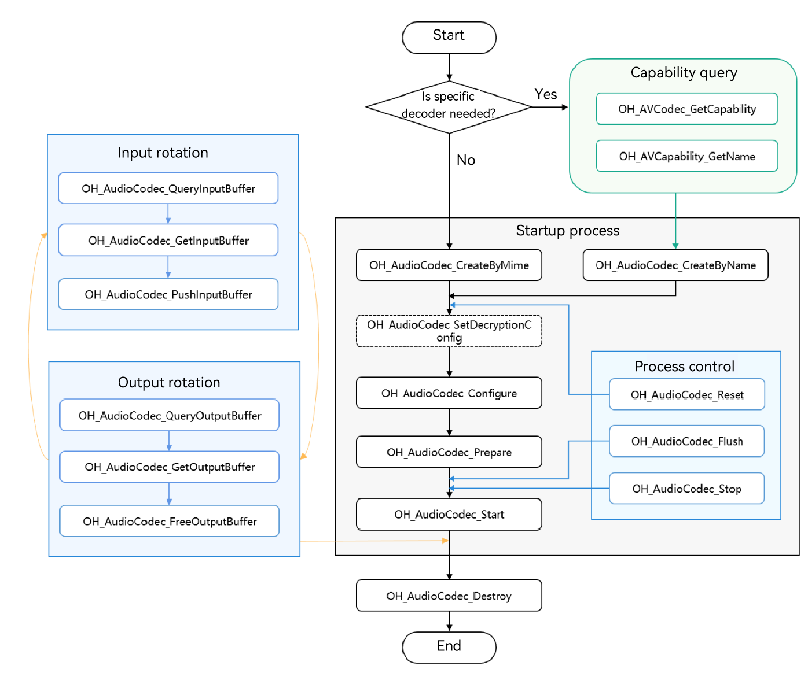

# Synchronous Audio Encoding

<!--Kit: AVCodec Kit-->
<!--Subsystem: Multimedia-->
<!--Owner: @mr-chencxy-->
<!--Designer: @dpy2650--->
<!--Tester: @baotianhao-->
<!--Adviser: @w_Machine_cc-->
<!-- md-trans-meta sourceCommit=1a0a8839cc296b62401e7fa32035cb66940b184d translatedAt=2026-08-06T13:47:04.324Z pushedAt=2026-08-07T07:31:07.593Z -->

Starting from API version 20, audio encoding in synchronous mode is supported.

You can call native APIs to perform audio encoding, which compresses audio PCM data into a desired format.

PCM data can be from any source. For example, you can use a microphone to record audio data or import edited PCM data. After audio encoding, you can output streams in the desired format and encapsulate the streams into a target file.

For details about the supported encoding capabilities, see [AVCodec Supported Formats](avcodec-support-formats.md#audio-encoding).

**When to Use**

Asynchronous mode is generally recommended for most use cases. For details, see [Audio Encoding](audio-encoding.md). Synchronous mode can be used if you need to actively request buffers for PCM encoding.

- Audio recording

  Record PCM data, encode it into the desired format, and then multiplex it in the target file format. For details about multiplexing, see [Media Data Multiplexing](audio-video-muxer.md).

- Audio editing

  Export edited PCM data, encode it into the corresponding audio format, and then multiplex it into a file. For details about multiplexing, see [Media Data Multiplexing](audio-video-muxer.md).
> **NOTE**
> - AAC encoders adopt the VBR mode by default. This may result in differences from the expected bit rate.
> - By default, AAC encoders include an ADTS header in its output, which occupies the first 7 bytes of each frame.

## Development Guidelines

Read [AudioCodec](../../reference/apis-avcodec-kit/capi-native-avcodec-audiocodec-h.md) for the API reference.

Refer to the code snippet below to complete the entire audio encoding process, including creating an encoder, setting encoding parameters (such as the sample rate, bit rate, and audio channel count), and starting, refreshing, resetting, and destroying the encoder.

During application development, you must call the APIs in the defined sequence. Otherwise, an exception or undefined behavior may occur.  

The figure below shows the call relationship of audio codec in synchronous mode.

- The dotted line indicates an optional operation. Audio encoding does not involve decryption. Therefore, you do not need to call **OH_AudioCodec_SetDecryptionConfig**.

- The solid line indicates a mandatory operation.



### Linking the Dynamic Libraries in the CMake Script

```cmake
target_link_libraries(sample PUBLIC libnative_media_codecbase.so)
target_link_libraries(sample PUBLIC libnative_media_core.so)
target_link_libraries(sample PUBLIC libnative_media_acodec.so)
```

> **NOTE**
>
> The word **sample** in the preceding code snippet is only an example. Use the actual project directory name.

### How to Develop

1. Add the header files and namespace.

   ```cpp
   #include <multimedia/player_framework/native_avcodec_audiocodec.h>
   #include <multimedia/native_audio_channel_layout.h>
   #include <multimedia/player_framework/native_avcapability.h>
   #include <multimedia/player_framework/native_avcodec_base.h>
   #include <multimedia/player_framework/native_avformat.h>
   #include <multimedia/player_framework/native_avbuffer.h>

   // C++ standard library namespace.
   using namespace std;
   ```

2. Create an encoder instance. In the code snippet below, **OH_AVCodec *** is the pointer to the encoder instance created.

   You can create an encoder by MIME type or codec name.

   Method 1: Create an encoder by MIME type.

   ```cpp
   // Create an encoder by MIME type. This example creates an AAC encoder. The second parameter set to true indicates encoding.
   OH_AVCodec *audioEnc_ = OH_AudioCodec_CreateByMime(OH_AVCODEC_MIMETYPE_AUDIO_AAC, true);
   ```

   Method 2: Create an encoder by codec name.

   ```cpp
   // Create an encoder by codec name.
   OH_AVCapability *capability = OH_AVCodec_GetCapability(OH_AVCODEC_MIMETYPE_AUDIO_AAC, true);
   const char *name = OH_AVCapability_GetName(capability);
   OH_AVCodec *audioEnc_ = OH_AudioCodec_CreateByName(name);
   ```

3. Call **OH_AudioCodec_Configure** to configure the encoder.

   Key values of configuration options are described as follows:

   <!--RP1-->

   

   <!--RP1End-->

   The sample below lists the value range of each audio encoding type.

   <!--RP2-->

   

   <!--RP2End-->

   The code snippet below shows the API call process, where AAC encoding at the bit rate of 32000 bit/s is carried out on the PCM audio with the 44100 Hz sample rate, 2-channel stereo, and SAMPLE_S16LE sample format.

   <!--RP3-->

   ```cpp
   OH_AVErrCode ret;
   // Configure the audio sample rate (mandatory).
   constexpr uint32_t DEFAULT_SAMPLERATE = 44100;
   // Configure the audio bitrate (mandatory).
   constexpr uint64_t DEFAULT_BITRATE = 32000;
   // Configure the number of audio channels (mandatory).
   constexpr uint32_t DEFAULT_CHANNEL_COUNT = 2;
   // Configure the audio bit depth (mandatory).
   constexpr OH_BitsPerSample SAMPLE_FORMAT = OH_BitsPerSample::SAMPLE_S16LE;
   // Configure the audio channel layout (optional).
   constexpr OH_AudioChannelLayout CHANNEL_LAYOUT = OH_AudioChannelLayout::CH_LAYOUT_STEREO;

   OH_AVFormat *format = OH_AVFormat_Create();
   // Write format.
   OH_AVFormat_SetIntValue(format, OH_MD_KEY_AUD_CHANNEL_COUNT, DEFAULT_CHANNEL_COUNT);
   OH_AVFormat_SetIntValue(format, OH_MD_KEY_AUD_SAMPLE_RATE, DEFAULT_SAMPLERATE);
   OH_AVFormat_SetLongValue(format, OH_MD_KEY_BITRATE, DEFAULT_BITRATE);
   OH_AVFormat_SetIntValue(format, OH_MD_KEY_AUDIO_SAMPLE_FORMAT, SAMPLE_FORMAT);
   OH_AVFormat_SetLongValue(format, OH_MD_KEY_CHANNEL_LAYOUT, CHANNEL_LAYOUT);
   OH_AVFormat_SetIntValue(format, OH_MD_KEY_ENABLE_SYNC_MODE, 1); // Synchronous mode configuration.
   // Configure the encoder.
   ret = OH_AudioCodec_Configure(audioEnc_, format);
   if (ret != AV_ERR_OK) {
       // Exception handling.
   }
   ```

   <!--RP3End-->

   Example of calling FLAC encoding:

   ```cpp
   OH_AVErrCode ret;
   // Configure the audio sample rate (required).
   constexpr uint32_t DEFAULT_SAMPLERATE = 44100;
   // Configure the audio bitrate (required).
   constexpr uint64_t DEFAULT_BITRATE = 261000;
   // Configure the number of audio channels (required).
   constexpr uint32_t DEFAULT_CHANNEL_COUNT = 2;
   // Configure the audio channel layout (required).
   // The value is one of CH_LAYOUT_MONO, CH_LAYOUT_STEREO, CH_LAYOUT_SURROUND, CH_LAYOUT_QUAD, CH_LAYOUT_5POINT0, CH_LAYOUT_5POINT1, CH_LAYOUT_6POINT1, or CH_LAYOUT_7POINT1.
   constexpr OH_AudioChannelLayout CHANNEL_LAYOUT = OH_AudioChannelLayout::CH_LAYOUT_STEREO;
   // Configure the audio bit depth (required). For FLAC, only SAMPLE_S16LE and SAMPLE_S32LE are supported.
   constexpr OH_BitsPerSample SAMPLE_FORMAT = OH_BitsPerSample::SAMPLE_S32LE;
   // Configure the audio compliance level (default value: 0, value range: [-2, 2]).
   constexpr int32_t COMPLIANCE_LEVEL = 0;

   OH_AVFormat *format = OH_AVFormat_Create();
   // Write the format.
   OH_AVFormat_SetIntValue(format, OH_MD_KEY_AUD_CHANNEL_COUNT, DEFAULT_CHANNEL_COUNT);
   OH_AVFormat_SetIntValue(format, OH_MD_KEY_AUD_SAMPLE_RATE, DEFAULT_SAMPLERATE);
   OH_AVFormat_SetLongValue(format, OH_MD_KEY_BITRATE, DEFAULT_BITRATE);
   OH_AVFormat_SetIntValue(format, OH_MD_KEY_AUDIO_SAMPLE_FORMAT, SAMPLE_FORMAT); 
   OH_AVFormat_SetLongValue(format, OH_MD_KEY_CHANNEL_LAYOUT, CHANNEL_LAYOUT);
   OH_AVFormat_SetLongValue(format, OH_MD_KEY_COMPLIANCE_LEVEL, COMPLIANCE_LEVEL); 
   OH_AVFormat_SetIntValue(format, OH_MD_KEY_ENABLE_SYNC_MODE, 1); // Configure the sync mode.
   // Configure the encoder.
   ret = OH_AudioCodec_Configure(audioEnc_, format);
   if (ret != AV_ERR_OK) {
       // Handle exceptions.
   }
   ```

   In addition to the parameters configured above, you can also configure the following optional parameters during the Configure phase:

   - `OH_MD_KEY_AUDIO_MAX_INPUT_BUFFER_SIZE`: Configures the maximum input buffer size (in bytes) for the audio encoder. For frame-aligned encoders such as FLAC and MP3, setting this parameter enables the internal PCM caching mechanism, allowing input data to be accepted without frame-size alignment. The encoder automatically caches and splits frames. The actual buffer size is subject to encoder implementation limits. If the configured value exceeds the upper limit, it is set to the upper limit (10 MB).

   - `OH_MD_KEY_AUDIO_ENCODER_PTS_MODE`: Configures the output PTS mode of the audio encoder. The value type is [OH_AudioEncoderPTSMode](../../reference/apis-avcodec-kit/capi-native-avcodec-base-h.md#oh_audioencoderptsmode). The PTS calculation method for output frames varies by mode:

     - `OH_AUDIO_ENCODER_PTS_MODE_DEFAULT`: Default behavior. The PTS output method may vary across different encoders.

     - `OH_AUDIO_ENCODER_PTS_MODE_ZERO_START`: PTS starts from 0 and increments by frame duration. This mode is suitable for scenarios where input PTS is not relied upon and timing needs to start from 0.

     - `OH_AUDIO_ENCODER_PTS_MODE_FIRST_INPUT_START`: PTS starts from the PTS of the first input frame and increments by frame duration. This mode is suitable for scenarios where PTS continuity with the input stream must be maintained.

   - `OH_MD_KEY_AUDIO_ENCODER_ENABLE_SAMPLE_FORMAT_CONVERT`: Configures the sample format conversion switch for the audio encoder. 1 indicates enabled, and 0 indicates disabled (default). Audio encoders natively support a limited set of sample formats (for example, G711mu supports only SAMPLE_S16LE). When enabled, the encoder automatically converts the input PCM data to a format supported by the encoder for encoding. The supported input sample formats are extended to: SAMPLE_U8, SAMPLE_S16LE, SAMPLE_S24LE, SAMPLE_S32LE, and SAMPLE_F32LE. This is suitable for scenarios where the input PCM format differs from the encoder's native format.

   ```cpp
   // Configure the maximum input buffer size of the encoder (optional). After this is set for FLAC/MP3, non-frame-aligned input data can be accepted. The value 4096 here is only a reference, and you can set it dynamically based on actual needs.
   OH_AVFormat_SetIntValue(format, OH_MD_KEY_AUDIO_MAX_INPUT_BUFFER_SIZE, 4096);
   // Configure the encoder PTS output mode (optional).
   OH_AVFormat_SetIntValue(format, OH_MD_KEY_AUDIO_ENCODER_PTS_MODE,
       OH_AUDIO_ENCODER_PTS_MODE_FIRST_INPUT_START);
   // Configure the encoder sample format conversion switch (optional). When enabled, more sample formats are supported for input.
   OH_AVFormat_SetIntValue(format, OH_MD_KEY_AUDIO_ENCODER_ENABLE_SAMPLE_FORMAT_CONVERT, 1);
   ```

4. Call **OH_AudioCodec_Prepare()** to prepare internal resources for the encoder.

   ```cpp
   OH_AVErrCode ret = OH_AudioCodec_Prepare(audioEnc_);
   if (ret != AV_ERR_OK) {
       // Handle exceptions.
   }
   ```

5. Call **OH_AudioCodec_Start()** to start the encoder.

   Add the header file.

   ```c++
   #include <fstream>
   ```

   The sample code is as follows:

   ```c++
   ifstream inputFile_;
   ofstream outFile_;

   // Fill in the input file path based on actual usage.
   const char* inputFilePath = "/";
   // Fill in the output file path based on actual usage.
   const char* outputFilePath = "/";
   // Open the binary file path to be encoded (using a PCM file as the input example).
   inputFile_.open(inputFilePath, ios::in | ios::binary); 
   // Configure the encoding file output path (using the encoded stream file as the output example; this is not a playable audio file — a playable audio file requires the audio stream to be muxed into a container).
   outFile_.open(outputFilePath, ios::out | ios::binary);
   // Start encoding.
   OH_AVErrCode ret = OH_AudioCodec_Start(audioEnc_);
   if (ret != AV_ERR_OK) {
       // Handle exceptions.
   }
   ```

6. Invoke synchronous mode to write PCM samples to encode and obtain the encoded audio frames.

   The method for determining the number of samples per frame (**SAMPLES_PER_FRAME**) is as follows:

   AAC-LC encodes 1024 PCM samples per frame. Therefore, you are advised to input exactly 1024 samples at a time.

   <!--RP4--><!--RP4End-->

   For FLAC encoding, set **SAMPLES_PER_FRAME** based on the table below.

   | Sample Rate| Sample Count|
   | :----: | :----: |
   |  8000  |  576  |
   | 16000 |  1152  |
   | 22050 |  2304  |
   | 24000 |  2304  |
   | 32000 |  2304  |
   | 44100 |  4608  |
   | 48000 |  4608  |
   | 88200 |  8192  |
   | 96000 |  8192  |

   Data volume (in bytes) of a single encoding input: Number of samples (**SAMPLES_PER_FRAME**) * Number of channels * Number of bytes per sample.

   The sample code is as follows:

   ```c++
   int32_t SAMPLES_PER_FRAME = 1024;
   // AAC LC encoding involves 1024 samples per frame, 2 channels, and uses S16LE format for the input data. Each 16-bit sample occupies 2 bytes.
   int32_t inputFrameBytes = SAMPLES_PER_FRAME * 2 * 2;
   bool inputFinished = false;
   OH_AVErrCode ret;
   OH_AVCodecBufferAttr attr;

   for (;;) {
       uint32_t index = 0;
       if (!inputFinished) {
           ret = OH_AudioCodec_QueryInputBuffer(audioEnc_, &index, 20000); // 20000us
           if (ret == AV_ERR_TRY_AGAIN_LATER) {
               continue;
           }
           if (ret != AV_ERR_OK) {
               // Handle exceptions.
               break;
           }
           OH_AVBuffer *inputBuf = OH_AudioCodec_GetInputBuffer(audioEnc_, index);
           if (inputBuf == nullptr) {
               // Handle exceptions.
               break;
           }
           memset(&attr, 0, sizeof(attr));
           if (!inputFile_.eof()) {
               inputFile_.read((char *)OH_AVBuffer_GetAddr(inputBuf), inputFrameBytes);
               int32_t readSize = inputFile_.gcount();
               attr.size = readSize;
               attr.flags = readSize != 0 ? AVCODEC_BUFFER_FLAGS_NONE : AVCODEC_BUFFER_FLAGS_EOS;
           } else {
               inputFinished = true;
               attr.size = 0;
               attr.flags = AVCODEC_BUFFER_FLAGS_EOS;
           }
           if (OH_AVBuffer_SetBufferAttr(inputBuf, &attr) != AV_ERR_OK) {
               // Handle exceptions.
           }
           if (OH_AudioCodec_PushInputBuffer(audioEnc_, index) != AV_ERR_OK) {
               // Handle exceptions.
           }
       }
       // If the input data can generate multiple encoded frames, you need to call the output buffer several times to obtain all the encoded data.
       ret = OH_AudioCodec_QueryOutputBuffer(audioEnc_, &index, 20000); // 20000us
       if (ret == AV_ERR_TRY_AGAIN_LATER) {
           // Timeout: There is not enough input data to encode a frame, or the timeout period is too short.
           continue;
       }
       if (ret != AV_ERR_OK) {
           // Handle exceptions.
           break;
       }
       OH_AVBuffer *outputBuf = OH_AudioCodec_GetOutputBuffer(audioEnc_, index);
       if (outputBuf == nullptr) {
           // Handle exceptions.
           break;
       }
       if (OH_AVBuffer_GetBufferAttr(outputBuf, &attr) != AV_ERR_OK) {
           // Handle exceptions.
           break;
       }
       if (attr.flags & AVCODEC_BUFFER_FLAGS_EOS) {
           // The output ends.
           break;
       }
       // In this example, the data is written to a file for logging purposes. To encapsulate the data into an audio file, call OH_AVMuxer_WriteSampleBuffer.
       outFile_.write(reinterpret_cast<char *>(OH_AVBuffer_GetAddr(outputBuf)), attr.size);
       OH_AudioCodec_FreeOutputBuffer(audioEnc_, index);
   }
   ```

   In the preceding example, **attr.flags** indicates the type of the buffer flag.

   When finished, set the flags to **AVCODEC_BUFFER_FLAGS_EOS**.

   | Value| Description| 
   | -------- | -------- |
   | AVCODEC_BUFFER_FLAGS_NONE | Common frame.| 
   | AVCODEC_BUFFER_FLAGS_EOS | The buffer is an end-of-stream frame.| 
   | AVCODEC_BUFFER_FLAGS_CODEC_DATA | The buffer contains codec-specific data.| 

7. (Optional) Call **OH_AudioCodec_Reset()** to reset the encoder.

   After **OH_AudioCodec_Reset()** is called, the encoder returns to the initialized state. The input and output buffers obtained before the reset cannot be used. You must call **OH_AudioCodec_Configure()** to reconfigure the encoder and then call **OH_AudioCodec_Start()** to start encoding again. Obtain the input and output buffers again after the encoder is started.

   ```c++
   // Reset the encoder.
   OH_AVErrCode ret = OH_AudioCodec_Reset(audioEnc_);
   if (ret != AV_ERR_OK) {
       // Exception handling.
   }
   // Reconfigure encoder parameters.
   ret = OH_AudioCodec_Configure(audioEnc_, format);
   if (ret != AV_ERR_OK) {
       // Exception handling.
   }
   ```

8. (Optional) Call **OH_AudioCodec_Stop()** to stop the encoder.

   After the encoder is stopped, you can call **OH_AudioCodec_Start()** to start it again. The input and output buffers obtained before the decoder is stopped cannot be reused. You must obtain them again after the decoder is started.

   ```c++
   // Stop the encoder.
   OH_AVErrCode ret = OH_AudioCodec_Stop(audioEnc_);
   if (ret != AV_ERR_OK) {
       // Exception handling.
   }
   ```

9. Call **OH_AudioCodec_Destroy()** to destroy the encoder instance and release resources.

   > **NOTE**
   >
   > Do not destroy the encoder repeatedly.

   ```c++
   // Call OH_AudioCodec_Destroy to destroy the encoder.
   OH_AVErrCode ret = OH_AudioCodec_Destroy(audioEnc_);
   if (ret != AV_ERR_OK) {
       // Handle exceptions.
   } else {
       audioEnc_ = NULL; // Do not destroy repeatedly.
   }
   ```