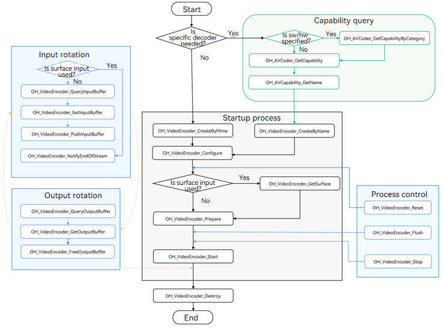

# Synchronous Video Encoding

<!--Kit: AVCodec Kit-->
<!--Subsystem: Multimedia-->
<!--Owner: @zhanghongran-->
<!--Designer: @dpy2650--->
<!--Tester: @cyakee-->
<!--Adviser: @zengyawen-->

Starting from API version 20, video encoding in synchronous mode is supported.

You can call native APIs to perform synchronous video encoding.

For details about the supported encoding capabilities, see [AVCodec Supported Formats](avcodec-support-formats.md#video-encoding).

For details about the restrictions, supported capabilities, and state machine call relationships of video encoding, see [Video Encoding](video-encoding.md).

## When to Use

Asynchronous mode is generally recommended for most use cases. Synchronous mode can be used if you need to actively request buffers for frame delivery.


## How to Develop

Read [VideoEncoder](../../reference/apis-avcodec-kit/_video_encoder.md) for the API reference.

The figure below shows the call relationship of synchronous video encoding.

- The dotted line indicates an optional operation.

- The solid line indicates a mandatory operation.



### Linking the Dynamic Libraries in the CMake Script

``` cmake
target_link_libraries(sample PUBLIC libnative_media_codecbase.so)
target_link_libraries(sample PUBLIC libnative_media_core.so)
target_link_libraries(sample PUBLIC libnative_media_venc.so)
```

> **NOTE**
>
> The word **sample** in the preceding code snippet is only an example. Use the actual project directory name.
>

### Defining the Basic Structure

The sample code provided in this section adheres to the C++17 standard and is for reference only.

1. Add the header files.

    ```c++
    #include <multimedia/player_framework/native_avcodec_videoencoder.h>
    #include <multimedia/player_framework/native_avcapability.h>
    #include <multimedia/player_framework/native_avcodec_base.h>
    #include <multimedia/player_framework/native_avformat.h>
    #include <multimedia/player_framework/native_avbuffer.h>
    #include <multimedia/player_framework/native_averrors.h>
    #include <native_buffer/native_buffer.h>
    #include <memory>
    #include <fstream>
    #include <mutex>
    #include <shared_mutex>
    ```
    
2. Configure global variables.

    These global variables are for reference only. They can be encapsulated into an object based on service requirements.

    ```c++
    // Video frame width.
    int32_t width = 320;
    // Video frame height.
    int32_t height = 240;
    // Video width stride.
    int32_t widthStride = 0;
    // Video height stride.
    int32_t heightStride = 0;
    // Video pixel format.
    OH_AVPixelFormat pixelFormat = AV_PIXEL_FORMAT_NV12;
    // Encoder synchronization lock.
    std::shared_mutex codecMutex;
    // Pointer to the encoder instance.
    OH_AVCodec *videoEnc = nullptr;
    // Encoding output.
    bool outputDone = false;
    // Encoding input.
    bool inputDone = false;
    std::unique_ptr<std::ifstream> inFile_;
    ```

### Surface Mode

The following walks you through how to implement the entire video encoding process in surface mode and implement data rotation in synchronous mode. In this example, surface data is input and encoded into a H.264 stream.


1. Create an encoder instance.

    Create an encoder by name. In the code snippet below, the following variables are used:

    - **videoEnc**: pointer to the video encoder instance.
    - **capability**: pointer to the encoder's capability.
    - [OH_AVCODEC_MIMETYPE_VIDEO_AVC](../../reference/apis-avcodec-kit/_codec_base.md#oh_avcodec_mimetype_video_avc): video codec in AVC format.

    ```c++
    // Create a hardware encoder instance.
    OH_AVCapability *capability= OH_AVCodec_GetCapabilityByCategory(OH_AVCODEC_MIMETYPE_VIDEO_AVC, true, HARDWARE);
    const char *name = OH_AVCapability_GetName(capability);
    OH_AVCodec *videoEnc = OH_VideoEncoder_CreateByName(name);
    if (videoEnc == nullptr) {
        printf("create videoEnc failed");
        return;
    }
    ```

2. Call **OH_VideoEncoder_Configure()** to configure the encoder.

    - For details about the configurable options, see [Media Data Key-Value Pairs](../../reference/apis-avcodec-kit/_codec_base.md#media-data-key-value-pairs).
    - For details about the parameter verification rules, see [OH_VideoEncoder_Configure()](../../reference/apis-avcodec-kit/_video_encoder.md#oh_videoencoder_configure).
    - The parameter value ranges can be obtained through the capability query interface. For details, see [Obtaining Supported Codecs](obtain-supported-codecs.md).

    Currently, the following options must be configured for all supported formats: video frame width, video frame height, and video pixel format.

    ```c++

    auto format = std::shared_ptr<OH_AVFormat>(OH_AVFormat_Create(), OH_AVFormat_Destroy);
    if (format == nullptr) {
        // Handle exceptions.
    }
    // Set the format.
    OH_AVFormat_SetIntValue(format.get(), OH_MD_KEY_WIDTH, width); // Mandatory.
    OH_AVFormat_SetIntValue(format.get(), OH_MD_KEY_HEIGHT, height); // Mandatory.
    OH_AVFormat_SetIntValue(format.get(), OH_MD_KEY_PIXEL_FORMAT, pixelFormat); // Mandatory.
    OH_AVFormat_SetIntValue(format.get(), OH_MD_KEY_ENABLE_SYNC_MODE, 1); // Set the synchronous mode.
    // Configure the encoder.
    OH_AVErrCode ret = OH_VideoEncoder_Configure(videoEnc, format.get());
    if (ret != AV_ERR_OK) {
        // Handle exceptions.
    }
    ```

    > **NOTE**
    >
    > To enable video encoding in synchronous mode, **OH_MD_KEY_ENABLE_SYNC_MODE** must be set to **1**.
    >
    > To use synchronous mode, do not call **OH_VideoEncoder_RegisterCallback** or **OH_VideoEncoder_RegisterParameterCallback** in prior to **OH_VideoEncoder_Configure**. Otherwise, the encoder will run in asynchronous mode instead.
    >
    > Synchronous mode is not supported for frame-specific channels in surface mode.

3. Set the surface.

   In the code snippet below, the following variables are used:
   
   - **nativeWindow**: For details about how to obtain the native window, see step 6 in [Surface Mode](video-encoding.md#surface-mode).

    ```c++
    // Obtain the surface used for data input.
    OH_AVErrCode ret = OH_VideoEncoder_GetSurface(videoEnc, &nativeWindow); 
    if (ret != AV_ERR_OK) {
        // Handle exceptions.
    }
    ```

4. Call **OH_VideoEncoder_Prepare()** to prepare internal resources for the encoder.

    ```c++
    OH_AVErrCode ret = OH_VideoEncoder_Prepare(videoEnc);
    if (ret != AV_ERR_OK) {
        // Handle exceptions.
    }
    ```

5. Call **OH_VideoEncoder_Start()** to start the encoder.

    ```c++
    // Configure the paths of the input and output files.
    std::string_view outputFilePath = "/*yourpath*.h264";
    std::unique_ptr<std::ofstream> outputFile = std::make_unique<std::ofstream>();
    if (outputFile != nullptr) {
        outputFile->open(outputFilePath.data(), std::ios::out | std::ios::binary | std::ios::ate);
    }
    // Start the encoder.
    OH_AVErrCode ret = OH_VideoEncoder_Start(videoEnc);
    if (ret != AV_ERR_OK) {
        // Handle exceptions.
    }
    ```

6. Obtain an available buffer and release the encoded frame.

   - Call [OH_VideoEncoder_QueryOutputBuffer](../../reference/apis-avcodec-kit/_video_encoder.md#oh_videoencoder_queryoutputbuffer) to obtain the index of the next available output buffer.
   - Based on this index, call [OH_VideoEncoder_GetOutputBuffer](../../reference/apis-avcodec-kit/_video_encoder.md#oh_videoencoder_getoutputbuffer) to obtain the buffer instance.
   - Call [OH_VideoEncoder_FreeOutputBuffer](../../reference/apis-avcodec-kit/_video_encoder.md#oh_videoencoder_freeoutputbuffer) to release the encoded frame.

    ```c++
    bool EncoderOutput(OH_AVCodec *videoEnc, int64_t timeoutUs)
    {
        uint32_t index;
        std::shared_lock<std::shared_mutex> lock(codecMutex);

        OH_AVErrCode ret = OH_VideoEncoder_QueryOutputBuffer(videoEnc, &index, timeoutUs);
        switch (ret) {
            case AV_ERR_OK: {
                OH_AVBuffer *buffer = OH_VideoEncoder_GetOutputBuffer(videoEnc, index);
                if (buffer == nullptr) {
                    // Handle exceptions.
                    return false;
                }
            
                // Obtain the encoded information.
                OH_AVCodecBufferAttr info;
                OH_AVErrCode getBufferRet = OH_AVBuffer_GetBufferAttr(buffer, &info);
                if (getBufferRet != AV_ERR_OK) {
                    // Handle exceptions.
                    return false;
                }
                if (info.flags & AVCODEC_BUFFER_FLAGS_EOS) {
                    outputDone = 1;
                }

                // Write the encoded frame data (specified by buffer) to the output file.
                uint8_t *addr = OH_AVBuffer_GetAddr(buffer);
                if (addr == nullptr) {
                   // Handle exceptions.
                   return false;
                }
                if (outputFile != nullptr && outputFile->is_open()) {
                    outputFile->write(reinterpret_cast<char *>(addr), info.size);
                }
                // Free the output buffer. index is the index of the buffer.
                OH_AVErrCode freeOutputRet = OH_VideoEncoder_FreeOutputBuffer(videoEnc, index);
                if (freeOutputRet != AV_ERR_OK) {
                    // Handle exceptions.
                    return false;
                }
                break;
            }
            case AV_ERR_TRY_AGAIN_LATER: {
                break;
            }
            case AV_ERR_STREAM_CHANGED: {
                auto format = std::shared_ptr<OH_AVFormat>(OH_VideoEncoder_GetOutputDescription(videoEnc), OH_AVFormat_Destroy);
                if (format == nullptr) {
                    // Handle exceptions.
                }
                // Obtain the new width and height.
                bool getIntRet = OH_AVFormat_GetIntValue(format.get(), OH_MD_KEY_VIDEO_WIDTH, &width) &&
                                 OH_AVFormat_GetIntValue(format.get(), OH_MD_KEY_VIDEO_HEIGHT, &height);
                if (!getIntRet) {
                 	// Handle exceptions.
                }
                break;
            }
            default: {
                // Handle exceptions.
                return false;
            }
        }
        return true;
    }
    ```

7. Enable the encoder to output frames in a loop.

   ```c++
    bool result = true;
    int64_t timeoutUs = 0; // Unit: μs. A negative value means to wait infinitely. The value 0 means to return immediately. A positive value means to wait for the specified time before exiting.   

    while (!outputDone && result) {
        if (!outputDone ) {
            result = EncoderOutput(videoEnc, timeoutUs);
        }
    }
   ```

8. Call **OH_VideoEncoder_NotifyEndOfStream()** to notify the encoder of EOS.

    ```c++
    // In surface mode, you only need to call this API to notify the encoder of EOS.
    OH_AVErrCode ret = OH_VideoEncoder_NotifyEndOfStream(videoEnc);
    if (ret != AV_ERR_OK) {
        // Handle exceptions.
    }
    ```

9. (Optional) Call **OH_VideoEncoder_Flush()** to refresh the encoder.

    After **OH_VideoEncoder_Flush** is called, the encoder remains in the Running state, but the input and output data and parameter set (such as the H.264 PPS/SPS) buffered in the encoder are cleared.
    
    To continue encoding, you must call [OH_VideoEncoder_Start](../../reference/apis-avcodec-kit/_video_encoder.md#oh_videoencoder_start) again.

    ```c++
    // Use codecMutex to avoid the problem where the encoding thread keeps running and exits the loop after the Flush API is called and the state is changed.
    std::unique_lock<std::shared_mutex> lock(codecMutex);
    // Refresh the encoder.
    OH_AVErrCode flushRet = OH_VideoEncoder_Flush(videoEnc);
    if (flushRet != AV_ERR_OK) {
        // Handle exceptions.
    }

    // Start encoding again.
    OH_AVErrCode startRet = OH_VideoEncoder_Start(videoEnc);
    if (startRet != AV_ERR_OK) {
        // Handle exceptions.
    }
    ```

10. (Optional) Call **OH_VideoEncoder_Reset()** to reset the encoder.

    After **OH_VideoEncoder_Reset** is called, the encoder returns to the initialized state. To continue encoding, you must call **[OH_VideoEncoder_Configure](../../reference/apis-avcodec-kit/_video_encoder.md#oh_videoencoder_configure)** and then **[OH_VideoEncoder_Prepare](../../reference/apis-avcodec-kit/_video_encoder.md#oh_videoencoder_prepare)**.

    ```c++
    // Reset the encoder.
    std::unique_lock<std::shared_mutex> lock(codecMutex);
    OH_AVErrCode resetRet = OH_VideoEncoder_Reset(videoEnc);
    if (resetRet != AV_ERR_OK) {
        // Handle exceptions.
    }
 
    // Reconfigure the encoder.
    auto format = std::shared_ptr<OH_AVFormat>(OH_AVFormat_Create(), OH_AVFormat_Destroy);
    if (format == nullptr) {
        // Handle exceptions.
    }
    OH_AVErrCode configRet = OH_VideoEncoder_Configure(videoEnc, format.get());
    if (configRet != AV_ERR_OK) {
        // Handle exceptions.
    }

    // The encoder is ready again.
    OH_AVErrCode prepareRet = OH_VideoEncoder_Prepare(videoEnc);
    if (prepareRet != AV_ERR_OK) {
        // Handle exceptions.
    }
    ```

    > **NOTE**
    >
    > When the encoder returns to the initialized state, you must call **OH_VideoEncoder_Configure** to set **OH_MD_KEY_ENABLE_SYNC_MODE** to **1** to reconfigure the encoder parameters. Otherwise, the encoder will run in asynchronous mode.

11. (Optional) Call **OH_VideoEncoder_Stop()** to stop the encoder.

    After **OH_VideoEncoder_Stop** is called, the encoder retains the encoding instance and releases the input and output buffers. You can directly call **OH_VideoEncoder_Start** to continue encoding. The first **buffer** passed must carry the parameter set, starting from the IDR frame.

    ```c++
    // Stop the encoder.
    std::unique_lock<std::shared_mutex> lock(codecMutex);
    OH_AVErrCode ret = OH_VideoEncoder_Stop(videoEnc);
    if (ret != AV_ERR_OK) {
        // Handle exceptions.
    }
    ```

12. Call **OH_VideoEncoder_Destroy()** to destroy the encoder instance and release resources.

    ```c++
    // Destroy the encoder.
    std::unique_lock<std::shared_mutex> lock(codecMutex);
    OH_AVErrCode ret = AV_ERR_OK;
    if (videoEnc != nullptr) {
        ret = OH_VideoEncoder_Destroy(videoEnc);
        videoEnc = nullptr;
    }
    if (ret != AV_ERR_OK) {
        // Handle exceptions.
    }
    ```

    > **NOTE**
    >
    > After the call, you must set a null pointer to the encoder to prevent program errors caused by wild pointers.

### Buffer Mode

The following walks you through how to implement the entire video encoding process in buffer mode and implement data rotation in synchronous mode. It uses the YUV file input and H.264 encoding format as an example.

1. Create an encoder instance.

    The procedure is the same as that in surface mode and is not described here.

    ```c++
    // Create an encoder by name. If your application has special requirements, for example, expecting an encoder that supports a certain resolution, you can call OH_AVCodec_GetCapability to query the capability first.
    OH_AVCapability *capability = OH_AVCodec_GetCapability(OH_AVCODEC_MIMETYPE_VIDEO_AVC, true);
    const char *name = OH_AVCapability_GetName(capability);
    OH_AVCodec *videoEnc = OH_VideoEncoder_CreateByName(name);
    if (videoEnc == nullptr) {
        printf("create videoEnc failed");
        return;
    }
    ```

2. Call **OH_VideoEncoder_Configure()** to configure the encoder.

    The procedure is the same as that in surface mode and is not described here.

    ```c++
    auto format = std::shared_ptr<OH_AVFormat>(OH_AVFormat_Create(), OH_AVFormat_Destroy);
    if (format == nullptr) {
        // Handle exceptions.
    }
    // Set the format.
    OH_AVFormat_SetIntValue(format.get(), OH_MD_KEY_WIDTH, width); // Mandatory.
    OH_AVFormat_SetIntValue(format.get(), OH_MD_KEY_HEIGHT, height); // Mandatory.
    OH_AVFormat_SetIntValue(format.get(), OH_MD_KEY_PIXEL_FORMAT, pixelFormat); // Mandatory.
    OH_AVFormat_SetIntValue(format.get(), OH_MD_KEY_ENABLE_SYNC_MODE, 1); // Set the synchronous mode.
    // Configure the encoder.
    OH_AVErrCode ret = OH_VideoEncoder_Configure(videoEnc, format.get());
    if (ret != AV_ERR_OK) {
        // Handle exceptions.
    }
    ```

    > **NOTE**
    >
    > To enable video encoding in synchronous mode, **OH_MD_KEY_ENABLE_SYNC_MODE** must be set to **1**.
    >
    > To use synchronous mode, do not call **OH_VideoEncoder_RegisterCallback** or **OH_VideoEncoder_RegisterParameterCallback** in prior to **OH_VideoEncoder_Configure**. Otherwise, the encoder will run in asynchronous mode instead.

3. Call **OH_VideoEncoder_Prepare()** to prepare internal resources for the encoder.

    ```c++
    ret = OH_VideoEncoder_Prepare(videoEnc);
    if (ret != AV_ERR_OK) {
        // Handle exceptions.
    }
    ```

4. Call **OH_VideoEncoder_Start()** to start the encoder.

    Configure the input and output files.

    ```c++
    // Configure the paths of the input and output files.
    std::string_view inputFilePath = "/*yourpath*.yuv";
    std::string_view outputFilePath = "/*yourpath*.h264";
    std::unique_ptr<std::ifstream> inputFile = std::make_unique<std::ifstream>();
    std::unique_ptr<std::ofstream> outputFile = std::make_unique<std::ofstream>();
    if (inputFile != nullptr) {
        inputFile->open(inputFilePath.data(), std::ios::in | std::ios::binary);
    }
    if (outputFile != nullptr) {
        outputFile->open(outputFilePath.data(), std::ios::out | std::ios::binary | std::ios::ate);
    }
    // Start the encoder.
    OH_AVErrCode ret = OH_VideoEncoder_Start(videoEnc);
    if (ret != AV_ERR_OK) {
        // Handle exceptions.
    }
    ```

5. Obtain an available buffer and write the bitstream to the encoder.

    - Call [OH_VideoEncoder_QueryInputBuffer](../../reference/apis-avcodec-kit/_video_encoder.md#oh_videoencoder_queryinputbuffer) to obtain the index of the next available input buffer.
    - Based on this index, call [OH_VideoEncoder_GetInputBuffer](../../reference/apis-avcodec-kit/_video_encoder.md#oh_videoencoder_getinputbuffer) to obtain the buffer instance.
    - Write the data to be encoded to the buffer, and call [OH_VideoEncoder_PushInputBuffer](../../reference/apis-avcodec-kit/_video_encoder.md#oh_videoencoder_pushinputbuffer) to push it into the encoding input queue for encoding. When all the data to be processed has been passed to the encoder, set flag to **AVCODEC_BUFFER_FLAGS_EOS** to notify the encoder that the input is complete.

    The meanings of the variables **size**, **offset**, **pts**, **frameData**, and **flags** in the example are the same as those in surface mode.

    ```c++
    bool EncoderInput(OH_AVCodec *videoEnc, int64_t timeoutUs)
    {    
        uint32_t index;
        std::shared_lock<std::shared_mutex> lock(codecMutex);

        OH_AVErrCode ret = OH_VideoEncoder_QueryInputBuffer(videoEnc, &index, timeoutUs);
        switch (ret) {
            case AV_ERR_OK: {
                OH_AVBuffer *buffer = OH_VideoEncoder_GetInputBuffer(videoEnc, index);
                if (buffer == nullptr) {
                    // Handle exceptions.
                    return false;
                }

                // Write image data.
                int32_t frameSize = 0;
                bool isFirstFrame = true;
                // Obtain the video width stride and height stride.
                if (isFirstFrame) {
                    auto format = std::shared_ptr<OH_AVFormat>(OH_VideoEncoder_GetInputDescription(videoEnc), OH_AVFormat_Destroy);
                    if (format == nullptr) {
                        // Handle exceptions.
                    }
                    bool getIntRet = OH_AVFormat_GetIntValue(format.get(), OH_MD_KEY_VIDEO_STRIDE, &widthStride) &&
                                     OH_AVFormat_GetIntValue(format.get(), OH_MD_KEY_VIDEO_SLICE_HEIGHT, &heightStride);
                     if (!getIntRet) {
                     	// Handle exceptions.
                     }
                    isFirstFrame = false;
                }
                if (widthStride == width && heightStride == height) {
                    frameSize = width * height * 3 / 2; // Formula for calculating the data size of each frame in NV12 pixel format.
                    // Process the file stream and obtain the frame length, and then write the data to encode to the buffer of the specified index.
                    uint8_t *addr = OH_AVBuffer_GetAddr(buffer);
                    if (addr == nullptr) {
                       // Handle exceptions.
                       return false;
                    }
                    if (inputFile != nullptr && inputFile->is_open()) {
                        inputFile->read(reinterpret_cast<char *>(addr), frameSize);
                    }
                } else {
                    // If the stride is not equal to the width, perform offset based on the stride. For details, see step 8 in "Buffer Mode in Video Encoding".
                }

                // Configure the buffer information.
                OH_AVCodecBufferAttr info;
                info.size = frameSize;
                info.offset = 0;
                info.pts = 0;
                OH_AVErrCode setBufferRet = OH_AVBuffer_SetBufferAttr(buffer, &info);
                if (setBufferRet != AV_ERR_OK) {
                    // Handle exceptions.
                    return false;
                }
                // Send the data to the input buffer for encoding. index is the index of the buffer.
                OH_AVErrCode pushInputRet = OH_VideoEncoder_PushInputBuffer(videoEnc, index);
                if (pushInputRet != AV_ERR_OK) {
                    // Handle exceptions.
                    return false;
                }
                if (inFile_->eof()) {
                    inputDone = 1;
                }
                break;
            }
            case AV_ERR_TRY_AGAIN_LATER: {
                break;
            }
            default: {
                // Handle exceptions.
                return false;
            }    
        }
        return true;
    }
    ```


6. Obtain an available buffer and release the encoded frame.

   - Call [OH_VideoEncoder_QueryOutputBuffer](../../reference/apis-avcodec-kit/_video_encoder.md#oh_videoencoder_queryoutputbuffer) to obtain the index of the next available output buffer.
   - Based on this index, call [OH_VideoEncoder_GetOutputBuffer](../../reference/apis-avcodec-kit/_video_encoder.md#oh_videoencoder_getoutputbuffer) to obtain the buffer instance.
   - Call [OH_VideoEncoder_FreeOutputBuffer](../../reference/apis-avcodec-kit/_video_encoder.md#oh_videoencoder_freeoutputbuffer) to release the encoded frame.

    ```c++
    bool EncoderOutput(OH_AVCodec *videoEnc, int64_t timeoutUs)
    {
        uint32_t index;
        std::shared_lock<std::shared_mutex> lock(codecMutex);

        OH_AVErrCode ret = OH_VideoEncoder_QueryOutputBuffer(videoEnc, &index, timeoutUs);
        switch (ret) {
            case AV_ERR_OK: {
                OH_AVBuffer *buffer = OH_VideoEncoder_GetOutputBuffer(videoEnc, index);
                if (buffer == nullptr) {
                    // Handle exceptions.
                    return false;
                }
            
                // Obtain the encoded information.
                OH_AVCodecBufferAttr info;
                OH_AVErrCode getBufferRet = OH_AVBuffer_GetBufferAttr(buffer, &info);
                if (getBufferRet != AV_ERR_OK) {
                    // Handle exceptions.
                    return false;
                }
                // Write the encoded frame data (specified by buffer) to the output file.
                uint8_t *addr = OH_AVBuffer_GetAddr(buffer);
                if (addr == nullptr) {
                   // Handle exceptions.
                   return false;
                }
                if (outputFile != nullptr && outputFile->is_open()) {
                    outputFile->write(reinterpret_cast<char *>(addr), info.size);
                }
                if (info.flags & AVCODEC_BUFFER_FLAGS_EOS) {
                    outputDone = 1;
                }
                // Free the output buffer. index is the index of the buffer.
                OH_AVErrCode freeOutputRet = OH_VideoEncoder_FreeOutputBuffer(videoEnc, index);
                if (freeOutputRet != AV_ERR_OK) {
                    // Handle exceptions.
                    return false;
                }
                break;
            }
            case AV_ERR_TRY_AGAIN_LATER: {
                break;
            }
            case AV_ERR_STREAM_CHANGED: {
                break;
            }
            default: {
                // Handle exceptions.
                return false;
            }
        }
        return true;
    }
    ```

7. Enable the encoder to input and output frames in a loop.
  
    ```c++
    bool result = true;
    int64_t timeoutUs = 0; // Unit: μs. A negative value means to wait infinitely. The value 0 means to return immediately. A positive value means to wait for the specified time before exiting.

    while (!outputDone && result) {
        if (!inputDone) {
            result = EncoderInput(videoEnc, timeoutUs);
        }
        if (!outputDone) {
            result = EncoderOutput(videoEnc, timeoutUs);
        }
    }
    ```

The subsequent processes (including refreshing, resetting, stopping, and destroying the encoder) are the same as those in surface mode. For details, see steps 9–12 in [Surface Mode](#surface-mode).
