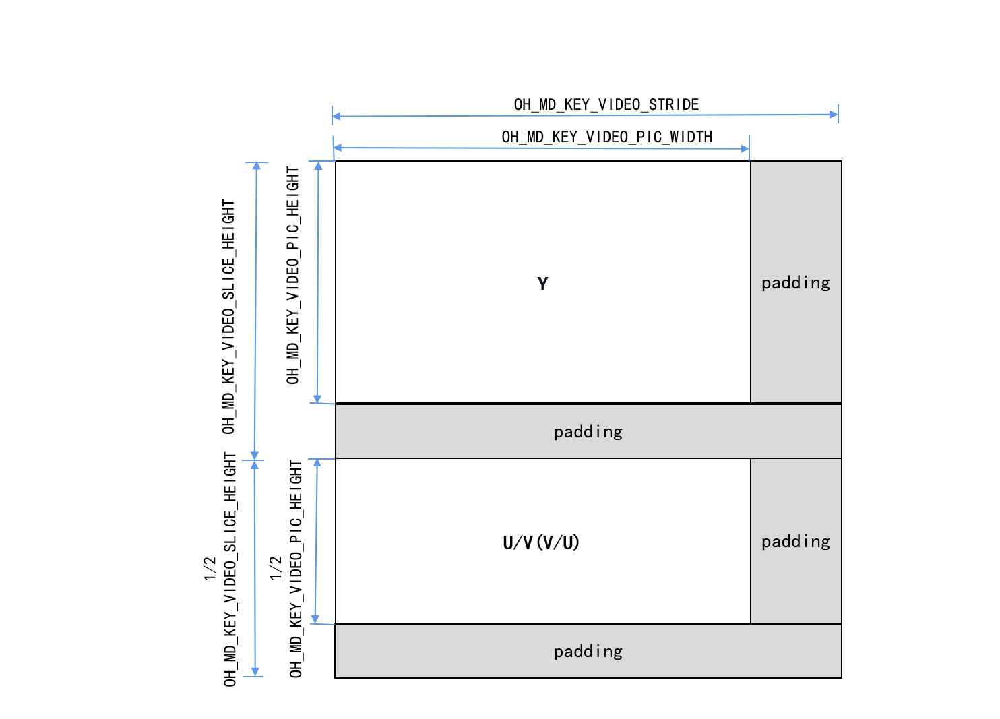

# Video Decoding

You can call the native APIs provided by the VideoDecoder module to decode video, that is, to decode media data into a YUV file or render it.

<!--RP3--><!--RP3End-->

Currently, the following decoding capabilities are supported:

| Video Hardware Decoding Type      | Video Software Decoding Type  |
| --------------------- | ---------------- |
| AVC (H.264) and HEVC (H.265)|AVC (H.264) and HEVC (H.265)|

Video software decoding and hardware decoding are different. When a decoder is created based on the MIME type, only H.264 (OH_AVCODEC_MIMETYPE_VIDEO_AVC) is supported for software decoding, and H.264 (OH_AVCODEC_MIMETYPE_VIDEO_AVC) and H.265 (OH_AVCODEC_MIMETYPE_VIDEO_HEVC) are supported for hardware decoding.

You can perform a [capability query](obtain-supported-codecs.md) to obtain the decoding capability range.

<!--RP1--><!--RP1End-->

Through the VideoDecoder module, your application can implement the following key capabilities.

|          Capability                      |             How to Configure                                                                    |
| --------------------------------------- | ---------------------------------------------------------------------------------- |
| Variable resolution        | The decoder supports the change of the input stream resolution. After the resolution is changed, the callback function **OnStreamChanged()** set by **OH_VideoDecoder_RegisterCallback** is triggered. For details, see step 4 in surface mode or step 3 in buffer mode. |
| Dynamic surface switching | Call **OH_VideoDecoder_SetSurface** to configure this capability. It is supported only in surface mode. For details, see step 7 in surface mode.   |
| Low-latency decoding | Call **OH_VideoDecoder_Configure** to configure this capability. For details, see step 6 in surface mode or step 5 in buffer mode.     |      


## Restrictions
- The buffer mode does not support 10-bit image data.
- After **flush()**, **reset()**, or **stop()** is called, the PPS/SPS must be transferred again in the **start()** call. For details about the example, see step 14 in [Surface Output](#surface-output).
- Due to limited hardware decoder resources, you must call **OH_VideoDecoder_Destroy** to destroy every decoder instance when it is no longer needed.
- The input streams for video decoding support only the AnnexB format, and the supported AnnexB format supports multiple slices. However, the slices of the same frame must be sent to the decoder at a time.
- When **flush()**, **reset()**, or **stop()** is called, do not continue to operate the OH_AVBuffer obtained through the previous callback function.
- The DRM decryption capability supports both non-secure and secure video channels in [surface mode](#surface-output), but only non-secure video channels in buffer mode (#buffer-output).
- The buffer mode and surface mode use the same APIs. Therefore, the surface mode is described as an example.
- In buffer mode, after obtaining the pointer to an OH_AVBuffer object through the callback function **OH_AVCodecOnNewOutputBuffer**, call **OH_VideoDecoder_FreeOutputBuffer** to notify the system that the buffer has been fully utilized. In this way, the system can write the subsequently decoded data to the corresponding location. If the OH_NativeBuffer object is obtained through **OH_AVBuffer_GetNativeBuffer** and its lifecycle extends beyond that of the OH_AVBuffer pointer object, you mut perform data duplication. In this case, you should manage the lifecycle of the newly generated OH_NativeBuffer object to ensure that the object can be correctly used and released.

## Surface Output and Buffer Output

- Surface output and buffer output differ in data output modes.
- They are applicable to different scenarios.
  - Surface output indicates that the OHNativeWindow is used to transfer output data. It supports connection with other modules, such as the **XComponent**.
  - Buffer output indicates that decoded data is output in shared memory mode.

- The two also differ slightly in the API calling modes:
- In surface mode, the caller can choose to call **OH_VideoDecoder_FreeOutputBuffer** to free the output buffer (without rendering the data). In buffer mode, the caller must call **OH_VideoDecoder_FreeOutputBuffer** to free the output buffer.
- In surface mode, the caller must call **OH_VideoDecoder_SetSurface** to set an OHNativeWindow before the decoder is ready and call **OH_VideoDecoder_RenderOutputBuffer** to render the decoded data after the decoder is started.
  - In buffer mode, an application can obtain the shared memory address and data from the output buffer. In surface mode, an application can obtain the data from the output buffer.

For details about the development procedure, see [Surface Output](#surface-output) and [Buffer Output](#buffer-output).

## State Machine Interaction
The following figure shows the interaction between states.


1. A decoder enters the Initialized state in either of the following ways:
   - When a decoder instance is initially created, the decoder enters the Initialized state.
   - When **OH_VideoDecoder_Reset** is called in any state, the decoder returns to the Initialized state.

2. When the decoder is in the Initialized state, you can call **OH_VideoDecoder_Configure** to configure the decoder. After the configuration, the decoder enters the Configured state.
3. When the decoder is in the Configured state, you can call **OH_VideoDecoder_Prepare** to switch it to the Prepared state.
4. When the decoder is in the Prepared state, you can call **OH_VideoDecoder_Start** to switch it to the Executing state.
   - When the decoder is in the Executing state, you can call **OH_VideoDecoder_Stop** to switch it back to the Prepared state.

5. In rare cases, the decoder may encounter an error and enter the Error state. If this is the case, an invalid value can be returned or an exception can be thrown through a queue operation.
   - When the decoder is in the Error state, you can either call **OH_VideoDecoder_Reset** to switch it to the Initialized state or call **OH_VideoDecoder_Destroy** to switch it to the Released state.

6. The Executing state has three substates: Flushed, Running, and End-of-Stream.
   - After **OH_VideoDecoder_Start** is called, the decoder enters the Running substate immediately.
   - When the decoder is in the Executing state, you can call **OH_VideoDecoder_Flush** to switch it to the Flushed substate.
   - After all data to be processed is transferred to the decoder, the **AVCODEC_BUFFER_FLAGS_EOS** flag is added to the last input buffer in the input buffers queue. Once this flag is detected, the decoder transits to the End-of-Stream substate. In this state, the decoder does not accept new inputs, but continues to generate outputs until it reaches the tail frame.

7. When the decoder is no longer needed, you must call **OH_VideoDecoder_Destroy** to destroy the decoder instance. Then the decoder enters the Released state.

## How to Develop

Read [VideoDecoder](../../reference/apis-avcodec-kit/_video_decoder.md) for the API reference.

The figure below shows the call relationship of video decoding.

- The dotted line indicates an optional operation.

- The solid line indicates a mandatory operation.


### Linking the Dynamic Link Libraries in the CMake Script

``` cmake
target_link_libraries(sample PUBLIC libnative_media_codecbase.so)
target_link_libraries(sample PUBLIC libnative_media_core.so)
target_link_libraries(sample PUBLIC libnative_media_vdec.so)
```
> **NOTE**
>
> The word 'sample' in the preceding code snippet is only an example. Use the actual project directory name.
>

### Surface Output

The following walks you through how to implement the entire video decoding process in surface mode. In this example, an H.264 stream file is input, decoded, and rendered.

Currently, the VideoDecoder module supports only data rotation in asynchronous mode.

1. Add the header files.

    ```c++
    #include <multimedia/player_framework/native_avcodec_videodecoder.h>
    #include <multimedia/player_framework/native_avcapability.h>
    #include <multimedia/player_framework/native_avcodec_base.h>
    #include <multimedia/player_framework/native_avformat.h>
    #include <multimedia/player_framework/native_avbuffer.h>
    #include <fstream>
    ```
2. Configure global variables.

    ```c++
    // (Mandatory) Configure the video frame width.
    int32_t width = 320; 
    // (Mandatory) Configure the video frame height.
    int32_t height = 240;
    // Configure the video pixel format.
    constexpr OH_AVPixelFormat DEFAULT_PIXELFORMAT = AV_PIXEL_FORMAT_NV12;
    int32_t widthStride = 0;
    int32_t heightStride = 0;
    ```

3. Create a decoder instance.

    You can create a decoder by name or MIME type. In the code snippet below, the following variables are used:

    - **videoDec**: pointer to the video decoder instance.
    - **capability**: pointer to the decoder's capability.
    - **OH_AVCODEC_MIMETYPE_VIDEO_AVC**: AVC video codec.

    ```c++
    // To create a decoder by name, call OH_AVCapability_GetName to obtain the codec names available and then call OH_VideoDecoder_CreateByName. If your application has special requirements, for example, expecting a decoder that supports a certain resolution, you can call OH_AVCodec_GetCapability to query the capability first.
    OH_AVCapability *capability = OH_AVCodec_GetCapability(OH_AVCODEC_MIMETYPE_VIDEO_AVC, false);
    // Create hardware decoder instances.
    OH_AVCapability *capability= OH_AVCodec_GetCapabilityByCategory(OH_AVCODEC_MIMETYPE_VIDEO_AVC, false, HARDWARE);
    const char *name = OH_AVCapability_GetName(capability);
    OH_AVCodec *videoDec = OH_VideoDecoder_CreateByName(name);
    ```

    ```c++
    // Create a decoder by MIME type. Only specific codecs recommended by the system can be created in this way.
    // If multiple codecs need to be created, create hardware decoder instances first. If the hardware resources are insufficient, create software decoder instances.
    // Create an H.264 decoder for software/hardware decoding.
    OH_AVCodec *videoDec = OH_VideoDecoder_CreateByMime(OH_AVCODEC_MIMETYPE_VIDEO_AVC);
    // Create an H.265 decoder for software/hardware decoding.
    OH_AVCodec *videoDec = OH_VideoDecoder_CreateByMime(OH_AVCODEC_MIMETYPE_VIDEO_HEVC);
    ```

4. Call **OH_VideoDecoder_RegisterCallback()** to register the callback functions.

    Register the **OH_AVCodecCallback** struct that defines the following callback function pointers:

    - **OH_AVCodecOnError**, a callback used to report a codec operation error. For details about the error codes, see [OH_AVCodecOnError](../../reference/apis-avcodec-kit/_codec_base.md#oh_avcodeconerror).
    - **OH_AVCodecOnStreamChanged**, a callback used to report a codec stream change, for example, stream width or height change.
    - **OH_AVCodecOnNeedInputBuffer**, a callback used to report input data required, which means that the decoder is ready for receiving data.
    - **OH_AVCodecOnNewOutputBuffer**, a callback used to report output data generated, which means that decoding is complete. (Note: The **buffer** parameter in surface mode is null.)

    You need to process the callback functions to ensure that the decoder runs properly.

    <!--RP2--><!--RP2End-->

    ```c++
    // Implement the OH_AVCodecOnError callback function.
    static void OnError(OH_AVCodec *codec, int32_t errorCode, void *userData)
    {
        // Process the error code in the callback.
        (void)codec;
        (void)errorCode;
        (void)userData;
    }

    // Implement the OH_AVCodecOnStreamChanged callback function.
    static void OnStreamChanged(OH_AVCodec *codec, OH_AVFormat *format, void *userData)
    {
        // The changed video width, height, and stride can be obtained through format.
        (void)codec;
        (void)userData;
        OH_AVFormat_GetIntValue(format, OH_MD_KEY_VIDEO_PIC_WIDTH, &width);
        OH_AVFormat_GetIntValue(format, OH_MD_KEY_VIDEO_PIC_HEIGHT, &height);
        OH_AVFormat_GetIntValue(format, OH_MD_KEY_VIDEO_STRIDE, &widthStride);
        OH_AVFormat_GetIntValue(format, OH_MD_KEY_VIDEO_SLICE_HEIGHT, &heightStride);
    }

    // Implement the OH_AVCodecOnNeedInputBuffer callback function.
    static void OnNeedInputBuffer(OH_AVCodec *codec, uint32_t index, OH_AVBuffer *buffer, void *userData)
    {
        // The index of the input frame buffer is sent to InIndexQueue.
        // The input frame data (specified by buffer) is sent to InBufferQueue.
        // Process the data.
        // Write the stream to decode.
    }

    // Implement the OH_AVCodecOnNewOutputBuffer callback function.
    static void OnNewOutputBuffer(OH_AVCodec *codec, uint32_t index, OH_AVBuffer *buffer, void *userData)
    {
        // The index of the output frame buffer is sent to outIndexQueue.
        // The output frame data (specified by buffer) is sent to outBufferQueue.
        // Process the data.
        // Display and release decoded frames.
    }
    // Call OH_VideoDecoder_RegisterCallback() to register the callback functions.
    OH_AVCodecCallback cb = {&OnError, &OnStreamChanged, &OnNeedInputBuffer, &OnNewOutputBuffer};
    // Set the asynchronous callbacks.
    int32_t ret = OH_VideoDecoder_RegisterCallback(videoDec, cb, NULL); // NULL: userData is null.
    if (ret != AV_ERR_OK) {
        // Exception handling.
    }
    ```
    > **NOTE**
    >
    > In the callback functions, pay attention to multi-thread synchronization for operations on the data queue.
    >

5. (Optional) Call **OH_VideoDecoder_SetDecryptionConfig** to set the decryption configuration. Call this API after the media key system information is obtained and a media key is obtained but before **Prepare()** is called. For details about how to obtain such information, see step 3 in [Audio and Video Demuxing](audio-video-demuxer.md).  In surface mode, the DRM decryption capability supports both secure and non-secure video channels. For details about DRM APIs, see [DRM](../../reference/apis-drm-kit/_drm.md).

    Add the header files.

    ```c++
    #include <multimedia/drm_framework/native_mediakeysystem.h>
    #include <multimedia/drm_framework/native_mediakeysession.h>
    #include <multimedia/drm_framework/native_drm_err.h>
    #include <multimedia/drm_framework/native_drm_common.h>
    ```
    Linking the Dynamic Libraries in the CMake Script

    ``` cmake
    target_link_libraries(sample PUBLIC libnative_drm.so)
    ```

    <!--RP4-->The following is the sample code:<!--RP4End--> 

    ```c++
    // Create a media key system based on the media key system information. The following uses com.clearplay.drm as an example.
    MediaKeySystem *system = nullptr;
    int32_t ret = OH_MediaKeySystem_Create("com.clearplay.drm", &system);
    if (system == nullptr) {
        printf("create media key system failed");
        return;
    }

    // Create a decryption session. If a secure video channel is used, create a MediaKeySession with the content protection level of CONTENT_PROTECTION_LEVEL_HW_CRYPTO or higher.
    // To use a non-secure video channel, create a MediaKeySession with the content protection level of CONTENT_PROTECTION_LEVEL_SW_CRYPTO or higher.
    MediaKeySession *session = nullptr;
    DRM_ContentProtectionLevel contentProtectionLevel = CONTENT_PROTECTION_LEVEL_SW_CRYPTO;
    ret = OH_MediaKeySystem_CreateMediaKeySession(system, &contentProtectionLevel, &session);
    if (ret != DRM_OK) {
        // If the creation fails, check the DRM interface document and logs.
        printf("create media key session failed.");
        return;
    }
    if (session == nullptr) {
        printf("media key session is nullptr.");
        return;
    }

    // Generate a media key request and set the response to the media key request.

    // Set the decryption configuration, that is, set the decryption session and secure video channel flag to the decoder.
    // If the DRM scheme supports a secure video channel, set secureVideoPath to true and create a secure decoder before using the channel.
    // That is, in step 3, call OH_VideoDecoder_CreateByName, with a decoder name followed by .secure (for example, [CodecName].secure) passed in, to create a secure decoder.
    bool secureVideoPath = false;
    ret = OH_VideoDecoder_SetDecryptionConfig(videoDec, session, secureVideoPath);
    ```

6. Call **OH_VideoDecoder_Configure()** to configure the decoder.

    For details about the configurable options, see [Video Dedicated Key-Value Paris](../../reference/apis-avcodec-kit/_codec_base.md#media-data-key-value-pairs).
    
    For details about the parameter verification rules, see [OH_VideoDecoder_Configure()](../../reference/apis-avcodec-kit/_video_decoder.md#oh_videodecoder_configure).

    The parameter value ranges can be obtained through the capability query interface. For details, see [Obtaining Supported Codecs](obtain-supported-codecs.md).
    
    Currently, the following options must be configured for all supported formats: video frame width, video frame height, and video pixel format. In the code snippet below, the following variables are used:

    - **DEFAULT_WIDTH**: 320 pixels
    - **DEFAULT_HEIGHT**: 240 pixels
    - **DEFAULT_PIXELFORMAT**: **AV_PIXEL_FORMAT_NV12** (the pixel format of the YUV file is NV12)

    ```c++

    OH_AVFormat *format = OH_AVFormat_Create();
    // Set the format.
    OH_AVFormat_SetIntValue (format, OH_MD_KEY_WIDTH, width); // Mandatory
    OH_AVFormat_SetIntValue(format, OH_MD_KEY_HEIGHT, height); // Mandatory
    OH_AVFormat_SetIntValue(format, OH_MD_KEY_PIXEL_FORMAT, DEFAULT_PIXELFORMAT);
    // (Optional) Configure low-latency decoding.
    OH_AVFormat_SetIntValue(format, OH_MD_KEY_VIDEO_ENABLE_LOW_LATENCY, 1);
    // Configure the decoder.
    int32_t ret = OH_VideoDecoder_Configure(videoDec, format);
    if (ret != AV_ERR_OK) {
        // Exception handling.
    }
    OH_AVFormat_Destroy(format);
    ```

7. Set the surface. The application obtains the native window from the **XComponent**. For details about the process, see [XComponent](../../reference/apis-arkui/arkui-ts/ts-basic-components-xcomponent.md).

    You perform this step during decoding, that is, dynamically switch the surface.

    ```c++
    // Set the window parameters.
    int32_t ret = OH_VideoDecoder_SetSurface(videoDec, window); // Obtain the window from the XComponent.
    if (ret != AV_ERR_OK) {
        // Exception handling.
    }
    ```

8. (Optional) Call **OH_VideoDecoder_SetParameter()** to set the surface parameters of the decoder.

    For details about the configurable options, see [Video Dedicated Key-Value Paris](../../reference/apis-avcodec-kit/_codec_base.md#media-data-key-value-pairs).

    ```c++
    OH_AVFormat *format = OH_AVFormat_Create();
    // Configure the display rotation angle.
    OH_AVFormat_SetIntValue(format, OH_MD_KEY_ROTATION, 90);
    // Configure the matching mode (scaling or cropping) between the video and the screen.
    OH_AVFormat_SetIntValue(format, OH_MD_KEY_SCALING_MODE, SCALING_MODE_SCALE_CROP);
    int32_t ret = OH_VideoDecoder_SetParameter(videoDec, format);
    OH_AVFormat_Destroy(format);
    ```

9. Call **OH_VideoDecoder_Prepare()** to prepare internal resources for the decoder.

    ```c++
    ret = OH_VideoDecoder_Prepare(videoDec);
    if (ret != AV_ERR_OK) {
        // Exception handling.
    }
    ```

10. Call **OH_VideoDecoder_Start()** to start the decoder.

    ```c++
    std::string_view inputFilePath = "/*yourpath*.h264";
    std::unique_ptr<std::ifstream> inputFile = std::make_unique<std::ifstream>();
    inputFile->open(inputFilePath.data(), std::ios::in | std::ios::binary); 
    // Start the decoder.
    int32_t ret = OH_VideoDecoder_Start(videoDec);
    if (ret != AV_ERR_OK) {
        // Exception handling.
    }
    ```

11. (Optional) Call **OH_AVCencInfo_SetAVBuffer()** to set the Common Encryption Scheme (CENC) information.

    If the program to play is DRM encrypted and the application implements media demuxing instead of using the system's [demuxer](audio-video-demuxer.md), you must call **OH_AVCencInfo_SetAVBuffer()** to set the CENC information to the AVBuffer. In this way, the AVBuffer carries the data to be decrypted and CENC information, so that the media data in the AVBuffer can be decrypted. You do not need to call this API when the application uses the system's [demuxer](audio-video-demuxer.md).

    Add the header files.

    ```c++
    #include <multimedia/player_framework/native_cencinfo.h>
    ```
    Link the dynamic library in the CMake script.

    ``` cmake
    target_link_libraries(sample PUBLIC libnative_media_avcencinfo.so)
    ```

    In the code snippet below, the following variable is used:
    - **buffer**: parameter passed by the callback function **OnNeedInputBuffer**. You can obtain the virtual address of the image by calling **OH_AVBuffer_GetAddr**.
    ```c++
    uint32_t keyIdLen = DRM_KEY_ID_SIZE;
    uint8_t keyId[] = {
        0xd4, 0xb2, 0x01, 0xe4, 0x61, 0xc8, 0x98, 0x96,
        0xcf, 0x05, 0x22, 0x39, 0x8d, 0x09, 0xe6, 0x28};
    uint32_t ivLen = DRM_KEY_IV_SIZE;
    uint8_t iv[] = {
        0xbf, 0x77, 0xed, 0x51, 0x81, 0xde, 0x36, 0x3e,
        0x52, 0xf7, 0x20, 0x4f, 0x72, 0x14, 0xa3, 0x95};
    uint32_t encryptedBlockCount = 0;
    uint32_t skippedBlockCount = 0;
    uint32_t firstEncryptedOffset = 0;
    uint32_t subsampleCount = 1;
    DrmSubsample subsamples[1] = { {0x10, 0x16} };
    // Create a CencInfo instance.
    OH_AVCencInfo *cencInfo = OH_AVCencInfo_Create();
    if (cencInfo == nullptr) {
        // Exception handling.
    }
    // Set the decryption algorithm.
    OH_AVErrCode errNo = OH_AVCencInfo_SetAlgorithm(cencInfo, DRM_ALG_CENC_AES_CTR);
    if (errNo != AV_ERR_OK) {
        // Exception handling.
    }
    // Set KeyId and Iv.
    errNo = OH_AVCencInfo_SetKeyIdAndIv(cencInfo, keyId, keyIdLen, iv, ivLen);
    if (errNo != AV_ERR_OK) {
        // Exception handling.
    }
    // Set the sample information.
    errNo = OH_AVCencInfo_SetSubsampleInfo(cencInfo, encryptedBlockCount, skippedBlockCount, firstEncryptedOffset,
        subsampleCount, subsamples);
    if (errNo != AV_ERR_OK) {
        // Exception handling.
    }
    // Set the mode. KeyId, Iv, and SubSamples have been set.
    errNo = OH_AVCencInfo_SetMode(cencInfo, DRM_CENC_INFO_KEY_IV_SUBSAMPLES_SET);
    if (errNo != AV_ERR_OK) {
        // Exception handling.
    }
    // Set CencInfo to the AVBuffer.
    errNo = OH_AVCencInfo_SetAVBuffer(cencInfo, buffer);
    if (errNo != AV_ERR_OK) {
        // Exception handling.
    }
    // Destroy the CencInfo instance.
    errNo = OH_AVCencInfo_Destroy(cencInfo);
    if (errNo != AV_ERR_OK) {
        // Exception handling.
    }
    ```

12. Call **OH_VideoDecoder_PushInputBuffer()** to push the stream to the input buffer for decoding.

    In the code snippet below, the following variables are used:

    - **buffer**: parameter passed by the callback function **OnNeedInputBuffer**. In surface mode, you cannot obtain the virtual address of the image by calling **OH_AVBuffer_GetAddr**.
    - **index**: parameter passed by the callback function **OnNeedInputBuffer**, which uniquely corresponds to the buffer.
    - **size**, **offset**, and **pts**: size, offset, and timestamp. For details about how to obtain the information, see [Audio and Video Demuxing](./audio-video-demuxer.md).
    - **flags**: type of the buffer flag. For details, see [OH_AVCodecBufferFlags](../../reference/apis-avcodec-kit/_core.md#oh_avcodecbufferflags).

    ```c++
    // Configure the size, offset, and timestamp of the frame data.
    OH_AVCodecBufferAttr info;
    info.size = size;
    info.offset = offset;
    info.pts = pts;
    info.flags = flags;
    // Write the information to the buffer.
    int32_t ret = OH_AVBuffer_SetBufferAttr(buffer, &info);
    if (ret != AV_ERR_OK) {
        // Exception handling.
    }
    // Send the data to the input buffer for decoding. index is the index of the buffer.
    ret = OH_VideoDecoder_PushInputBuffer(videoDec, index);
    if (ret != AV_ERR_OK) {
        // Exception handling.
    }
    ```

13. Call **OH_VideoDecoder_RenderOutputBuffer()** or **OH_VideoDecoder_RenderOutputBufferAtTime()** to render the data and free the output buffer, or call **OH_VideoDecoder_FreeOutputBuffer()** to directly free the output buffer.

    In the code snippet below, the following variables are used:

    - **index**: parameter passed by the callback function **OnNewOutputBuffer**, which uniquely corresponds to the buffer.
    - **buffer**: parameter passed by the callback function **OnNewOutputBuffer**. In surface mode, you cannot obtain the virtual address of the image by calling **OH_AVBuffer_GetAddr**.

    Add the header files.

    ```c++
    #include <chrono>
    ```

    ```c++
    // Obtain the decoded information.
    OH_AVCodecBufferAttr info;
    int32_t ret = OH_AVBuffer_GetBufferAttr(buffer, &info);
    if (ret != AV_ERR_OK) {
        // Exception handling.
    }
    // The value is determined by the caller.
    bool isRender;
    bool isNeedRenderAtTime;
    if (isRender) {
        // Render the data and free the output buffer. index is the index of the buffer.
        if (isNeedRenderAtTime){
            // Obtain the system absolute time, and call renderTimestamp to display the time based on service requirements.
            int64_t renderTimestamp =
                chrono::duration_cast<chrono::nanoseconds>(chrono::high_resolution_clock::now().time_since_epoch()).count();
            ret = OH_VideoDecoder_RenderOutputBufferAtTime(videoDec, index, renderTimestamp);
        } else {
           ret = OH_VideoDecoder_RenderOutputBuffer(videoDec, index);
        }

    } else {
        // Free the output buffer.
        ret = OH_VideoDecoder_FreeOutputBuffer(videoDec, index);
    }
    if (ret != AV_ERR_OK) {
        // Exception handling.
    }
    ```

14. (Optional) Call **OH_VideoDecoder_Flush()** to refresh the decoder.

    After **OH_VideoDecoder_Flush** is called, the decoder remains in the Running state, but the input and output data and parameter set (such as the H.264 PPS/SPS) buffered in the decoder are cleared.

    To continue decoding, you must call **OH_VideoDecoder_Start** again.

    ```c++
    // Refresh the decoder.
    int32_t ret = OH_VideoDecoder_Flush(videoDec);
    if (ret != AV_ERR_OK) {
        // Exception handling.
    }
    // Start decoding again.
    ret = OH_VideoDecoder_Start(videoDec);
    if (ret != AV_ERR_OK) {
        // Exception handling.
    }
    // Retransfer PPS/SPS.
    // Configure the frame PPS/SPS information.
    OH_AVCodecBufferAttr info;
    info.flags = AVCODEC_BUFFER_FLAG_CODEC_DATA;
    // Write the information to the buffer.
    int32_t ret = OH_AVBuffer_SetBufferAttr(buffer, &info);
    if (ret != AV_ERR_OK) {
        // Exception handling.
    }
    // Push the frame data to the decoder. index is the index of the corresponding queue.
    ret = OH_VideoDecoder_PushInputBuffer(videoDec, index);
    if (ret != AV_ERR_OK) {
        // Exception handling.
    }
    ```
    > **NOTE**
    >
    > When **OH_VideoDecoder_Start** s called again after the flush operation, the PPS/SPS must be retransferred.


15. (Optional) Call **OH_VideoDecoder_Reset()** to reset the decoder.

    After **OH_VideoDecoder_Reset** is called, the decoder returns to the Initialized state. To continue decoding, you must call **OH_VideoDecoder_Configure**, **OH_VideoDecoder_Prepare**, and **OH_VideoDecoder_SetSurface** in sequence.

    ```c++
    // Reset the decoder.
    int32_t ret = OH_VideoDecoder_Reset(videoDec);
    if (ret != AV_ERR_OK) {
        // Exception handling.
    }
    // Reconfigure the decoder.
    ret = OH_VideoDecoder_Configure(videoDec, format);
    if (ret != AV_ERR_OK) {
        // Exception handling.
    }
    // The decoder is ready again.
    ret = OH_VideoDecoder_Prepare(videoDec);
    if (ret != AV_ERR_OK) {
        // Exception handling.
    }
    // Reconfigure the surface in surface mode. This is not required in buffer mode.
    ret = OH_VideoDecoder_SetSurface(videoDec, window);
    if (ret != AV_ERR_OK) {
        // Exception handling.
    }
    ```

16. (Optional) Call **OH_VideoDecoder_Stop()** to stop the decoder.

    After **OH_VideoDecoder_Stop()** is called, the decoder retains the decoding instance and releases the input and output buffers. You can directly call **OH_VideoDecoder_Start** to continue decoding. The first input buffer must carry the parameter set, starting from the IDR frame.

    ```c++
    // Stop the decoder.
    int32_t ret = OH_VideoDecoder_Stop(videoDec);
    if (ret != AV_ERR_OK) {
        // Exception handling.
    }
    ```

17. Call **OH_VideoDecoder_Destroy()** to destroy the decoder instance and release resources.

    > **NOTE**
    >
    > This API cannot be called in the callback function.
    > After the call, you must set the decoder to NULL to prevent program errors caused by wild pointers.
    >

    ```c++
    // Call OH_VideoDecoder_Destroy to destroy the decoder.
    if (videoDec != NULL) {
        int32_t ret = OH_VideoDecoder_Destroy(videoDec);
        videoDec = NULL;
    }
    if (ret != AV_ERR_OK) {
        // Exception handling.
    }
    ```

### Buffer Output

The following walks you through how to implement the entire video decoding process in buffer mode. In this example, an H.264 file is input and decoded into a YUV file.
Currently, the VideoDecoder module supports only data rotation in asynchronous mode.

1. Add the header files.

    ```c++
    #include <multimedia/player_framework/native_avcodec_videodecoder.h>
    #include <multimedia/player_framework/native_avcapability.h>
    #include <multimedia/player_framework/native_avcodec_base.h>
    #include <multimedia/player_framework/native_avformat.h>
    #include <multimedia/player_framework/native_avbuffer.h>
    #include <native_buffer/native_buffer.h>
    #include <fstream>
    ```

2. Create a decoder instance.

    The procedure is the same as that in surface mode and is not described here.

    ```c++
    // To create a decoder by name, call OH_AVCapability_GetName to obtain the codec names available and then call OH_VideoDecoder_CreateByName. If your application has special requirements, for example, expecting a decoder that supports a certain resolution, you can call OH_AVCodec_GetCapability to query the capability first.
    OH_AVCapability *capability = OH_AVCodec_GetCapability(OH_AVCODEC_MIMETYPE_VIDEO_AVC, false);
    const char *name = OH_AVCapability_GetName(capability);
    OH_AVCodec *videoDec = OH_VideoDecoder_CreateByName(name);
    ```

    ```c++
    // Create a decoder by MIME type. Only specific codecs recommended by the system can be created in this way.
    // If multiple codecs need to be created, create hardware decoder instances first. If the hardware resources are insufficient, create software decoder instances.
    // Create an H.264 decoder for software/hardware decoding.
    OH_AVCodec *videoDec = OH_VideoDecoder_CreateByMime(OH_AVCODEC_MIMETYPE_VIDEO_AVC);
    // Create an H.265 decoder for hardware decoding.
    OH_AVCodec *videoDec = OH_VideoDecoder_CreateByMime(OH_AVCODEC_MIMETYPE_VIDEO_HEVC);
    ```

3. Call **OH_VideoDecoder_RegisterCallback()** to register the callback functions.

    Register the **OH_AVCodecCallback** struct that defines the following callback function pointers:

    - **OH_AVCodecOnError**, a callback used to report a codec operation error. For details about the error codes, see [OH_AVCodecOnError](../../reference/apis-avcodec-kit/_codec_base.md#oh_avcodeconerror).
    - **OH_AVCodecOnStreamChanged**, a callback used to report a codec stream change, for example, stream width or height change.
    - **OH_AVCodecOnNeedInputBuffer**, a callback used to report input data required, which means that the decoder is ready for receiving data.
    - **OH_AVCodecOnNewOutputBuffer**, a callback used to report output data generated, which means that decoding is complete.

    You need to process the callback functions to ensure that the decoder runs properly.

    <!--RP2--><!--RP2End-->

    ```c++
    int32_t cropTop = 0;
    int32_t cropBottom = 0;
    int32_t cropLeft = 0;
    int32_t cropRight = 0;
    bool isFirstFrame = true;
    // Implement the OH_AVCodecOnError callback function.
    static void OnError(OH_AVCodec *codec, int32_t errorCode, void *userData)
    {
        // Process the error code in the callback.
        (void)codec;
        (void)errorCode;
        (void)userData;
    }
    
    // Implement the OH_AVCodecOnStreamChanged callback function.
    static void OnStreamChanged(OH_AVCodec *codec, OH_AVFormat *format, void *userData)
    {
        // Optional. Configure the data when you want to obtain the video width, height, and stride.
        // The changed video width, height, and stride can be obtained through format.
        (void)codec;
        (void)userData;
        OH_AVFormat_GetIntValue(format, OH_MD_KEY_VIDEO_PIC_WIDTH, &width);
        OH_AVFormat_GetIntValue(format, OH_MD_KEY_VIDEO_PIC_HEIGHT, &height);
        OH_AVFormat_GetIntValue(format, OH_MD_KEY_VIDEO_STRIDE, &widthStride);
        OH_AVFormat_GetIntValue(format, OH_MD_KEY_VIDEO_SLICE_HEIGHT, &heightStride);
        // (Optional) Obtain the cropped rectangle information.
        OH_AVFormat_GetIntValue(format, OH_MD_KEY_VIDEO_CROP_TOP, &cropTop);
        OH_AVFormat_GetIntValue(format, OH_MD_KEY_VIDEO_CROP_BOTTOM, &cropBottom);
        OH_AVFormat_GetIntValue(format, OH_MD_KEY_VIDEO_CROP_LEFT, &cropLeft);
        OH_AVFormat_GetIntValue(format, OH_MD_KEY_VIDEO_CROP_RIGHT, &cropRight);
    }
    
    // Implement the OH_AVCodecOnNeedInputBuffer callback function.
    static void OnNeedInputBuffer(OH_AVCodec *codec, uint32_t index, OH_AVBuffer *buffer, void *userData)
    {
        // The index of the input frame buffer is sent to InIndexQueue.
        // The input frame data (specified by buffer) is sent to InBufferQueue.
        // Process the data.
        // Write the stream to decode.
    }
    
    // Implement the OH_AVCodecOnNewOutputBuffer callback function.
    static void OnNewOutputBuffer(OH_AVCodec *codec, uint32_t index, OH_AVBuffer *buffer, void *userData)
    {
        // Optional. Configure the data when you want to obtain the video width, height, and stride.
        // The index of the output frame buffer is sent to outIndexQueue.
        // The output frame data (specified by buffer) is sent to outBufferQueue.
        // Obtain the video width, height, and stride.
        if (isFirstFrame) {
            OH_AVFormat *format = OH_VideoDecoder_GetOutputDescription(codec);
            OH_AVFormat_GetIntValue(format, OH_MD_KEY_VIDEO_PIC_WIDTH, &width);
            OH_AVFormat_GetIntValue(format, OH_MD_KEY_VIDEO_PIC_HEIGHT, &height);
            OH_AVFormat_GetIntValue(format, OH_MD_KEY_VIDEO_STRIDE, &widthStride);
            OH_AVFormat_GetIntValue(format, OH_MD_KEY_VIDEO_SLICE_HEIGHT, &heightStride);
            // (Optional) Obtain the cropped rectangle information.
            OH_AVFormat_GetIntValue(format, OH_MD_KEY_VIDEO_CROP_TOP, &cropTop);
            OH_AVFormat_GetIntValue(format, OH_MD_KEY_VIDEO_CROP_BOTTOM, &cropBottom);
            OH_AVFormat_GetIntValue(format, OH_MD_KEY_VIDEO_CROP_LEFT, &cropLeft);
            OH_AVFormat_GetIntValue(format, OH_MD_KEY_VIDEO_CROP_RIGHT, &cropRight);
            OH_AVFormat_Destroy(format);
            isFirstFrame = false;
        }
        // Process the data.
        // Release the decoded frame.
    }
    // Call OH_VideoDecoder_RegisterCallback() to register the callback functions.
    OH_AVCodecCallback cb = {&OnError, &OnStreamChanged, &OnNeedInputBuffer, &OnNewOutputBuffer};
    // Set the asynchronous callbacks.
    int32_t ret = OH_VideoDecoder_RegisterCallback(videoDec, cb, NULL); // NULL: userData is null.
    if (ret != AV_ERR_OK) {
        // Exception handling.
    }
    ```
    > **NOTE**
    >
    > In the callback functions, pay attention to multi-thread synchronization for operations on the data queue.
    >

4. (Optional) Call **OH_VideoDecoder_SetDecryptionConfig** to set the decryption configuration. Call this API after the media key system information is obtained and a media key is obtained but before **Prepare()** is called. For details about how to obtain such information, see step 3 in [Audio and Video Demuxing](audio-video-demuxer.md).  In buffer mode, the DRM decryption capability supports only non-secure video channels. For details about DRM APIs, see [DRM](../../reference/apis-drm-kit/_drm.md).

    Add the header files.

    ```c++
    #include <multimedia/drm_framework/native_mediakeysystem.h>
    #include <multimedia/drm_framework/native_mediakeysession.h>
    #include <multimedia/drm_framework/native_drm_err.h>
    #include <multimedia/drm_framework/native_drm_common.h>
    ```
    Link the dynamic library in the CMake script.

    ``` cmake
    target_link_libraries(sample PUBLIC libnative_drm.so)
    ```

    The following is the sample code:
    ```c++
    // Create a media key system based on the media key system information. The following uses com.clearplay.drm as an example.
    MediaKeySystem *system = nullptr;
    int32_t ret = OH_MediaKeySystem_Create("com.clearplay.drm", &system);
    if (system == nullptr) {
        printf("create media key system failed");
        return;
    }

    // Create a media key session.
    // To use a non-secure video channel, create a MediaKeySession with the content protection level of CONTENT_PROTECTION_LEVEL_SW_CRYPTO or higher.
    MediaKeySession *session = nullptr;
    DRM_ContentProtectionLevel contentProtectionLevel = CONTENT_PROTECTION_LEVEL_SW_CRYPTO;
    ret = OH_MediaKeySystem_CreateMediaKeySession(system, &contentProtectionLevel, &session);
    if (ret != DRM_OK) {
        // If the creation fails, check the DRM interface document and logs.
        printf("create media key session failed.");
        return;
    }
    if (session == nullptr) {
        printf("media key session is nullptr.");
        return;
    }
    // Generate a media key request and set the response to the media key request.
    // Set the decryption configuration, that is, set the decryption session and secure video channel flag to the decoder.
    bool secureVideoPath = false;
    ret = OH_VideoDecoder_SetDecryptionConfig(videoDec, session, secureVideoPath);
    ```

5. Call **OH_VideoDecoder_Configure()** to configure the decoder.

    The procedure is the same as that in surface mode and is not described here.

    ```c++
    OH_AVFormat *format = OH_AVFormat_Create();
    // Set the format.
    OH_AVFormat_SetIntValue(format, OH_MD_KEY_WIDTH, width);
    OH_AVFormat_SetIntValue(format, OH_MD_KEY_HEIGHT, height);
    OH_AVFormat_SetIntValue(format, OH_MD_KEY_PIXEL_FORMAT, DEFAULT_PIXELFORMAT);
    // Configure the decoder.
    int32_t ret = OH_VideoDecoder_Configure(videoDec, format);
    if (ret != AV_ERR_OK) {
        // Exception handling.
    }
    OH_AVFormat_Destroy(format);
    ```

6. Call **OH_VideoDecoder_Prepare()** to prepare internal resources for the decoder.

    ```c++
    int32_t ret = OH_VideoDecoder_Prepare(videoDec);
    if (ret != AV_ERR_OK) {
        // Exception handling.
    }
    ```

7. Call **OH_VideoDecoder_Start()** to start the decoder.

    ```c++
    std::string_view inputFilePath = "/*yourpath*.h264";
    std::string_view outputFilePath = "/*yourpath*.yuv";
    std::unique_ptr<std::ifstream> inputFile = std::make_unique<std::ifstream>();
    std::unique_ptr<std::ofstream> outputFile = std::make_unique<std::ofstream>();
    inputFile->open(inputFilePath.data(), std::ios::in | std::ios::binary); 
    outputFile->open(outputFilePath.data(), std::ios::out | std::ios::binary | std::ios::ate);
    // Start the decoder.
    int32_t ret = OH_VideoDecoder_Start(videoDec);
    if (ret != AV_ERR_OK) {
        // Exception handling.
    }
    ```

8. (Optional) Call **OH_AVCencInfo_SetAVBuffer()** to set the CENC information.

    The procedure is the same as that in surface mode and is not described here.

    The following is the sample code:
    ```c++
    uint32_t keyIdLen = DRM_KEY_ID_SIZE;
    uint8_t keyId[] = {
        0xd4, 0xb2, 0x01, 0xe4, 0x61, 0xc8, 0x98, 0x96,
        0xcf, 0x05, 0x22, 0x39, 0x8d, 0x09, 0xe6, 0x28};
    uint32_t ivLen = DRM_KEY_IV_SIZE;
    uint8_t iv[] = {
        0xbf, 0x77, 0xed, 0x51, 0x81, 0xde, 0x36, 0x3e,
        0x52, 0xf7, 0x20, 0x4f, 0x72, 0x14, 0xa3, 0x95};
    uint32_t encryptedBlockCount = 0;
    uint32_t skippedBlockCount = 0;
    uint32_t firstEncryptedOffset = 0;
    uint32_t subsampleCount = 1;
    DrmSubsample subsamples[1] = { {0x10, 0x16} };
    // Create a CencInfo instance.
    OH_AVCencInfo *cencInfo = OH_AVCencInfo_Create();
    if (cencInfo == nullptr) {
        // Exception handling.
    }
    // Set the decryption algorithm.
    OH_AVErrCode errNo = OH_AVCencInfo_SetAlgorithm(cencInfo, DRM_ALG_CENC_AES_CTR);
    if (errNo != AV_ERR_OK) {
        // Exception handling.
    }
    // Set KeyId and Iv.
    errNo = OH_AVCencInfo_SetKeyIdAndIv(cencInfo, keyId, keyIdLen, iv, ivLen);
    if (errNo != AV_ERR_OK) {
        // Exception handling.
    }
    // Set the sample information.
    errNo = OH_AVCencInfo_SetSubsampleInfo(cencInfo, encryptedBlockCount, skippedBlockCount, firstEncryptedOffset,
        subsampleCount, subsamples);
    if (errNo != AV_ERR_OK) {
        // Exception handling.
    }
    // Set the mode. KeyId, Iv, and SubSamples have been set.
    errNo = OH_AVCencInfo_SetMode(cencInfo, DRM_CENC_INFO_KEY_IV_SUBSAMPLES_SET);
    if (errNo != AV_ERR_OK) {
        // Exception handling.
    }
    // Set CencInfo to the AVBuffer.
    errNo = OH_AVCencInfo_SetAVBuffer(cencInfo, buffer);
    if (errNo != AV_ERR_OK) {
        // Exception handling.
    }
    // Destroy the CencInfo instance.
    errNo = OH_AVCencInfo_Destroy(cencInfo);
    if (errNo != AV_ERR_OK) {
        // Exception handling.
    }
    ```

9. Call **OH_VideoDecoder_PushInputBuffer()** to push the stream to the input buffer for decoding.

    The procedure is the same as that in surface mode and is not described here.

    ```c++
    // Configure the size, offset, and timestamp of the frame data.
    OH_AVCodecBufferAttr info;
    info.size = size;
    info.offset = offset;
    info.pts = pts;
    info.flags = flags;
    // Write the information to the buffer.
    ret = OH_AVBuffer_SetBufferAttr(buffer, &info);
    if (ret != AV_ERR_OK) {
        // Exception handling.
    }
    // Send the data to the input buffer for decoding. index is the index of the buffer.
    int32_t ret = OH_VideoDecoder_PushInputBuffer(videoDec, index);
    if (ret != AV_ERR_OK) {
        // Exception handling.
    }
    ```

10. Call **OH_VideoDecoder_FreeOutputBuffer()** to release decoded frames.

    In the code snippet below, the following variables are used:

    - **index**: parameter passed by the callback function **OnNewOutputBuffer**, which uniquely corresponds to the buffer.
    - **buffer**: parameter passed by the callback function **OnNewOutputBuffer**. You can obtain the virtual address of the image by calling **OH_AVBuffer_GetAddr**.

    ```c++
    // Obtain the decoded information.
    OH_AVCodecBufferAttr info;
    int32_t ret = OH_AVBuffer_GetBufferAttr(buffer, &info);
    if (ret != AV_ERR_OK) {
        // Exception handling.
    }
    // Write the decoded data (specified by data) to the output file.
    outputFile->write(reinterpret_cast<char *>(OH_AVBuffer_GetAddr(buffer)), info.size);
    // Free the buffer that stores the output data. index is the index of the buffer.
    ret = OH_VideoDecoder_FreeOutputBuffer(videoDec, index);
    if (ret != AV_ERR_OK) {
        // Exception handling.
    }
    ```

    To copy the Y, U, and V components of an NV12 or NV21 image to another buffer in sequence, perform the following steps (taking an NV12 image as an example), presenting the image layout of **width**, **height**, **wStride**, and **hStride**.

    - **OH_MD_KEY_VIDEO_PIC_WIDTH** corresponds to **width**.
    - **OH_MD_KEY_VIDEO_PIC_HEIGHT** corresponds to **height**.
    - **OH_MD_KEY_VIDEO_STRIDE** corresponds to **wStride**.
    - **OH_MD_KEY_VIDEO_SLICE_HEIGHT** corresponds to **hStride**.

    

    Add the header files.

    ```c++
    #include <string.h>
    ```
    The following is the sample code:

    ```c++
    struct Rect // Width and height of the source buffer. They are obtained by calling OnNewOutputBuffer.
    {
        int32_t width;
        int32_t height;
    };

    struct DstRect // Width stride and height stride of the destination buffer. They are set by the caller.
    {
        int32_t wStride;
        int32_t hStride;
    };

    struct SrcRect // Width stride and height stride of the source buffer. They are obtained by calling OnNewOutputBuffer.
    {
        int32_t wStride;
        int32_t hStride;
    };

    Rect rect = {320, 240};
    DstRect dstRect = {320, 250};
    SrcRect srcRect = {320, 250};
    uint8_t* dst = new uint8_t[dstRect.hStride * dstRect.wStride]; // Pointer to the target memory area.
    uint8_t* src = new uint8_t[srcRect.hStride * srcRect.wStride]; // Pointer to the source memory area.

    // Y: Copy the source data in the Y region to the target data in another region.
    for (int32_t i = 0; i < rect.height; ++i) {
        // Copy a row of data from the source to a row of the target.
        memcpy_s(dst, src, rect.width);
        // Update the pointers to the source data and target data to copy the next row. The pointers to the source data and target data are moved downwards by one wStride each time the source data and target data are updated.
        dst += dstRect.wStride;
        src += srcRect.wStride;
    }
    // padding
    // Update the pointers to the source data and target data. The pointers move downwards by one padding.
    dst += (dstRect.hStride - rect.height) * dstRect.wStride;
    src += (srcRect.hStride - rect.height) * srcRect.wStride;
    rect.height >>= 1;
    // UV: Copy the source data in the UV region to the target data in another region.
    for (int32_t i = 0; i < rect.height; ++i) {
        memcpy_s(dst, src, rect.width);
        dst += dstRect.wStride;
        src += srcRect.wStride;
    }

    delete[] dst;
    dst = nullptr;
    delete[] src;
    src = nullptr;
    ```

    When processing buffer data (before releasing data) during hardware decoding, the output callback AVBuffer receives the image data after width and height alignment. Generally, copy the image width, height, stride, and pixel format to ensure correct processing of the decoded data. For details, see step 3 in [Buffer Output](#buffer-output).

The subsequent processes (including refreshing, resetting, stopping, and destroying the decoder) are basically the same as those in surface mode. For details, see steps 14-17 in [Surface Output](#surface-output).

<!--RP5-->
<!--RP5End-->
