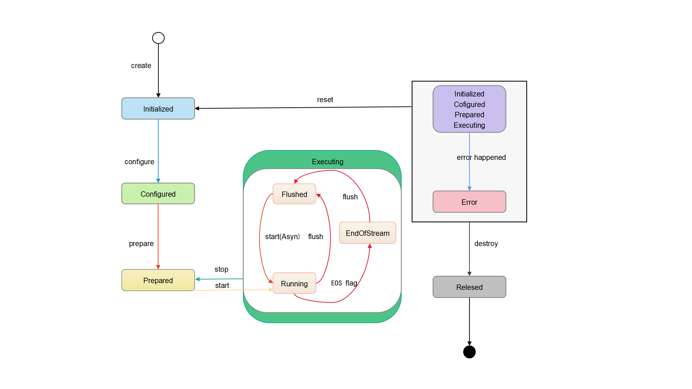
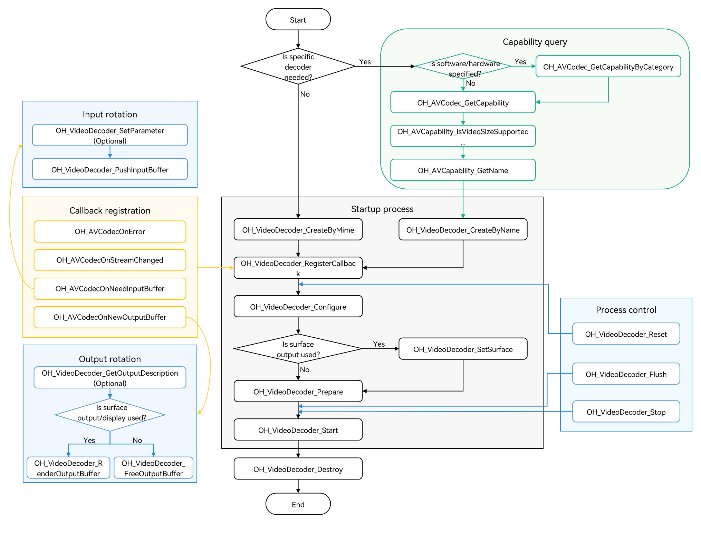
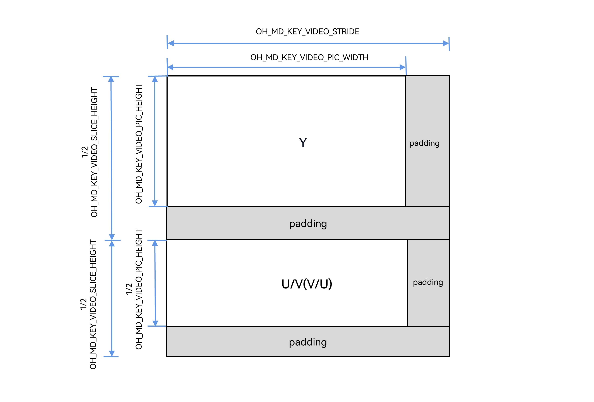

# Video Decoding

You can call the native APIs provided by the VideoDecoder module to decode video, that is, to decode media data into a YUV file or render it.

<!--RP3--><!--RP3End-->

For details about the supported decoding capabilities, see [AVCodec Supported Formats](avcodec-support-formats.md#video-decoding).

<!--RP1--><!--RP1End-->

Through the VideoDecoder module, your application can implement the following key capabilities.

|          Capability                      |             How to Configure                                                                    |
| --------------------------------------- | ---------------------------------------------------------------------------------- |
| Variable resolution        | The decoder supports the change of the input stream resolution. After the resolution is changed, the callback function **OnStreamChanged()** set by **OH_VideoDecoder_RegisterCallback** is triggered. For details, see step 3 in surface mode or step 3 in buffer mode. |
| Dynamic surface switching | Call **OH_VideoDecoder_SetSurface** to configure this capability. It is supported only in surface mode. For details, see step 6 in surface mode.   |
| Low-latency decoding | Call **OH_VideoDecoder_Configure** to configure this capability. For details, see step 5 in surface mode or step 5 in buffer mode.     |

## Constraints

- HDR Vivid decoding is not supported in buffer mode.
- After **flush()**, **reset()**, or **stop()** is called, the PPS/SPS must be transferred again in the **start()** call. For details about the example, see step 13 in [Surface Output](#surface-output).
- If **flush()**, **reset()**, **stop()**, or **destroy()** is executed in a non-callback thread, the execution result is returned after all callbacks are executed.
- Due to limited hardware decoder resources, you must call **OH_VideoDecoder_Destroy** to destroy every decoder instance when it is no longer needed.
- The input streams for video decoding support only the AnnexB format, and the supported AnnexB format supports multiple slices. However, the slices of the same frame must be sent to the decoder at a time.
- When **flush()**, **reset()**, or **stop()** is called, do not continue to operate the OH_AVBuffer obtained through the previous callback function.
- The DRM decryption capability supports both non-secure and secure video channels in [surface mode](#surface-output), but only non-secure video channels in buffer mode(#buffer-output).
- The buffer mode and surface mode use the same APIs. Therefore, the surface mode is described as an example.
- In buffer mode, after obtaining the pointer to an OH_AVBuffer instance through the callback function **OH_AVCodecOnNewOutputBuffer**, call **OH_VideoDecoder_FreeOutputBuffer** to notify the system that the buffer has been fully utilized. In this way, the system can write the subsequently decoded data to the corresponding location. If the OH_NativeBuffer instance is obtained through **OH_AVBuffer_GetNativeBuffer** and its lifecycle extends beyond that of the OH_AVBuffer pointer instance, you mut perform data duplication. In this case, you should manage the lifecycle of the newly generated OH_NativeBuffer object to ensure that the object can be correctly used and released.
<!--RP6--><!--RP6End-->

## Surface Output and Buffer Output

- Surface output and buffer output differ in data output modes.
- They are applicable to different scenarios.
  - Surface output indicates that the OHNativeWindow is used to transfer output data. It supports connection with other modules, such as the **XComponent**.
  - Buffer output indicates that decoded data is output in shared memory mode.

- The two also differ slightly in the API calling modes:
  - In surface mode, the caller can choose to call **OH_VideoDecoder_FreeOutputBuffer** to free the output buffer (without rendering the data). In buffer mode, the caller must call **OH_VideoDecoder_FreeOutputBuffer** to free the output buffer.
  - In surface mode, the caller must call **OH_VideoDecoder_SetSurface** to set an OHNativeWindow before the decoder is ready and call **OH_VideoDecoder_RenderOutputBuffer** to render the decoded data after the decoder is started.
  - In buffer mode, an application can obtain the shared memory address and data from the output buffer. In surface mode, an application can obtain the data from the output buffer.
- Data transfer performance in surface mode is better than that in buffer mode.

For details about the development procedure, see [Surface Output](#surface-output) and [Buffer Output](#buffer-output).

## State Machine Interaction

The following figure shows the interaction between states.



1. A decoder enters the Initialized state in either of the following ways:
   - When a decoder instance is initially created, the decoder enters the Initialized state.
   - When **OH_VideoDecoder_Reset** is called in any state, the decoder returns to the Initialized state.

2. When the decoder is in the Initialized state, you can call **OH_VideoDecoder_Configure** to configure the decoder. After the configuration, the decoder enters the Configured state.
3. When the decoder is in the Configured state, you can call **OH_VideoDecoder_Prepare** to switch it to the Prepared state.
4. When the decoder is in the Prepared state, you can call **OH_VideoDecoder_Start** to switch it to the Executing state.
   - When the decoder is in the Executing state, you can call **OH_VideoDecoder_Stop** to switch it back to the Prepared state.

5. In rare cases, the decoder may encounter an error and enter the Error state. If this is the case, an invalid value can be returned or an exception can be thrown through a queue operation.
   - When the decoder is in the Error state, you can either call **OH_VideoDecoder_Reset** to switch it to the Initialized state or call **OH_VideoDecoder_Destroy** to switch it to the Released state.

6. The Executing state has three substates: Flushed, Running, and End-of-Stream.
   - After **OH_VideoDecoder_Start** is called, the decoder enters the Running substate immediately.
   - When the decoder is in the Executing state, you can call **OH_VideoDecoder_Flush** to switch it to the Flushed substate.
   - After all data to be processed is transferred to the decoder, the [AVCODEC_BUFFER_FLAGS_EOS](../../reference/apis-avcodec-kit/_core.md#oh_avcodecbufferflags-1) flag is added to the last input buffer in the input buffers queue. Once this flag is detected, the decoder transits to the End-of-Stream substate. In this state, the decoder does not accept new inputs, but continues to generate outputs until it reaches the tail frame.

7. When the decoder is no longer needed, you must call **OH_VideoDecoder_Destroy** to destroy the decoder instance, which then transitions to the Released state.

## How to Develop

Read [VideoDecoder](../../reference/apis-avcodec-kit/_video_decoder.md) for the API reference.

The figure below shows the call relationship of video decoding.

- The dotted line indicates an optional operation.

- The solid line indicates a mandatory operation.



### Linking the Dynamic Link Libraries in the CMake Script

``` cmake
target_link_libraries(sample PUBLIC libnative_media_codecbase.so)
target_link_libraries(sample PUBLIC libnative_media_core.so)
target_link_libraries(sample PUBLIC libnative_media_vdec.so)
```

> **NOTE**
>
> The word **sample** in the preceding code snippet is only an example. Use the actual project directory name.
>

### Defining the Basic Structure

The sample code provided in this section adheres to the C++17 standard and is for reference only. You can define your own buffer objects by referring to it.

1. Add the header files.

    ```c++
    #include <condition_variable>
    #include <memory>
    #include <mutex>
    #include <queue>
    #include <shared_mutex>
    ```

2. Define the information about the decoder callback buffer.

    ```c++
    struct CodecBufferInfo {
        CodecBufferInfo(uint32_t index, OH_AVBuffer *buffer): index(index), buffer(buffer), isValid(true) {}
        // Callback buffer.
        OH_AVBuffer *buffer = nullptr;
        // Index of the callback buffer.
        uint32_t index = 0;
        // Check whether the current buffer information is valid.
        bool isValid = true;
    };
    ```

3. Define the input and output queue for decoding.

    ```c++
    class CodecBufferQueue {
    public:
        // Pass the callback buffer information to the queue.
        void Enqueue(const std::shared_ptr<CodecBufferInfo> bufferInfo)
        {
            std::unique_lock<std::mutex> lock(mutex_);
            bufferQueue_.push(bufferInfo);
            cond_.notify_all();
        }

        // Obtain the information about the callback buffer.
        std::shared_ptr<CodecBufferInfo> Dequeue(int32_t timeoutMs = 1000)
        {
            std::unique_lock<std::mutex> lock(mutex_);
            (void)cond_.wait_for(lock, std::chrono::milliseconds(timeoutMs), [this]() { return !bufferQueue_.empty(); });
            if (bufferQueue_.empty()) {
                return nullptr;
            }
            std::shared_ptr<CodecBufferInfo> bufferInfo = bufferQueue_.front();
            bufferQueue_.pop();
            return bufferInfo;
        }

        // Clear the queue. The previous callback buffer becomes unavailable.
        void Flush()
        {
            std::unique_lock<std::mutex> lock(mutex_);
            while (!bufferQueue_.empty()) {
                std::shared_ptr<CodecBufferInfo> bufferInfo = bufferQueue_.front();
                // After the flush, stop, reset, and destroy operations are performed, the previous callback buffer information is invalid.
                bufferInfo->isValid = false;
                bufferQueue_.pop();
            }
        }

    private:
        std::mutex mutex_;
        std::condition_variable cond_;
        std::queue<std::shared_ptr<CodecBufferInfo>> bufferQueue_;
    };
    ```

4. Configure global variables.

    These global variables are for reference only. They can be encapsulated into an object based on service requirements.

    ```c++
    // Video frame width.
    int32_t width = 320;
    // Video frame height.
    int32_t height = 240;
    // Video pixel format.
     OH_AVPixelFormat pixelFormat = AV_PIXEL_FORMAT_NV12;
    // Video width stride.
    int32_t widthStride = 0;
    // Video height stride.
    int32_t heightStride = 0;
    // Pointer to the decoder instance.
    OH_AVCodec *videoDec = nullptr;
    // Decoder synchronization lock.
    std::shared_mutex codecMutex;
    // Decoder input queue.
    CodecBufferQueue inQueue;
    // Decoder output queue.
    CodecBufferQueue outQueue;
    ```

### Surface Output

The following walks you through how to implement the entire video decoding process in surface mode. In this example, an H.264 stream file is input, decoded, and rendered.

Currently, the VideoDecoder module supports only data rotation in asynchronous mode.

1. Add the header files.

    ```c++
    #include <multimedia/player_framework/native_avcodec_videodecoder.h>
    #include <multimedia/player_framework/native_avcapability.h>
    #include <multimedia/player_framework/native_avcodec_base.h>
    #include <multimedia/player_framework/native_avformat.h>
    #include <multimedia/player_framework/native_avbuffer.h>
    #include <fstream>
    ```

2. Create a decoder instance.

    You can create a decoder by name or MIME type. In the code snippet below, the following variables are used:

    - **videoDec**: pointer to the video decoder instance.
    - **capability**: pointer to the decoder's capability.
    - **OH_AVCODEC_MIMETYPE_VIDEO_AVC**: AVC video codec.

    ```c++
    // To create a decoder by name, call OH_AVCapability_GetName to obtain the codec names available and then call OH_VideoDecoder_CreateByName. If your application has special requirements, for example, expecting a decoder that supports a certain resolution, you can call OH_AVCodec_GetCapability to query the capability first.
    OH_AVCapability *capability = OH_AVCodec_GetCapability(OH_AVCODEC_MIMETYPE_VIDEO_AVC, false);
    // Create hardware decoder instances.
    OH_AVCapability *capability= OH_AVCodec_GetCapabilityByCategory(OH_AVCODEC_MIMETYPE_VIDEO_AVC, false, HARDWARE);
    const char *name = OH_AVCapability_GetName(capability);
    OH_AVCodec *videoDec = OH_VideoDecoder_CreateByName(name);
    ```

    ```c++
    // Create a decoder by MIME type. Only specific codecs recommended by the system can be created in this way.
    // If multiple codecs need to be created, create hardware decoder instances first. If the hardware resources are insufficient, create software decoder instances.
    // Create an H.264 decoder for software/hardware decoding.
    OH_AVCodec *videoDec = OH_VideoDecoder_CreateByMime(OH_AVCODEC_MIMETYPE_VIDEO_AVC);
    // Create an H.265 decoder for software/hardware decoding.
    OH_AVCodec *videoDec = OH_VideoDecoder_CreateByMime(OH_AVCODEC_MIMETYPE_VIDEO_HEVC);
    ```

3. Call **OH_VideoDecoder_RegisterCallback()** to register the callback functions.

    Register the **OH_AVCodecCallback** struct that defines the following callback function pointers:

    - **OH_AVCodecOnError**, a callback used to report a codec operation error. For details about the error codes, see [OH_AVCodecOnError](../../reference/apis-avcodec-kit/_codec_base.md#oh_avcodeconerror).
    - **OH_AVCodecOnStreamChanged**, a callback used to report a codec stream change, for example, stream width or height change.
    - **OH_AVCodecOnNeedInputBuffer**, a callback used to report input data required, which means that the decoder is ready for receiving data.
    - **OH_AVCodecOnNewOutputBuffer**, a callback used to report output data generated, which means that decoding is complete. (Note: The **buffer** parameter in surface mode is null.)

    You need to process the callback functions to ensure that the decoder runs properly.

    <!--RP2--><!--RP2End-->

    ```c++
    // Implement the OH_AVCodecOnError callback function.
    static void OnError(OH_AVCodec *codec, int32_t errorCode, void *userData)
    {
        // Process the error code in the callback.
        (void)codec;
        (void)errorCode;
        (void)userData;
    }

    // Implement the OH_AVCodecOnStreamChanged callback function.
    static void OnStreamChanged(OH_AVCodec *codec, OH_AVFormat *format, void *userData)
    {
        // The changed video width and height can be obtained through format.
        (void)codec;
        (void)userData;
        OH_AVFormat_GetIntValue(format, OH_MD_KEY_VIDEO_PIC_WIDTH, &width);
        OH_AVFormat_GetIntValue(format, OH_MD_KEY_VIDEO_PIC_HEIGHT, &height);
    }

    // Implement the OH_AVCodecOnNeedInputBuffer callback function.
    static void OnNeedInputBuffer(OH_AVCodec *codec, uint32_t index, OH_AVBuffer *buffer, void *userData)
    {
        // The data buffer of the input frame and its index are sent to inQueue.
        (void)codec;
        (void)userData;
        inQueue.Enqueue(std::make_shared<CodecBufferInfo>(index, buffer));
    }

    // Implement the OH_AVCodecOnNewOutputBuffer callback function.
    static void OnNewOutputBuffer(OH_AVCodec *codec, uint32_t index, OH_AVBuffer *buffer, void *userData)
    {
        // The data buffer of the finished frame and its index are sent to outQueue.
        (void)codec;
        (void)userData;
        outQueue.Enqueue(std::make_shared<CodecBufferInfo>(index, buffer));
    }
    // Call OH_VideoDecoder_RegisterCallback() to register the callback functions.
    OH_AVCodecCallback cb = {&OnError, &OnStreamChanged, &OnNeedInputBuffer, &OnNewOutputBuffer};
    // Set the asynchronous callbacks.
    int32_t ret = OH_VideoDecoder_RegisterCallback(videoDec, cb, nullptr); // nullptr: userData is null.
    if (ret != AV_ERR_OK) {
        // Handle exceptions.
    }
    ```

    > **NOTE**
    >
    > In the callback functions, pay attention to multi-thread synchronization for operations on the data queue.
    >
    > During video playback, if the SPS of the video stream contains color information, the decoder will return the information (RangeFlag, ColorPrimary, MatrixCoefficient, and TransferCharacteristic) through the **OH_AVFormat** parameter in the **OH_AVCodecOnStreamChanged** callback.
    >
    > In surface mode of video decoding, the internal data is processed by using High Efficiency Bandwidth Compression (HEBC) by default, and the values of **widthStride** and **heightStride** cannot be obtained.

4. (Optional) Call **OH_VideoDecoder_SetDecryptionConfig** to set the decryption configuration. Call this API after the media key system information is obtained and a media key is obtained but before **Prepare()** is called. For details about how to obtain such information, see step 4 in [Media Data Demultiplexing](audio-video-demuxer.md).  In surface mode, the DRM decryption capability supports both secure and non-secure video channels. For details about DRM APIs, see [DRM](../../reference/apis-drm-kit/_drm.md).

    Add the header files.

    ```c++
    #include <multimedia/drm_framework/native_mediakeysystem.h>
    #include <multimedia/drm_framework/native_mediakeysession.h>
    #include <multimedia/drm_framework/native_drm_err.h>
    #include <multimedia/drm_framework/native_drm_common.h>
    ```

    Link the dynamic library in the CMake script.

    ``` cmake
    target_link_libraries(sample PUBLIC libnative_drm.so)
    ```

    <!--RP4-->The following is the sample code:<!--RP4End-->

    ```c++
    // Create a media key system based on the media key system information. The following uses com.clearplay.drm as an example.
    MediaKeySystem *system = nullptr;
    int32_t ret = OH_MediaKeySystem_Create("com.clearplay.drm", &system);
    if (system == nullptr) {
        printf("create media key system failed");
        return;
    }

    // Create a decryption session. If a secure video channel is used, create a MediaKeySession with the content protection level of CONTENT_PROTECTION_LEVEL_HW_CRYPTO or higher.
    // To use a non-secure video channel, create a MediaKeySession with the content protection level of CONTENT_PROTECTION_LEVEL_SW_CRYPTO or higher.
    MediaKeySession *session = nullptr;
    DRM_ContentProtectionLevel contentProtectionLevel = CONTENT_PROTECTION_LEVEL_SW_CRYPTO;
    ret = OH_MediaKeySystem_CreateMediaKeySession(system, &contentProtectionLevel, &session);
    if (ret != DRM_OK) {
        // If the creation fails, refer to the DRM interface document and check logs.
        printf("create media key session failed.");
        return;
    }
    if (session == nullptr) {
        printf("media key session is nullptr.");
        return;
    }

    // Generate a media key request and set the response to the media key request.

    // Set the decryption configuration, that is, set the decryption session and secure video channel flag to the decoder.
    // If the DRM scheme supports a secure video channel, set secureVideoPath to true and create a secure decoder before using the channel.
    // That is, in step 2, call OH_VideoDecoder_CreateByName, with a decoder name followed by .secure (for example, [CodecName].secure) passed in, to create a secure decoder.
    bool secureVideoPath = false;
    ret = OH_VideoDecoder_SetDecryptionConfig(videoDec, session, secureVideoPath);
    ```

5. Call **OH_VideoDecoder_Configure()** to configure the decoder.

    For details about the configurable options, see [Video Dedicated Key-Value Paris](../../reference/apis-avcodec-kit/_codec_base.md#media-data-key-value-pairs).

    For details about the parameter verification rules, see [OH_VideoDecoder_Configure()](../../reference/apis-avcodec-kit/_video_decoder.md#oh_videodecoder_configure).

    The parameter value ranges can be obtained through the capability query interface. For details, see [Obtaining Supported Codecs](obtain-supported-codecs.md).

    Currently, the following options must be configured for all supported formats: video frame width, video frame height, and video pixel format.

    ```c++

    OH_AVFormat *format = OH_AVFormat_Create();
    // Set the format.
    OH_AVFormat_SetIntValue (format, OH_MD_KEY_WIDTH, width); // Mandatory.
    OH_AVFormat_SetIntValue(format, OH_MD_KEY_HEIGHT, height); // Mandatory.
    OH_AVFormat_SetIntValue(format, OH_MD_KEY_PIXEL_FORMAT, pixelFormat);
    // (Optional) Configure low-latency decoding.
    // If supported by the platform, the video decoder outputs frames in the decoding sequence when OH_MD_KEY_VIDEO_ENABLE_LOW_LATENCY is enabled.
    OH_AVFormat_SetIntValue(format, OH_MD_KEY_VIDEO_ENABLE_LOW_LATENCY, 1);
    // Configure the decoder.
    int32_t ret = OH_VideoDecoder_Configure(videoDec, format);
    if (ret != AV_ERR_OK) {
        // Handle exceptions.
    }
    OH_AVFormat_Destroy(format);
    ```

6. Set the surface.

    You can obtain NativeWindow in either of the following ways:

    6.1 If the image is directly displayed after being decoded, obtain NativeWindow from the **XComponent**.

    Add the header files.

    ```c++
    #include <native_window/external_window.h>
    ```

    Link the dynamic library in the CMake script.

    ``` cmake
    target_link_libraries(sample PUBLIC libnative_window.so)
    ```

    6.1.1 On ArkTS, call **getXComponentSurfaceId** of the xComponentController to obtain the surface ID of the XComponent. For details about the operation, see [Custom Rendering (XComponent)](../../ui/napi-xcomponent-guidelines.md#arkts-xcomponent-scenario).

    6.1.2 On the native side, call **OH_NativeWindow_CreateNativeWindowFromSurfaceId** to create a **NativeWindow** instance.

    ```c++
    OHNativeWindow* nativeWindow;
    // Create a NativeWindow instance based on the surface ID obtained in step 1.1.
    OH_NativeWindow_CreateNativeWindowFromSurfaceId(surfaceId, nativeWindow);
    ```

    6.2 If OpenGL post-processing is performed after decoding, obtain NativeWindow from NativeImage. For details about the operation, see [NativeImage](../../graphics/native-image-guidelines.md).

    You perform this step during decoding, that is, dynamically switch the surface.

    ```c++
    // Set the surface.
    // Set the window parameters.
    int32_t ret = OH_VideoDecoder_SetSurface(videoDec, nativeWindow); // Obtain a NativeWindow instance using either of the preceding methods.
    if (ret != AV_ERR_OK) {
        // Handle exceptions.
    }
    // Configure the matching mode between the video and screen. (Scale the buffer at the original aspect ratio to enable the smaller side of the buffer to match the window, while making the excess part transparent.)
    OH_NativeWindow_NativeWindowSetScalingModeV2(nativeWindow, OH_SCALING_MODE_SCALE_CROP_V2);
    ```

    > **NOTE**
    >
    > If both decoder 1 and decoder 2 are bound to the same NativeWindow using the **OH_VideoDecoder_SetSurface** function, and decoder 2 is running, destroying decoder 1 with **OH_VideoDecoder_Destroy** will cause decoder 2's video playback to freeze.
    >
    > Consider the following approaches:
    > 1. Wait for decoder 1 to be fully released before starting decoder 2 with **OH_VideoDecoder_Start**.
    > 2. Use surface 1 for decoder 1, and create a temporary surface for decoder 2 using **OH_ConsumerSurface_Create**. Once decoder 1 is released, bind decoder 2 to surface 1 using **OH_VideoDecoder_SetSurface**. For details, see [Concurrently Creating a Video Decoder and Initializing NativeWindow](../../media/avcodec/parallel-decoding-nativeWindow.md).

7. Call **OH_VideoDecoder_Prepare()** to prepare internal resources for the decoder.

     

    ```c++
    int32_t ret = OH_VideoDecoder_Prepare(videoDec);
    if (ret != AV_ERR_OK) {
        // Handle exceptions.
    }
    ```

8. Call **OH_VideoDecoder_Start()** to start the decoder.

    ```c++
    // Start the decoder.
    int32_t ret = OH_VideoDecoder_Start(videoDec);
    if (ret != AV_ERR_OK) {
        // Handle exceptions.
    }
    ```

9. (Optional) Call **OH_VideoDecoder_SetParameter()** to set the surface parameters of the decoder.

    For details about the configurable options, see [Video Dedicated Key-Value Paris](../../reference/apis-avcodec-kit/_codec_base.md#media-data-key-value-pairs).

    ```c++
    OH_AVFormat *format = OH_AVFormat_Create();
    // Configure the display rotation angle.
    OH_AVFormat_SetIntValue(format, OH_MD_KEY_ROTATION, 90);
    int32_t ret = OH_VideoDecoder_SetParameter(videoDec, format);
    if (ret != AV_ERR_OK) {
        // Handle exceptions.
    }
    OH_AVFormat_Destroy(format);
    ```

10. (Optional) Call **OH_AVCencInfo_SetAVBuffer()** to set the Common Encryption Scheme (CENC) information.

    If the program to play is DRM encrypted and the application implements media demultiplexing instead of using the system's [demuxer](audio-video-demuxer.md), you must call **OH_AVCencInfo_SetAVBuffer()** to set the CENC information to the AVBuffer. In this way, the AVBuffer carries the data to be decrypted and CENC information, so that the media data in the AVBuffer can be decrypted. You do not need to call this API when the application uses the system's [demuxer](audio-video-demuxer.md).

    Add the header files.

    ```c++
    #include <multimedia/player_framework/native_cencinfo.h>
    ```

    Link the dynamic library in the CMake script.

    ``` cmake
    target_link_libraries(sample PUBLIC libnative_media_avcencinfo.so)
    ```

    In the code snippet below, the following variable is used:
    - **buffer**: parameter passed by the callback function **OnNeedInputBuffer**.
    ```c++
    uint32_t keyIdLen = DRM_KEY_ID_SIZE;
    uint8_t keyId[] = {
        0xd4, 0xb2, 0x01, 0xe4, 0x61, 0xc8, 0x98, 0x96,
        0xcf, 0x05, 0x22, 0x39, 0x8d, 0x09, 0xe6, 0x28};
    uint32_t ivLen = DRM_KEY_IV_SIZE;
    uint8_t iv[] = {
        0xbf, 0x77, 0xed, 0x51, 0x81, 0xde, 0x36, 0x3e,
        0x52, 0xf7, 0x20, 0x4f, 0x72, 0x14, 0xa3, 0x95};
    uint32_t encryptedBlockCount = 0;
    uint32_t skippedBlockCount = 0;
    uint32_t firstEncryptedOffset = 0;
    uint32_t subsampleCount = 1;
    DrmSubsample subsamples[1] = { {0x10, 0x16} };
    // Create a CencInfo instance.
    OH_AVCencInfo *cencInfo = OH_AVCencInfo_Create();
    if (cencInfo == nullptr) {
        // Handle exceptions.
    }
    // Set the decryption algorithm.
    OH_AVErrCode errNo = OH_AVCencInfo_SetAlgorithm(cencInfo, DRM_ALG_CENC_AES_CTR);
    if (errNo != AV_ERR_OK) {
        // Handle exceptions.
    }
    // Set KeyId and Iv.
    errNo = OH_AVCencInfo_SetKeyIdAndIv(cencInfo, keyId, keyIdLen, iv, ivLen);
    if (errNo != AV_ERR_OK) {
        // Handle exceptions.
    }
    // Set the sample information.
    errNo = OH_AVCencInfo_SetSubsampleInfo(cencInfo, encryptedBlockCount, skippedBlockCount, firstEncryptedOffset,
        subsampleCount, subsamples);
    if (errNo != AV_ERR_OK) {
        // Handle exceptions.
    }
    // Set the mode. KeyId, Iv, and SubSamples have been set.
    errNo = OH_AVCencInfo_SetMode(cencInfo, DRM_CENC_INFO_KEY_IV_SUBSAMPLES_SET);
    if (errNo != AV_ERR_OK) {
        // Handle exceptions.
    }
    // Set CencInfo to the AVBuffer.
    errNo = OH_AVCencInfo_SetAVBuffer(cencInfo, buffer);
    if (errNo != AV_ERR_OK) {
        // Handle exceptions.
    }
    // Destroy the CencInfo instance.
    errNo = OH_AVCencInfo_Destroy(cencInfo);
    if (errNo != AV_ERR_OK) {
        // Handle exceptions.
    }
    ```

11. Call **OH_VideoDecoder_PushInputBuffer()** to push the stream to the input buffer for decoding.

    In the code snippet below, the following variables are used:

    - **buffer**: parameter passed by the callback function **OnNeedInputBuffer**. You can obtain the virtual address of the input stream by calling [OH_AVBuffer_GetAddr](../../reference/apis-avcodec-kit/_core.md#oh_avbuffer_getaddr).
    - **index**: parameter passed by the callback function **OnNeedInputBuffer**, which uniquely corresponds to the buffer.
    - **size**, **offset**, **pts**, and **frameData**: size, offset, timestamp, and frame data. For details about how to obtain such information, see step 9 in [Media Data Demultiplexing](./audio-video-demuxer.md).
    - **flags**: type of the buffer flag. For details, see [OH_AVCodecBufferFlags](../../reference/apis-avcodec-kit/_core.md#oh_avcodecbufferflags).

    ```c++
    std::shared_ptr<CodecBufferInfo> bufferInfo = inQueue.Dequeue();
    std::shared_lock<std::shared_mutex> lock(codecMutex);
    if (bufferInfo == nullptr || !bufferInfo->isValid) {
        // Handle exceptions.
    }
    // Write stream data.
    uint8_t *addr = OH_AVBuffer_GetAddr(bufferInfo->buffer);
    int32_t capcacity = OH_AVBuffer_GetCapacity(bufferInfo->buffer);
    if (size > capcacity) {
        // Handle exceptions.
    }
    memcpy(addr, frameData, size);
    // Configure the size, offset, and timestamp of the frame data.
    OH_AVCodecBufferAttr info;
    info.size = size;
    info.offset = offset;
    info.pts = pts;
    info.flags = flags;
    // Write the information to the buffer.
    int32_t ret = OH_AVBuffer_SetBufferAttr(bufferInfo->buffer, &info);
    if (ret != AV_ERR_OK) {
        // Handle exceptions.
    }
    // Send the data to the input buffer for decoding. index is the index of the buffer.
    ret = OH_VideoDecoder_PushInputBuffer(videoDec, bufferInfo->index);
    if (ret != AV_ERR_OK) {
        // Handle exceptions.
    }
    ```

12. Call **OH_VideoDecoder_RenderOutputBuffer()** or **OH_VideoDecoder_RenderOutputBufferAtTime()** to render the data and free the output buffer, or call **OH_VideoDecoder_FreeOutputBuffer()** to directly free the output buffer.

    In the code snippet below, the following variables are used:

    - **index**: parameter passed by the callback function **OnNewOutputBuffer**, which uniquely corresponds to the buffer.
    - **buffer**: parameter passed by the callback function **OnNewOutputBuffer**. In surface mode, you cannot obtain the virtual address of the image by calling [OH_AVBuffer_GetAddr](../../reference/apis-avcodec-kit/_core.md#oh_avbuffer_getaddr).

    ```c++
    std::shared_ptr<CodecBufferInfo> bufferInfo = outQueue.Dequeue();
    std::shared_lock<std::shared_mutex> lock(codecMutex);
    if (bufferInfo == nullptr || !bufferInfo->isValid) {
        // Handle exceptions.
    }
    // Obtain the decoded information.
    OH_AVCodecBufferAttr info;
    int32_t ret = OH_AVBuffer_GetBufferAttr(bufferInfo->buffer, &info);
    if (ret != AV_ERR_OK) {
        // Handle exceptions.
    }
    // You can determine the value.
    bool isRender;
    bool isNeedRenderAtTime;
    if (isRender) {
        // Render the data and free the output buffer. index is the index of the buffer.
        if (isNeedRenderAtTime){
            // Obtain the system absolute time, and call renderTimestamp to display the time based on service requirements.
            int64_t renderTimestamp =
                std::chrono::duration_cast<std::chrono::nanoseconds>(std::chrono::high_resolution_clock::now().time_since_epoch()).count();
            ret = OH_VideoDecoder_RenderOutputBufferAtTime(videoDec, bufferInfo->index, renderTimestamp);
        } else {
           ret = OH_VideoDecoder_RenderOutputBuffer(videoDec, bufferInfo->index);
        }

    } else {
        // Free the output buffer.
        ret = OH_VideoDecoder_FreeOutputBuffer(videoDec, bufferInfo->index);
    }
    if (ret != AV_ERR_OK) {
        // Handle exceptions.
    }

    ```

    > **NOTE**
    >
    > To obtain the buffer attributes, such as **pixel_format** and **stride**, call [OH_NativeWindow_NativeWindowHandleOpt](../../reference/apis-arkgraphics2d/_native_window.md#oh_nativewindow_nativewindowhandleopt).

13. (Optional) Call **OH_VideoDecoder_Flush()** to refresh the decoder.

    After **OH_VideoDecoder_Flush** is called, the decoder remains in the Running state, but the input and output data and parameter set (such as the H.264 PPS/SPS) buffered in the decoder are cleared.

    To continue decoding, you must call **OH_VideoDecoder_Start** again.
    
    In the code snippet below, the following variables are used:

    - **xpsData** and **xpsSize**: PPS/SPS information. For details about how to obtain such information, see [Media Data Demultiplexing](./audio-video-demuxer.md).

    ```c++
    std::unique_lock<std::shared_mutex> lock(codecMutex);
    // Refresh the decoder.
    int32_t ret = OH_VideoDecoder_Flush(videoDec);
    if (ret != AV_ERR_OK) {
        // Handle exceptions.
    }
    inQueue.Flush();
    outQueue.Flush();
    // Start decoding again.
    ret = OH_VideoDecoder_Start(videoDec);
    if (ret != AV_ERR_OK) {
        // Handle exceptions.
    }

    std::shared_ptr<CodecBufferInfo> bufferInfo = outQueue.Dequeue();
    if (bufferInfo == nullptr || !bufferInfo->isValid) {
        // Handle exceptions.
    }
    // Retransfer PPS/SPS.
    // Configure the frame PPS/SPS information.
    uint8_t *addr = OH_AVBuffer_GetAddr(bufferInfo->buffer);
    int32_t capcacity = OH_AVBuffer_GetCapacity(bufferInfo->buffer);
    if (xpsSize > capcacity) {
        // Handle exceptions.
    }
    memcpy(addr, xpsData, xpsSize);
    OH_AVCodecBufferAttr info;
    info.flags = AVCODEC_BUFFER_FLAG_CODEC_DATA;
    // Write the information to the buffer.
    ret = OH_AVBuffer_SetBufferAttr(bufferInfo->buffer, &info);
    if (ret != AV_ERR_OK) {
        // Handle exceptions.
    }
    // Push the frame data to the decoder. index is the index of the corresponding queue.
    ret = OH_VideoDecoder_PushInputBuffer(videoDec, bufferInfo->index);
    if (ret != AV_ERR_OK) {
        // Handle exceptions.
    }

    ```

    > **NOTE**
    >
    > When **OH_VideoDecoder_Start** s called again after the flush operation, the PPS/SPS must be retransferred.

14. (Optional) Call **OH_VideoDecoder_Reset()** to reset the decoder.

    After **OH_VideoDecoder_Reset** is called, the decoder returns to the Initialized state. To continue decoding, you must call **OH_VideoDecoder_Configure**, **OH_VideoDecoder_SetSurface**, and **OH_VideoDecoder_Prepare** in sequence.

    ```c++
    std::unique_lock<std::shared_mutex> lock(codecMutex);
    // Reset the decoder.
    int32_t ret = OH_VideoDecoder_Reset(videoDec);
    if (ret != AV_ERR_OK) {
        // Handle exceptions.
    }
    inQueue.Flush();
    outQueue.Flush();
    // Reconfigure the decoder.
    ret = OH_VideoDecoder_Configure(videoDec, format);
    if (ret != AV_ERR_OK) {
        // Handle exceptions.
    }
    // Reconfigure the surface in surface mode. This is not required in buffer mode.
    ret = OH_VideoDecoder_SetSurface(videoDec, nativeWindow);
    if (ret != AV_ERR_OK) {
        // Handle exceptions.
    }
    // The decoder is ready again.
    ret = OH_VideoDecoder_Prepare(videoDec);
    if (ret != AV_ERR_OK) {
        // Handle exceptions.
    }
    ```

15. (Optional) Call **OH_VideoDecoder_Stop()** to stop the decoder.

    After **OH_VideoDecoder_Stop()** is called, the decoder retains the decoding instance and releases the input and output buffers. You can directly call **OH_VideoDecoder_Start** to continue decoding. The first input buffer must carry the parameter set, starting from the IDR frame.

    ```c++
    std::unique_lock<std::shared_mutex> lock(codecMutex);
    // Stop the decoder.
    int32_t ret = OH_VideoDecoder_Stop(videoDec);
    if (ret != AV_ERR_OK) {
        // Handle exceptions.
    }
    inQueue.Flush();
    outQueue.Flush();
    ```

16. Call **OH_VideoDecoder_Destroy()** to destroy the decoder instance and release resources.

    > **NOTE**
    >
    > This API cannot be called in the callback function.
    > 
    > After the call, you must set a null pointer to the decoder to prevent program errors caused by wild pointers.

    ```c++
    std::unique_lock<std::shared_mutex> lock(codecMutex);
    // Release the nativeWindow instance.
    if(nativeWindow != nullptr){
        OH_NativeWindow_DestroyNativeWindow(nativeWindow);
        nativeWindow = nullptr;
    }
    // Call OH_VideoDecoder_Destroy to destroy the decoder.
    int32_t ret = AV_ERR_OK;
    if (videoDec != nullptr) {
        ret = OH_VideoDecoder_Destroy(videoDec);
        videoDec = nullptr;
    }
    if (ret != AV_ERR_OK) {
        // Handle exceptions.
    }
    inQueue.Flush();
    outQueue.Flush();
    ```

### Buffer Output

The following walks you through how to implement the entire video decoding process in buffer mode. In this example, an H.264 file is input and decoded into a YUV file.
Currently, the VideoDecoder module supports only data rotation in asynchronous mode.

1. Add the header files.

    ```c++
    #include <multimedia/player_framework/native_avcodec_videodecoder.h>
    #include <multimedia/player_framework/native_avcapability.h>
    #include <multimedia/player_framework/native_avcodec_base.h>
    #include <multimedia/player_framework/native_avformat.h>
    #include <multimedia/player_framework/native_avbuffer.h>
    #include <native_buffer/native_buffer.h>
    #include <fstream>
    ```

2. Create a decoder instance.

    The procedure is the same as that in surface mode and is not described here.

    ```c++
    // To create a decoder by name, call OH_AVCapability_GetName to obtain the codec names available and then call OH_VideoDecoder_CreateByName. If your application has special requirements, for example, expecting a decoder that supports a certain resolution, you can call OH_AVCodec_GetCapability to query the capability first.
    OH_AVCapability *capability = OH_AVCodec_GetCapability(OH_AVCODEC_MIMETYPE_VIDEO_AVC, false);
    const char *name = OH_AVCapability_GetName(capability);
    OH_AVCodec *videoDec = OH_VideoDecoder_CreateByName(name);
    ```

    ```c++
    // Create a decoder by MIME type. Only specific codecs recommended by the system can be created in this way.
    // If multiple codecs need to be created, create hardware decoder instances first. If the hardware resources are insufficient, create software decoder instances.
    // Create an H.264 decoder for software/hardware decoding.
    OH_AVCodec *videoDec = OH_VideoDecoder_CreateByMime(OH_AVCODEC_MIMETYPE_VIDEO_AVC);
    // Create an H.265 decoder for hardware decoding.
    OH_AVCodec *videoDec = OH_VideoDecoder_CreateByMime(OH_AVCODEC_MIMETYPE_VIDEO_HEVC);
    ```

3. Call **OH_VideoDecoder_RegisterCallback()** to register the callback functions.

    Register the **OH_AVCodecCallback** struct that defines the following callback function pointers:

    - **OH_AVCodecOnError**, a callback used to report a codec operation error. For details about the error codes, see [OH_AVCodecOnError](../../reference/apis-avcodec-kit/_codec_base.md#oh_avcodeconerror).
    - **OH_AVCodecOnStreamChanged**, a callback used to report a codec stream change, for example, stream width or height change.
    - **OH_AVCodecOnNeedInputBuffer**, a callback used to report input data required, which means that the decoder is ready for receiving data.
    - **OH_AVCodecOnNewOutputBuffer**, a callback used to report output data generated, which means that decoding is complete.

    You need to process the callback functions to ensure that the decoder runs properly.

    <!--RP2--><!--RP2End-->

    ```c++
    int32_t cropTop = 0;
    int32_t cropBottom = 0;
    int32_t cropLeft = 0;
    int32_t cropRight = 0;
    bool isFirstFrame = true;
    // Implement the OH_AVCodecOnError callback function.
    static void OnError(OH_AVCodec *codec, int32_t errorCode, void *userData)
    {
        // Process the error code in the callback.
        (void)codec;
        (void)errorCode;
        (void)userData;
    }
    
    // Implement the OH_AVCodecOnStreamChanged callback function.
    static void OnStreamChanged(OH_AVCodec *codec, OH_AVFormat *format, void *userData)
    {
        // Optional. Configure the data when you want to obtain the video width, height, and stride.
        // The changed video width, height, and stride can be obtained through format.
        (void)codec;
        (void)userData;
        OH_AVFormat_GetIntValue(format, OH_MD_KEY_VIDEO_PIC_WIDTH, &width);
        OH_AVFormat_GetIntValue(format, OH_MD_KEY_VIDEO_PIC_HEIGHT, &height);
        OH_AVFormat_GetIntValue(format, OH_MD_KEY_VIDEO_STRIDE, &widthStride);
        OH_AVFormat_GetIntValue(format, OH_MD_KEY_VIDEO_SLICE_HEIGHT, &heightStride);
        // (Optional) Obtain the cropped rectangle information.
        OH_AVFormat_GetIntValue(format, OH_MD_KEY_VIDEO_CROP_TOP, &cropTop);
        OH_AVFormat_GetIntValue(format, OH_MD_KEY_VIDEO_CROP_BOTTOM, &cropBottom);
        OH_AVFormat_GetIntValue(format, OH_MD_KEY_VIDEO_CROP_LEFT, &cropLeft);
        OH_AVFormat_GetIntValue(format, OH_MD_KEY_VIDEO_CROP_RIGHT, &cropRight);
    }
    
    // Implement the OH_AVCodecOnNeedInputBuffer callback function.
    static void OnNeedInputBuffer(OH_AVCodec *codec, uint32_t index, OH_AVBuffer *buffer, void *userData)
    {
        // The data buffer of the input frame and its index are sent to inQueue.
        (void)codec;
        (void)userData;
        inQueue.Enqueue(std::make_shared<CodecBufferInfo>(index, buffer));
    }
    
    // Implement the OH_AVCodecOnNewOutputBuffer callback function.
    static void OnNewOutputBuffer(OH_AVCodec *codec, uint32_t index, OH_AVBuffer *buffer, void *userData)
    {
        // Optional. Configure the data when you want to obtain the video width, height, and stride.
        // Obtain the video width, height, and stride.
        if (isFirstFrame) {
            OH_AVFormat *format = OH_VideoDecoder_GetOutputDescription(codec);
            OH_AVFormat_GetIntValue(format, OH_MD_KEY_VIDEO_PIC_WIDTH, &width);
            OH_AVFormat_GetIntValue(format, OH_MD_KEY_VIDEO_PIC_HEIGHT, &height);
            OH_AVFormat_GetIntValue(format, OH_MD_KEY_VIDEO_STRIDE, &widthStride);
            OH_AVFormat_GetIntValue(format, OH_MD_KEY_VIDEO_SLICE_HEIGHT, &heightStride);
            // (Optional) Obtain the cropped rectangle information.
            OH_AVFormat_GetIntValue(format, OH_MD_KEY_VIDEO_CROP_TOP, &cropTop);
            OH_AVFormat_GetIntValue(format, OH_MD_KEY_VIDEO_CROP_BOTTOM, &cropBottom);
            OH_AVFormat_GetIntValue(format, OH_MD_KEY_VIDEO_CROP_LEFT, &cropLeft);
            OH_AVFormat_GetIntValue(format, OH_MD_KEY_VIDEO_CROP_RIGHT, &cropRight);
            OH_AVFormat_Destroy(format);
            isFirstFrame = false;
        }
        // The data buffer of the finished frame and its index are sent to outQueue.
        (void)userData;
        outQueue.Enqueue(std::make_shared<CodecBufferInfo>(index, buffer));
    }
    // Call OH_VideoDecoder_RegisterCallback() to register the callback functions.
    OH_AVCodecCallback cb = {&OnError, &OnStreamChanged, &OnNeedInputBuffer, &OnNewOutputBuffer};
    // Set the asynchronous callbacks.
    int32_t ret = OH_VideoDecoder_RegisterCallback(videoDec, cb, nullptr); // nullptr: userData is null.
    if (ret != AV_ERR_OK) {
        // Handle exceptions.
    }
    ```

    > **NOTE**
    >
    > In the callback functions, pay attention to multi-thread synchronization for operations on the data queue.
    >

4. (Optional) Call **OH_VideoDecoder_SetDecryptionConfig** to set the decryption configuration. Call this API after the media key system information is obtained and a media key is obtained but before **Prepare()** is called. For details about how to obtain such information, see step 4 in [Media Data Demultiplexing](audio-video-demuxer.md).  In buffer mode, the DRM decryption capability supports only non-secure video channels. For details about DRM APIs, see [DRM](../../reference/apis-drm-kit/_drm.md).

    Add the header files.

    ```c++
    #include <multimedia/drm_framework/native_mediakeysystem.h>
    #include <multimedia/drm_framework/native_mediakeysession.h>
    #include <multimedia/drm_framework/native_drm_err.h>
    #include <multimedia/drm_framework/native_drm_common.h>
    ```

    Link the dynamic library in the CMake script.

    ``` cmake
    target_link_libraries(sample PUBLIC libnative_drm.so)
    ```

    The following is the sample code:

    ```c++
    // Create a media key system based on the media key system information. The following uses com.clearplay.drm as an example.
    MediaKeySystem *system = nullptr;
    int32_t ret = OH_MediaKeySystem_Create("com.clearplay.drm", &system);
    if (system == nullptr) {
        printf("create media key system failed");
        return;
    }

    // Create a media key session.
    // To use a non-secure video channel, create a MediaKeySession with the content protection level of CONTENT_PROTECTION_LEVEL_SW_CRYPTO or higher.
    MediaKeySession *session = nullptr;
    DRM_ContentProtectionLevel contentProtectionLevel = CONTENT_PROTECTION_LEVEL_SW_CRYPTO;
    ret = OH_MediaKeySystem_CreateMediaKeySession(system, &contentProtectionLevel, &session);
    if (ret != DRM_OK) {
        // If the creation fails, refer to the DRM interface document and check logs.
        printf("create media key session failed.");
        return;
    }
    if (session == nullptr) {
        printf("media key session is nullptr.");
        return;
    }
    // Generate a media key request and set the response to the media key request.
    // Set the decryption configuration, that is, set the decryption session and secure video channel flag to the decoder.
    bool secureVideoPath = false;
    ret = OH_VideoDecoder_SetDecryptionConfig(videoDec, session, secureVideoPath);
    ```

5. Call **OH_VideoDecoder_Configure()** to configure the decoder.

    The procedure is the same as that in surface mode and is not described here.

    ```c++
    OH_AVFormat *format = OH_AVFormat_Create();
    // Set the format.
    OH_AVFormat_SetIntValue (format, OH_MD_KEY_WIDTH, width); // Mandatory.
    OH_AVFormat_SetIntValue(format, OH_MD_KEY_HEIGHT, height); // Mandatory.
    OH_AVFormat_SetIntValue(format, OH_MD_KEY_PIXEL_FORMAT, pixelFormat);
    // Configure the decoder.
    int32_t ret = OH_VideoDecoder_Configure(videoDec, format);
    if (ret != AV_ERR_OK) {
        // Handle exceptions.
    }
    OH_AVFormat_Destroy(format);
    ```

6. Call **OH_VideoDecoder_Prepare()** to prepare internal resources for the decoder.

    ```c++
    int32_t ret = OH_VideoDecoder_Prepare(videoDec);
    if (ret != AV_ERR_OK) {
        // Handle exceptions.
    }
    ```

7. Call **OH_VideoDecoder_Start()** to start the decoder.

    ```c++
    std::unique_ptr<std::ofstream> outputFile = std::make_unique<std::ofstream>();
    outputFile->open("/*yourpath*.yuv", std::ios::out | std::ios::binary | std::ios::ate);
    // Start the decoder.
    int32_t ret = OH_VideoDecoder_Start(videoDec);
    if (ret != AV_ERR_OK) {
        // Handle exceptions.
    }
    ```

8. (Optional) Call **OH_VideoDecoder_SetParameter()** to set the decoder parameters.
    For details about the configurable options, see [Video Dedicated Key-Value Paris](../../reference/apis-avcodec-kit/_codec_base.md#media-data-key-value-pairs).

    ```c++
    OH_AVFormat *format = OH_AVFormat_Create();
    // Set the frame rate.
    OH_AVFormat_SetDoubleValue(format, OH_MD_KEY_FRAME_RATE, 30.0);
    int32_t ret = OH_VideoDecoder_SetParameter(videoDec, format);
    if (ret != AV_ERR_OK) {
        // Handle exceptions.
    }
    OH_AVFormat_Destroy(format);
    ```

9. (Optional) Call **OH_AVCencInfo_SetAVBuffer()** to set the CENC information.

    The procedure is the same as that in surface mode and is not described here.

    The following is the sample code:

    ```c++
    uint32_t keyIdLen = DRM_KEY_ID_SIZE;
    uint8_t keyId[] = {
        0xd4, 0xb2, 0x01, 0xe4, 0x61, 0xc8, 0x98, 0x96,
        0xcf, 0x05, 0x22, 0x39, 0x8d, 0x09, 0xe6, 0x28};
    uint32_t ivLen = DRM_KEY_IV_SIZE;
    uint8_t iv[] = {
        0xbf, 0x77, 0xed, 0x51, 0x81, 0xde, 0x36, 0x3e,
        0x52, 0xf7, 0x20, 0x4f, 0x72, 0x14, 0xa3, 0x95};
    uint32_t encryptedBlockCount = 0;
    uint32_t skippedBlockCount = 0;
    uint32_t firstEncryptedOffset = 0;
    uint32_t subsampleCount = 1;
    DrmSubsample subsamples[1] = { {0x10, 0x16} };
    // Create a CencInfo instance.
    OH_AVCencInfo *cencInfo = OH_AVCencInfo_Create();
    if (cencInfo == nullptr) {
        // Handle exceptions.
    }
    // Set the decryption algorithm.
    OH_AVErrCode errNo = OH_AVCencInfo_SetAlgorithm(cencInfo, DRM_ALG_CENC_AES_CTR);
    if (errNo != AV_ERR_OK) {
        // Handle exceptions.
    }
    // Set KeyId and Iv.
    errNo = OH_AVCencInfo_SetKeyIdAndIv(cencInfo, keyId, keyIdLen, iv, ivLen);
    if (errNo != AV_ERR_OK) {
        // Handle exceptions.
    }
    // Set the sample information.
    errNo = OH_AVCencInfo_SetSubsampleInfo(cencInfo, encryptedBlockCount, skippedBlockCount, firstEncryptedOffset,
        subsampleCount, subsamples);
    if (errNo != AV_ERR_OK) {
        // Handle exceptions.
    }
    // Set the mode. KeyId, Iv, and SubSamples have been set.
    errNo = OH_AVCencInfo_SetMode(cencInfo, DRM_CENC_INFO_KEY_IV_SUBSAMPLES_SET);
    if (errNo != AV_ERR_OK) {
        // Handle exceptions.
    }
    // Set CencInfo to the AVBuffer.
    errNo = OH_AVCencInfo_SetAVBuffer(cencInfo, buffer);
    if (errNo != AV_ERR_OK) {
        // Handle exceptions.
    }
    // Destroy the CencInfo instance.
    errNo = OH_AVCencInfo_Destroy(cencInfo);
    if (errNo != AV_ERR_OK) {
        // Handle exceptions.
    }
    ```

10. Call **OH_VideoDecoder_PushInputBuffer()** to push the stream to the input buffer for decoding.

    The procedure is the same as that in surface mode and is not described here.

    ```c++
    std::shared_ptr<CodecBufferInfo> bufferInfo = inQueue.Dequeue();
    std::shared_lock<std::shared_mutex> lock(codecMutex);
    if (bufferInfo == nullptr || !bufferInfo->isValid) {
        // Handle exceptions.
    }
    // Write stream data.
    uint8_t *addr = OH_AVBuffer_GetAddr(bufferInfo->buffer);
    int32_t capcacity = OH_AVBuffer_GetCapacity(bufferInfo->buffer);
    if (size > capcacity) {
        // Handle exceptions.
    }
    memcpy(addr, frameData, size);
    // Configure the size, offset, and timestamp of the frame data.
    OH_AVCodecBufferAttr info;
    info.size = size;
    info.offset = offset;
    info.pts = pts;
    info.flags = flags;
    // Write the information to the buffer.
    ret = OH_AVBuffer_SetBufferAttr(bufferInfo->buffer, &info);
    if (ret != AV_ERR_OK) {
        // Handle exceptions.
    }
    // Send the data to the input buffer for decoding. index is the index of the buffer.
    int32_t ret = OH_VideoDecoder_PushInputBuffer(videoDec, bufferInfo->index);
    if (ret != AV_ERR_OK) {
        // Handle exceptions.
    }
    ```

11. Call **OH_VideoDecoder_FreeOutputBuffer()** to release decoded frames.

    In the code snippet below, the following variables are used:

    - **index**: parameter passed by the callback function **OnNewOutputBuffer**, which uniquely corresponds to the buffer.
    - **buffer**: parameter passed by the callback function **OnNewOutputBuffer**. You can obtain the virtual address of an image by calling [OH_AVBuffer_GetAddr](../../reference/apis-avcodec-kit/_core.md#oh_avbuffer_getaddr).

    ```c++
    std::shared_ptr<CodecBufferInfo> bufferInfo = outQueue.Dequeue();
    std::shared_lock<std::shared_mutex> lock(codecMutex);
    if (bufferInfo == nullptr || !bufferInfo->isValid) {
        // Handle exceptions.
    }
    // Obtain the decoded information.
    OH_AVCodecBufferAttr info;
    int32_t ret = OH_AVBuffer_GetBufferAttr(bufferInfo->buffer, &info);
    if (ret != AV_ERR_OK) {
        // Handle exceptions.
    }
    // Write the decoded data (specified by data) to the output file.
    outputFile->write(reinterpret_cast<char *>(OH_AVBuffer_GetAddr(bufferInfo->buffer)), info.size);
    // Free the buffer that stores the output data. index is the index of the buffer.
    ret = OH_VideoDecoder_FreeOutputBuffer(videoDec, bufferInfo->index);
    if (ret != AV_ERR_OK) {
        // Handle exceptions.
    }
    ```

    To copy the Y, U, and V components of an NV12 or NV21 image to another buffer in sequence, perform the following steps (taking an NV12 image as an example),

    presenting the image layout of **width**, **height**, **wStride**, and **hStride**.

    - **OH_MD_KEY_VIDEO_PIC_WIDTH** corresponds to **width**.
    - **OH_MD_KEY_VIDEO_PIC_HEIGHT** corresponds to **height**.
    - **OH_MD_KEY_VIDEO_STRIDE** corresponds to **wStride**.
    - **OH_MD_KEY_VIDEO_SLICE_HEIGHT** corresponds to **hStride**.

    

    Add the header files.

    ```c++
    #include <string.h>
    ```

    The following is the sample code:

    ```c++
    // Obtain the width and height of the source buffer by using the callback function OnStreamChanged or OH_VideoDecoder_GetOutputDescription.
    struct Rect
    {
        int32_t width;
        int32_t height;
    };

    struct DstRect // Width, height, and stride of the destination buffer. They are set by the caller.
    {
        int32_t wStride;
        int32_t hStride;
    };
    // Obtain the width, height, and stride of the source buffer by using the callback function OnStreamChanged or OH_VideoDecoder_GetOutputDescription.
    struct SrcRect
    {
        int32_t wStride;
        int32_t hStride;
    };

    Rect rect = {320, 240};
    DstRect dstRect = {320, 240};
    SrcRect srcRect = {320, 256};
    uint8_t* dst = new uint8_t[dstRect.hStride * dstRect.wStride * 3 / 2]; // Pointer to the target memory area.
    uint8_t* src = new uint8_t[srcRect.hStride * srcRect.wStride * 3 / 2]; // Pointer to the source memory area.
    uint8_t* dstTemp = dst;
    uint8_t* srcTemp = src;

    // Y: Copy the source data in the Y region to the target data in another region.
    for (int32_t i = 0; i < rect.height; ++i) {
        // Copy a row of data from the source to a row of the target.
        memcpy(dstTemp, srcTemp, rect.width);
        // Update the pointers to the source data and target data to copy the next row. The pointers to the source data and target data are moved downwards by one wStride each time the source data and target data are updated.
        dstTemp += dstRect.wStride;
        srcTemp += srcRect.wStride;
    }
    // Padding.
    // Update the pointers to the source data and target data. The pointers move downwards by one padding.
    dstTemp += (dstRect.hStride - rect.height) * dstRect.wStride;
    srcTemp += (srcRect.hStride - rect.height) * srcRect.wStride;
    rect.height >>= 1;
    // UV: Copy the source data in the UV region to the target data in another region.
    for (int32_t i = 0; i < rect.height; ++i) {
        memcpy(dstTemp, srcTemp, rect.width);
        dstTemp += dstRect.wStride;
        srcTemp += srcRect.wStride;
    }

    delete[] dst;
    dst = nullptr;
    delete[] src;
    src = nullptr;
    ```

    When processing buffer data (before releasing data) during hardware decoding, the output callback AVBuffer receives the image data after width and height alignment. Generally, copy the image width, height, stride, and pixel format to ensure correct processing of the decoded data. For details, see step 3 in [Buffer Output](#buffer-output).

The subsequent processes (including refreshing, resetting, stopping, and destroying the decoder) are basically the same as those in surface mode. For details, see steps 13-16 in [Surface Output](#surface-output).

<!--RP5-->
<!--RP5End-->
