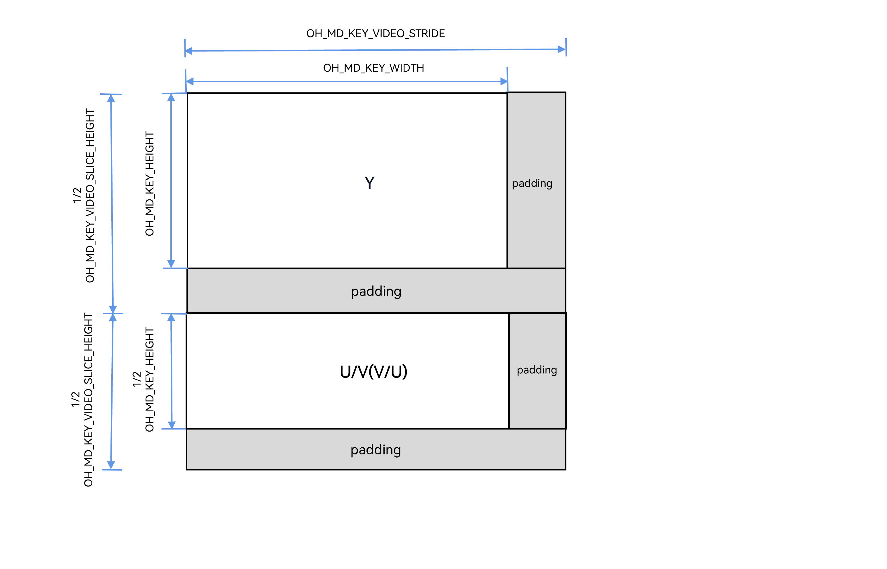
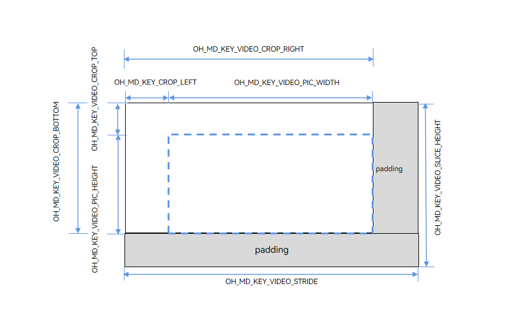

# Video Codec Width, Height, Stride, and Crop Information

<!--Kit: AVCodec Kit-->
<!--Subsystem: Multimedia-->
<!--Owner: @zhanghongran-->
<!--Designer: @dpy2650--->
<!--Tester: @cyakee-->
<!--Adviser: @w_Machine_cc-->
<!-- md-trans-meta sourceCommit=decdba1ffe3d86631313429b08804662a902a71a translatedAt=2026-08-06T13:48:25.664Z pushedAt=2026-08-07T08:27:49.517Z -->

## Overview

In video codec development, there are multiple representations of image **width** and **height**. Additionally, hardware processing typically requires memory alignment (stride), and decoder output may involve a **crop region**. This document systematically describes the size-related parameters in the video codec APIs and their relationships, helping you understand and use these parameters correctly.

## Parameter Overview

**Table 1** Overview of size parameters

| Parameter | Key Name | Type | Meaning | Encoder Use Scenario | Decoder Use Scenario | Calling API |
|------|------|------|------|--------|--------|----------|
| width/height | `OH_MD_KEY_WIDTH`/`OH_MD_KEY_HEIGHT` | int32_t | Configured video width/height. | Configure the target encoding resolution. | Configure the pre-allocated buffer. | Configure |
| stride | `OH_MD_KEY_VIDEO_STRIDE` | int32_t | Width stride (bytes per row after row alignment). | Obtain the buffer memory-aligned width. | Obtain the buffer memory-aligned width. |GetInputDescription/GetOutputDescription/OnStreamChanged |
| sliceHeight | `OH_MD_KEY_VIDEO_SLICE_HEIGHT` | int32_t | Height stride (total rows after column alignment). | Obtain the buffer memory-aligned height. | Obtain the buffer memory-aligned height. |GetInputDescription/GetOutputDescription/OnStreamChanged |
| picWidth/picHeight | `OH_MD_KEY_VIDEO_PIC_WIDTH`/`OH_MD_KEY_VIDEO_PIC_HEIGHT` | int32_t | Actual valid width/height of the image. | — | Obtain the valid width/height of the decoder output.|GetOutputDescription/OnStreamChanged |
| cropTop | `OH_MD_KEY_VIDEO_CROP_TOP` | int32_t | Top row coordinate (y) of the crop rectangle, inclusive of the top row of the crop frame. Row index starts from 0. | — | Obtain the top boundary of the decoded crop.|GetOutputDescription/OnStreamChanged |
| cropBottom | `OH_MD_KEY_VIDEO_CROP_BOTTOM` | int32_t | Bottom row coordinate (y) of the crop rectangle, inclusive of the bottom row of the crop frame. Row index starts from 0. | — | Obtain the bottom boundary of the decoded crop. |GetOutputDescription/OnStreamChanged |
| cropLeft | `OH_MD_KEY_VIDEO_CROP_LEFT` | int32_t | Left column coordinate (x) of the crop rectangle, inclusive of the leftmost column of the crop frame. Column index starts from 0. | — | Obtain the left boundary of the decoded crop. |GetOutputDescription/OnStreamChanged |
| cropRight | `OH_MD_KEY_VIDEO_CROP_RIGHT` | int32_t | Right column coordinate (x) of the crop rectangle, inclusive of the rightmost column of the crop frame. Column index starts from 0. | — | Obtain the right boundary of the decoded crop. |GetOutputDescription/OnStreamChanged |

> **NOTE**
>
> For the definitions of the keys in the table, see [native_avcodec_base.h](../../reference/apis-avcodec-kit/capi-native-avcodec-base-h.md).

## Core Concepts in Detail

### Differences Between width/height and picWidth/picHeight

**width/height (Configured Size)**

The encoder's `OH_MD_KEY_WIDTH` and `OH_MD_KEY_HEIGHT` are the target encoding resolution configured through the `Configure` interface. This is the **expected size** of the encoder input data and also the **encoding resolution** in the bitstream.

```c++
// Encoder configuration example.
OH_AVFormat *format = OH_AVFormat_Create();
OH_AVFormat_SetIntValue(format, OH_MD_KEY_WIDTH, 1920);  // Target encoding width.
OH_AVFormat_SetIntValue(format, OH_MD_KEY_HEIGHT, 1080);  // Set the target encoding height.
OH_AVFormat_SetIntValue(format, OH_MD_KEY_PIXEL_FORMAT, AV_PIXEL_FORMAT_NV12);
// Destroy the format after use.
OH_AVFormat_Destroy(format);
```

The decoder's `OH_MD_KEY_WIDTH` and `OH_MD_KEY_HEIGHT` are decoding resolution hints configured by you through the `Configure` API. Based on these parameters, the decoder **pre-allocates internal buffers** to ensure they can accommodate the encoded frame size in the bitstream.

> **NOTE**
>
> - The decoder's width/height are **expected values** at the configuration stage. The actual valid image size of the decoded output is determined by `OH_MD_KEY_VIDEO_PIC_WIDTH`/`OH_MD_KEY_VIDEO_PIC_HEIGHT` (see below).
> - It is generally recommended to set width/height to match or slightly exceed the actual bitstream resolution.
> - The decoder supports dynamic changes in bitstream resolution (such as adaptive bitrate scenarios), in which case the decoder outputs the corresponding picWidth/picHeight based on the actual frame size.

```c++
// Decoder configuration example.
OH_AVFormat *format = OH_AVFormat_Create();
OH_AVFormat_SetIntValue(format, OH_MD_KEY_WIDTH, 1920);   // Decoding width (mandatory).
OH_AVFormat_SetIntValue(format, OH_MD_KEY_HEIGHT, 1080);  // Decoding height (mandatory).
OH_AVFormat_SetIntValue(format, OH_MD_KEY_PIXEL_FORMAT, AV_PIXEL_FORMAT_NV12);
// Destroy the format after use.
OH_AVFormat_Destroy(format);
```

**picWidth/picHeight (Valid Image Size)**

The decoder's `OH_MD_KEY_VIDEO_PIC_WIDTH` and `OH_MD_KEY_VIDEO_PIC_HEIGHT` represent the width and height of the **actual valid pixel region** in the decoder output.

Since video bitstream standards (such as H.264/H.265) support the crop mechanism, the size of the encoded frame in the bitstream is not equivalent to the **actual valid pixel region**.

```txt
picWidth  = cropRight - cropLeft + 1     (Width: difference between the left and right column coordinates + 1)
picHeight = cropBottom - cropTop + 1     (Height: difference between the top and bottom row coordinates + 1)
```

### stride/sliceHeight (Memory Stride)

**Definition of Stride**

Video codec hardware typically requires **memory to be aligned to specific bytes or pixels** to improve access efficiency. When the configured image width/height does not meet the alignment requirements, the hardware allocates a larger buffer, and the excess portion is called **padding**.

Stride consists of two dimensions:

- **Width stride (stride)**: The actual number of bytes per row in memory, typically ≥ the valid width of the image.

- **sliceHeight**: The total number of rows allocated in memory, typically ≥ the valid image height.

The relationship between the two and the valid dimensions is as follows:

```txt
stride      = width + padding_width          (Horizontal direction)
sliceHeight = height + padding_height        (Vertical direction)
```

**Encoder-Side Memory Layout**

Taking the NV12 format as an example, the memory layout of the encoder input buffer is shown in Figure 1.

**Figure 1** Memory layout of an NV12 format image


Meanings of the parameters in Figure 1:

| Name | Key Name | Description |
|------|------|------|
| width | `OH_MD_KEY_WIDTH` | Valid width of the image configured by the developer. |
| height | `OH_MD_KEY_HEIGHT` | Valid height of the image configured by the developer. |
| stride | `OH_MD_KEY_VIDEO_STRIDE` | Actual number of pixels per row in the buffer (including right-side padding). |
| sliceHeight | `OH_MD_KEY_VIDEO_SLICE_HEIGHT` | Actual number of rows in the Y plane region (including bottom padding). |

**Decoder-Side Memory Layout**

The memory layout of the decoder output buffer is similar, but different key names are used to identify the valid region.

**Figure 2** Memory layout of the decoder output buffer


Meanings of the parameters in Figure 2:

| Name | Key Name | Description |
|------|------|------|
| picWidth | `OH_MD_KEY_VIDEO_PIC_WIDTH` | Actual valid width of the decoded image. |
| picHeight | `OH_MD_KEY_VIDEO_PIC_HEIGHT` | Actual valid height of the decoded image. |
| stride | `OH_MD_KEY_VIDEO_STRIDE` | Actual number of pixels per row in the buffer (including right-side padding). |
| sliceHeight | `OH_MD_KEY_VIDEO_SLICE_HEIGHT` | Actual number of rows in the Y component region (including bottom padding). |

### Crop Rectangle

**Decoder-side memory layout with crop information**

Generally, the left and top crop offset fields in the bitstream parameter set are usually 0, so the valid region of the decoder output typically starts from the beginning of the memory, meaning both `cropLeft` and `cropTop` are 0.

**Figure 3** Schematic diagram of decoder-side memory layout with crop information


The four crop parameters specific to the decoder define the rectangular range of the **valid display region**.

| Name | Key Name | Description |
|------|--------|--------|
| cropLeft | `OH_MD_KEY_VIDEO_CROP_LEFT` | Column coordinate (x) of the left edge of the valid region, starting from 0, inclusive. |
| cropRight | `OH_MD_KEY_VIDEO_CROP_RIGHT` | Column coordinate (x) of the right edge of the valid region, starting from 0, inclusive. |
| cropTop | `OH_MD_KEY_VIDEO_CROP_TOP` | Row coordinate (y) of the top edge of the valid region, starting from 0, inclusive. |
| cropBottom | `OH_MD_KEY_VIDEO_CROP_BOTTOM` | Row coordinate (y) of the bottom edge of the valid region, starting from 0, inclusive. |

## Relationship Between picWidth/picHeight and Bitstream Standards (H.264/H.265)

### H.264 AVC Standard

In the H.264 standard, the following fields in the SPS (Sequence Parameter Set) define the image size relationships.

| H.264 SPS Field | Description |
|----------------|------|
| `pic_width_in_mbs_minus1` | Encoded frame width in macroblocks. |
| `pic_height_in_map_units_minus1` | Encoded frame height in macroblock rows. |
| `frame_cropping_flag` | Whether to enable cropping. |
| `frame_crop_left_offset` | Left crop offset (pixel count from the left edge). |
| `frame_crop_right_offset` | Right crop offset (pixel count from the right edge). |
| `frame_crop_top_offset` | Top crop offset (pixel count from the top edge). |
| `frame_crop_bottom_offset` | Bottom crop offset (pixel count from the bottom edge). |

For common formats, such as YUV420 and H.264 video with `frame_mbs_only_flag` = 1, the valid image size is calculated as follows.

```txt
// Method 1: Calculate directly from SPS offsets.
picWidth  = (pic_width_in_mbs_minus1 + 1) * 16 - 2 * frame_crop_left_offset - 2 * frame_crop_right_offset
picHeight = (pic_height_in_map_units_minus1 + 1) * 16 - 2 * frame_crop_top_offset - 2 * frame_crop_bottom_offset

// Method 2: Calculate using API coordinate values (equivalent).
picWidth  = cropRight - cropLeft + 1
picHeight = cropBottom - cropTop + 1
```

### H.265 HEVC Standard

The H.265 standard uses CTU (Coding Tree Unit) instead of macroblocks. The corresponding fields in the SPS are listed in the following table.

| H.265 SPS Field | Description |
|----------------|------|
| `pic_width_in_luma_samples` | Encoded frame width of the luma component (in pixels). |
| `pic_height_in_luma_samples` | Encoded frame height of the luma component (in pixels). |
| `conformance_window_flag` | Whether to enable the conformance window (crop) flag. |
| `conf_win_left_offset` | Left offset of the conformance window (in pixels from the left edge). |
| `conf_win_right_offset` | Right offset of the conformance window (in pixels from the right edge). |
| `conf_win_top_offset` | Top offset of the conformance window (in pixels from the top edge). |
| `conf_win_bottom_offset` | Bottom offset of the conformance window (in pixels from the bottom edge). |

For common H.265 videos in YUV420 format, the valid image size is calculated as follows.

```txt
// Method 1: Calculate directly using SPS offsets.
picWidth  = pic_width_in_luma_samples - 2 * conf_win_right_offset - 2 * conf_win_left_offset
picHeight = pic_height_in_luma_samples - 2 * conf_win_bottom_offset - 2 * conf_win_top_offset

// Method 2: Calculate using API coordinate values (equivalent).
picWidth  = cropRight - cropLeft + 1
picHeight = cropBottom - cropTop + 1
```

> **NOTE**
>
> Stride (stride/sliceHeight) is a **platform- and hardware-specific memory management attribute** and does not belong to any video bitstream standard. Therefore, different chip platforms have different alignment rules.
>
> 1. General-purpose CPU (software codec) platforms: stride is usually equal to width (no additional alignment required).
> 2. ARM GPU (Mali) platforms: row alignment to 64 or 128 bytes.
> 3. DSP/NPU platforms: row alignment to 16 or 32 pixels.
> 4. Specific SoCs: may require stricter alignment.
> Always obtain the actual stride value through the `GetInputDescription`/`GetOutputDescription` or `OnStreamChanged` callback, rather than assuming a fixed value.

## Code Example

### Scenario 1: Writing Data to Encoder Input Buffer

In encoder buffer mode, the encoder provides available input buffers through the `OnNeedInputBuffer` callback. You need to copy raw image data into the `OH_AVBuffer`. When the buffer memory stride exceeds the configured width and height, you must copy valid data row by row and skip the padding area; otherwise, image misalignment will occur.

Reference code: video encoding development guide ([Buffer Mode](video-encoding.md#buffer-mode), step 3), video encoding development guide ([Buffer Mode](video-encoding.md#buffer-mode), step 8).

### Reading Data from Decoder Output Buffer

In decoder buffer mode, when reading data, you need to read row by row based on the valid image size and stride, and skip padding and invalid edges using the crop information.

Reference code: video decoding development guide ([Buffer Mode](video-decoding.md#buffer-mode), step 3), video decoding development guide ([Buffer Mode](video-decoding.md#buffer-mode), step 11).

### Scenario 3: Surface Mode

In Surface mode, the system automatically handles stride and memory alignment, so you do not need to worry about padding.

| Mode | Party Responsible for Stride Handling | Whether to Consider Stride |
|------|---------------|--------------|
| Surface Mode | System (automatically handled by the underlying graphics stack). | No |
| Buffer Mode | You (need to perform row-by-row copy). | Yes |

## Dimension Relationship Quick Reference

### Encoder Parameter Relationship Diagram

```txt
Configure stage (set by developers):
  OH_MD_KEY_WIDTH                -> Target encoding width
  OH_MD_KEY_HEIGHT               -> Target encoding height

Runtime (obtained via GetInputDescription):
  OH_MD_KEY_VIDEO_STRIDE         -> Buffer stride (≥ width)
  OH_MD_KEY_VIDEO_SLICE_HEIGHT   -> Buffer slice height (≥ height)

Relationship:
  stride      ≥ width (No stride offset is required when they are equal.)
  sliceHeight ≥ height (No vertical padding is required when they are equal.)
```

### Decoder Parameter Relationship Diagram

```txt
Configure parameters:
  OH_MD_KEY_WIDTH                -> Configured width (used for decoder buffer allocation)
  OH_MD_KEY_HEIGHT               -> Configured height (used for decoder buffer allocation)

Bitstream parsing results (GetOutputDescription/OnStreamChanged):
  OH_MD_KEY_VIDEO_PIC_WIDTH      -> cropRight - cropLeft + 1 (valid display width)
  OH_MD_KEY_VIDEO_PIC_HEIGHT     -> cropBottom - cropTop + 1 (valid display height)
  OH_MD_KEY_VIDEO_CROP_*         -> Crop coordinates (optional). No cropping is applied when cropLeft = 0, cropTop = 0, cropRight = encoded frame width - 1, and cropBottom = encoded frame height - 1.

  OH_MD_KEY_VIDEO_STRIDE         -> Buffer stride (≥ encoded frame width)
  OH_MD_KEY_VIDEO_SLICE_HEIGHT   -> Buffer slice height (≥ encoded frame height)

Relationship (typical case with cropping and alignment):
  width/height  ≥ cropRight+1/cropBottom+1 (The configured values should cover the actual coordinate range of the bitstream.)
  stride        ≥ cropRight + 1
  sliceHeight   ≥ cropBottom + 1
```

## FAQs

### Q1: Why does the encoded output image have green edges or garbled display?

**Answer**: When writing to the encoder input buffer, the copy operation is not stride-aligned, causing the padding area to contain dirty data or an out-of-bounds write.

**Solution**: Use the row-by-row copy code from Scenario 1. Ensure that the length of each `memcpy` is the valid width, and the pointer advances by the stride.

### Q2: Why does the decoded image appear stretched or compressed?

**Answer**: When reading the decoder output, `stride` is used instead of `picWidth`/`picHeight` as the image dimensions for subsequent processing.

**Solution**: Use `picWidth`/`picHeight` as the actual image resolution when displaying or saving, and use stride only for memory operations.

### Q3: When to Pay Attention to Crop Information

**Answer**: You only need to pay attention when using a decoder and the bitstream contains non-zero crop values. This commonly occurs in the following cases:

- Bitstreams output by certain webcams, where the encoded frame is padded to a multiple of 16 and then cropped back to the original size.

- Bitstreams generated by some transcoding tools.

For most conventional bitstreams (such as videos shot on mobile phones), the crop values typically cover the entire encoded frame (that is, `LEFT=0, TOP=0, RIGHT=encoded frame width - 1, BOTTOM=encoded frame height - 1`). In this case, `picWidth` equals the encoded frame width and `picHeight` equals the encoded frame height, and no additional crop offset processing is required.

### Q4: Differences Between Surface Mode and Buffer Mode

**Answer**: As shown in the following table.

| Aspect | Surface Mode | Buffer Mode |
|------|-------------|-------------|
| Stride Handling | Automatically handled by the system/driver layer. | You must handle it manually. |
| Applicable Scenarios | Camera preview, playback rendering. | Transcoding, AI processing, file saving, etc. |

### Q5: Is the stride value always fixed?

**Answer**: Not necessarily. Stride depends on:

- Hardware platform: Different SoCs have different alignment requirements.

- Pixel format: The alignment rules for YUV420P and RGBA may differ.

Therefore, you should requery the stride value each time `OnStreamChanged` is triggered or when `GetInputDescription`/`GetOutputDescription` is called for the first time, and do not cache the stride value.

### Q6: What do the width and height parameters in capability query APIs such as `OH_AVCapability_IsVideoSizeSupported` refer to?

**Answer**: The width and height parameters in these APIs generally refer to the **encoded frame width and height** defined in the bitstream parameter set (such as SPS). They do not directly correspond to any of the width/height keys used in `avcodec` APIs (such as `OH_MD_KEY_WIDTH` and `OH_MD_KEY_VIDEO_PIC_WIDTH`). During decoding, the decoder determines whether it supports decoding the resolution based on the **encoded frame width and height** read from the bitstream parameter set. If the width and height queried earlier do not match the parameters in the actual bitstream, the actual decoding capability may differ from the query result.

## References

- [Video Encoding](video-encoding.md): Complete workflow for surface mode and buffer mode.

- [Video Decoding](video-decoding.md): Complete workflow for Surface mode and Buffer mode.

- [Codec Base API Reference](../../reference/apis-avcodec-kit/capi-native-avcodec-base-h.md): Definitions of all key names.

- [AVCodec Kit API Reference - VideoEncoder](../../reference/apis-avcodec-kit/capi-native-avcodec-videoencoder-h.md): Encoder APIs.

- [AVCodec Kit API Reference - VideoDecoder](../../reference/apis-avcodec-kit/capi-native-avcodec-videodecoder-h.md): Decoder APIs.