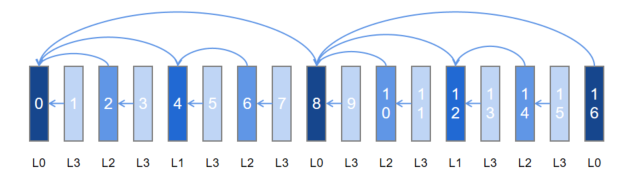
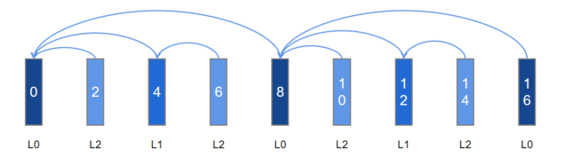
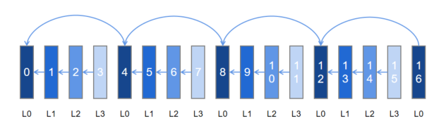
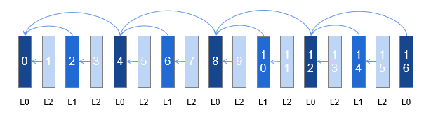

# Temporally Scalable Video Coding

## Basic Concepts

### Introduction to Temporally Scalable Video Coding

Scalable video coding is an extended standard for video coding. SVC (short for Scalable Video Coding, an extension of the H.264 standard) and SHVC (short for Scalable High Efficiency Video Coding, an extension of the H.265 standard) are popular nowadays.

Scalable video coding allows conveyance of information structured in a hierarchical manner of spatial scalability, temporal scalability, and quality scalability.

Temporally scalable video coding refers to the process of encoding a video sequence into a set of layers that provide an increasing temporal resolution. The following figure shows the structure of a bitstream that contains four temporal layers and is constructed based on the reference relationship.



In scenarios where the channel condition is poor, frames can be dropped layer by layer in descending order (L3- > L2- > L1) to meet the changing requirements of transmission and decoding capabilities.

The figure below shows the new bitstream structure when the frames at L3 are dropped. The bitstream can be normally decoded while the frame rate is reduced by half. Dropping can occur at other layers in a similar way.



### Structure of a Temporally Scalable Bitstream
A bitstream is organized by one or more Group of Pictures (GOPs). A GOP is a collection of consecutive pictures that can be independently decoded. It measures the distance between two I-frames (also named key frames).

A GOP can be further divided into one or more Temporal Group of Pictures (TGOPs), and each TGOP is composed by a base layer (BL) and one or more associated enhancement layers (ELs). For example, frame 0 to frame 7 in the foregoing four-layer temporally scalable bitstream form a TGOP.

- BL: bottom layer (L0) in the GOP. In temporal scalability, this layer is encoded at the lowest frame rate.

- EL: layers above the BL. There are L1, L2, and L3 in ascending order. In temporal scalability, the lowest EL encodes, based on encoding information obtained from the BL, the frames at a higher frame rate; a higher EL encodes, based on the BL or a lower EL, the frames at a higher frame rate.

### How to Implement the Structure of a Temporally Scalable Bitstream

The temporally scalable bitstream structure is implemented by specifying reference frames, which are classified into the following types based on the duration of residence in a Decoded Picture Buffer (DPB):

- Short-Term Reference (STR): a reference frame that cannot reside in the DPB for a long period of time. It adopts the First In First Out (FIFO) approach, which means that the oldest STR is removed from the DPB once the DPB is full.

- Long-Term Reference (LTR): a reference frame that can reside in the DPB for a long period of time. It stays in the DPB until it is replaced by another decoded picture with the same ID.

Although a specific cross-frame reference structure can be implemented when there is more than one STR, the span supported by temporal scalability is limited due to an excessively short validity period. This problem does not exist when coming to the LTR, which also covers the cross-frame scenario of the STR. Therefore, the LTR is preferably used to implement the structure of a temporally scalable bitstream.

## When to Use
You are advised to use temporal scalability in the following scenarios:

- Real-time encoding and transmission scenarios with no cache or low cache on the playback side, for example, video conferencing, live streaming, and collaborative office.

- Video encoding and recording scenario that requires video preview or multi-speed playback.

If your development scenario does not involve dynamic adjustment of the temporal reference structure and the hierarchical structure is simple, you are advised to use [global temporal scalability](#global-temporal-scalability). Otherwise, enable [LTR](#ltr).

## Constraints

- The global temporal scalability and LTR features are mutually exclusive.

  The two features cannot be both enabled because they have normalized bottom-layer implementation.

- When using the forcible IDR configuration along with the two features, use the frame channel configuration.

  The reference frame is valid only in the GOP. After an I-frame is refreshed, the DPB is cleared, so does the reference frame. In other words, the I-frame refresh location has a great impact on the reference relationship.

  When temporal scalability is enabled, to temporarily request the I-frame through **OH_MD_KEY_REQUEST_I_FRAME**, you must configure the frame channel with a determined effective time to notify the framework of the I-frame refresh location, so as to avoid disorder of the reference relationship. For details, see the configuration guide of the frame channel. Do not use **OH_VideoEncoder_SetParameter**, which uses an uncertain effective time. For details, see "Step 4: Call **OH_VideoEncoder_RegisterParameterCallback()** to register the frame-specific parameter callback function" in [Video Encoding in Surface Input](video-encoding.md#surface-input).

- The callback using **OH_AVBuffer** is supported, but the callback using **OH_AVMemory** is not.

  Temporal scalability depends on the frame feature. Do not use **OH_AVMemory** to trigger **OH_AVCodecAsyncCallback**. Instead, use **OH_AVBuffer** to trigger **OH_AVCodecCallback**.

- Temporal scalability employs P-pictures, but not B-pictures.

  Temporal scalability can be hierarchical-P or hierarchical-B. Currently, this feature can only be hierarchical-P.

- In the case of **UNIFORMLY_SCALED_REFERENCE**, TGOP can only be 2 or 4.

## Global Temporal Scalability

### Available APIs

Global temporal scalability is suitable for encoding frames into a stable and simple temporal structure. Its initial configuration takes effect globally and cannot be dynamically modified. The configuration parameters are as follows:

| Parameter| Description                        |
| -------- | ---------------------------- |
| OH_MD_KEY_VIDEO_ENCODER_ENABLE_TEMPORAL_SCALABILITY  |  Enabled status of the global temporal scalability feature.|
| OH_MD_KEY_VIDEO_ENCODER_TEMPORAL_GOP_SIZE  | TGOP size of the global temporal scalability feature.|
| OH_MD_KEY_VIDEO_ENCODER_TEMPORAL_GOP_REFERENCE_MODE  | TGOP reference mode of the global temporal scalability feature. |

- **OH_MD_KEY_VIDEO_ENCODER_ENABLE_TEMPORAL_SCALABILITY**: This parameter is set in the configuration phase. The feature can be successfully enabled only when it is supported.

- **OH_MD_KEY_VIDEO_ENCODER_TEMPORAL_GOP_SIZE**: This parameter is optional and specifies the distance between two I-frames. You need to customize the I-frame density based on the frame extraction requirements. The value range is [2, GopSize). If no value is passed in, the default value is used.

- **OH_MD_KEY_VIDEO_ENCODER_TEMPORAL_GOP_REFERENCE_MODE**: This parameter is optional and affects the reference mode of non-I-frames. The value can be **ADJACENT_REFERENCE**, **JUMP_REFERENCE**, or **UNIFORMLY_SCALED_REFERENCE**. **ADJACENT_REFERENCE** provides better compression performance, whereas **JUMP_REFERENCE** is more flexible in dropping frames. **UNIFORMLY_SCALED_REFERENCE** enables streams to be distributed more evenly in the case of frame loss. If no value is passed in, the default value is used.

    > **NOTE**
    >
    > In the case of **UNIFORMLY_SCALED_REFERENCE**, TGOP can only be 2 or 4.

Example 1: TGOP=4, ADJACENT_REFERENCE



Example 2: TGOP=4, JUMP_REFERENCE


Example 3: TGOP = 4, UNIFORMLY_SCALED_REFERENCE



### How to Develop

This section describes only the steps that are different from the basic encoding process. You can learn the basic encoding process in [Video Encoding](video-encoding.md).

1. When creating an encoder instance, check whether the video encoder supports the global temporal scalability feature.

    ```c++
    // 1.1 Obtain the video encoder capability instance. The following uses H.264 as an example.
    OH_AVCapability *cap = OH_AVCodec_GetCapability(OH_AVCODEC_MIMETYPE_VIDEO_AVC, true);
    // 1.2 Check whether the global temporal scalability feature is supported.
    bool isSupported = OH_AVCapability_IsFeatureSupported(cap, VIDEO_ENCODER_TEMPORAL_SCALABILITY);
    ```

    If the feature is supported, it can be enabled.

2. In the configuration phase, configure the parameters related to the global temporal scalability feature.

    ```c++
    constexpr int32_t TGOP_SIZE = 3; 
    // 2.1 Create a temporary AV format used for configuration.
    OH_AVFormat *format = OH_AVFormat_Create();
    // 2.2 Fill in the key-value pair of the parameter used to enable the feature.
    OH_AVFormat_SetIntValue(format, OH_MD_KEY_VIDEO_ENCODER_ENABLE_TEMPORAL_SCALABILITY, 1);
    // 2.3 (Optional) Fill in the key-value pairs of the parameters that specify the TGOP size and reference mode.
    OH_AVFormat_SetIntValue(format, OH_MD_KEY_VIDEO_ENCODER_TEMPORAL_GOP_SIZE, TGOP_SIZE);
    OH_AVFormat_SetIntValue(format, OH_MD_KEY_VIDEO_ENCODER_TEMPORAL_GOP_REFERENCE_MODE, ADJACENT_REFERENCE);
    // 2.4 Configure the parameters.
    int32_t ret = OH_VideoEncoder_Configure(videoEnc, format);
    if (ret != AV_ERR_OK) {
        // Handle exceptions.
    }
    // 2.5 Destroy the temporary AV format after the configuration is complete.
    OH_AVFormat_Destroy(format);
    ```

3. (Optional) During output rotation in the running phase, obtain the temporal layer information corresponding to the bitstream.

    You can periodically obtain the number of encoded frames based on the configured TGOP parameters.

    The sample code is as follows:

    ```c++
    uint32_t outPoc = 0;
    // Obtain the relative position in the TGOP based on the number of valid frames in the output callback and determine the layer based on the configuration.
    static void OnNewOutputBuffer(OH_AVCodec *codec, uint32_t index, OH_AVBuffer *buffer, void *userData)
    {
        // Note: If complex processing is involved, you are advised to create an association.
        struct OH_AVCodecBufferAttr attr;
        (void)buffer->GetBufferAttr(attr);
        // Set POC to 0 after the I-frame is refreshed.
        if (attr.flags & AVCODEC_BUFFER_FLAG_KEY_FRAME) {
            outPoc = 0;
        }
        // Skip this step only for the XPS output.
        if (attr.flags != AVCODEC_BUFFER_FLAG_CODEC_DATA) {
            int32_t tGopInner = outPoc % TGOP_SIZE;
            if (tGopInner == 0) {
                // I-frames cannot be dropped in subsequent transmission and decoding processes.
            } else {
                // Non-I-frames can be dropped in subsequent transmission and decoding processes.
            }
            outPoc++;
        }
    }
    ```

4. (Optional) During output rotation in the running phase, use the temporal layer information obtained for adaptive transmission or decoding.

    Based on the temporally scalable bitstream and layer information, select a required layer for transmission, or carry the information to the peer for adaptive decoding.

## LTR

### Available APIs

The LTR feature provides a flexible configuration of the frame-level reference relationship. It is suitable for flexible and complex temporally hierarchical structures.

| Parameter| Description                |
| -------- | ---------------------------- |
| OH_MD_KEY_VIDEO_ENCODER_LTR_FRAME_COUNT  |  Number of LTR frames.|
| OH_MD_KEY_VIDEO_ENCODER_PER_FRAME_MARK_LTR  | Marked as an LTR frame.|
| OH_MD_KEY_VIDEO_ENCODER_PER_FRAME_USE_LTR   | POC number of the LTR frame referenced by the current frame. |

- **OH_MD_KEY_VIDEO_ENCODER_LTR_FRAME_COUNT**: This parameter is set in the configuration phase and must be less than or equal to the maximum number of LTR frames supported. For details, see Step 3 below.
- **OH_MD_KEY_VIDEO_ENCODER_PER_FRAME_MARK_LTR **: The BL layer is marked as an LTR frame, and the EL layer to skip is also marked as an LTR frame.
- **OH_MD_KEY_VIDEO_ENCODER_PER_FRAME_USE_LTR**: POC number of the frame marked as the LTR frame.

For example, to implement the four-layer temporally hierarchical structure described in [Introduction to Temporally Scalable Video Coding](#introduction-to-temporally-scalable-video-coding), perform the following steps:

1. In the configuration phase, set **OH_MD_KEY_VIDEO_ENCODER_LTR_FRAME_COUNT** to **5**.

2. In the input rotation of the running phase, configure the LTR parameters according to the following table, where **\** means that no configuration is required.

    | Configuration\POC| 0 | 1 | 2 | 3 | 4 | 5 | 6 | 7 | 8 | 9 | 10 | 11 | 12 | 13 | 14 | 15 | 16 |
    | -------- |---|---|---|---|---|---|---|---|---|---|----|----|----|----|----|----|----|
    | MARK_LTR | 1 | 0 | 0 | 0 | 1 | 0 | 0 | 0 | 1 | 0 | 0  | 0  | 1  | 0  | 0  | 0  | 1  |
    | USE_LTR  | \ | \ | 0 | \ | 0 | \ | 4 | \ | 0 | \ | 8  | \  | 8  | \  | 12 | \  | 8  |

### How to Develop

This section describes only the steps that are different from the basic encoding process. You can learn the basic encoding process in [Video Encoding](video-encoding.md).

1. When creating an encoder instance, check whether the video encoder supports the LTR feature.

    ```c++
    constexpr int32_t NEEDED_LTR_COUNT = 5;
    bool isSupported = false;
    int32_t supportedLTRCount = 0;
    // 1.1 Obtain the encoder capability instance. The following uses H.264 as an example.
    OH_AVCapability *cap = OH_AVCodec_GetCapability(OH_AVCODEC_MIMETYPE_VIDEO_AVC, true);
    // 1.2 Check whether the LTR feature is supported.
    isSupported = OH_AVCapability_IsFeatureSupported(cap, VIDEO_ENCODER_LONG_TERM_REFERENCE);
    // 1.3 Determine the number of supported LTR frames.
    if (isSupported) {
        OH_AVFormat *properties = OH_AVCapability_GetFeatureProperties(cap, VIDEO_ENCODER_LONG_TERM_REFERENCE);
        OH_AVFormat_GetIntValue(properties, OH_FEATURE_PROPERTY_KEY_VIDEO_ENCODER_MAX_LTR_FRAME_COUNT, &supportedLTRCount);
        OH_AVFormat_Destroy(properties);
        // 1.4 Check whether the number of supported LTR frames meets the structure requirements.
        isSupported = supportedLTRCount >= NEEDED_LTR_COUNT;
    }
    ```

    If the LTR feature is supported and the number of supported LTR frames meets the requirements, the feature can be enabled.

2. Register the frame channel callback functions.

    The following is an example of the configuration in buffer input mode:

    ```c++
    // 2.1 Implement the OH_AVCodecOnNeedInputBuffer callback function.
    static void OnNeedInputBuffer(OH_AVCodec *codec, uint32_t index, OH_AVBuffer *buffer, void *userData)
    {
        // The index of the input frame buffer is sent to InIndexQueue.
        // The input frame data (specified by buffer) is sent to InBufferQueue.
        // Perform data processing. For details, see:
        // - Write the stream to encode.
        // - Notify the encoder of EOS.
        // - Write the frame parameter.
        OH_AVFormat *format = OH_AVBuffer_GetParameter(buffer);
        OH_AVFormat_SetIntValue(format, OH_MD_KEY_VIDEO_ENCODER_PER_FRAME_MARK_LTR, 1);
        OH_AVFormat_SetIntValue(format, OH_MD_KEY_VIDEO_ENCODER_PER_FRAME_USE_LTR, 4);
        OH_AVBuffer_SetParameter(buffer, format);
        OH_AVFormat_Destroy(format);
        // Notify the encoder that the buffer input is complete.
        OH_VideoEncoder_PushInputBuffer(codec, index);
    }

    // 2.2 Implement the OH_AVCodecOnNewOutputBuffer callback function.
    static void OnNewOutputBuffer(OH_AVCodec *codec, uint32_t index, OH_AVBuffer *buffer, void *userData)
    {
        // The index of the output frame buffer is sent to outIndexQueue.
        // The encoded frame data (specified by buffer) is sent to outBufferQueue.
        // Perform data processing. For details, see:
        // - Release the encoded frame.
        // - Record POC and the enabled status of LTR.
    }

    // 2.3 Register the callback functions.
    OH_AVCodecCallback cb;
    cb.onNeedInputBuffer = OnNeedInputBuffer;
    cb.onNewOutputBuffer = OnNewOutputBuffer;
    OH_VideoEncoder_RegisterCallback(codec, cb, nullptr);
    ```

    The following is an example of the configuration in surface input mode:

    ```c++
    // 2.1 Implement the OH_VideoEncoder_OnNeedInputParameter callback function.
    static void OnNeedInputParameter(OH_AVCodec *codec, uint32_t index, OH_AVFormat *parameter, void *userData)
    {
        // The index of the input frame buffer is sent to InIndexQueue.
        // The input frame data (specified by avformat) is sent to InFormatQueue.
        // Perform data processing. For details, see:
        // - Write the stream to encode.
        // - Notify the encoder of EOS.
        // - Write the frame parameter.
        OH_AVFormat_SetIntValue(parameter, OH_MD_KEY_VIDEO_ENCODER_PER_FRAME_MARK_LTR, 1);
        OH_AVFormat_SetIntValue(parameter, OH_MD_KEY_VIDEO_ENCODER_PER_FRAME_USE_LTR, 4);
        // Notify the encoder that the frame input is complete.
        OH_VideoEncoder_PushInputParameter(codec, index);
    }

    // 2.2 Implement the OH_AVCodecOnNewOutputBuffer callback function.
    static void OnNewOutputBuffer(OH_AVCodec *codec, uint32_t index, OH_AVBuffer *buffer, void *userData)
    {
        // The index of the output frame buffer is sent to outIndexQueue.
        // The encoded frame data (specified by buffer) is sent to outBufferQueue.
        // Perform data processing. For details, see:
        // - Release the encoded frame.
        // - Record POC and the enabled status of LTR.
    }

    // 2.3 Register the callback functions.
    OH_AVCodecCallback cb;
    cb.onNewOutputBuffer = OnNewOutputBuffer;
    OH_VideoEncoder_RegisterCallback(codec, cb, nullptr);
    // 2.4 Register the frame channel callback functions.
    OH_VideoEncoder_OnNeedInputParameter inParaCb = OnNeedInputParameter;
    OH_VideoEncoder_RegisterParameterCallback(codec, inParaCb, nullptr);
    ```

3. In the configuration phase, configure the maximum number of LTR frames.

    ```c++
    constexpr int32_t TGOP_SIZE = 3;
    // 3.1 Create a temporary AV format used for configuration.
    OH_AVFormat *format = OH_AVFormat_Create();
    // 3.2 Fill in the key-value pair of the parameter that specifies the number of LTR frames.
    OH_AVFormat_SetIntValue(format, OH_MD_KEY_VIDEO_ENCODER_LTR_FRAME_COUNT, NEEDED_LTR_COUNT);
    // 3.3 Configure the parameters.
    int32_t ret = OH_VideoEncoder_Configure(videoEnc, format);
    if (ret != AV_ERR_OK) {
        // Handle exceptions.
    }
    // 3.4 Destroy the temporary AV format after the configuration is complete.
    OH_AVFormat_Destroy(format);
    ```

4. (Optional) During output rotation in the running phase, obtain the temporal layer information corresponding to the bitstream.

    This procedure is the same as that described in the global temporal scalability feature.

    The LTR parameters are configured in the input rotation. You can also record the LTR parameters in the input rotation and find the corresponding input parameters in the output rotation.

5. (Optional) During output rotation in the running phase, use the temporal layer information obtained for adaptive transmission or decoding.

    This procedure is the same as that described in the global temporal scalability feature.
