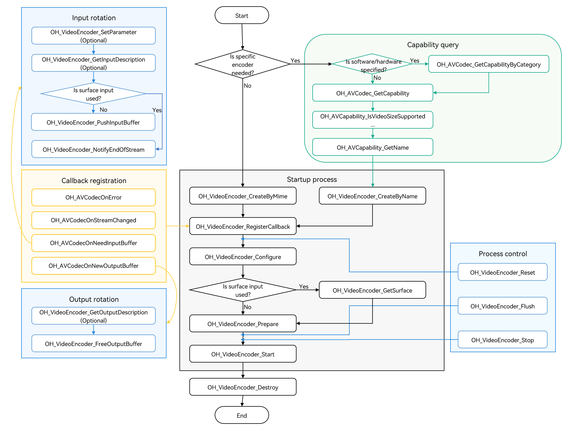

# Video Encoding

You can call the native APIs provided by the VideoEncoder module to encode a video, that is, to compress video data into a video stream.

Currently, the following encoding capabilities are supported:

| Container Specification| Video Encoding Type                |
| -------- | ---------------------------- |
| mp4      | HEVC (H.265) and AVC (H.264)|
| m4a      | HEVC (H.265) and AVC (H.264)|

Currently, only hardware encoding is supported. When an encoder is created based on the MIME type, H.264 (OH_AVCODEC_MIMETYPE_VIDEO_AVC) and H.265 (OH_AVCODEC_MIMETYPE_VIDEO_HEVC) are supported.

<!--RP1--><!--RP1End-->

Through the VideoEncoder module, your application can implement the following key capabilities.

|          Capability                      |                              How to Configure                                           |
| --------------------------------------- | ---------------------------------------------------------------------------------- |
| Dynamic configuration of encoder parameters and resetting of the frame rate, bit rate, maximum Quantization Parameter (QP), and minimum QP        | Configured by calling **OH_VideoEncoder_SetParameter()**. For details, see step 10 in surface mode.    |
| Encoding QP                | Configured in the frame channel callback function, which is set by calling **OH_VideoEncoder_RegisterParameterCallback()**. For details, see step 5 in surface mode. |
| Temporal scalability and Long-Term Reference (LTR) setting                       | For details, see [Temporally Scalable Video Coding](video-encoding-temporal-scalability.md).       |
| Obtaining the average QP and Mean Squared Error (MSE) of each encoded frame           | Obtained through the **OnNewOutputBuffer()** callback function. For details, see step 4 in surface mode.  |


## Restrictions

- The buffer mode does not support 10-bit image data.
- Due to limited hardware encoder resources, you must call **OH_VideoEncoder_Destroy()** to destroy every encoder instance when it is no longer needed.
- When **flush()**, **reset()**, or **stop()** is called, do not continue to operate the OH_AVBuffer obtained through the previous callback function.


## Surface Input and Buffer Input

- Surface input and buffer input differ in data sources.

- They are applicable to different scenarios.

  - Surface input indicates that the OHNativeWindow is used to transfer passed-in data. It supports connection with other modules, such as the camera module.
  - Buffer input refers to a pre-allocated memory area. The caller needs to copy original data to this memory area. It is more applicable to scenarios such as reading video data from files.

- The two also differ slightly in the API calling modes:

  - In buffer mode, an application calls **OH_VideoEncoder_PushInputBuffer()** to input data. In surface mode, an application, before the encoder is ready, calls **OH_VideoEncoder_GetSurface()** to obtain the OHNativeWindow for video data transmission.
  - In buffer mode, an application calls **OH_VideoEncoder_PushInputBuffer()** to pass in the End of Stream (EOS) flag, and the encoder stops when it reads the last frame. In surface mode, an application calls **OH_VideoEncoder_NotifyEndOfStream()** to notify the encoder of EOS.

For details about the development procedure, see [Surface Input](#surface-input) and [Buffer Input](#buffer-input).

## State Machine Interaction

The following figure shows the interaction between states.


1. An encoder enters the Initialized state in either of the following ways:
   - When an encoder instance is initially created, the encoder enters the Initialized state.
   - When **OH_VideoEncoder_Reset()** is called in any state, the encoder returns to the Initialized state.

2. When the encoder is in the Initialized state, you can call **OH_VideoEncoder_Configure()** to configure the encoder. After the configuration, the encoder enters the Configured state.
3. When the encoder is in the Configured state, you can call **OH_VideoEncoder_Prepare()** to switch it to the Prepared state.
4. When the encoder is in the Prepared state, you can call **OH_VideoEncoder_Start()** to switch it to the Executing state.
   
   When the encoder is in the Executing state, you can call **OH_VideoEncoder_Stop()** to switch it back to the Prepared state.
   
5. In rare cases, the encoder may encounter an error and enter the Error state. If this is the case, an invalid value can be returned or an exception can be thrown through a queue operation.
   
   When the encoder is in the Error state, you can either call **OH_VideoEncoder_Reset()** to switch it to the Initialized state or call **OH_VideoEncoder_Destroy()** to switch it to the Released state.
   
6. The Executing state has three substates: Flushed, Running, and End-of-Stream.
   - After **OH_VideoEncoder_Start()** is called, the encoder enters the Running substate immediately.
   - When the encoder is in the Executing state, you can call **OH_VideoEncoder_Flush()** to switch it to the Flushed substate.
   - After all data to be processed is transferred to the encoder, the **AVCODEC_BUFFER_FLAGS_EOS** flag is added to the last input buffer in the input buffers queue. Once this flag is detected, the encoder transits to the End-of-Stream substate. In this state, the encoder does not accept new inputs, but continues to generate outputs until it reaches the tail frame.

7. When the encoder is no longer needed, you must call **OH_VideoEncoder_Destroy()** to destroy the encoder instance. Then the encoder enters the Released state.

## How to Develop

Read [VideoEncoder](../../reference/apis-avcodec-kit/_video_encoder.md) for the API reference.

The figure below shows the call relationship of video encoding.



### Linking the Dynamic Link Library in the CMake Script

```cmake
target_link_libraries(sample PUBLIC libnative_media_codecbase.so)
target_link_libraries(sample PUBLIC libnative_media_core.so)
target_link_libraries(sample PUBLIC libnative_media_venc.so)
```
> **NOTE**
>
> The word **sample** in the preceding code snippet is only an example. Use the actual project directory name.
>

### Surface Input

The following walks you through how to implement the entire video encoding process in surface mode. In this example, surface data is input and encoded into a H.264 stream.

Currently, the VideoEncoder module supports only data rotation in asynchronous mode.

1. Add the header files.

    ```cpp
    #include <multimedia/player_framework/native_avcodec_videoencoder.h>
    #include <multimedia/player_framework/native_avcapability.h>
    #include <multimedia/player_framework/native_avcodec_base.h>
    #include <multimedia/player_framework/native_avformat.h>
    #include <multimedia/player_framework/native_avbuffer.h>
    #include <fstream>
    ```

2. Configure global variables.

    ```c++
    // (Mandatory) Configure the video frame width.
    int32_t width = 320; 
    // (Mandatory) Configure the video frame height.
    int32_t height = 240;
    // (Mandatory) Configure the video pixel format.
    constexpr OH_AVPixelFormat DEFAULT_PIXELFORMAT = AV_PIXEL_FORMAT_NV12;
    int32_t widthStride = 0;
    int32_t heightStride = 0;
    ```
   
3. Create an encoder instance.

    You can create an encoder by name or MIME type. In the code snippet below, the following variables are used:

    - **videoEnc**: pointer to the video encoder instance.
    - **capability**: pointer to the encoder's capability.
    - **OH_AVCODEC_MIMETYPE_VIDEO_AVC**: name of an AVC video stream.

    The following is an example:

    ```c++
    // To create an encoder by name, call OH_AVCapability_GetName to obtain the codec names available and then call OH_VideoEncoder_CreateByName. If your application has special requirements, for example, expecting an encoder that supports a certain resolution, you can call OH_AVCodec_GetCapability to query the capability first.
    OH_AVCapability *capability = OH_AVCodec_GetCapability(OH_AVCODEC_MIMETYPE_VIDEO_AVC, true);
    const char *codecName = OH_AVCapability_GetName(capability);
    OH_AVCodec *videoEnc = OH_VideoEncoder_CreateByName(codecName);
    ```

    ```c++
    // Create an encoder by MIME type. Only specific codecs recommended by the system can be created in this way.
    // If multiple codecs need to be created, create hardware encoder instances first. If the hardware resources are insufficient, create software encoder instances.
    OH_AVCodec *videoEnc = OH_VideoEncoder_CreateByMime(OH_AVCODEC_MIMETYPE_VIDEO_AVC);
    ```

4. Call **OH_VideoEncoder_RegisterCallback()** to register the callback functions.

    Register the **OH_AVCodecCallback** struct that defines the following callback function pointers:

    - **OH_AVCodecOnError**, a callback used to report a codec operation error.
    - **OH_AVCodecOnStreamChanged**, a callback used to report a codec stream change, for example, format change.
    - **OH_AVCodecOnNeedInputBuffer**, a callback used to report input data required. This callback does not take effect, since you input data through the obtained surface.
    - **OH_AVCodecOnNewOutputBuffer**, a callback used to report output data generated, which means that encoding is complete.

    <!--RP2--><!--RP2End-->

    The following is an example:
    ```c++
    int32_t qpAverage = 20;
    double mseValue = 0.0;
    // Set the OH_AVCodecOnError callback function, which is used to report a codec operation error.
    static void OnError(OH_AVCodec *codec, int32_t errorCode, void *userData)
    {
        // You need to process the error code in the callback.
        (void)codec;
        (void)errorCode;
        (void)userData;
    }

    // Set the OH_AVCodecOnStreamChanged callback function, which is used to report an encoding stream change.
    static void OnStreamChanged(OH_AVCodec *codec, OH_AVFormat *format, void *userData)
    {
        // This callback is useless in encoding scenarios.
        (void)codec;
        (void)format;
        (void)userData;
    }

    // Set the OH_AVCodecOnNeedInputBuffer callback function, which is used to send an input frame to the data queue.
    static void OnNeedInputBuffer(OH_AVCodec *codec, uint32_t index, OH_AVBuffer *buffer, void *userData)
    {
        // In surface mode, this callback function does not take effect. You can input data by using the obtained surface.
        (void)userData;
        (void)index;
        (void)buffer;
    }

    // Set the OH_AVCodecOnNewOutputBuffer callback function, which is used to send an encoded frame to the output queue.
    static void OnNewOutputBuffer(OH_AVCodec *codec, uint32_t index, OH_AVBuffer *buffer, void *userData)
    {
        // The index of the output frame buffer is sent to outIndexQueue.
        // The encoded frame data (specified by buffer) is sent to outBufferQueue.
        // Obtain the average QP and MSE of the video frame.
        OH_AVFormat *format = OH_AVBuffer_GetParameter(buffer);
        OH_AVFormat_GetIntValue(format, OH_MD_KEY_VIDEO_ENCODER_QP_AVERAGE, &qpAverage);
        OH_AVFormat_GetDoubleValue(format, OH_MD_KEY_VIDEO_ENCODER_MSE, &mseValue);
        OH_AVFormat_Destroy(format);
        // Process the data.
        // Release the encoded frame.
    }

    // Call OH_VideoEncoder_RegisterCallback() to register the callback functions.
    OH_AVCodecCallback cb = {&OnError, &OnStreamChanged, &OnNeedInputBuffer, &OnNewOutputBuffer};
    int32_t ret = OH_VideoEncoder_RegisterCallback(videoEnc, cb, NULL); // NULL: userData is null.
    if (ret != AV_ERR_OK) {
        // Exception handling.
    }
    ```
    > **NOTE**
    > 
    > In the callback functions, pay attention to multi-thread synchronization for operations on the data queue.

5. (Optional) Call **OH_VideoEncoder_RegisterParameterCallback()** to register the callback function of the frame channel.

    ```c++
    // 5.1 Implement the OH_VideoEncoder_OnNeedInputParameter callback function.
    static void OnNeedInputParameter(OH_AVCodec *codec, uint32_t index, OH_AVFormat *parameter, void *userData)
    {
        // The index of the input frame parameter is sent to InParameterIndexQueue.
        // The input frame data (specified by parameter) is sent to InParameterQueue.
        // Process the data.
        // Write the frame parameter.
        // The value of OH_MD_KEY_VIDEO_ENCODER_QP_MAX must be greater than or equal to that of OH_MD_KEY_VIDEO_ENCODER_QP_MIN.
        OH_AVFormat_SetIntValue(parameter, OH_MD_KEY_VIDEO_ENCODER_QP_MAX, 30);
        OH_AVFormat_SetIntValue(parameter, OH_MD_KEY_VIDEO_ENCODER_QP_MIN, 20);
    }

    // 5.2 Register the frame channel callback function.
    OH_VideoEncoder_OnNeedInputParameter inParaCb = OnNeedInputParameter;
    OH_VideoEncoder_RegisterParameterCallback(videoEnc, inParaCb, nullptr); // NULL: userData is null.
    ```

6. Call **OH_VideoEncoder_Configure()** to configure the encoder.

    For details about the configurable options, see [Video Dedicated Key-Value Paris](../../reference/apis-avcodec-kit/_codec_base.md#media-data-key-value-pairs).
    
    For details about the parameter verification rules, see [OH_VideoEncoder_Configure()](../../reference/apis-avcodec-kit/_video_encoder.md#oh_videoencoder_configure).

    The parameter value ranges can be obtained through the capability query interface. For details, see [Obtaining Supported Codecs](obtain-supported-codecs.md).

    Currently, the following options must be configured for all supported formats: video frame width, video frame height, and video pixel format. In the code snippet below, the following variables are used:

    - **DEFAULT_WIDTH**: 320 pixels
    - **DEFAULT_HEIGHT**: 240 pixels
    - **DEFAULT_PIXELFORMAT**: **AV_PIXEL_FORMAT_NV12** (the pixel format of the YUV file is NV12)

    ```c++
    // Configure the video frame rate.
    double frameRate = 30.0;
    // Configure the video YUV range flag.
    bool rangeFlag = false;
    // Configure the video primary color.
    int32_t primary = static_cast<int32_t>(OH_ColorPrimary::COLOR_PRIMARY_BT709);
    // Configure the transfer features.
    int32_t transfer = static_cast<int32_t>(OH_TransferCharacteristic::TRANSFER_CHARACTERISTIC_BT709);
    // Configure the maximum matrix coefficient.
    int32_t matrix = static_cast<int32_t>(OH_MatrixCoefficient::MATRIX_COEFFICIENT_IDENTITY);
    // Configure the encoding profile.
    int32_t profile = static_cast<int32_t>(OH_AVCProfile::AVC_PROFILE_BASELINE);
    // Configure the encoding bit rate mode.
    int32_t rateMode = static_cast<int32_t>(OH_VideoEncodeBitrateMode::CBR);
    // Configure the key frame interval, in milliseconds.
    int32_t iFrameInterval = 23000;
    // Configure the bit rate.
    int64_t bitRate = 3000000;
    // Set the encoding quality.
    int64_t quality = 0;

    OH_AVFormat *format = OH_AVFormat_Create();
    OH_AVFormat_SetIntValue(format, OH_MD_KEY_WIDTH, width);
    OH_AVFormat_SetIntValue(format, OH_MD_KEY_HEIGHT, height);
    OH_AVFormat_SetIntValue(format, OH_MD_KEY_PIXEL_FORMAT, DEFAULT_PIXELFORMAT);

    OH_AVFormat_SetDoubleValue(format, OH_MD_KEY_FRAME_RATE, frameRate);
    OH_AVFormat_SetIntValue(format, OH_MD_KEY_RANGE_FLAG, rangeFlag);
    OH_AVFormat_SetIntValue(format, OH_MD_KEY_COLOR_PRIMARIES, primary);
    OH_AVFormat_SetIntValue(format, OH_MD_KEY_TRANSFER_CHARACTERISTICS, transfer);
    OH_AVFormat_SetIntValue(format, OH_MD_KEY_MATRIX_COEFFICIENTS, matrix);
    OH_AVFormat_SetIntValue(format, OH_MD_KEY_I_FRAME_INTERVAL, iFrameInterval);
    OH_AVFormat_SetIntValue(format, OH_MD_KEY_PROFILE, profile);
    OH_AVFormat_SetIntValue(format, OH_MD_KEY_VIDEO_ENCODE_BITRATE_MODE, rateMode);
    OH_AVFormat_SetLongValue(format, OH_MD_KEY_BITRATE, bitRate);
    // Configure OH_MD_KEY_QUALITY only when OH_MD_KEY_BITRATE = CQ is used.
    if (rateMode == static_cast<int32_t>(OH_VideoEncodeBitrateMode::CQ)) {
        OH_AVFormat_SetIntValue(format, OH_MD_KEY_QUALITY, quality);
    }
    int32_t ret = OH_VideoEncoder_Configure(videoEnc, format);
    if (ret != AV_ERR_OK) {
        // Exception handling.
    }
    OH_AVFormat_Destroy(format);
    ```

    > **NOTE**
    > 
    > If an optional parameter is incorrectly configured, the error code **AV_ERR_INVAILD_VAL** is returned. However, **OH_VideoEncoder_Configure()** does not fail. Instead, its execution continues with the default value.

7. Obtain a surface.

    Obtain the OHNativeWindow in surface mode. The surface must be obtained before the encoder is prepared.

    ```c++
    // Obtain the surface used for data input.
    OHNativeWindow *nativeWindow;
    int32_t ret = OH_VideoEncoder_GetSurface(videoEnc, &nativeWindow);
    if (ret != AV_ERR_OK) {
        // Exception handling.
    }
    // Use the OHNativeWindow* variable type to obtain the address of the data to be filled through the producer interface.
    ```
    For details about how to use the **OHNativeWindow*** variable type, see [OHNativeWindow](../../reference/apis-arkgraphics2d/_native_window.md#ohnativewindow).

8. Call **OH_VideoEncoder_Prepare()** to prepare internal resources for the encoder.  

    ```c++
    int32_t ret = OH_VideoEncoder_Prepare(videoEnc);
    if (ret != AV_ERR_OK) {
        // Exception handling.
    }
    ```

9. Call **OH_VideoEncoder_Start()** to start the encoder.

    ```c++
    // Configure the paths of the input and output files.
    std::string_view outputFilePath = "/*yourpath*.h264";
    std::unique_ptr<std::ofstream> outputFile = std::make_unique<std::ofstream>();
    outputFile->open(outputFilePath.data(), std::ios::out | std::ios::binary | std::ios::ate);
    // Start the encoder.
    int32_t ret = OH_VideoEncoder_Start(videoEnc);
    if (ret != AV_ERR_OK) {
        // Exception handling.
    }
    ```

10. (Optional) Call **OH_VideoEncoder_SetParameter()** to dynamically configure encoder parameters during running.
    
    For details about the configurable options, see [Video Dedicated Key-Value Paris](../../reference/apis-avcodec-kit/_codec_base.md#media-data-key-value-pairs).

    ```c++
    OH_AVFormat *format = OH_AVFormat_Create();
    // Dynamically request IDR frames.
    OH_AVFormat_SetIntValue(format, OH_MD_KEY_REQUEST_I_FRAME, true);
    // Dynamically reset the bit rate.
    int64_t bitRate = 2000000;
    OH_AVFormat_SetLongValue(format, OH_MD_KEY_BITRATE, bitRate);
    // Dynamically reset the video frame rate.
    double frameRate = 60.0;
    OH_AVFormat_SetDoubleValue(format, OH_MD_KEY_FRAME_RATE, frameRate);
    // The QP can be dynamically set.
    // The value of OH_MD_KEY_VIDEO_ENCODER_QP_MAX must be greater than or equal to that of OH_MD_KEY_VIDEO_ENCODER_QP_MIN.
    OH_AVFormat_SetIntValue(parameter, OH_MD_KEY_VIDEO_ENCODER_QP_MAX, 30);
    OH_AVFormat_SetIntValue(parameter, OH_MD_KEY_VIDEO_ENCODER_QP_MIN, 20);

    int32_t ret = OH_VideoEncoder_SetParameter(videoEnc, format);
    if (ret != AV_ERR_OK) {
        // Exception handling.
    }
    ```

11. Write the image to encode.

    In step 7, you have configured the **OHNativeWindow*** variable type returned by **OH_VideoEncoder_GetSurface**. The data required for encoding is continuously input by the surface. Therefore, you do not need to process the **OnNeedInputBuffer** callback function or use **OH_VideoEncoder_PushInputBuffer** to input data.

12. (Optional) Call **OH_VideoEncoder_PushInputParameter()** to notify the encoder that the frame parameter configuration is complete.

    In step 5, you have registered the callback function of the frame channel.

    In the code snippet below, the following variables are used:

    - **index**: index of the data queue, which is passed in by the callback function **OnNeedInputParameter**.

    ```c++
    int32_t ret = OH_VideoEncoder_PushInputParameter(videoEnc, index);
    if (ret != AV_ERR_OK) {
        // Exception handling.
    }
    ```

13. Call **OH_VideoEncoder_NotifyEndOfStream()** to notify the encoder of EOS.

    ```c++
    // In surface mode, you only need to call this API to notify the encoder of EOS.
    // In buffer mode, you need to set the AVCODEC_BUFFER_FLAGS_EOS flag and then call OH_VideoEncoder_PushInputBuffer to notify the encoder of EOS.
    int32_t ret = OH_VideoEncoder_NotifyEndOfStream(videoEnc);
    if (ret != AV_ERR_OK) {
        // Exception handling.
    }
    ```

14. Call **OH_VideoEncoder_FreeOutputBuffer()** to release encoded frames.

    In the code snippet below, the following variables are used:

    - **index**: index of the data queue, which is passed in by the callback function **OnNewOutputBuffer**.
    - **buffer**: parameter passed in by the callback function **OnNewOutputBuffer**. You can call **OH_AVBuffer_GetAddr()** to obtain the pointer to the shared memory address.

    ```c++
    // Obtain the encoded information.
    OH_AVCodecBufferAttr info;
    int32_t ret = OH_AVBuffer_GetBufferAttr(buffer, &info);
    if (ret != AV_ERR_OK) {
        // Exception handling.
    }
    // Write the encoded frame data (specified by buffer) to the output file.
    outputFile->write(reinterpret_cast<char *>(OH_AVBuffer_GetAddr(buffer)), info.size);
    // Free the output buffer. index is the index of the buffer.
    ret = OH_VideoEncoder_FreeOutputBuffer(videoEnc, index);
    if (ret != AV_ERR_OK) {
        // Exception handling.
    }
    ```

15. (Optional) Call **OH_VideoEncoder_Flush()** to refresh the encoder.

    After **OH_VideoEncoder_Flush()** is called, the encoder remains in the Running state, but the current queue is cleared and the buffer storing the encoded data is freed.

    To continue encoding, you must call **OH_VideoEncoder_Start()** again.

    ```c++
    // Refresh the encoder.
    int32_t ret = OH_VideoEncoder_Flush(videoEnc);
    if (ret != AV_ERR_OK) {
        // Exception handling.
    }
    // Start encoding again.
    ret = OH_VideoEncoder_Start(videoEnc);
    if (ret != AV_ERR_OK) {
        // Exception handling.
    }
    ```

16. (Optional) Call **OH_VideoEncoder_Reset()** to reset the encoder.

    After **OH_VideoEncoder_Reset()** is called, the encoder returns to the Initialized state. To continue, you must call **OH_VideoEncoder_Configure()** and **OH_VideoEncoder_Prepare()** again.

    ```c++
    // Reset the encoder.
    int32_t ret = OH_VideoEncoder_Reset(videoEnc);
    if (ret != AV_ERR_OK) {
        // Exception handling.
    }
    // Reconfigure the encoder.
    ret = OH_VideoEncoder_Configure(videoEnc, format);
    if (ret != AV_ERR_OK) {
        // Exception handling.
    }
    // The encoder is ready again.
    ret = OH_VideoEncoder_Prepare(videoEnc);
    if (ret != AV_ERR_OK) {
        // Exception handling.
    }
    ```

17. (Optional) Call **OH_VideoEncoder_Stop()** to stop the encoder.
    
    After **OH_VideoEncoder_Stop()** is called, the encoder stops until **OH_VideoEncoder_Start()** is called again.
    ```c++
    // Stop the encoder.
    int32_t ret = OH_VideoEncoder_Stop(videoEnc);
    if (ret != AV_ERR_OK) {
        // Exception handling.
    }
    ```

18. Call **OH_VideoEncoder_Destroy()** to destroy the encoder instance and release resources.

    > **NOTE**
    >
    > This API cannot be called in the callback function.
    > After the call, you must set a null pointer to the encoder to prevent program errors caused by wild pointers.

    ```c++
    // Call OH_VideoEncoder_Destroy to destroy the encoder.
    int32_t ret = OH_VideoEncoder_Destroy(videoEnc);
    videoEnc = nullptr;
    if (ret != AV_ERR_OK) {
        // Exception handling.
    }
    ```

### Buffer Input

The following walks you through how to implement the entire video encoding process in buffer mode. It uses the YUV file input and H.264 encoding format as an example.
Currently, the VideoEncoder module supports only data rotation in asynchronous mode.

1. Add the header files.

    ```cpp
    #include <multimedia/player_framework/native_avcodec_videoencoder.h>
    #include <multimedia/player_framework/native_avcapability.h>
    #include <multimedia/player_framework/native_avcodec_base.h>
    #include <multimedia/player_framework/native_avformat.h>
    #include <multimedia/player_framework/native_avbuffer.h>
    #include <fstream>
    ```

2. Create an encoder instance.

    The procedure is the same as that in surface mode and is not described here.

    ```c++
    // To create an encoder by name, call OH_AVCapability_GetName to obtain the codec names available and then call OH_VideoEncoder_CreateByName. If your application has special requirements, for example, expecting an encoder that supports a certain resolution, you can call OH_AVCodec_GetCapability to query the capability first.
    OH_AVCapability *capability = OH_AVCodec_GetCapability(OH_AVCODEC_MIMETYPE_VIDEO_AVC, true);
    const char *codecName = OH_AVCapability_GetName(capability);
    OH_AVCodec *videoEnc = OH_VideoEncoder_CreateByName(codecName);
    ```

    ```c++
    // Create an encoder by MIME type. Only specific codecs recommended by the system can be created in this way.
    // If multiple codecs need to be created, create hardware encoder instances first. If the hardware resources are insufficient, create software encoder instances.
    OH_AVCodec *videoEnc = OH_VideoEncoder_CreateByMime(OH_AVCODEC_MIMETYPE_VIDEO_AVC);
    ```

3. Call **OH_VideoEncoder_RegisterCallback()** to register the callback functions.

    Register the **OH_AVCodecCallback** struct that defines the following callback function pointers:
    - **OH_AVCodecOnError**, a callback used to report a codec operation error.
    - **OH_AVCodecOnStreamChanged**, a callback used to report a codec stream change, for example, format change.
    - **OH_AVCodecOnNeedInputBuffer**, a callback used to report input data required, which means that the encoder is ready for receiving YUV/RGB data.
    - **OH_AVCodecOnNewOutputBuffer**, a callback used to report output data generated, which means that encoding is complete.

    You need to process the callback functions to ensure that the encoder runs properly.

    <!--RP2--><!--RP2End-->

    ```c++
    bool isFirstFrame = true;
    int32_t qpAverage = 20;
    double mseValue = 0.0;
    // Implement the OH_AVCodecOnError callback function.
    static void OnError(OH_AVCodec *codec, int32_t errorCode, void *userData)
    {
        // You need to process the error code in the callback.
        (void)codec;
        (void)errorCode;
        (void)userData;
    }
    
    // Implement the OH_AVCodecOnStreamChanged callback function.
    static void OnStreamChanged(OH_AVCodec *codec, OH_AVFormat *format, void *userData)
    {
        // This callback is useless in encoding scenarios.
        (void)codec;
        (void)format;
        (void)userData;
    }
    
    // Implement the OH_AVCodecOnNeedInputBuffer callback function.
    static void OnNeedInputBuffer(OH_AVCodec *codec, uint32_t index, OH_AVBuffer *buffer, void *userData)
    {
        // The index of the input frame buffer is sent to InIndexQueue.
        // The input frame data (specified by buffer) is sent to InBufferQueue.
        // Obtain the video width, height, and stride.
        if (isFirstFrame) {
            OH_AVFormat *format = OH_VideoEncoder_GetInputDescription(codec);
            OH_AVFormat_GetIntValue(format, OH_MD_KEY_VIDEO_STRIDE, &widthStride);
            OH_AVFormat_GetIntValue(format, OH_MD_KEY_VIDEO_SLICE_HEIGHT, &heightStride);
            OH_AVFormat_Destroy(format);
            isFirstFrame = false;
        }
        // Process the data.
        // Write the image to encode.
        // Notify the encoder of EOS.
    }
    
    // Implement the OH_AVCodecOnNewOutputBuffer callback function.
    static void OnNewOutputBuffer(OH_AVCodec *codec, uint32_t index, OH_AVBuffer *buffer, void *userData)
    {
        // The index of the output frame buffer is sent to outIndexQueue.
        // The encoded frame data (specified by buffer) is sent to outBufferQueue.
        // Obtain the average QP and MSE of the video frame.
        OH_AVFormat *format = OH_AVBuffer_GetParameter(buffer);
        OH_AVFormat_GetIntValue(format, OH_MD_KEY_VIDEO_ENCODER_QP_AVERAGE, &qpAverage);
        OH_AVFormat_GetDoubleValue(format, OH_MD_KEY_VIDEO_ENCODER_MSE, &mseValue);
        OH_AVFormat_Destroy(format);
        // Process the data.
        // Release the encoded frame.
    }
    
    // Call OH_VideoEncoder_RegisterCallback() to register the callback functions.
    OH_AVCodecCallback cb = {&OnError, &OnStreamChanged, &OnNeedInputBuffer, &OnNewOutputBuffer};
    int32_t ret = OH_VideoEncoder_RegisterCallback(videoEnc, cb, NULL);
    if (ret != AV_ERR_OK) {
        // Exception handling.
    }
    ```
    > **NOTE**
    >
    > In the callback functions, pay attention to multi-thread synchronization for operations on the data queue.
    >

4. Call **OH_VideoEncoder_Configure()** to configure the encoder.

    The procedure is the same as that in surface mode and is not described here.

    ```c++
    OH_AVFormat *format = OH_AVFormat_Create();
    // Set the format.
    OH_AVFormat_SetIntValue(format, OH_MD_KEY_WIDTH, width);
    OH_AVFormat_SetIntValue(format, OH_MD_KEY_HEIGHT, height);
    OH_AVFormat_SetIntValue(format, OH_MD_KEY_PIXEL_FORMAT, DEFAULT_PIXELFORMAT);
    // Configure the encoder.
    int32_t ret = OH_VideoEncoder_Configure(videoEnc, format);
    if (ret != AV_ERR_OK) {
        // Exception handling.
    }
    OH_AVFormat_Destroy(format);
    ```

5. Call **OH_VideoEncoder_Prepare()** to prepare internal resources for the encoder.  

    ```c++
    ret = OH_VideoEncoder_Prepare(videoEnc);
    if (ret != AV_ERR_OK) {
        // Exception handling.
    }
    ```

6. Call **OH_VideoEncoder_Start()** to start the encoder.

    As soon as the encoder starts, the callback functions will be triggered to respond to events. Therefore, you must configure the input file and output file first.

    ```c++
    // Configure the paths of the input and output files.
    std::string_view inputFilePath = "/*yourpath*.yuv";
    std::string_view outputFilePath = "/*yourpath*.h264";
    std::unique_ptr<std::ifstream> inputFile = std::make_unique<std::ifstream>();
    std::unique_ptr<std::ofstream> outputFile = std::make_unique<std::ofstream>();
    inputFile->open(inputFilePath.data(), std::ios::in | std::ios::binary);
    outputFile->open(outputFilePath.data(), std::ios::out | std::ios::binary | std::ios::ate);
    // Start the encoder.
    int32_t ret = OH_VideoEncoder_Start(videoEnc);
    if (ret != AV_ERR_OK) {
        // Exception handling.
    }
    ```

7. (Optional) Dynamically configure encoder parameters during running.

    ```c++
    OH_AVFormat *format = OH_AVFormat_Create();
    // Dynamically request IDR frames.
    OH_AVFormat_SetIntValue(format, OH_MD_KEY_REQUEST_I_FRAME, true);
    // Dynamically reset the bit rate.
    int64_t bitRate = 2000000;
    OH_AVFormat_SetLongValue(format, OH_MD_KEY_BITRATE, bitRate);
    // Dynamically reset the video frame rate.
    double frameRate = 60.0;
    OH_AVFormat_SetDoubleValue(format, OH_MD_KEY_FRAME_RATE, frameRate);
    
    int32_t ret = OH_VideoEncoder_SetParameter(videoEnc, format);
    if (ret != AV_ERR_OK) {
        // Exception handling.
    }
    ```

8. Call **OH_VideoEncoder_PushInputBuffer()** to push the image to the input queue for encoding.

    In the code snippet below, the following variables are used:

    - **buffer**: parameter passed in by the callback function **OnNeedInputBuffer**. You can call **OH_AVBuffer_GetAddr()** to obtain the pointer to the shared memory address.
    - **index**: index of the data queue, which is passed in by the callback function **OnNeedInputBuffer**.
    - **flags**: type of the buffer flag. For details, see [OH_AVCodecBufferFlags](../../reference/apis-avcodec-kit/_core.md#oh_avcodecbufferflags).
    - **stride**: stride of the obtained buffer data.

    ```c++
    if (stride == width) {
        // Process the file stream and obtain the frame length, and then write the data to encode to the buffer of the specified index.
        int32_t frameSize = width * height * 3 / 2; // Formula for calculating the data size of each frame in NV12 pixel format.
        inputFile->read(reinterpret_cast<char *>(OH_AVBuffer_GetAddr(buffer)), frameSize);
    } else {
        // If the stride is not equal to the width, you need to perform the offset based on the stride.
    }
    // Configure the buffer information.
    OH_AVCodecBufferAttr info;
    info.size = frameSize;
    info.offset = 0;
    info.pts = 0;
    info.flags = flags;
    ret = OH_AVBuffer_SetBufferAttr(buffer, &info);
    if (ret != AV_ERR_OK) {
        // Exception handling.
    }
    // Send the data to the input buffer for encoding. index is the index of the buffer.
    int32_t ret = OH_VideoEncoder_PushInputBuffer(videoEnc, index);
    if (ret != AV_ERR_OK) {
        // Exception handling.
    }
    ```
    Offset the stride. The following uses an NV12 image as an example:

    Add the header file.

    ```c++
    #include <string.h>
    ```
    The following is the sample code:

    ```c++
    struct Rect // Width and height of the source memory area.
    {
        int32_t width;
        int32_t height;
    };

    struct DstRect // Width stride and height stride of the target memory area.
    {
        int32_t wStride;
        int32_t hStride;
    };

    struct SrcRect // Width stride and height stride of the source memory area.
    {
        int32_t wStride;
        int32_t hStride;
    };

    Rect rect = {320, 240};
    DstRect dstRect = {320, 250};
    SrcRect srcRect = {320, 250};
    uint8_t* dst = new uint8_t[dstRect.hStride * dstRect.wStride]; // Pointer to the target memory area.
    uint8_t* src = new uint8_t[srcRect.hStride * srcRect.wStride]; // Pointer to the source memory area.

    // Y: Copy the source data in the Y region to the target data in another region.
    for (int32_t i = 0; i < rect.height; ++i) {
        // Copy a row of data from the source to a row of the target.
        memcpy_s(dst, src, rect.width);
        // Update the pointers to the source data and target data to copy the next row. The pointers to the source data and target data are moved downwards by one wStride each time the source data and target data are updated.
        dst += dstRect.wStride;
        src += srcRect.wStride;
    }
    // padding
    // Update the pointers to the source data and target data. The pointers move downwards by one padding.
    dst += (dstRect.hStride - rect.height) * dstRect.wStride;
    src += (srcRect.hStride - rect.height) * srcRect.wStride;
    rect.height >>= 1;
    // UV: Copy the source data in the UV region to the target data in another region.
    for (int32_t i = 0; i < rect.height; ++i) {
        memcpy_s(dst, src, rect.width);
        dst += dstRect.wStride;
        src += srcRect.wStride;
    }

    delete[] dst;
    dst = nullptr;
    delete[] src;
    src = nullptr;
    ```
    When processing buffer data (before pushing data) during hardware encoding, you must copy the image data after width and height alignment to the input callback AVBuffer. Generally, copy the image width, height, stride, and pixel format to ensure correct processing of the data to encode. For details, see step 3 in [Buffer Input](#buffer-input).

9. Notify the encoder of EOS.

    In the code snippet below, the following variables are used:
    - **index**: index of the data queue, which is passed in by the callback function **OnNeedInputBuffer**.
    - **buffer**: parameter passed in by the callback function **OnNeedInputBuffer**. You can call **OH_AVBuffer_GetAddr()** to obtain the pointer to the shared memory address.

    The API **OH_VideoEncoder_PushInputBuffer** is used to notify the encoder of EOS. This API is also used in step 8 to push the stream to the input queue for encoding. Therefore, in the current step, you must pass in the **AVCODEC_BUFFER_FLAGS_EOS** flag.

    ```c++
    OH_AVCodecBufferAttr info;
    info.size = 0;
    info.offset = 0;
    info.pts = 0;
    info.flags = AVCODEC_BUFFER_FLAGS_EOS;
    int32_t ret = OH_AVBuffer_SetBufferAttr(buffer, &info);
    if (ret != AV_ERR_OK) {
        // Exception handling.
    }
    ret = OH_VideoEncoder_PushInputBuffer(videoEnc, index);
    if (ret != AV_ERR_OK) {
        // Exception handling.
    }
    ```

10. Call **OH_VideoEncoder_FreeOutputBuffer()** to release encoded frames.
    
    The procedure is the same as that in surface mode and is not described here.

    ```c++
    // Obtain the encoded information.
    OH_AVCodecBufferAttr info;
    int32_t ret = OH_AVBuffer_GetBufferAttr(buffer, &info);
    if (ret != AV_ERR_OK) {
        // Exception handling.
    }
    // Write the encoded frame data (specified by buffer) to the output file.
    outputFile->write(reinterpret_cast<char *>(OH_AVBuffer_GetAddr(buffer)), info.size);
    // Free the output buffer. index is the index of the buffer.
    ret = OH_VideoEncoder_FreeOutputBuffer(videoEnc, index);
    if (ret != AV_ERR_OK) {
        // Exception handling.
    }
    ```

The subsequent processes (including refreshing, resetting, stopping, and destroying the encoder) are the same as those in surface mode. For details, see steps 15-18 in [Surface Input](#surface-input).
