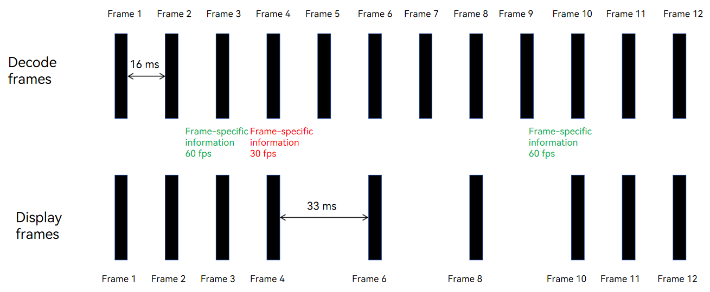

# Video Variable Frame Rate

<!--Kit: AVCodec Kit-->
<!--Subsystem: Multimedia-->
<!--Owner: @tianjian97861-->
<!--Designer: @dpy2650--->
<!--Tester: @cyakee-->
<!--Adviser: @zengyawen-->

With the C APIs related to the video variable refresh rate feature, you can dynamically adjust the screen refresh rate based on the video content during playback. This helps save display power while maintaining smooth video playback.

## When to Use

The video variable refresh rate feature is ideal for video sources with high frame rates (>30 fps). For video sources with frame rates at or below 30 fps, a refresh rate of 30 Hz is recommended.

The figure below demonstrates the playback of a 60 fps video. The algorithm adjusts the screen refresh rate in real-time based on the video content. If the refresh rate drops below the video frame rate, some frames will be discarded to save power.



## Constraints

1. This feature is available only for the scenario where the video is directly sent for display after hardware decoding.
2. The overall screen refresh rate will change. It is recommended that you use this feature in full-screen playback scenarios without bullet comments or animations, as the feature may affect their smoothness.
3. This feature depends on the decoding frame rate configuration. The **OH_MD_KEY_FRAME_RATE** property must be correctly set before use.
4. This feature is platform-dependent. If the platform does not support this feature, the API calls do not report an error, but the feature does not take effect. Normal decoding and playback still function.

## How to Develop

This section describes only the steps that are different from the basic decoding process. You can learn the basic decoding process in [Video Decoding](video-decoding.md).

1. Enable the video variable frame rate feature during decoder configuration.
   
   In the code snippet below, the following variables are used:
   
   **videoDec**: pointer to the video decoder instance. For details, see [Creating a Decoder Instance in Surface Mode](video-decoding.md#surface-mode).

    ```cpp
    OH_AVFormat *format = OH_AVFormat_Create();
    int32_t width = 1280; // Video frame width.
    int32_t height = 720; // Video frame height.
    int32_t fps = 60; // Video frame rate.
    OH_AVFormat_SetIntValue(format, OH_MD_KEY_WIDTH, width);
    OH_AVFormat_SetIntValue(format, OH_MD_KEY_HEIGHT, height);
    OH_AVFormat_SetIntValue(format, OH_MD_KEY_FRAME_RATE, fps);
    OH_AVFormat_SetIntValue(format, OH_MD_KEY_VIDEO_DECODER_OUTPUT_ENABLE_VRR, 1);
    int32_t ret = OH_VideoDecoder_Configure(videoDec, format);
    if (ret != AV_ERR_OK) {
        // Handle exceptions.
    }
    OH_AVFormat_Destroy(format);
    ```

2. (Optional) Dynamically enable or disable the variable frame rate feature during video playback.

    If bullet comments are enabled during playback, you can disable the variable frame rate feature to avoid wasting resources, since the refresh rate adjustments are not applied.
    
    The following code snippet is used to dynamically disable the feature:

    ```cpp
    OH_AVFormat *format = OH_AVFormat_Create();
    OH_AVFormat_SetIntValue(format, OH_MD_KEY_VIDEO_DECODER_OUTPUT_ENABLE_VRR, 0);
    OH_VideoDecoder_SetParameter(videoDec, format);
    OH_AVFormat_Destroy(format);
    ```

    The following code snippet is used to dynamically enable the feature:

    ```cpp
    OH_AVFormat *format = OH_AVFormat_Create();
    OH_AVFormat_SetIntValue(format, OH_MD_KEY_FRAME_RATE, fps);
    OH_AVFormat_SetIntValue(format, OH_MD_KEY_VIDEO_DECODER_OUTPUT_ENABLE_VRR, 1);
    OH_VideoDecoder_SetParameter(videoDec, format);
    OH_AVFormat_Destroy(format);
    ```
