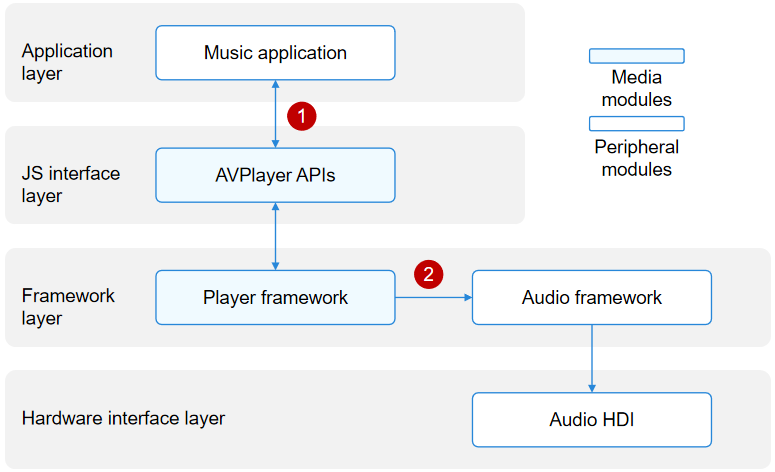

# AVPlayer and AVRecorder

The media module provides the [AVPlayer](#avplayer) and [AVRecorder](#avrecorder) class to implement audio and video playback and recording.

## AVPlayer

The AVPlayer transcodes audio and video media assets (such as MP4, MP3, MKV, and MPEG-TS) into renderable images and hearable audio analog signals, and plays the audio and video through output devices.

The AVPlayer provides the integrated playback capability. This means that your application only needs to provide streaming media sources to implement media playback. It does not need to parse or decode data.

### Audio Playback

The figure below shows the interaction when the **AVPlayer** class is used to develop a music application.

**Figure 1** Interaction with external modules for audio playback 

When a music application calls the **AVPlayer** APIs at the JS interface layer to implement audio playback, the player framework at the framework layer parses the media asset into audio data streams (in PCM format). The audio data streams are then decoded by software and output to the audio framework. The audio framework outputs the audio data streams to the audio HDI for rendering. A complete audio playback process requires the cooperation of the application, player framework, audio framework, and audio HDI.

In Figure 1, the numbers indicate the process where data is transferred to external modules.

1. The music application transfers the media asset to the **AVPlayer** instance.

2. The player framework outputs the audio PCM data streams to the audio framework, which then outputs the data streams to the audio HDI.

### Video Playback

The figure below shows the interaction when the **AVPlayer** class is used to develop a video application.

**Figure 2** Interaction with external modules for video playback 

When the video application calls the **AVPlayer** APIs at the JS interface layer to implement audio and video playback, the player framework at the framework layer parses the media asset into separate audio data streams and video data streams. The audio data streams are then decoded by software and output to the audio framework. The audio framework outputs the audio data streams to the audio HDI at the hardware interface layer to implement audio playback. The video data streams are then decoded by hardware (recommended) or software and output to the graphic framework. The graphic framework outputs the video data streams to the display HDI at the hardware interface layer to implement graphics rendering.

A complete video playback process requires the cooperation of the application, XComponent, player framework, graphic framework, audio framework, display HDI, and audio HDI.

In Figure 2, the numbers indicate the process where data is transferred to external modules.

1. The application obtains a window surface ID from the XComponent. For details about how to obtain the window surface ID, see [XComponent](../reference/arkui-ts/ts-basic-components-xcomponent.md).

2. The application transfers the media asset and surface ID to the **AVPlayer** instance.

3. The player framework outputs the video elementary streams (ESs) to the decoding HDI to obtain video frames (NV12/NV21/RGBA).

4. The player framework outputs the audio PCM data streams to the audio framework, which then outputs the data streams to the audio HDI.

5. The player framework outputs the video frames (NV12/NV21/RGBA) to the graphic framework, which then outputs the video frames to the display HDI.

### Supported Formats and Protocols

Audio and video containers and codecs are domains specific to content creators. You are advised to use the mainstream playback formats, rather than custom ones to avoid playback failures, frame freezing, and artifacts. The system will not be affected by incompatibility issues. If such an issue occurs, you can exit playback.

The table below lists the supported protocols.

| Scenario| Description| 
| -------- | -------- |
| Local VOD| The file descriptor is supported, but the file path is not.|
| Network VoD| HTTP, HTTPS, and HLS are supported.|

The table below lists the supported audio playback formats.

| Audio Container Format| Description| 
| -------- | -------- |
| M4A| Audio format: AAC| 
| AAC| Audio format: AAC| 
| MP3| Audio format: MP3| 
| OGG| Audio format: VORBIS | 
| WAV| Audio format: PCM | 

> **NOTE**
> 
> The supported video formats are further classified into mandatory and optional ones. All vendors must support mandatory ones and can determine whether to implement optional ones based on their service requirements. You are advised to perform compatibility processing to ensure that all the application functions are compatible on different platforms.

| Video Format| Mandatory or Not|
| -------- | -------- |
| H.264     | Yes|
| MPEG-2    | No|
| MPEG-4    | No|
| H.263     | No|
| VP8      | No|

The table below lists the supported playback formats and mainstream resolutions.

| Video Container Format| Description| Resolution| 
| -------- | -------- | -------- |
| MP4| Video formats: H.264, MPEG-2, MPEG-4, and H.263 Audio formats: AAC and MP3| Mainstream resolutions, such as 4K, 1080p, 720p, 480p, and 270p| 
| MKV| Video formats: H.264, MPEG-2, MPEG-4, and H.263 Audio formats: AAC and MP3| Mainstream resolutions, such as 4K, 1080p, 720p, 480p, and 270p| 
| TS| Video formats: H.264, MPEG-2, and MPEG-4 Audio formats: AAC and MP3| Mainstream resolutions, such as 4K, 1080p, 720p, 480p, and 270p| 
| WebM| Video format: VP8 Audio format: VORBIS| Mainstream resolutions, such as 4K, 1080p, 720p, 480p, and 270p| 

## AVRecorder

The AVRecorder captures audio signals, receives video signals, encodes the audio and video signals, and saves them to files. With the AVRecorder, you can easily implement audio and video recording, including starting, pausing, resuming, and stopping recording, and releasing resources. You can also specify parameters such as the encoding format, encapsulation format, and file path for recording.

**Figure 3** Interaction with external modules for video recording 

- Audio recording: When an application calls the **AVRecorder** APIs at the JS interface layer to implement audio recording, the player framework at the framework layer invokes the audio framework to capture audio data through the audio HDI. The audio data is then encoded by software and saved into a file.

- Video recording: When an application calls the **AVRecorder** APIs at the JS interface layer to implement video recording, the camera framework is first invoked to capture image data. Through the video encoding HDI, the camera framework sends the data to the player framework at the framework layer. The player framework encodes the image data through the video HDI and saves the encoded image data into a file.

With the AVRecorder, you can implement pure audio recording, pure video recording, and audio and video recording.

In Figure 3, the numbers indicate the process where data is transferred to external modules.

1. The application obtains a surface ID from the player framework through the **AVRecorder** instance.

2. The application sets the surface ID for the camera framework, which obtains the surface corresponding to the surface ID. The camera framework captures image data through the video HDI and sends the data to the player framework at the framework layer.

3. The camera framework transfers the video data to the player framework through the surface.

4. The player framework encodes video data through the video HDI.

5. The player framework sets the audio parameters for the audio framework and obtains the audio data from the audio framework.

### Supported Formats

The table below lists the supported audio sources.

| Type| Description| 
| -------- | -------- |
| mic | The system microphone is used as the audio source input.| 

The table below lists the supported video sources.

| Type| Description | 
| -------- | -------- |
| surface_yuv | The input surface carries raw data.| 
| surface_es | The input surface carries ES data.| 

The table below lists the supported audio and video encoding formats.

| Encoding Format| Description | 
| -------- | -------- |
| audio/mp4a-latm | Audio encoding format MP4A-LATM.| 
| video/mp4v-es | Video encoding format MPEG-4.| 
| video/avc | Video encoding format AVC.| 

The table below lists the supported output file formats.

| Format| Description | 
| -------- | -------- |
| MP4| Video container format MP4.| 
| M4A| Audio container format M4A.| 
