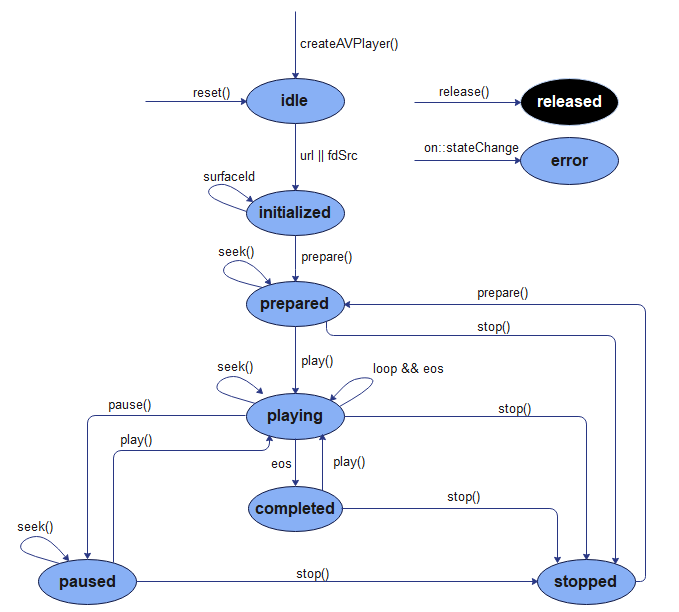
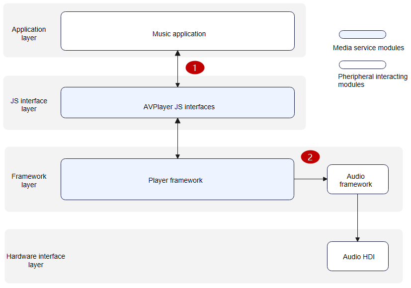
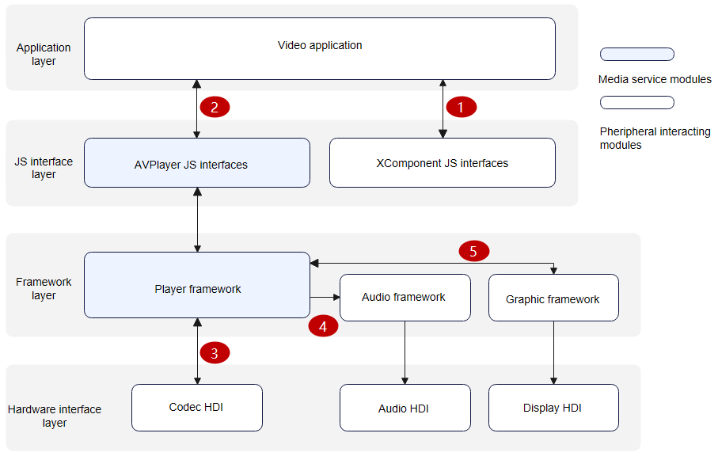

# AVPlayer Development

## Introduction

The AVPlayer converts audio or video resources into audible analog signals or renderable images and plays the signals or images using output devices. You can manage playback tasks on the AVPlayer. For example, you can control the playback (start/pause/stop/seek), set the volume, obtain track information, and release resources.

## Working Principles

The following figures show the [AVPlayer state](../reference/apis/js-apis-media.md#avplayerstate9) transition and interaction with external audio and video playback modules.

**Figure 1** AVPlayer state transition 



**Figure 2** Interaction with external modules for audio playback



**NOTE**: When an application calls the **AVPlayer** JS APIs at the JS interface layer to implement a feature, the framework layer parses the resources into audio data streams through the playback service of the player framework. The audio data streams are then decoded by software and output to the audio service of the audio framework. The audio framework outputs the audio data streams to the audio HDI at the hardware interface layer to implement audio playback. A complete audio playback process requires the cooperation of the application (application adaptation required), player framework, audio framework, and audio HDI (driver adaptation required). 

1. An application passes a URL into the **AVPlayer** JS API.
2. The playback service outputs the audio PCM data streams to the audio service, and the audio service outputs the data streams to the audio HDI.


**Figure 3** Interaction with external modules for video playback



**NOTE**: When an application calls the **AVPlayer** JS APIs at the JS interface layer to implement a feature, the framework layer parses the resources into separate audio data streams and video data streams through the playback service of the player framework. The audio data streams are then decoded by software and output to the audio service of the audio framework. The audio framework outputs the audio data streams to the audio HDI at the hardware interface layer to implement audio playback. The video data streams are then decoded by hardware (recommended) or software and output to the renderer service of the graphic framework. The renderer service outputs the video data streams to the display HDI at the hardware interface layer. A complete video playback process requires the cooperation of the application (application adaptation required), XComponent, player framework, graphic framework, audio framework, display HDI (driver adaptation required), and audio HDI (driver adaptation required). 

1. An application obtains the surface ID from the XComponent. For details about the obtaining method, see [XComponent](../reference/arkui-ts/ts-basic-components-xcomponent.md).
2. The application passes a URL and the surface ID into the **AVPlayer** JS API.
3. The playback service outputs video elementary streams (ESs) to the codec HDI, which decodes the ESs to obtain video frames (NV12/NV21/RGBA).
4. The playback service outputs the audio PCM data streams to the audio service, and the audio service outputs the data streams to the audio HDI.
5. The playback service outputs video frames (NV12/NV21/RGBA) to the renderer service, and the renderer service outputs the video frames to the display HDI.

## Compatibility

Use the mainstream playback formats and resolutions, rather than custom ones to avoid playback failures, frame freezing, and artifacts. The system will not be affected by incompatibility issues. If such an issue occurs, you can exit stream playback.

The table below lists the mainstream playback formats and resolutions.

| Video Container Format|                     Description                     |               Resolution              |
| :----------: | :-----------------------------------------------: | :--------------------------------: |
|     mp4      | Video format: H.264/MPEG-2/MPEG-4/H.263; audio format: AAC/MP3| Mainstream resolutions, such as 1080p, 720p, 480p, and 270p|
|     mkv      | Video format: H.264/MPEG-2/MPEG-4/H.263; audio format: AAC/MP3| Mainstream resolutions, such as 1080p, 720p, 480p, and 270p|
|      ts      |   Video format: H.264/MPEG-2/MPEG-4; audio format: AAC/MP3   | Mainstream resolutions, such as 1080p, 720p, 480p, and 270p|
|     webm     |          Video format: VP8; audio format: VORBIS          | Mainstream resolutions, such as 1080p, 720p, 480p, and 270p|

| Audio Container Format |   Description  |
| :----------: | :----------: |
|     m4a      | Audio format: AAC|
|     aac      | Audio format: AAC|
|     mp3      | Audio format: MP3|
|     ogg      | Audio format: VORBIS |
|     wav      | Audio format: PCM |

## How to Develop

For details about the APIs, see the [AVPlayer APIs in the Media Class](../reference/apis/js-apis-media.md#avplayer9).

### Full-Process Scenario

The full playback process includes creating an instance, setting resources, setting a video window, preparing for playback, controlling playback, and resetting or releasing the resources. (During the preparation, you can obtain track information, volume, speed, focus mode, and zoom mode, and set bit rates. To control the playback, you can start, pause, and stop the playback, seek to a playback position, and set the volume.)

1. Call [createAVPlayer()](../reference/apis/js-apis-media.md#mediacreateavplayer9) to create an **AVPlayer** instance. The AVPlayer is initialized to the [idle](#avplayer_state) state.

2. Set the events to listen for, which will be used in the full-process scenario.

3. Set the resource [URL](../reference/apis/js-apis-media.md#avplayer_attributes). When the AVPlayer enters the [initialized](#avplayer_state) state, you can set the [surface ID](../reference/apis/js-apis-media.md#avplayer_attributes) for the video window. For details about the supported specifications, see [AVPlayer Attributes](../reference/apis/js-apis-media.md#avplayer_attributes).

4. Call [prepare()](../reference/apis/js-apis-media.md#avplayer_prepare) to switch the AVPlayer to the [prepared](#avplayer_state) state.

5. Perform video playback control. For example, you can call [play()](../reference/apis/js-apis-media.md#avplayer_play), [pause()](../reference/apis/js-apis-media.md#avplayer_pause), [seek()](../reference/apis/js-apis-media.md#avplayer_seek), and [stop()](../reference/apis/js-apis-media.md#avplayer_stop) to control the playback.

6. Call [reset()](../reference/apis/js-apis-media.md#avplayer_reset) to reset resources. The AVPlayer enters the [idle](#avplayer_state) state again, and you can change the resource [URL](../reference/apis/js-apis-media.md#avplayer_attributes).

7. Call [release()](../reference/apis/js-apis-media.md#avplayer_release) to release the instance. The AVPlayer enters the [released](#avplayer_state) state and exits the playback.

> **NOTE**
>
> When the AVPlayer is in the prepared, playing, paused, or completed state, the playback engine is working and a large amount of system running memory is occupied. If your application does not need to use the AVPlayer, call **reset()** or **release()** to release the resources.

### Listening Events

| Event Type                                         | Description                                                        |
| ------------------------------------------------- | ------------------------------------------------------------ |
| stateChange<a name = stateChange></a>             | Mandatory; used to listen for player state changes.                                |
| error<a name = error></a>                         | Mandatory; used to listen for player error information.                              |
| durationUpdate<a name = durationUpdate></a>       | Used to listen for progress bar updates to refresh the resource duration.                    |
| timeUpdate<a name = timeUpdate></a>               | Used to listen for the current position of the progress bar to refresh the current time.                |
| seekDone<a name = seekDone></a>                   | Used to listen for the completion status of the **seek()** request.                         |
| speedDone<a name = speedDone></a>                 | Used to listen for the completion status of the **setSpeed()** request.                     |
| volumeChange<a name = volumeChange></a>           | Used to listen for the completion status of the **setVolume()** request.                    |
| bitrateDone<a name = bitrateDone></a>             | Used to listen for the completion status of the **setBitrate()** request, which is used for HTTP Live Streaming (HLS) streams.    |
| availableBitrates<a name = availableBitrates></a> | Used to listen for available bit rates of HLS resources. The available bit rates are provided for **setBitrate()**.  |
| bufferingUpdate<a name = bufferingUpdate></a>     | Used to listen for network playback buffer information.                          |
| startRenderFrame<a name = startRenderFrame></a>   | Used to listen for the rendering time of the first frame during video playback.                      |
| videoSizeChange<a name = videoSizeChange></a>     | Used to listen for the width and height of video playback and adjust the window size and ratio.|
| audioInterrupt<a name = audioInterrupt></a>       | Used to listen for audio interruption during video playback. This event is used together with the **audioInterruptMode** attribute.|

### Full-Process Scenario API Example

```js
import media from '@ohos.multimedia.media'
import audio from '@ohos.multimedia.audio';
import fileIO from '@ohos.fileio'

const TAG = 'AVPlayerDemo:'
export class AVPlayerDemo {
  private count:number = 0
  private avPlayer
  private surfaceID:string // The surfaceID parameter is used for screen display. Its value is obtained through the XComponent API.

  // Set AVPlayer callback functions.
  setAVPlayerCallback() {
    // Callback function for state changes.
    this.avPlayer.on('stateChange', async (state, reason) => {
      switch (state) {
        case 'idle': // This state is reported upon a successful callback of reset().
          console.info(TAG + 'state idle called')
          this.avPlayer.release() // Release the AVPlayer instance.
          break;
        case 'initialized': // This state is reported when the AVPlayer sets the playback source.
          console.info(TAG + 'state initialized called ')
          this.avPlayer.surfaceId = this.surfaceID // Set the image to be displayed. This setting is not required when a pure audio resource is to be played.
          this.avPlayer.prepare().then(() => {
            console.info(TAG+ 'prepare success');
          }, (err) => {
            console.error(TAG + 'prepare filed,error message is :' + err.message)
          })
          break;
        case 'prepared': // This state is reported upon a successful callback of prepare().
          console.info(TAG + 'state prepared called')
          this.avPlayer.play() // Call play() to start playback.
          break;
        case 'playing': // This state is reported upon a successful callback of play().
          console.info(TAG + 'state playing called')
          if (this.count == 0) {
            this.avPlayer.pause() // Call pause() to pause the playback.
          } else {
            this.avPlayer.seek(10000, media.SeekMode.SEEK_PREV_SYNC) // Seek to 10 seconds. The seekDone callback is triggered.
          }
          break;
        case 'paused': // This state is reported upon a successful callback of pause().
          console.info(TAG + 'state paused called')
          if (this.count == 0) {
            this.count++
            this.avPlayer.play() // Call play() to continue the playback.
          }
          break;
        case 'completed': // This state is reported upon the completion of the playback.
          console.info(TAG + 'state completed called')
          this.avPlayer.stop() // Call stop() to stop the playback.
          break;
        case 'stopped': // This state is reported upon a successful callback of stop().
          console.info(TAG + 'state stopped called')
          this.avPlayer.reset() // Call reset() to initialize the AVPlayer state.
          break;
        case 'released':
          console.info(TAG + 'state released called')
          break;
        case 'error':
          console.info(TAG + 'state error called')
          break;
        default:
          console.info(TAG + 'unkown state :' + state)
          break;
      }
    })
    // Callback function for time updates.
    this.avPlayer.on('timeUpdate', (time:number) => {
      console.info(TAG + 'timeUpdate success,and new time is :' + time)
    })
    // Callback function for volume updates.
    this.avPlayer.on('volumeChange', (vol:number) => {
      console.info(TAG + 'volumeChange success,and new volume is :' + vol)
      this.avPlayer.setSpeed(media.AVPlayerSpeed.SPEED_FORWARD_2_00_X) // Double the playback speed. The speedDone callback is triggered.
    })
    // Callback function for the video playback completion event.
    this.avPlayer.on('endOfStream', () => {
      console.info(TAG + 'endOfStream success')
    })
    // Callback function for the seek operation.
    this.avPlayer.on('seekDone', (seekDoneTime:number) => {
      console.info(TAG + 'seekDone success,and seek time is:' + seekDoneTime)
      this.avPlayer.setVolume(0.5) // Set the volume to 0.5. The volumeChange callback is triggered.
    })
    // Callback function for the speed setting operation.
    this.avPlayer.on('speedDone', (speed:number) => {
      console.info(TAG + 'speedDone success,and speed value is:' + speed)
    })
    // Callback function for successful bit rate setting.
    this.avPlayer.on('bitrateDone', (bitrate:number) => {
      console.info(TAG + 'bitrateDone success,and bitrate value is:' + bitrate)
    })
    // Callback function for buffering updates.
    this.avPlayer.on('bufferingUpdate', (infoType: media.BufferingInfoType, value: number) => {
      console.info(TAG + 'bufferingUpdate success,and infoType value is:' + infoType + ', value is :' + value)
    })
    // Callback function invoked when frame rendering starts.
    this.avPlayer.on('startRenderFrame', () => {
      console.info(TAG + 'startRenderFrame success')
    })
    // Callback function for video width and height changes.
    this.avPlayer.on('videoSizeChange', (width: number, height: number) => {
      console.info(TAG + 'videoSizeChange success,and width is:' + width + ', height is :' + height)
    })
    // Callback function for the audio interruption event.
    this.avPlayer.on('audioInterrupt', (info: audio.InterruptEvent) => {
      console.info(TAG + 'audioInterrupt success,and InterruptEvent info is:' + info)
    })
    // Callback function to report the available bit rates of HLS.
    this.avPlayer.on('availableBitrates', (bitrates: Array<number>) => {
      console.info(TAG + 'availableBitrates success,and availableBitrates length is:' + bitrates.length)
    })
  }

  async avPlayerDemo() {
    // Create an AVPlayer instance.
    this.avPlayer = await media.createAVPlayer()
    let fdPath = 'fd://'
    let pathDir = "/data/storage/el2/base/haps/entry/files" // The path used here is an example. Obtain the path based on project requirements.
    // The stream in the path can be pushed to the device by running the "hdc file send D:\xxx\H264_AAC.mp4 /data/app/el2/100/base/ohos.acts.multimedia.media.avplayer/haps/entry/files" command.
    let path = pathDir  + '/H264_AAC.mp4'
    await fileIO.open(path).then((fdNumber) => {
      fdPath = fdPath + '' + fdNumber
      console.info('open fd success fd is' + fdPath)
    }, (err) => {
      console.info('open fd failed err is' + err)
    }).catch((err) => {
      console.info('open fd failed err is' + err)
    });
    this.avPlayer.url = fdPath
  }
}
```

### Normal Playback Scenario

```js
import media from '@ohos.multimedia.media'
import fileIO from '@ohos.fileio'

const TAG = 'AVPlayerDemo:'
export class AVPlayerDemo {
  private avPlayer
  private surfaceID:string // The surfaceID parameter is used for screen display. Its value is obtained through the XComponent API.

  // Set AVPlayer callback functions.
  setAVPlayerCallback() {
    // Callback function for state changes.
    this.avPlayer.on('stateChange', async (state, reason) => {
      switch (state) {
        case 'idle': // This state is reported upon a successful callback of reset().
          console.info(TAG + 'state idle called')
          break;
        case 'initialized': // This state is reported when the AVPlayer sets the playback source.
          console.info(TAG + 'state initialized called ')
          this.avPlayer.surfaceId = this.surfaceID // Set the image to be displayed. This setting is not required when a pure audio resource is to be played.
          this.avPlayer.prepare().then(() => {
            console.info(TAG+ 'prepare success');
          }, (err) => {
            console.error(TAG + 'prepare filed,error message is :' + err.message)
          })
          break;
        case 'prepared': // This state is reported upon a successful callback of prepare().
          console.info(TAG + 'state prepared called')
          this.avPlayer.play() // Call play() to start playback.
          break;
        case 'playing': // This state is reported upon a successful callback of play().
          console.info(TAG + 'state playing called')
          break;
        case 'paused': // This state is reported upon a successful callback of pause().
          console.info(TAG + 'state paused called')
          break;
        case 'completed': // This state is reported upon the completion of the playback.
          console.info(TAG + 'state completed called')
          this.avPlayer.stop() // Call stop() to stop the playback.
          break;
        case 'stopped': // This state is reported upon a successful callback of stop().
          console.info(TAG + 'state stopped called')
          this.avPlayer.reset() // Call reset() to initialize the AVPlayer state.
          break;
        case 'released':
          console.info(TAG + 'state released called')
          break;
        case 'error':
          console.info(TAG + 'state error called')
          break;
        default:
          console.info(TAG + 'unkown state :' + state)
          break;
      }
    })
  }

  async avPlayerDemo() {
    // Create an AVPlayer instance.
    this.avPlayer = await media.createAVPlayer()
    let fdPath = 'fd://'
    let pathDir = "/data/storage/el2/base/haps/entry/files" // The path used here is an example. Obtain the path based on project requirements.
    // The stream in the path can be pushed to the device by running the "hdc file send D:\xxx\H264_AAC.mp4 /data/app/el2/100/base/ohos.acts.multimedia.media.avplayer/haps/entry/files" command.
    let path = pathDir  + '/H264_AAC.mp4'
    await fileIO.open(path).then((fdNumber) => {
      fdPath = fdPath + '' + fdNumber
      console.info('open fd success fd is' + fdPath)
    }, (err) => {
      console.info('open fd failed err is' + err)
    }).catch((err) => {
      console.info('open fd failed err is' + err)
    });
    this.avPlayer.url = fdPath
  }
}
```

### Switching to the Next Video Clip

```js
import media from '@ohos.multimedia.media'
import fileIO from '@ohos.fileio'

const TAG = 'AVPlayerDemo:'
export class AVPlayerDemo {
  private count:number = 0
  private avPlayer
  private surfaceID:string // The surfaceID parameter is used for screen display. Its value is obtained through the XComponent API.

  // Set AVPlayer callback functions.
  setAVPlayerCallback() {
    // Callback function for state changes.
    this.avPlayer.on('stateChange', async (state, reason) => {
      switch (state) {
        case 'idle': // This state is reported upon a successful callback of reset().
          console.info(TAG + 'state idle called')
          break;
        case 'initialized': // This state is reported when the AVPlayer sets the playback source.
          console.info(TAG + 'state initialized called ')
          this.avPlayer.surfaceId = this.surfaceID // Set the image to be displayed. This setting is not required when a pure audio resource is to be played.
          this.avPlayer.prepare().then(() => {
            console.info(TAG+ 'prepare success');
          }, (err) => {
            console.error(TAG + 'prepare filed,error message is :' + err.message)
          })
          break;
        case 'prepared': // This state is reported upon a successful callback of prepare().
          console.info(TAG + 'state prepared called')
          this.avPlayer.loop = true // Set the AVPlayer to loop a single item. The endOfStream callback is triggered when the previous round of the playback is complete.
          this.avPlayer.play() // Call play() to start playback.
          break;
        case 'playing': // This state is reported upon a successful callback of play().
          console.info(TAG + 'state playing called')
          break;
        case 'paused': // This state is reported upon a successful callback of pause().
          console.info(TAG + 'state paused called')
          break;
        case 'completed': // This state is reported upon the completion of the playback.
          console.info(TAG + 'state completed called')
          // Cancel the loop playback when the endOfStream callback is triggered for the second time. The completed state is reported when the next round of the playback is complete.
          this.avPlayer.stop() // Call stop() to stop the playback.
          break;
        case 'stopped': // This state is reported upon a successful callback of stop().
          console.info(TAG + 'state stopped called')
          this.avPlayer.reset() // Call reset() to initialize the AVPlayer state.
          break;
        case 'released':
          console.info(TAG + 'state released called')
          break;
        case 'error':
          console.info(TAG + 'state error called')
          break;
        default:
          console.info(TAG + 'unkown state :' + state)
          break;
      }
    })
    // Callback function for the video playback completion event.
    this.avPlayer.on('endOfStream', () => {
      console.info(TAG + 'endOfStream success')
      if (this.count == 1) {
        this.avPlayer.loop = false // Cancel loop playback.
      } else {
        this.count++
      }
    })
  }

  async avPlayerDemo() {
    // Create an AVPlayer instance.
    this.avPlayer = await media.createAVPlayer()
    let fdPath = 'fd://'
    let pathDir = "/data/storage/el2/base/haps/entry/files" // The path used here is an example. Obtain the path based on project requirements.
    // The stream in the path can be pushed to the device by running the "hdc file send D:\xxx\H264_AAC.mp4 /data/app/el2/100/base/ohos.acts.multimedia.media.avplayer/haps/entry/files" command.
    let path = pathDir  + '/H264_AAC.mp4'
    await fileIO.open(path).then((fdNumber) => {
      fdPath = fdPath + '' + fdNumber
      console.info('open fd success fd is' + fdPath)
    }, (err) => {
      console.info('open fd failed err is' + err)
    }).catch((err) => {
      console.info('open fd failed err is' + err)
    });
    this.avPlayer.url = fdPath
  }
}
```
### Looping a Song

```js
import media from '@ohos.multimedia.media'
import fileIO from '@ohos.fileio'

const TAG = 'AVPlayerDemo:'
export class AVPlayerDemo {
  private count:number = 0
  private avPlayer
  private surfaceID:string // The surfaceID parameter is used for screen display. Its value is obtained through the XComponent API.

  async nextVideo() {
    let fdPath = 'fd://'
    let pathDir = "/data/storage/el2/base/haps/entry/files" // The path used here is an example. Obtain the path based on project requirements.
    // The stream in the path can be pushed to the device by running the "hdc file send D:\xxx\H264_MP3.mp4 /data/app/el2/100/base/ohos.acts.multimedia.media.avplayer/haps/entry/files" command.
    let path = pathDir  + '/H264_MP3.mp4'
    await fileIO.open(path).then((fdNumber) => {
      fdPath = fdPath + '' + fdNumber
      console.info('open fd success fd is' + fdPath)
    }, (err) => {
      console.info('open fd failed err is' + err)
    }).catch((err) => {
      console.info('open fd failed err is' + err)
    });
    this.avPlayer.url = fdPath // The initialized state is reported again.
  }

  // Set AVPlayer callback functions.
  setAVPlayerCallback() {
    // Callback function for state changes.
    this.avPlayer.on('stateChange', async (state, reason) => {
      switch (state) {
        case 'idle': // This state is reported upon a successful callback of reset().
          console.info(TAG + 'state idle called')
          await this.nextVideo() // Switch to the next video.
          break;
        case 'initialized': // This state is reported when the AVPlayer sets the playback source.
          console.info(TAG + 'state initialized called ')
          this.avPlayer.surfaceId = this.surfaceID // Set the image to be displayed. This setting is not required when a pure audio resource is to be played.
          this.avPlayer.prepare().then(() => {
            console.info(TAG+ 'prepare success');
          }, (err) => {
            console.error(TAG + 'prepare filed,error message is :' + err.message)
          })
          break;
        case 'prepared': // This state is reported upon a successful callback of prepare().
          console.info(TAG + 'state prepared called')
          this.avPlayer.play() // Call play() to start playback.
          break;
        case 'playing': // This state is reported upon a successful callback of play().
          console.info(TAG + 'state playing called')
          break;
        case 'paused': // This state is reported upon a successful callback of pause().
          console.info(TAG + 'state paused called')
          break;
        case 'completed': // This state is reported upon the completion of the playback.
          console.info(TAG + 'state completed called')
          if (this.count == 0) {
            this.count++
            this.avPlayer.reset() // Call reset() to prepare for switching to the next video.
          } else {
            this.avPlayer.release() // Release the AVPlayer instance when the new video finishes playing.
          }
          break;
        case 'stopped': // This state is reported upon a successful callback of stop().
          console.info(TAG + 'state stopped called')
          break;
        case 'released':
          console.info(TAG + 'state released called')
          break;
        case 'error':
          console.info(TAG + 'state error called')
          break;
        default:
          console.info(TAG + 'unkown state :' + state)
          break;
      }
    })
  }

  async avPlayerDemo() {
    // Create an AVPlayer instance.
    this.avPlayer = await media.createAVPlayer()
    let fdPath = 'fd://'
    let pathDir = "/data/storage/el2/base/haps/entry/files" // The path used here is an example. Obtain the path based on project requirements.
    // The stream in the path can be pushed to the device by running the "hdc file send D:\xxx\H264_AAC.mp4 /data/app/el2/100/base/ohos.acts.multimedia.media.avplayer/haps/entry/files" command.
    let path = pathDir  + '/H264_AAC.mp4'
    await fileIO.open(path).then((fdNumber) => {
      fdPath = fdPath + '' + fdNumber
      console.info('open fd success fd is' + fdPath)
    }, (err) => {
      console.info('open fd failed err is' + err)
    }).catch((err) => {
      console.info('open fd failed err is' + err)
    });
    this.avPlayer.url = fdPath
  }
}
```
