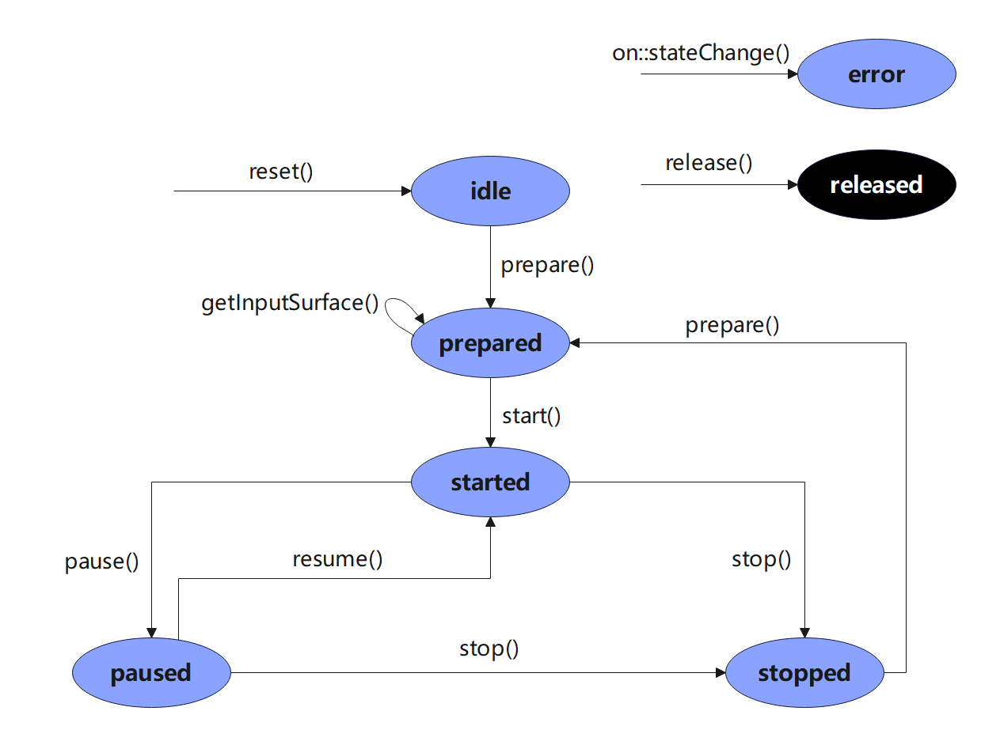
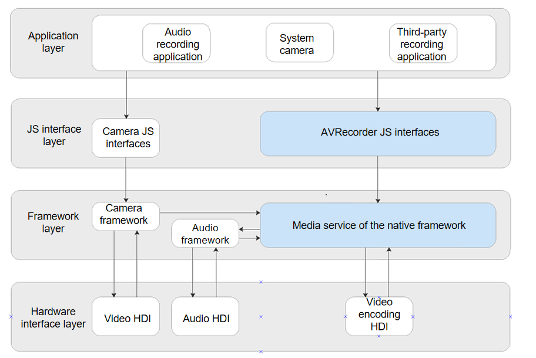

# AVRecorder Development

## Introduction

The AVRecorder captures audio signals, receives video signals, encodes audio and video signals, and saves them to files. With the AVRecorder, you can easily implement audio and video recording, including starting, pausing, resuming, and stopping recording, and releasing resources. You can also specify parameters such as the encoding format, encapsulation format, and file path for recording.

## Working Principles

The following figures show the AVRecorder state transition and the interaction with external modules for audio and video recording.

**Figure 1** AVRecorder state transition



**Figure 2** Interaction between external modules for audio and video recording



**NOTE**: During audio recording, the framework layer calls the audio subsystem through the media service of the native framework to capture audio data through the audio HDI, encodes and encapsulates the data by using software, and saves the data to a file. During video recording, the camera subsystem captures image data through the video HDI. The media service encodes the image data through the video encoding HDI and encapsulates the encoded image data into a file. With the AVRecorder, you can implement pure audio recording, pure video recording, and audio and video recording.

## Constraints

Before developing the recording feature, configure the permissions **ohos.permission.MICROPHONE** and **ohos.permission.CAMERA** for your application. For details, see [Permission Application Guide](../security/accesstoken-guidelines.md).

## How to Develop

For details about the AVRecorder APIs, see the [AVRecorder APIs in the Media Class](../reference/apis/js-apis-media.md#avrecorder9).

For details about the processes related to the media library, see [Media Library Management](../reference/apis/js-apis-medialibrary.md).

For details about the camera-related process, see [Camera Management](../reference/apis/js-apis-camera.md).

### Full-Process Scenario of Audio and Video Recording

The full audio and video recording process includes creating an instance, setting recording parameters, obtaining the input surface, starting, pausing, resuming, and stopping recording, and releasing resources.

The value range that can be set for the audio recording parameters is restricted by the codec performance of the device and the performance of the audio subsystem.

The video range that can be set for the video recording parameters is restricted by the codec performance of the device and the performance of the camera subsystem.

```
import media from '@ohos.multimedia.media'
import camera from '@ohos.multimedia.camera'
import mediaLibrary from '@ohos.multimedia.mediaLibrary'

export class AVRecorderDemo {
  private testFdNumber; // Used to save the File Descriptor (FD) address.
  
  // Obtain the FD corresponding to fileName of the recorded file. The media library capability is required. To use the media library, configure the following permissions: ohos.permission.MEDIA_LOCATION, ohos.permission.WRITE_MEDIA, and ohos.permission.READ_MEDIA.
  async getFd(fileName) {
	// For details about the implementation mode, see the media library documentation.
	this.testFdNumber = "fd://" + fdNumber.toString(); // e.g. fd://54
  }

  // Error callback triggered in the case of an error in the promise mode.
  failureCallback(error) {
      console.info('error happened, error message is ' + error.message);
  }

  // Error callback triggered in the case of an exception in the promise mode.
  catchCallback(error) {
      console.info('catch error happened, error message is ' + error.message);
  }

  async AVRecorderDemo() {
    let AVRecorder; // Assign a value to the empty AVRecorder instance upon a successful call of createAVRecorder().
    let surfaceID; // The surface ID is obtained by calling getInputSurface and transferred to the videoOutput object of the camera.
    await this.getFd('01.mp4');

    // Configure the parameters related to audio and video recording based on those supported by the hardware device.
    let avProfile = {
        audioBitrate : 48000,
        audioChannels : 2,
        audioCodec : media.CodecMimeType.AUDIO_AAC,
        audioSampleRate : 48000,
        fileFormat : media.ContainerFormatType.CFT_MPEG_4,
        videoBitrate : 2000000,
        videoCodec : media.CodecMimeType.VIDEO_MPEG4,
        videoFrameWidth : 640,
        videoFrameHeight : 480,
        videoFrameRate : 30
    }
    let avConfig = {
        audioSourceType : media.AudioSourceType.AUDIO_SOURCE_TYPE_MIC,
        videoSourceType : media.VideoSourceType.VIDEO_SOURCE_TYPE_SURFACE_YUV,
        profile : avProfile,
        url : 'fd://',
        rotation : 0,
        location : { latitude : 30, longitude : 130 }
    }
    
    // Create an AVRecorder instance.
    await media.createAVRecorder().then((recorder) => {
      console.info('case createAVRecorder called');
      if (typeof (recorder) != 'undefined') {
        AVRecorder = recorder;
        console.info('createAVRecorder success');
      } else {
        console.info('createAVRecorder failed');
      }
    }, this.failureCallback).catch(this.catchCallback);

    // After the instance is created, use the on('stateChange') and on('error') callbacks to listen for state changes and errors.
    AVRecorder.on('stateChange', async (state, reason) => {
        console.info('case state has changed, new state is :' + state);
        switch (state) {
        // Your can set the desired behavior in different states as required.
            case 'idle':
                // This state is reported upon a successful call of rest() or create().
                break;
            case 'prepared':
                // This state is reported upon a successful call of prepare().
                break;
            case 'started':
                // This state is reported upon a successful call of start().
                break;
            case 'paused':
                // This state is reported upon a successful call of pause().
                break;
            case 'stopped':
                // This state is reported upon a successful call of stop().
                break;
            case 'released':
                // This state is reported upon a successful call of release().
                break;
            case 'error':
                // The error state indicates that an error occurs at the bottom layer. You must rectify the fault and create an AVRecorder instance again.
                break;
            default:
                console.info('case state is unknown');
        }
    });
    AVRecorder.on('error', (err) => {
        // Listen for non-interface errors.
        console.info('case avRecorder.on(error) called, errMessage is ' + err.message);
    });

    // Call prepare() to prepare for recording. The bottom layer determines whether to record audio, video, or audio and video based on the input parameters of prepare().
    await AVRecorder.prepare(avConfig).then(() => {
      console.info('prepare success');
    }, this.failureCallback).catch(this.catchCallback);

    // If video recording is involved, call getInputSurface to obtain the input surface and pass the returned surface ID to the related camera API.
    await AVRecorder.getInputSurface().then((surface) => {
      console.info('getInputSurface success');
      surfaceID = surface; // The surfaceID is passed into createVideoOutput() of the camera as an input parameter.
    }, this.failureCallback).catch(this.catchCallback);

    // Video recording depends on camera-related APIs. The following operations can be performed only after the video output start API is invoked.
    // Start video recording.
    await AVRecorder.start().then(() => {
      console.info('start success');
    }, this.failureCallback).catch(this.catchCallback);

    // Pause video recording before the video output stop API of the camera is invoked.
    await AVRecorder.pause().then(() => {
      console.info('pause success');
    }, this.failureCallback).catch(this.catchCallback);

    // Resume video recording after the video output start API of the camera is invoked.
    await AVRecorder.resume().then(() => {
      console.info('resume success');
    }, this.failureCallback).catch(this.catchCallback);

    // Stop video recording after the video output stop API of the camera is invoked.
    await AVRecorder.stop().then(() => {
      console.info('stop success');
    }, this.failureCallback).catch(this.catchCallback);

    // Reset the recording configuration.
    await AVRecorder.reset().then(() => {
      console.info('reset success');
    }, this.failureCallback).catch(this.catchCallback);

   // Disable the listeners. The configured callbacks will be invalid after release() is invoked, even if you do not call off().
    AVRecorder.off('stateChange');
    AVRecorder.off('error');

    // Release the video recording resources and camera object resources.
    await AVRecorder.release().then(() => {
      console.info('release success');
    }, this.failureCallback).catch(this.catchCallback);

    // Set the AVRecorder instance to null.
    AVRecorder = undefined;
    surfaceID = undefined;
  }
}
```

### Full-Process Scenario of Pure Audio Recording

The full audio recording process includes creating an instance, setting recording parameters, starting, pausing, resuming, and stopping recording, and releasing resources.

The value range that can be set for the audio recording parameters is restricted by the codec performance of the device and the performance of the audio subsystem.

```
import media from '@ohos.multimedia.media'
import mediaLibrary from '@ohos.multimedia.mediaLibrary'

export class AudioRecorderDemo {
  private testFdNumber; // Used to save the FD address.
  
  // Obtain the FD corresponding to fileName of the recorded file. The media library capability is required. To use the media library, configure the following permissions: ohos.permission.MEDIA_LOCATION, ohos.permission.WRITE_MEDIA, and ohos.permission.READ_MEDIA.
  async getFd(fileName) {
	// For details about the implementation mode, see the media library documentation.
	this.testFdNumber = "fd://" + fdNumber.toString(); // e.g. fd://54
  }

  // Error callback triggered in the case of an error in the promise mode.
  failureCallback(error) {
      console.info('error happened, error message is ' + error.message);
  }

  // Error callback triggered in the case of an exception in the promise mode.
  catchCallback(error) {
      console.info('catch error happened, error message is ' + error.message);
  }

  async audioRecorderDemo() {
    let audioRecorder; // Assign a value to the empty AudioRecorder instance upon a successful call of createAVRecorder().
    await this.getFd('01.m4a');
    // Configure the parameters related to audio recording.
    let audioProfile = {
        audioBitrate : 48000,
        audioChannels : 2,
        audioCodec : media.CodecMimeType.AUDIO_AAC,
        audioSampleRate : 48000,
        fileFormat : media.ContainerFormatType.CFT_MPEG_4,
    }
    let audioConfig = {
        audioSourceType : media.AudioSourceType.AUDIO_SOURCE_TYPE_MIC,
        profile : audioProfile,
        url : this.testFdNumber,
        rotation : 0,
        location : { latitude : 30, longitude : 130 }
    }
    
    // Create an AudioRecorder instance.
    await media.createAVRecorder().then((recorder) => {
      console.info('case createAVRecorder called');
      if (typeof (recorder) != 'undefined') {
        audioRecorder = recorder;
        console.info('createAudioRecorder success');
      } else {
        console.info('createAudioRecorder failed');
      }
    }, this.failureCallback).catch(this.catchCallback);

    // After the instance is created, use the on('stateChange') and on('error') callbacks to listen for state changes and errors.
    audioRecorder.on('stateChange', async (state, reason) => {
        console.info('case state has changed, new state is :' + state);
        switch (state) {
        // Your can set the desired behavior in different states as required.
            case 'idle':
                // This state is reported upon a successful call of rest() or create().
                break;
            case 'prepared':
                // This state is reported upon a successful call of prepare().
                break;
            case 'started':
                // This state is reported upon a successful call of start().
                break;
            case 'paused':
                // This state is reported upon a successful call of pause().
                break;
            case 'stopped':
                // This state is reported upon a successful call of stop().
                break;
            case 'released':
                // This state is reported upon a successful call of release().
                break;
            case 'error':
                // The error state indicates that an error occurs at the bottom layer. You must rectify the fault and create an AudioRecorder instance again.
                break;
            default:
                console.info('case state is unknown');
        }
    });
    audioRecorder.on('error', (err) => {
        // Listen for non-interface errors.
        console.info('case avRecorder.on(error) called, errMessage is ' + err.message);
    });

    // Call prepare() to prepare for recording. The bottom layer determines whether to record audio, video, or audio and video based on the input parameters of prepare().
    await audioRecorder.prepare(audioConfig).then(() => {
      console.info('prepare success');
    }, this.failureCallback).catch(this.catchCallback);

    // Call start() to start audio recording.
    await audioRecorder.start().then(() => {
      console.info('start success');
    }, this.failureCallback).catch(this.catchCallback);

    // Call pause() to pause audio recording.
    await audioRecorder.pause().then(() => {
      console.info('pause success');
    }, this.failureCallback).catch(this.catchCallback);

    // Call resume() to resume audio recording.
    await audioRecorder.resume().then(() => {
      console.info('resume success');
    }, this.failureCallback).catch(this.catchCallback);

    // Call stop() to stop audio recording.
    await audioRecorder.stop().then(() => {
      console.info('stop success');
    }, this.failureCallback).catch(this.catchCallback);

    // Call reset() to reset the recording configuration.
    await audioRecorder.reset().then(() => {
      console.info('reset success');
    }, this.failureCallback).catch(this.catchCallback);

   // Disable the listeners. The configured callbacks will be invalid after release() is invoked, even if you do not call off().
    avRecorder.off('stateChange');
    avRecorder.off('error');

    // Call release() to release audio recording resources.
    await audioRecorder.release().then(() => {
      console.info('release success');
    }, this.failureCallback).catch(this.catchCallback);

    // Set the AudioRecorder instance to null.
    audioRecorder = undefined;
  }
}

```

### Full-Process Scenario of Pure Video Recording

The full video recording process includes creating an instance, setting recording parameters, obtaining the input surface, starting, pausing, resuming, and stopping recording, and releasing resources.

The video range that can be set for the video recording parameters is restricted by the codec performance of the device and the performance of the camera subsystem.

```
import media from '@ohos.multimedia.media'
import camera from '@ohos.multimedia.camera'
import mediaLibrary from '@ohos.multimedia.mediaLibrary'

export class VideoRecorderDemo {
  private testFdNumber; // Used to save the FD address.
  
  // Obtain the FD corresponding to fileName of the recorded file. The media library capability is required. To use the media library, configure the following permissions: ohos.permission.MEDIA_LOCATION, ohos.permission.WRITE_MEDIA, and ohos.permission.READ_MEDIA.
  async getFd(fileName) {
	// For details about the implementation mode, see the media library documentation.
	this.testFdNumber = "fd://" + fdNumber.toString(); // e.g. fd://54
  }

  // Error callback triggered in the case of an error in the promise mode.
  failureCallback(error) {
      console.info('error happened, error message is ' + error.message);
  }

  // Error callback triggered in the case of an exception in the promise mode.
  catchCallback(error) {
      console.info('catch error happened, error message is ' + error.message);
  }

  async videoRecorderDemo() {
    let videoRecorder; // Assign a value to the empty VideoRecorder instance upon a successful call of createAVRecorder().
    let surfaceID; // The surface ID is obtained by calling getInputSurface and transferred to the videoOutput object of the camera.
    await this.getFd('01.mp4');

    // Configure the parameters related to pure video recording based on those supported by the hardware device.
    let videoProfile = {
        fileFormat : media.ContainerFormatType.CFT_MPEG_4,
        videoBitrate : 2000000,
        videoCodec : media.CodecMimeType.VIDEO_MPEG4,
        videoFrameWidth : 640,
        videoFrameHeight : 480,
        videoFrameRate : 30
    }
    let videoConfig = {
        videoSourceType : media.VideoSourceType.VIDEO_SOURCE_TYPE_SURFACE_YUV,
        profile : videoProfile,
        url : 'fd://',
        rotation : 0,
        location : { latitude : 30, longitude : 130 }
    }
    
    // Create a VideoRecorder instance.
    await media.createAVRecorder().then((recorder) => {
      console.info('case createVideoRecorder called');
      if (typeof (recorder) != 'undefined') {
        videoRecorder = recorder;
        console.info('createVideoRecorder success');
      } else {
        console.info('createVideoRecorder failed');
      }
    }, this.failureCallback).catch(this.catchCallback);

    // After the instance is created, use the on('stateChange') and on('error') callbacks to listen for state changes and errors.
    videoRecorder.on('stateChange', async (state, reason) => {
        console.info('case state has changed, new state is :' + state);
        switch (state) {
        // Your can set the desired behavior in different states as required.
            case 'idle':
                // This state is reported upon a successful call of rest() or create().
                break;
            case 'prepared':
                // This state is reported upon a successful call of prepare().
                break;
            case 'started':
                // This state is reported upon a successful call of start().
                break;
            case 'paused':
                // This state is reported upon a successful call of pause().
                break;
            case 'stopped':
                // This state is reported upon a successful call of stop().
                break;
            case 'released':
                // This state is reported upon a successful call of release().
                break;
            case 'error':
                // The error state indicates that an error occurs at the bottom layer. You must rectify the fault and create a VideoRecorder instance again.
                break;
            default:
                console.info('case state is unknown');
        }
    });
    videoRecorder.on('error', (err) => {
        // Listen for non-interface errors.
        console.info('case avRecorder.on(error) called, errMessage is ' + err.message);
    });

    // Call prepare() to prepare for recording. The bottom layer determines whether to record audio, video, or audio and video based on the input parameters of prepare().
    await videoRecorder.prepare(videoConfig).then(() => {
      console.info('prepare success');
    }, this.failureCallback).catch(this.catchCallback);

    // If video recording is involved, call getInputSurface to obtain the input surface and pass the returned surface ID to the related camera API.
    await videoRecorder.getInputSurface().then((surface) => {
      console.info('getInputSurface success');
      surfaceID = surface; // The surfaceID is passed into createVideoOutput() of the camera as an input parameter.
    }, this.failureCallback).catch(this.catchCallback);

    // Video recording depends on camera-related APIs. The following operations can be performed only after the video output start API is invoked.
    // Start video recording.
    await videoRecorder.start().then(() => {
      console.info('start success');
    }, this.failureCallback).catch(this.catchCallback);

    // Pause video recording before the video output stop API of the camera is invoked.
    await videoRecorder.pause().then(() => {
      console.info('pause success');
    }, this.failureCallback).catch(this.catchCallback);

    // Resume video recording after the video output start API of the camera is invoked.
    await videoRecorder.resume().then(() => {
      console.info('resume success');
    }, this.failureCallback).catch(this.catchCallback);

    // Stop video recording after the video output stop API of the camera is invoked.
    await videoRecorder.stop().then(() => {
      console.info('stop success');
    }, this.failureCallback).catch(this.catchCallback);

    // Reset the recording configuration.
    await videoRecorder.reset().then(() => {
      console.info('reset success');
    }, this.failureCallback).catch(this.catchCallback);

   // Disable the listeners. The configured callbacks will be invalid after release() is invoked, even if you do not call off().
    videoRecorder.off('stateChange');
    videoRecorder.off('error');

    // Release the video recording resources and camera object resources.
    await videoRecorder.release().then(() => {
      console.info('release success');
    }, this.failureCallback).catch(this.catchCallback);

    // Set the VideoRecorder instance to null.
    videoRecorder = undefined;
    surfaceID = undefined;
  }
}
```

### AVRecorder App

The AVRecorder app provides a complete audio and video recording process, which includes creating an instance, setting recording parameters, obtaining the input surface, starting, pausing, resuming, and stopping recording, and releasing resources.

For details about the code, see [AVRecorderDemo]([multimedia_player_framework: Implementation of media playback and recording](https://gitee.com/openharmony/multimedia_player_framework/tree/master/test/appdemo/AVRecorderDemo)).
