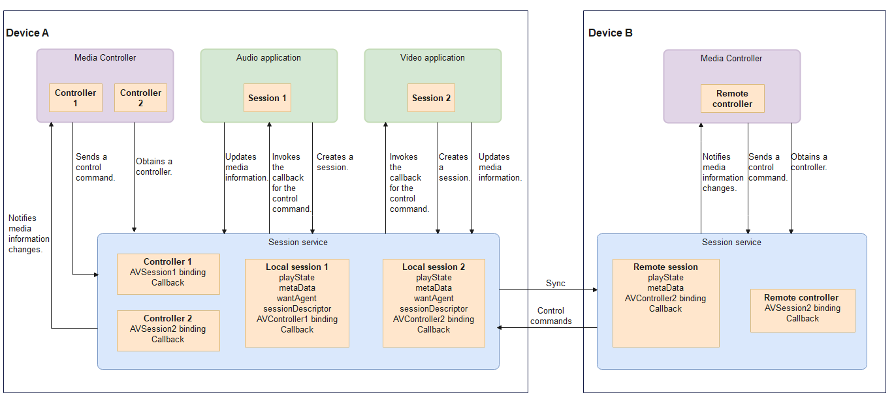

# AVSession Overview

## Overview

  AVSession, short for audio and video session, is also known as media session.
  - Application developers can use the APIs provided by the **AVSession** module to connect their audio and video applications to the system's Media Controller.
  - System developers can use the APIs provided by the **AVSession** module to display media information of system audio and video applications and carry out unified playback control.

  You can implement the following features through the **AVSession** module:

  1. Unified playback control entry

     If there are multiple audio and video applications on the device, users need to switch to and access different applications to control media playback. With AVSession, a unified playback control entry of the system (such as Media Controller) is used for playback control of these audio and video applications. No more switching is required.

  2. Better background application management

     When an application running in the background automatically starts audio playback, it is difficult for users to locate the application. With AVSession, users can quickly find the application that plays the audio clip in Media Controller.

## Basic Concepts

- AVSession

  A channel used for information exchange between applications and Media Controller. For AVSession, one end is the media application under control, and the other end is Media Controller. Through AVSession, an application can transfer the media playback information to Media Controller and receive control commands from Media Controller.
  
- AVSessionController

  Object that controls media sessions and thereby controls the playback behavior of applications. Through AVSessionController, Media Controller can control the playback behavior of applications, obtain playback information, and send control commands. It can also monitor the playback state of applications to ensure synchronization of the media session information.

- Media Controller
  
  Holder of AVSessionController. Through AVSessionController, Media Controller sends commands to control media playback of applications.

## Implementation Principle

The **AVSession** module provides two classes: **AVSession** and **AVSessionController**.

**Figure 1** AVSession interaction

- Interaction between the application and Media Controller: First, an audio application creates an **AVSession** object and sets session information, including media metadata, launcher ability, and playback state information. Then, Media Controller creates an **AVSessionController** object to obtain session-related information and send the 'play' command to the audio application. Finally, the audio application responds to the command and updates the playback state.

- Distributed projection: When a connected device creates a local session, Media Controller or the audio application can select another device to be projected based on the device list, synchronize the local session to the remote device, and generate a controllable remote session. The remote session is controlled by sending control commands to the remote device's application through its AVSessionController.

## Constraints

- The playback information displayed in Media Controller is the media information proactively written by the media application to AVSession.
- Media Controller controls the playback of a media application based on the responses of the media application to control commands.
- AVSession can transmit media playback information and control commands. It does not display information or execute control commands.
- Do not develop Media Controller for common applications. For common audio and video applications running on OpenHarmony, the default control end is Media Controller, which is a system application. You do not need to carry out additional development for Media Controller.
- If you want to develop your own system running OpenHarmony, you can develop your own Media Controller.
- For better background management of audio and video applications, the **AVSession** module enforces background control for third-party applications. Only third-party applications that have accessed AVSession can play audio in the background. Otherwise, the system forcibly pauses the playback when a third-party application switches to the background.
