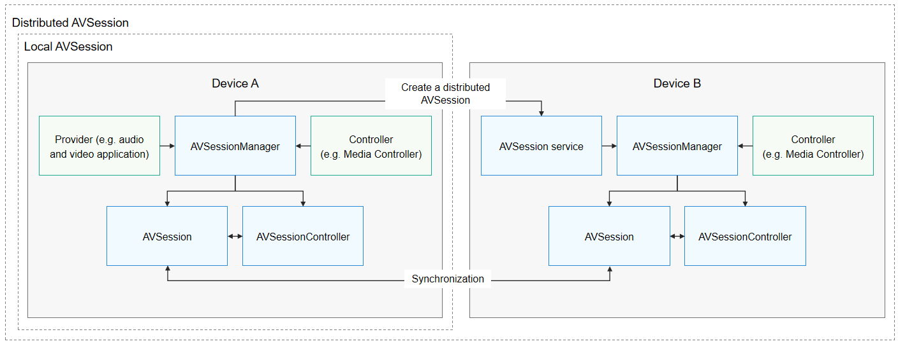

# AVSession Overview

The Audio and Video Session (AVSession) service is used to manage the playback behavior of all audio and video applications in the system in a unified manner. For example, it allows only one audio application in the playing state.

Audio and video applications access the AVSession service and send application data (for example, a song that is being played and playback state) to it. Through a controller, the user can choose another application or device to continue the playback. If an application does not access the AVSession service, its playback will be forcibly interrupted when it switches to the background.

To implement background playback, you must request a continuous task to prevent the task from being suspended. For details, see [Continuous Task](../task-management/continuous-task.md).

## Basic Concepts

Be familiar with the following basic concepts before development:

- AVSession

  For AVSession, one end is the audio and video applications under control, and the other end is a controller (for example, Media Controller or AI Voice). AVSession provides a channel for information exchange between the application and controller. 

- Provider

  An audio and video application that accesses the AVSession service. After accessing AVSession, the audio and video application must provide the media information, for example, the name of the item to play and the playback state, to AVSession. Through AVSession, the application also receives control commands from the controller and responds accordingly.

- Controller

  A system application that accesses AVSession to provide global control on audio and video playback behavior. Typical controllers on OpenHarmony devices are Media Controller and AI Voice. The following sections use Media Controller as an example of the controller. After accessing AVSession, the controller obtains the latest media information and sends control commands to the audio and video applications through AVSession.

- AVSessionController

  An object that controls the playback behavior of the provider. It obtains the playback information of the audio and video application and listens for the application playback changes to synchronize the AVSession information between the application and controller. The controller is the holder of an **AVSessionController** object.

- AVSessionManager

  An object that provides the capability of managing sessions. It can create an **AVSession** object, create an **AVSessionController** object, send control commands, and listen for session state changes.

## AVSession Interaction Process

AVSessions are classified into local AVSessions and distributed AVSessions.

- Local AVSession

  Local AVSession establishes a connection between the provider and controller in the local device, so as to implement unified playback control and media information display for audio and video applications in the system.

- Distributed AVSession

  Distributed AVSession establishes a connection between the provider and controller in the cross-device scenario, so as to implement cross-device playback control and media information display for audio and video applications in the system. For example, you can project the content played on device A to device B and perform playback control on device B.

## Constraints

The AVSession service manages the playback behavior of all audio and video applications in the system. To continue the playback after switching to the background, the audio and video applications must access the AVSession service.
