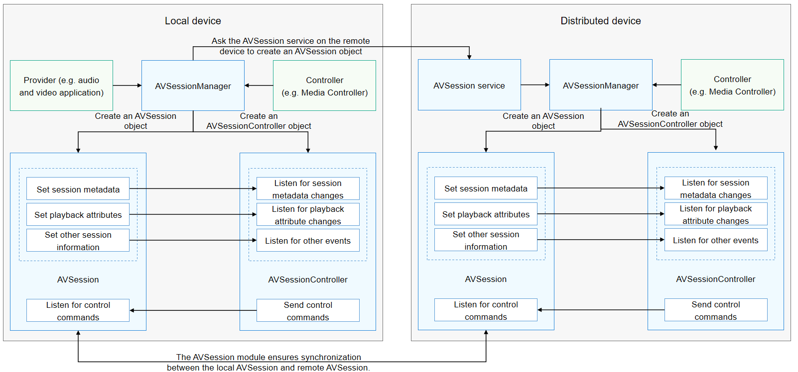

# Distributed AVSession Overview (for System Applications Only)

<!--Kit: AVSession Kit-->
<!--Subsystem: Multimedia-->
<!--Owner: @ccfriend; @devil_red-->
<!--Designer: @ccfriend-->
<!--Tester: @chenmingxi1_huawei-->
<!--Adviser: @w_Machine_cc-->
<!-- md-trans-meta sourceCommit=4575f288d13c429dbede3c0b33d0bfd71bcb7755 translatedAt=2026-08-10T03:45:54.421Z pushedAt=2026-08-10T07:41:26.398Z -->

With distributed AVSession, OpenHarmony allows users to project locally played media to a distributed device for a better playback effect. For example, users can project audio played on a tablet to a smart speaker.

After the user initiates a projection, the media information is synchronized to the distributed device in real time, and the user can control the playback (for example, previous, next, play, and pause) on the distributed device. From the perspective of the user, the playback control operation on the distributed device is the same as that on the local device.

## Interaction Process

After the local device is paired with a distributed device, the controller on the local device projects media to the distributed device through AVSessionManager, thereby implementing a distributed AVSession. The interaction process is shown below.

The AVSession service on the distributed device automatically creates an AVSession object for information synchronization with the local device. The information to synchronize includes the session information, control commands, and events.

## Distributed AVSession Process

After a user initiates distributed casting, a corresponding media session is automatically created on the controlled device. The media sessions on both sides can interact with each other in the following ways:

1. After receiving an audio device switching command, the AVSession service on the local device synchronizes the session information to the distributed device.

2. The controller (for example, Media Controller) on the distributed device detects the new AVSession object and creates an AVSessionController object for it.

3. Through the AVSessionController object, the controller on the distributed device sends a control command to the AVSession object on the local device.

4. After receiving a remote control command, the local media session on the local device notifies the local audio app through a callback.

5. The AVSession object on the local device synchronizes the new session information to the controller on the distributed device in real time.

6. After the connection to the remote device is disconnected, the audio is switched back to the local controller and paused. (The audio module completes the switchback, and the media session notifies the app to pause.)

## Distributed AVSession Scenarios

There are two scenarios for projection implemented using the distributed AVSession:

- System projection: The controller (for example, Media Controller) initiates a projection.

  This type of projection takes effect for all applications. After a system projection, all audio files on the local device are played from the distributed device by default.

- App casting: An audio/video app initiates distributed casting within the app by integrating the casting component. (This feature is not yet supported.)

  This type of projection takes effect for a single application. After an application projection, audio of the application on the local device is played from the distributed device, and audio of other applications is still played from the local device.

In addition, casting supports preemption. An app that initiates casting later can preempt the previously casting app and play audio on the remote device.

## Relationship Between Distributed AVSession and Distributed Audio Playback

When the media session service implements distributed media sessions for cross-device casting, the internal logic can be described as follows:

- APIs related to [distributed audio playback (for system applications only)](../audio/distributed-audio-playback-sys.md) are called to project audio streams to the remote device.

- The distributed capability is used to project the session metadata to the distributed device for display.

Therefore, casting through a distributed media session not only enables audio playback on the remote device, but also allows the remote device to display playback information. In addition, with the media session mechanism, you can control the audio being played on the remote device.