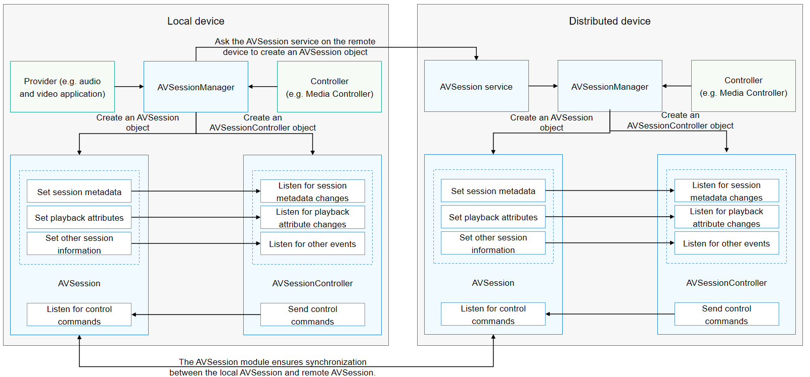

# Distributed AVSession Overview (for System Applications Only)

With distributed AVSession, OpenHarmony allows users to project locally played media to a distributed device for a better playback effect. For example, users can project audio played on a tablet to a smart speaker.

After the user initiates a projection, the media information is synchronized to the distributed device in real time, and the user can control the playback (for example, previous, next, play, and pause) on the distributed device. From the perspective of the user, the playback control operation on the distributed device is the same as that on the local device.

## Interaction Process

After the local device is paired with a distributed device, the controller on the local device projects media to the distributed device through AVSessionManager, thereby implementing a distributed AVSession. The interaction process is shown below.

The AVSession service on the distributed device automatically creates an **AVSession** object for information synchronization with the local device. The information to synchronize includes the session information, control commands, and events.

## Distributed AVSession Process

After the user triggers a projection, the remote device automatically creates an **AVSession** object to associate it with that on the local device. The detailed process is as follows:

1. After receiving an audio device switching command, the AVSession service on the local device synchronizes the session information to the distributed device.

2. The controller (for example, Media Controller) on the distributed device detects the new **AVSession** object and creates an **AVSessionController** object for it.

3. Through the **AVSessionController** object, the controller on the distributed device sends a control command to the **AVSession** object on the local device.

4. Upon the receipt of the control command, the **AVSession** object on the local device triggers a callback to the local audio application.

5. The **AVSession** object on the local device synchronizes the new session information to the controller on the distributed device in real time.

6. When the remote device is disconnected, the audio stream is switched back to the local device and the playback is paused. (The audio module completes the switchback, and the AVSession service instructs the application to pause the playback.)

## Distributed AVSession Scenarios

There are two scenarios for projection implemented using the distributed AVSession:

- System projection: The controller (for example, Media Controller) initiates a projection.

  This type of projection takes effect for all applications. After a system projection, all audio files on the local device are played from the distributed device by default.

- Application projection: An audio and video application integrates the projection component to initiate a projection. (This scenario is not supported yet.)
  
  This type of projection takes effect for a single application. After an application projection, audio of the application on the local device is played from the distributed device, and audio of other applications is still played from the local device.

Projection preemption is supported. If application A initiates a projection to a remote device and then application B initiates a projection to the same device, then audio of application B is played on the remote device.

## Relationship Between Distributed AVSession and Distributed Audio Playback

The internal logic for the distributed AVSession to implement projection is as follows:

- API related to [distributed audio playback](../audio/distributed-audio-playback.md) are called to project audio streams to the distributed device.

- The distributed capability is used to project the session metadata to the distributed device for display.

Projection implemented by using the distributed AVSession not only enables audio to be played on the distributed device, but also enables media information to be displayed on the distributed device. It also allows the user to perform playback control on the distributed device.
