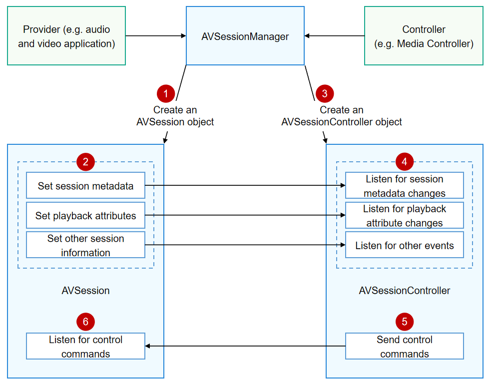

# Local AVSession Overview
<!--Kit: AVSession Kit-->
<!--Subsystem: Multimedia-->
<!--Owner: @ccfriend; @liao_qian-->
<!--SE: @ccfriend-->
<!--TSE: @chenmingxi1_huawei-->

## Interaction Process

For a local AVSession, the data sources are on the local device. The figure below illustrates the interaction process.



This process involves two roles: provider and controller.

> **NOTE**
>
> The controller must be a system application. A third-party application can be a provider.

In the local AVSession, the provider exchanges information with the controller through AVSessionManager.

1. The provider creates an AVSession object through AVSessionManager.

2. Through the AVSession object, the provider sets session metadata (such as the asset ID, title, and duration) and playback attributes (such as the playback state, speed, and position).

3. The controller creates an AVSessionController object through AVSessionManager.

4. Through the AVSessionController object, the controller listens for changes of the session metadata and playback attributes.

5. Through the AVSessionController object, the controller sends control commands to the AVSession object.

6. Through the AVSession object, the provider listens for the control commands, for example, play, playNext, fastForward, and setSpeed, from the controller.

## AVSessionManager

AVSessionManager provides the capability of managing sessions. It can create an AVSession object, create an AVSessionController object, send control commands, and listen for session state changes.

Unlike the AVSession and AVSessionController objects, AVSessionManager is not a specific object, but the root namespace of AVSessions. You can import AVSessionManager as follows:

```ts
import { avSession as AVSessionManager } from '@kit.AVSessionKit';
```

All the APIs in the root namespace can be used as APIs of AVSessionManager.

The code snippet below shows how the provider creates an AVSession object by using AVSessionManager:

> **NOTE**
>
> The sample code below demonstrates only the API call for creating an AVSession object. When actually using it, the application must ensure that the AVSession object remains throughout the application's background playback activities. This prevents the system from reclaiming or releasing it, which could lead to playback being controlled by the system.
 
```ts
import { BusinessError } from '@kit.BasicServicesKit';
import { avSession } from '@kit.AVSessionKit';
import { avSession as AVSessionManager } from '@kit.AVSessionKit';

@Entry
@Component
struct Index {
  @State message: string = 'hello world';

  build() {
    Column() {
      Text(this.message)
        .onClick(async () => {
          // Create an AVSession object.
          let context = this.getUIContext().getHostContext() as Context;
          let session: AVSessionManager.AVSession = await AVSessionManager.createAVSession(context, 'SESSION_NAME', 'audio');
          console.info(`session create done : sessionId : ${session.sessionId}`);
        })
    }
    .width('100%')
    .height('100%')
  }
}
```
<!--Del-->
The code snippet below shows how the controller creates an AVSessionController object by using AVSessionManager:

```ts
// Create an AVSessionController object.
async function createController() {
  // Obtain the descriptors of all live AVSession objects.
  let descriptorsArray: Array<AVSessionManager.AVSessionDescriptor> = await AVSessionManager.getAllSessionDescriptors();
  if (descriptorsArray.length > 0) {
    // For demonstration, the session ID of the first descriptor is used to create the AVSessionController object.
    let sessionId: string = descriptorsArray[0].sessionId;
    let avSessionController: AVSessionManager.AVSessionController = await AVSessionManager.createController(sessionId);
    console.info(`controller create done : sessionId : ${avSessionController.sessionId}`);
  }
}
```
<!--DelEnd-->

For more information about AVSessionManager APIs, see [API Reference](../../reference/apis-avsession-kit/arkts-apis-avsession.md).
