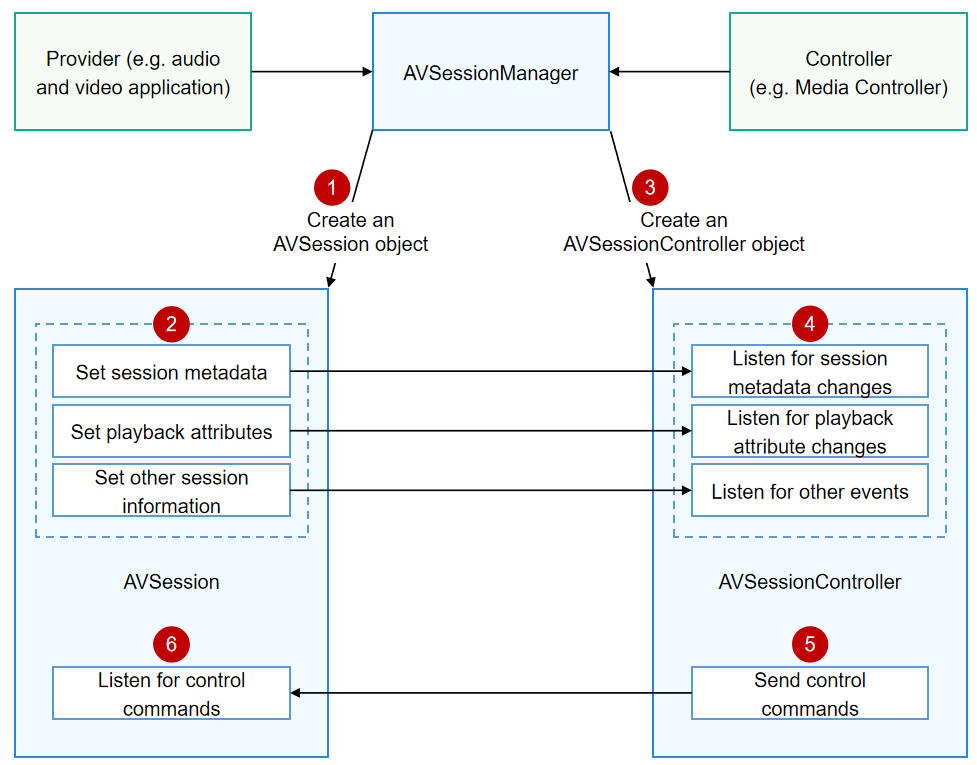

# Local AVSession Overview

<!--Kit: AVSession Kit-->
<!--Subsystem: Multimedia-->
<!--Owner: @ccfriend; @devil_red-->
<!--Designer: @ccfriend-->
<!--Tester: @chenmingxi1_huawei-->
<!--Adviser: @w_Machine_cc-->
<!-- md-trans-meta sourceCommit=9d0f59dbcae46303a4fbbc3dcb2ffb4bcae1691a translatedAt=2026-08-10T03:46:48.148Z pushedAt=2026-08-10T07:46:33.100Z -->

## Interaction Process

For a local AVSession, the data sources are on the local device. The figure below illustrates the interaction process.



This process involves two roles: provider and controller.

> **NOTE**
>
> The controller must be a system application. A third-party application can be a provider.

In the local AVSession, the provider exchanges information with the controller through AVSessionManager.

1. The provider creates an AVSession object through AVSessionManager.

2. The provider sets session metadata (such as media ID, title, and media duration) and session playback attributes (such as playback state, playback speed, and playback position) through the AVSession object.

3. The controller creates an AVSessionController object through AVSessionManager.

4. Through the AVSessionController object, the controller listens for changes of the session metadata and playback attributes.

5. Through the AVSessionController object, the controller sends control commands to the AVSession object.

6. Through the AVSession object, the provider can listen for control commands from the media session controller, for example, "play" (play), "playNext" (play next), "fastForward" (fast-forward), and "setSpeed" (set playback speed).

## AVSessionManager

AVSessionManager provides the capability of managing sessions. It can create an AVSession object, create an AVSessionController object, send control commands, and listen for session state changes.

In fact, unlike AVSession and AVSessionController objects, AVSessionManager is not a concrete object but the module namespace of the media session. In actual programming, you can import it as follows:

<!-- @[avSession_manager_import](https://gitcode.com/openharmony/applications_app_samples/blob/master/code/DocsSample/Media/AVSession/LocalAVSession/LocalAVSessionOverview/entry/src/main/ets/pages/Index.ets) -->

``` TypeScript
import { avSession as AVSessionManager } from '@kit.AVSessionKit';
```

All methods in the module namespace can be used as methods of AVSessionManager.

The code snippet below shows how the provider creates an AVSession object by using AVSessionManager:

> **NOTE**
>
> The sample code below demonstrates only the API call for creating an AVSession object. When actually using it, the app must ensure that the AVSession object instance persists throughout background playback to prevent it from being reclaimed or released by the system, which would cause the system to restrict background audio playback.

<!-- @[avSession_manager](https://gitcode.com/openharmony/applications_app_samples/blob/master/code/DocsSample/Media/AVSession/LocalAVSession/LocalAVSessionOverview/entry/src/main/ets/pages/Index.ets) -->

``` TypeScript
import { avSession as AVSessionManager } from '@kit.AVSessionKit';
@Entry
@Component
struct Index {
  @State message: string = 'hello world';

  build() {
    Column() {
      Text(this.message)
        .onClick(async () => {
          // Create an AVSession object.
          let context = this.getUIContext().getHostContext() as Context;
          let session: AVSessionManager.AVSession = await AVSessionManager.createAVSession(context, 'SESSION_NAME', 'audio');
          console.info(`session create done : sessionId : ${session.sessionId}`);
        })
    }
    .width('100%')
    .height('100%')
  }
}
```

<!--Del-->

The code snippet below shows how the controller creates an AVSessionController object by using AVSessionManager:

```ts
// Create an AVSessionController object.
async function createController() {
  // Obtain the descriptors of all live AVSession objects.
  let descriptorsArray: Array<AVSessionManager.AVSessionDescriptor> = await AVSessionManager.getAllSessionDescriptors();
  if (descriptorsArray.length > 0) {
    // For demonstration, the session ID of the first descriptor is used to create the AVSessionController object.
    let sessionId: string = descriptorsArray[0].sessionId;
    let avSessionController: AVSessionManager.AVSessionController = await AVSessionManager.createController(sessionId);
    console.info(`controller create done : sessionId : ${avSessionController.sessionId}`);
  }
}
```

<!--DelEnd-->

For more methods of AVSessionManager, see the API documentation: [Module Description](../../reference/apis-avsession-kit/arkts-apis-avsession.md).