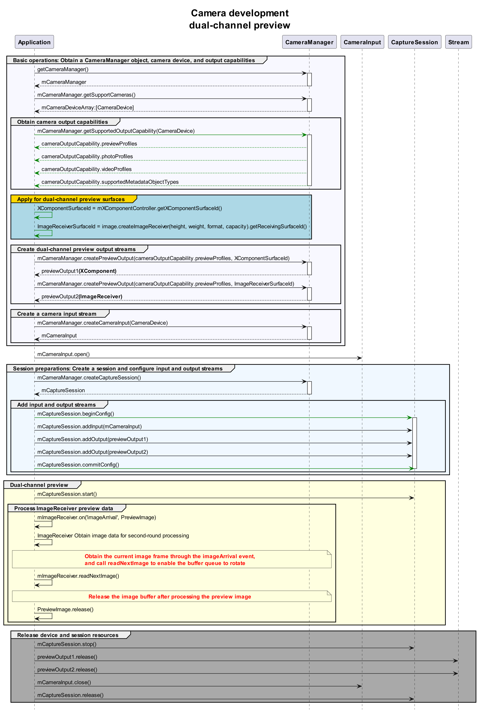

# Dual-Channel Preview (ArkTS)

The camera application controls the camera hardware to implement basic operations such as image display (preview), photo saving (photographing), and video recording. The camera model is developed on the surface model. That is, an application transfers data through the surface. Specifically, it obtains the photo stream through the surface of an **ImageReceiver** object and the preview stream through the surface of an **\<XComponent>** object.

To implement dual-channel preview (there are two preview streams instead of one preview stream plus one photo stream), you must create a **previewOutput** object through the surface of an **ImageReceiver** object. Other processes are the same as those of the photo stream and preview stream.

Read [Camera](../reference/apis/js-apis-camera.md) for the API reference.

## Constraints

- Currently, streams cannot be dynamically added. In other words, you cannot call **addOutput** to add streams without calling **session.stop** first.
- After an **ImageReceiver** object processes image data obtained, it must release the image buffer so that the buffer queue of the surface properly rotates.

## API Calling Process

The figure below shows the recommended API calling process of the dual-channel preview solution.



## How to Develop

1. Import the image module.

   Create a surface for the dual-channel preview stream. In addition to the surface of an **\<XComponent>** object, the surface ID generated by an **ImageReceiver** object is needed. The APIs provided by the image module are also needed.

   ```ts
   import image from '@ohos.multimedia.image';
   ```

2. Create a surface of the **ImageReceiver** object.

   ```ts
   async function getImageReceiverSurfaceId(): Promise<string | undefined> {
     let receiver: image.ImageReceiver = image.createImageReceiver(640, 480, 4, 8);
     console.info('before ImageReceiver check');
     let ImageReceiverSurfaceId: string | undefined = undefined;
     if (receiver !== undefined) {
       console.info('ImageReceiver is ok');
       let ImageReceiverSurfaceId: string = await receiver.getReceivingSurfaceId();
       console.info(`ImageReceived id: ${ImageReceiverSurfaceId}`);
     } else {
       console.info('ImageReceiver is not ok');
     }
     return ImageReceiverSurfaceId;
   }
   ```

3. Create a surface of an **\<XComponent>** object.

   For details, see [Camera Preview](camera-preview.md).

   ```ets
   //xxx.ets
   // Create an XComponentController object.
   @Component
   struct XComponentPage {
     // Create an XComponentController object.
     mXComponentController: XComponentController = new XComponentController;
   
     build() {
       Flex() {
         // Create an XComponent object.
         XComponent({
           id: '',
           type: 'surface',
           libraryname: '',
           controller: this.mXComponentController
         })
           .onLoad(() => {
             // Set the surface width and height (1920 x 1080). For details about how to set the preview size, see the preview resolutions supported by the current device, which are obtained from previewProfilesArray.
             this.mXComponentController.setXComponentSurfaceSize({surfaceWidth:1920,surfaceHeight:1080});
             // Obtain the surface ID.
             let surfaceId: string = this.mXComponentController.getXComponentSurfaceId();
           })
           .width('1920px')
           .height('1080px')
       }
     }
   }
   ```

4. Implement dual-channel preview.

   Call **createPreviewOutput** to transfer the two surface IDs generated in steps 2 and 3 to the camera service to create two preview streams. Develop other processes based on the normal preview process.

   ```ts
   import camera from '@ohos.multimedia.camera';

   async function createDualChannelPreview(cameraManager: camera.CameraManager, XComponentSurfaceId: string, receiver: image.ImageReceiver): Promise<void> {
     let camerasDevices: Array<camera.CameraDevice> = cameraManager.getSupportedCameras(); // Obtain the supported camera devices.
   
     // Obtain the profile object.
     let profiles: camera.CameraOutputCapability = cameraManager.getSupportedOutputCapability(camerasDevices[0]); // Obtain the profiles of the camera.
     let previewProfiles: Array<camera.Profile> = profiles.previewProfiles;
   
     // Preview stream 1.
     let previewProfilesObj: camera.Profile = previewProfiles[0];
   
     // Preview stream 2.
     let previewProfilesObj2: camera.Profile = previewProfiles[0];
   
     // Create an output object for preview stream 1.
     let previewOutput: camera.PreviewOutput = cameraManager.createPreviewOutput(previewProfilesObj, XComponentSurfaceId);
   
     // Create an output object for preview stream 2.
     let imageReceiverSurfaceId: string = await receiver.getReceivingSurfaceId();
     let previewOutput2: camera.PreviewOutput = cameraManager.createPreviewOutput(previewProfilesObj2, imageReceiverSurfaceId);
   
     // Create a CameraInput object.
     let cameraInput: camera.CameraInput = cameraManager.createCameraInput(camerasDevices[0]);
   
     // Open the camera.
     await cameraInput.open();
   
     // Create a session.
     let captureSession: camera.CaptureSession = cameraManager.createCaptureSession();
   
     // Start configuration for the session.
     captureSession.beginConfig();
   
     // Add the CameraInput object to the session.
     captureSession.addInput(cameraInput);
   
     // Add preview stream 1 to the session.
     captureSession.addOutput(previewOutput);
   
     // Add preview stream 2 to the session.
     captureSession.addOutput(previewOutput2);
   
     // Commit the configuration.
     await captureSession.commitConfig();
   
     // Start the session.
     await captureSession.start();
   }
   ```

5. Obtain preview images in real time through the **ImageReceiver** object.

   Use the **imageArrival** event of the **ImageReceiver** object to listen for and obtain image data returned by the bottom layer. For details, see [Image](../reference/apis/js-apis-image.md).

   ```ts
   import { BusinessError } from '@ohos.base';

   function onImageArrival(receiver: image.ImageReceiver): void {
     receiver.on('imageArrival', () => {
       receiver.readNextImage((err: BusinessError, nextImage: image.Image) => {
         if (err || nextImage === undefined) {
           return;
         }
         nextImage.getComponent(image.ComponentType.JPEG, (err: BusinessError, imgComponent: image.Component) => {
           if (err || imgComponent === undefined) {
             return;
           }
           if (imgComponent.byteBuffer as ArrayBuffer) {
             // do something...
           } else {
             return;
           }
         })
       })
     })
   }
   ```
