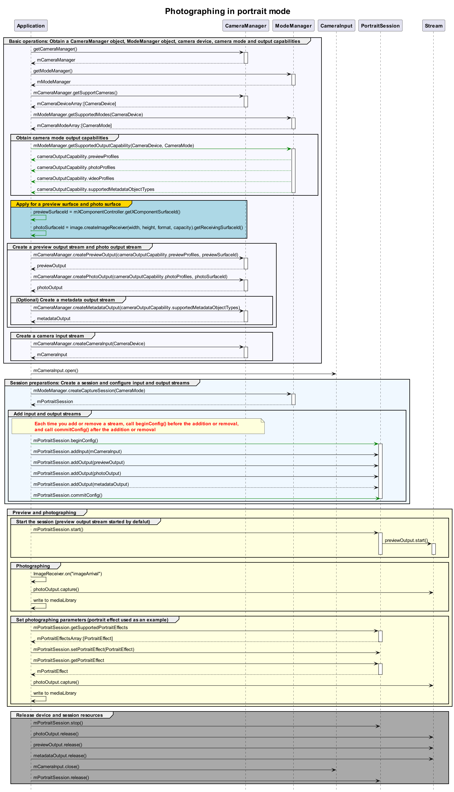

# Taking Photos in Portrait Mode

## How to Develop

Portrait mode depends on the mode manager. After obtaining the mode management capability, you can create photo streams.

Mode management, as an enhancement to **CameraManager**, is used to manage advanced camera features. The figure below illustrates the mode management development process.



## Sample Code
For details about how to obtain the BaseContext, see [BaseContext](../reference/apis/js-apis-inner-application-baseContext.md).
```ts
import camera from '@ohos.multimedia.camera';
import { BusinessError } from '@ohos.base';
import image from '@ohos.multimedia.image';
import common from '@ohos.app.ability.common';

async function cameraModeCase(baseContext: common.BaseContext, surfaceId: string): Promise<void> {
  // Create a CameraManager instance.
  let cameraManager: camera.CameraManager = camera.getCameraManager(baseContext);
  if (!cameraManager) {
    console.error("camera.getCameraManager error");
    return;
  }
  // Create a ModeManager instance.
  let modeManager: camera.ModeManager = camera.getModeManager(baseContext);
  if (!cameraManager) {
    console.error("camera.getModeManager error");
    return;
  }
  // Listen for camera status changes.
  cameraManager.on('cameraStatus', (err: BusinessError, cameraStatusInfo: camera.CameraStatusInfo) => {
    console.info(`camera : ${cameraStatusInfo.camera.cameraId}`);
    console.info(`status: ${cameraStatusInfo.status}`);
  });
  // Obtain the camera list.
  let cameraArray: Array<camera.CameraDevice> = cameraManager.getSupportedCameras();
  if (cameraArray.length <= 0) {
    console.error("cameraManager.getSupportedCameras error");
    return;
  }

  for (let index = 0; index < cameraArray.length; index++) {
    console.info('cameraId : ' + cameraArray[index].cameraId); // Obtain the camera ID.
    console.info('cameraPosition : ' + cameraArray[index].cameraPosition); // Obtain the camera position.
    console.info('cameraType : ' + cameraArray[index].cameraType); // Obtain the camera type.
    console.info('connectionType : ' + cameraArray[index].connectionType); // Obtain the camera connection type.
  }

  // Obtain the mode list.
  let cameraModeArray: Array<camera.CameraMode> = modeManager.getSupportedModes(cameraArray[0]);
  if (cameraModeArray.length <= 0) {
    console.error("modeManager.getSupportedModes error");
    return;
  }
  // Create a camera input stream.
  let cameraInput: camera.CameraInput | undefined = undefined;
  try {
    cameraInput = cameraManager.createCameraInput(cameraArray[0]);
  } catch (error) {
    let err = error as BusinessError;
    console.error('Failed to createCameraInput errorCode = ' + err.code);
  }
  // Listen for camera input errors.
  let cameraDevice: camera.CameraDevice = cameraArray[0];
  if (cameraInput === undefined) {
    return;
  }
  cameraInput.on('error', cameraDevice, (error: BusinessError) => {
    console.info(`Camera input error code: ${error.code}`);
  });

  // Open the camera.
  await cameraInput.open();

  // Obtain the output stream capabilities supported by the camera in the current mode.
  let cameraOutputCap: camera.CameraOutputCapability = modeManager.getSupportedOutputCapability(cameraArray[0], cameraModeArray[0]);
  if (!cameraOutputCap) {
    console.error("modeManager.getSupportedOutputCapability error");
    return;
  }
  console.info("outputCapability: " + JSON.stringify(cameraOutputCap));

  let previewProfilesArray: Array<camera.Profile> = cameraOutputCap.previewProfiles;
  if (!previewProfilesArray) {
    console.error("createOutput previewProfilesArray == null || undefined");
  }

  let photoProfilesArray: Array<camera.Profile> = cameraOutputCap.photoProfiles;
  if (!photoProfilesArray) {
    console.error("createOutput photoProfilesArray == null || undefined");
  }

  // Create a preview output stream. For details about the surfaceId parameter, see the XComponent. The preview stream uses the surface provided by the XComponent.
  let previewOutput: camera.PreviewOutput | undefined = undefined;
  try {
    previewOutput = cameraManager.createPreviewOutput(previewProfilesArray[0], surfaceId);
  } catch (error) {
    let err = error as BusinessError;
    console.error("Failed to create the PreviewOutput instance. error code:" + err.code);
  }
  if (previewOutput === undefined) {
    return;
  }
  // Listen for preview output errors.
  previewOutput.on('error', (error: BusinessError) => {
    console.info(`Preview output error code: ${error.code}`);
  });
  // Create an ImageReceiver instance and set photographing parameters. Wherein, the resolution must be one of the photographing resolutions supported by the current device, which are obtained from photoProfilesArray.
  let imageReceiver: image.ImageReceiver = image.createImageReceiver(1920, 1080, 4, 8);
  // Obtain the surface ID for displaying photos.
  let photoSurfaceId: string = await imageReceiver.getReceivingSurfaceId();
  // Create a photo output stream.
  let photoOutput: camera.PhotoOutput | undefined = undefined;
  try {
    photoOutput = cameraManager.createPhotoOutput(photoProfilesArray[0], photoSurfaceId);
  } catch (error) {
    let err = error as BusinessError;
    console.error('Failed to createPhotoOutput errorCode = ' + err.code);
  }
  if (photoOutput === undefined) {
    return;
  }
  // Create a portrait session.
  let portraitSession: camera.CaptureSession | undefined = undefined;
  try {
    portraitSession = modeManager.createCaptureSession(cameraModeArray[0]);
  } catch (error) {
    let err = error as BusinessError;
    console.error('Failed to create the CaptureSession instance. errorCode = ' + err.code);
  }
  if (portraitSession === undefined) {
    return;
  }
  // Listen for portrait session errors.
  portraitSession.on('error', (error: BusinessError) => {
    console.info(`Capture session error code: ${error.code}`);
  });

  // Start configuration for the session.
  try {
    portraitSession.beginConfig();
  } catch (error) {
    let err = error as BusinessError;
    console.error('Failed to beginConfig. errorCode = ' + err.code);
  }

  // Add the camera input stream to the session.
  try {
    portraitSession.addInput(cameraInput);
  } catch (error) {
    let err = error as BusinessError;
    console.error('Failed to addInput. errorCode = ' + err.code);
  }

  // Add the preview output stream to the session.
  try {
    portraitSession.addOutput(previewOutput);
  } catch (error) {
    let err = error as BusinessError;
    console.error('Failed to addOutput(previewOutput). errorCode = ' + err.code);
  }

  // Add the photo output stream to the session.
  try {
    portraitSession.addOutput(photoOutput);
  } catch (error) {
    let err = error as BusinessError;
    console.error('Failed to addOutput(photoOutput). errorCode = ' + err.code);
  }

  // Commit the session configuration.
  await portraitSession.commitConfig();

  // Start the session.
  await portraitSession.start().then(() => {
    console.info('Promise returned to indicate the session start success.');
  })

  // Obtain the supported beauty types.
  let beautyTypes: Array<camera.BeautyType> = [];
  try {
    beautyTypes = portraitSession.getSupportedBeautyTypes();
  } catch (error) {
    let err = error as BusinessError;
    console.error('Failed to get the beauty types. errorCode = ' + err.code);
  }
  if (beautyTypes.length <= 0) {
    return;
  }
  // Obtain the beautify levels of the beauty type.
  let beautyRanges: Array<number> = [];
  try {
    beautyRanges = portraitSession.getSupportedBeautyRange(beautyTypes[0]);
  } catch (error) {
    let err = error as BusinessError;
    console.error('Failed to get the beauty types ranges. errorCode = ' + err.code);
  }
  if (beautyRanges.length <= 0) {
    return;
  }
  // Set the beauty type and its level.
  try {
    portraitSession.setBeauty(beautyTypes[0], beautyRanges[0]);
  } catch (error) {
    let err = error as BusinessError;
    console.error('Failed to set the beauty type value. errorCode = ' + err.code);
  }
  // Obtain the beauty level in use.
  let beautyLevel: number = -1;
  try {
    beautyLevel = portraitSession.getBeauty(beautyTypes[0]);
  } catch (error) {
    let err = error as BusinessError;
    console.error('Failed to get the beauty type value. errorCode = ' + err.code);
  }

  if (beautyLevel === -1) {
    return;
  }
  // Obtain the supported filter types.
  let filterTypes: Array<camera.FilterType> = [];
  try {
    filterTypes = portraitSession.getSupportedFilters();
  } catch (error) {
    let err = error as BusinessError;
    console.error('Failed to get the filter types. errorCode = ' + err.code);
  }
  if (filterTypes.length <= 0) {
    return;
  }
  // Set a filter type.
  try {
    portraitSession.setFilter(filterTypes[0]);
  } catch (error) {
    let err = error as BusinessError;
    console.error('Failed to set the filter type value. errorCode = ' + err.code);
  }
  // Obtain the filter type in use.
  let filter: number = -1;
  try {
    filter = portraitSession.getFilter();
  } catch (error) {
    let err = error as BusinessError;
    console.error('Failed to get the filter type value. errorCode = ' + err.code);
  }
  if (filter === -1) {
    return;
  }

  // Obtain the supported portrait types.
  let portraitTypes: Array<camera.PortraitEffect> = [];
  try {
    let portraitSession1: camera.PortraitSession = portraitSession as camera.PortraitSession;
    portraitTypes = portraitSession1.getSupportedPortraitEffects();
  } catch (error) {
    let err = error as BusinessError;
    console.error('Failed to get the portrait effects types. errorCode = ' + err.code);
  }
  if (portraitTypes.length <= 0) {
    return;
  }
  // Set a portrait type.
  try {
    let portraitSession1: camera.PortraitSession = portraitSession as camera.PortraitSession;
    portraitSession1.setPortraitEffect(portraitTypes[0]);
  } catch (error) {
    let err = error as BusinessError;
    console.error('Failed to set the portrait effects value. errorCode = ' + err.code);
  }
  // Obtain the portrait type in use.
  let effect: camera.PortraitEffect | undefined = undefined;
  try {
    let portraitSession1: camera.PortraitSession = portraitSession as camera.PortraitSession;
    effect = portraitSession1.getPortraitEffect();
  } catch (error) {
    let err = error as BusinessError;
    console.error('Failed to get the portrait effects value. errorCode = ' + err.code);
  }

  let captureSettings: camera.PhotoCaptureSetting = {
    quality: camera.QualityLevel.QUALITY_LEVEL_HIGH,
    rotation: camera.ImageRotation.ROTATION_0,
    mirror: false
  };
  // Use the current photographing settings to take photos.
  photoOutput.capture(captureSettings, async (err: BusinessError) => {
    if (err) {
      console.error('Failed to capture the photo ${err.message}');
      return;
    }
    console.info('Callback invoked to indicate the photo capture request success.');
  });
  // Stop the session.
  portraitSession.stop();

  // Release the camera input stream.
  cameraInput.close();

  // Release the preview output stream.
  previewOutput.release();

  // Release the photo output stream.
  photoOutput.release();

  // Release the session.
  portraitSession.release();

  // Set the session to null.
  portraitSession = undefined;
}
```
