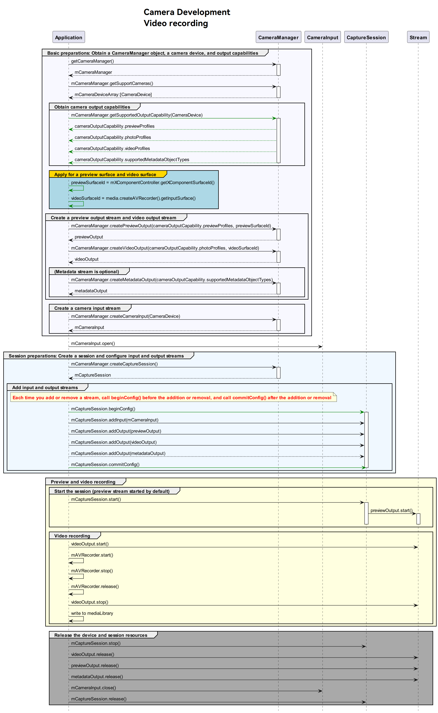

# Camera Recording Sample

## Development Process

After obtaining the output stream capabilities supported by the camera, create a video stream. The development process is as follows:




## Sample Code

```ts
import camera from '@ohos.multimedia.camera'
import media from '@ohos.multimedia.media'

// Create a CameraManager instance.
context: any = getContext(this)
let cameraManager = camera.getCameraManager(this.context)
if (!cameraManager) {
    console.error("camera.getCameraManager error")
    return;
} 

// Listen for camera status changes.
cameraManager.on('cameraStatus', (cameraStatusInfo) => {
    console.log(`camera : ${cameraStatusInfo.camera.cameraId}`);
    console.log(`status: ${cameraStatusInfo.status}`);
})

// Obtain the output stream capabilities supported by the camera.
let cameraOutputCap = cameraManager.getSupportedOutputCapability(cameraArray[0]);
if (!cameraOutputCap) {
    console.error("cameraManager.getSupportedOutputCapability error")
    return;
}
console.log("outputCapability: " + JSON.stringify(cameraOutputCap));

let previewProfilesArray = cameraOutputCap.previewProfiles;
if (!previewProfilesArray) {
    console.error("createOutput previewProfilesArray == null || undefined")
} 

let photoProfilesArray = cameraOutputCap.photoProfiles;
if (!photoProfilesArray) {
    console.error("createOutput photoProfilesArray == null || undefined")
} 

let videoProfilesArray = cameraOutputCap.videoProfiles;
if (!videoProfilesArray) {
    console.error("createOutput videoProfilesArray == null || undefined")
} 

let metadataObjectTypesArray = cameraOutputCap.supportedMetadataObjectTypes;
if (!metadataObjectTypesArray) {
    console.error("createOutput metadataObjectTypesArray == null || undefined")
}

// Configure the parameters based on those supported by the hardware device.
let AVRecorderProfile = {
    audioBitrate : 48000,
    audioChannels : 2,
    audioCodec : media.CodecMimeType.AUDIO_AAC,
    audioSampleRate : 48000,
    fileFormat : media.ContainerFormatType.CFT_MPEG_4,
    videoBitrate : 2000000,
    videoCodec : media.CodecMimeType.VIDEO_MPEG4,
    videoFrameWidth : 640,
    videoFrameHeight : 480,
    videoFrameRate : 30
}
let AVRecorderConfig = {
    audioSourceType : media.AudioSourceType.AUDIO_SOURCE_TYPE_MIC,
    videoSourceType : media.VideoSourceType.VIDEO_SOURCE_TYPE_SURFACE_YUV,
    profile : AVRecorderProfile,
    url : 'fd://', // Before passing in a file descriptor to this parameter, the file must be created by the caller and granted with the read and write permissions. Example value: eg.fd://45--file:///data/media/01.mp4.
    rotation: 0, // The value can be 0, 90, 180, or 270. If any other value is used, prepare() reports an error.
    location : { latitude : 30, longitude : 130 }
}

let avRecorder
media.createAVRecorder((error, recorder) => {
   if (recorder != null) {
       avRecorder = recorder;
       console.log('createAVRecorder success');
   } else {
       console.log(`createAVRecorder fail, error:${error}`);
   }
});

avRecorder.prepare(AVRecorderConfig, (err) => {
    if (err == null) {
        console.log('prepare success');
    } else {
        console.log('prepare failed and error is ' + err.message);
    }
})

let videoSurfaceId = null; // The surfaceID is passed in to the camera API to create a VideoOutput instance.
avRecorder.getInputSurface((err, surfaceId) => {
    if (err == null) {
        console.log('getInputSurface success');
        videoSurfaceId = surfaceId;
    } else {
        console.log('getInputSurface failed and error is ' + err.message);
    }
});

// Create a VideoOutput instance.
let videoOutput
try {
    videoOutput = cameraManager.createVideoOutput(videoProfilesArray[0], videoSurfaceId)
} catch (error) {
    console.error('Failed to create the videoOutput instance. errorCode = ' + error.code);
}

// Listen for video output errors.
videoOutput.on('error', (error) => {
    console.log(`Preview output error code: ${error.code}`);
})

// Create a session.
let captureSession
try {
    captureSession = cameraManager.createCaptureSession()
} catch (error) {
    console.error('Failed to create the CaptureSession instance. errorCode = ' + error.code);
}

// Listen for session errors.
captureSession.on('error', (error) => {
    console.log(`Capture session error code: ${error.code}`);
})

// Start configuration for the session.
try {
    captureSession.beginConfig()
} catch (error) {
    console.error('Failed to beginConfig. errorCode = ' + error.code);
}

// Obtain the camera list.
let cameraArray = cameraManager.getSupportedCameras();
if (cameraArray.length <= 0) {
    console.error("cameraManager.getSupportedCameras error")
    return;
}

// Create a camera input stream.
let cameraInput
try {
    cameraInput = cameraManager.createCameraInput(cameraArray[0]);
} catch (error) {
   console.error('Failed to createCameraInput errorCode = ' + error.code);
}

// Listen for camera input errors.
let cameraDevice = cameraArray[0];
cameraInput.on('error', cameraDevice, (error) => {
    console.log(`Camera input error code: ${error.code}`);
})

// Open the camera.
await cameraInput.open();

// Add the camera input stream to the session.
try {
    captureSession.addInput(cameraInput)
} catch (error) {
    console.error('Failed to addInput. errorCode = ' + error.code);
}

// Create a preview output stream. For details about the surfaceId parameter, see the XComponent. The preview stream is the surface provided by the XComponent.
let previewOutput
try {
    previewOutput = cameraManager.createPreviewOutput(previewProfilesArray[0], surfaceId)
} catch (error) {
    console.error("Failed to create the PreviewOutput instance.")
}

// Add the preview input stream to the session.
try {
    captureSession.addOutput(previewOutput)
} catch (error) {
    console.error('Failed to addOutput(previewOutput). errorCode = ' + error.code);
}

// Add a video output stream to the session.
try {
    captureSession.addOutput(videoOutput)
} catch (error) {
    console.error('Failed to addOutput(videoOutput). errorCode = ' + error.code);
}

// Commit the session configuration.
await captureSession.commitConfig()

// Start the session.
await captureSession.start().then(() => {
    console.log('Promise returned to indicate the session start success.');
})

// Start the video output stream.
videoOutput.start(async (err) => {
    if (err) {
        console.error('Failed to start the video output ${err.message}');
        return;
    }
    console.log('Callback invoked to indicate the video output start success.');
});

// Start video recording.
avRecorder.start().then(() => {
    console.log('videoRecorder start success');
})

// Stop the video output stream.
videoOutput.stop((err) => {
    if (err) {
        console.error('Failed to stop the video output ${err.message}');
        return;
    }
    console.log('Callback invoked to indicate the video output stop success.');
});

// Stop video recording.
avRecorder.stop().then(() => {
    console.log('stop success');
})

// Stop the session.
captureSession.stop()

// Release the camera input stream.
cameraInput.close()

// Release the preview output stream.
previewOutput.release()

// Release the video output stream.
videoOutput.release()

// Release the session.
captureSession.release()

// Set the session to null.
captureSession = null
```
