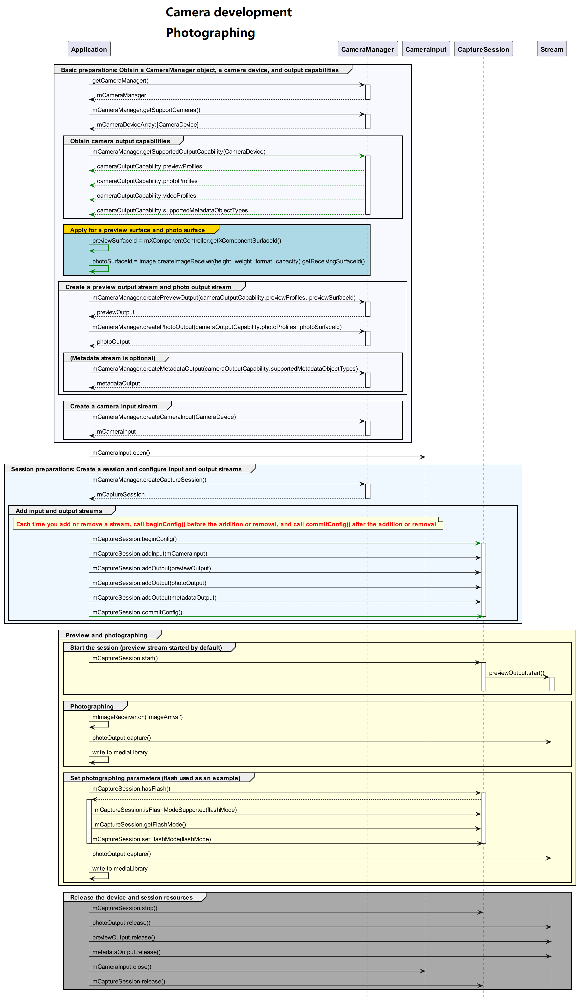

# Camera Photographing Sample

## Development Process

After obtaining the output stream capabilities supported by the camera, create a photo stream. The development process is as follows:



## Sample Code
For details about how to obtain the BaseContext, see [BaseContext](../reference/apis/js-apis-inner-application-baseContext.md).
```ts
import camera from '@ohos.multimedia.camera';
import image from '@ohos.multimedia.image';
import { BusinessError } from '@ohos.base';
import common from '@ohos.app.ability.common';

async function cameraShootingCase(baseContext: common.BaseContext, surfaceId: string): Promise<void> {
  // Create a CameraManager instance.
  let cameraManager: camera.CameraManager = camera.getCameraManager(baseContext);
  if (!cameraManager) {
    console.error("camera.getCameraManager error");
    return;
  }
  // Listen for camera status changes.
  cameraManager.on('cameraStatus', (err: BusinessError, cameraStatusInfo: camera.CameraStatusInfo) => {
    console.info(`camera : ${cameraStatusInfo.camera.cameraId}`);
    console.info(`status: ${cameraStatusInfo.status}`);
  });

  // Obtain the camera list.
  let cameraArray: Array<camera.CameraDevice> = cameraManager.getSupportedCameras();
  if (cameraArray.length <= 0) {
    console.error("cameraManager.getSupportedCameras error");
    return;
  }

  for (let index = 0; index < cameraArray.length; index++) {
    console.info('cameraId : ' + cameraArray[index].cameraId);                          // Obtain the camera ID.
    console.info('cameraPosition : ' + cameraArray[index].cameraPosition);              // Obtain the camera position.
    console.info('cameraType : ' + cameraArray[index].cameraType);                      // Obtain the camera type.
    console.info('connectionType : ' + cameraArray[index].connectionType);              // Obtain the camera connection type.
  }

  // Create a camera input stream.
  let cameraInput: camera.CameraInput | undefined = undefined;
  try {
    cameraInput = cameraManager.createCameraInput(cameraArray[0]);
  } catch (error) {
    let err = error as BusinessError;
    console.error('Failed to createCameraInput errorCode = ' + err.code);
  }
  if (cameraInput === undefined) {
    return;
  }

  // Listen for camera input errors.
  let cameraDevice: camera.CameraDevice = cameraArray[0];
  cameraInput.on('error', cameraDevice, (error: BusinessError) => {
    console.info(`Camera input error code: ${error.code}`);
  })

  // Open the camera.
  await cameraInput.open();

  // Obtain the output stream capabilities supported by the camera.
  let cameraOutputCap: camera.CameraOutputCapability = cameraManager.getSupportedOutputCapability(cameraArray[0]);
  if (!cameraOutputCap) {
    console.error("cameraManager.getSupportedOutputCapability error");
    return;
  }
  console.info("outputCapability: " + JSON.stringify(cameraOutputCap));

  let previewProfilesArray: Array<camera.Profile> = cameraOutputCap.previewProfiles;
  if (!previewProfilesArray) {
    console.error("createOutput previewProfilesArray == null || undefined");
  }

  let photoProfilesArray: Array<camera.Profile> = cameraOutputCap.photoProfiles;
  if (!photoProfilesArray) {
    console.error("createOutput photoProfilesArray == null || undefined");
  }

  // Create a preview output stream. For details about the surfaceId parameter, see the XComponent. The preview stream uses the surface provided by the XComponent.
  let previewOutput: camera.PreviewOutput | undefined = undefined;
  try {
    previewOutput = cameraManager.createPreviewOutput(previewProfilesArray[0], surfaceId);
  } catch (error) {
    let err = error as BusinessError;
    console.error(`Failed to create the PreviewOutput instance. error code: ${err.code}`);
  }
  if (previewOutput === undefined) {
    return;
  }
  // Listen for preview output errors.
  previewOutput.on('error', (error: BusinessError) => {
    console.info(`Preview output error code: ${error.code}`);
  });

  // Create an ImageReceiver instance and set photographing parameters. Wherein, the resolution must be one of the photographing resolutions supported by the current device, which are obtained from photoProfilesArray.
  let imageReceiver: image.ImageReceiver = image.createImageReceiver(1920, 1080, 4, 8);
  // Obtain the surface ID for displaying photos.
  let photoSurfaceId: string = await imageReceiver.getReceivingSurfaceId();
  // Create a photo output stream.
  let photoOutput: camera.PhotoOutput | undefined = undefined;
  try {
    photoOutput = cameraManager.createPhotoOutput(photoProfilesArray[0], photoSurfaceId);
  } catch (error) {
    let err = error as BusinessError;
    console.error('Failed to createPhotoOutput errorCode = ' + err.code);
  }
  if (photoOutput === undefined) {
    return;
  }
  // Create a session.
  let captureSession: camera.CaptureSession | undefined = undefined;
  try {
    captureSession = cameraManager.createCaptureSession();
  } catch (error) {
    let err = error as BusinessError;
    console.error('Failed to create the CaptureSession instance. errorCode = ' + err.code);
  }
  if (captureSession === undefined) {
    return;
  }
  // Listen for session errors.
  captureSession.on('error', (error: BusinessError) => {
    console.info(`Capture session error code: ${error.code}`);
  });

  // Start configuration for the session.
  try {
    captureSession.beginConfig();
  } catch (error) {
    let err = error as BusinessError;
    console.error('Failed to beginConfig. errorCode = ' + err.code);
  }

  // Add the camera input stream to the session.
  try {
    captureSession.addInput(cameraInput);
  } catch (error) {
    let err = error as BusinessError;
    console.error('Failed to addInput. errorCode = ' + err.code);
  }

  // Add the preview output stream to the session.
  try {
    captureSession.addOutput(previewOutput);
  } catch (error) {
    let err = error as BusinessError;
    console.error('Failed to addOutput(previewOutput). errorCode = ' + err.code);
  }

  // Add the photo output stream to the session.
  try {
    captureSession.addOutput(photoOutput);
  } catch (error) {
    let err = error as BusinessError;
    console.error('Failed to addOutput(photoOutput). errorCode = ' + err.code);
  }

  // Commit the session configuration.
  await captureSession.commitConfig();

  // Start the session.
  await captureSession.start().then(() => {
    console.info('Promise returned to indicate the session start success.');
  });
  // Check whether the camera has flash.
  let flashStatus: boolean = false;
  try {
    flashStatus = captureSession.hasFlash();
  } catch (error) {
    let err = error as BusinessError;
    console.error('Failed to hasFlash. errorCode = ' + err.code);
  }
  console.info('Promise returned with the flash light support status:' + flashStatus);

  if (flashStatus) {
    // Check whether the auto flash mode is supported.
    let flashModeStatus: boolean = false;
    try {
      let status: boolean = captureSession.isFlashModeSupported(camera.FlashMode.FLASH_MODE_AUTO);
      flashModeStatus = status;
    } catch (error) {
      let err = error as BusinessError;
      console.error('Failed to check whether the flash mode is supported. errorCode = ' + err.code);
    }
    if(flashModeStatus) {
      // Set the flash mode to auto.
      try {
        captureSession.setFlashMode(camera.FlashMode.FLASH_MODE_AUTO);
      } catch (error) {
        let err = error as BusinessError;
        console.error('Failed to set the flash mode. errorCode = ' + err.code);
      }
    }
  }

  // Check whether the continuous auto focus is supported.
  let focusModeStatus: boolean = false;
  try {
    let status: boolean = captureSession.isFocusModeSupported(camera.FocusMode.FOCUS_MODE_CONTINUOUS_AUTO);
    focusModeStatus = status;
  } catch (error) {
    let err = error as BusinessError;
    console.error('Failed to check whether the focus mode is supported. errorCode = ' + err.code);
  }

  if (focusModeStatus) {
    // Set the focus mode to continuous auto focus.
    try {
      captureSession.setFocusMode(camera.FocusMode.FOCUS_MODE_CONTINUOUS_AUTO);
    } catch (error) {
      let err = error as BusinessError;
      console.error('Failed to set the focus mode. errorCode = ' + err.code);
    }
  }

  // Obtain the zoom ratio range supported by the camera.
  let zoomRatioRange: Array<number> = [];
  try {
    zoomRatioRange = captureSession.getZoomRatioRange();
  } catch (error) {
    let err = error as BusinessError;
    console.error('Failed to get the zoom ratio range. errorCode = ' + err.code);
  }
  if (zoomRatioRange.length <= 0) {
    return;
  }
  // Set a zoom ratio.
  try {
    captureSession.setZoomRatio(zoomRatioRange[0]);
  } catch (error) {
    let err = error as BusinessError;
    console.error('Failed to set the zoom ratio value. errorCode = ' + err.code);
  }
  let photoCaptureSetting: camera.PhotoCaptureSetting = {
    quality: camera.QualityLevel.QUALITY_LEVEL_HIGH, // Set the photo quality to high.
    rotation: camera.ImageRotation.ROTATION_0 // Set the rotation angle of the photo to 0.
  }
  // Use the current photographing settings to take photos.
  photoOutput.capture(photoCaptureSetting, (err: BusinessError) => {
    if (err) {
      console.error('Failed to capture the photo ${err.message}');
      return;
    }
    console.info('Callback invoked to indicate the photo capture request success.');
  });
  // Stop the session.
  captureSession.stop();

  // Release the camera input stream.
  cameraInput.close();

  // Release the preview output stream.
  previewOutput.release();

  // Release the photo output stream.
  photoOutput.release();

  // Release the session.
  captureSession.release();

  // Set the session to null.
  captureSession = undefined;
}
```
