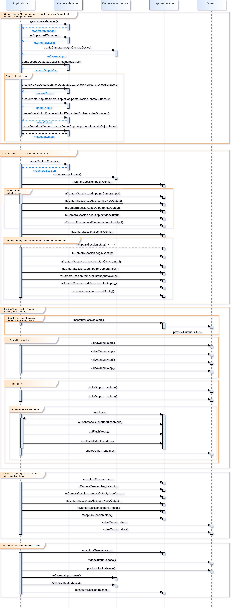

# Camera Development

## When to Use

With the APIs provided by the **Camera** module, you can access and operate camera devices and develop new functions. Common operations include preview, photographing, and video recording. You can also implement flash control, exposure time control, focus mode control, zooming control, and many others.

Before calling camera APIs, be familiar with the following concepts:

- **Static camera capabilities**: A series of parameters used to describe inherent capabilities of a camera, such as orientation and supported resolution.
- **Physical camera**: An independent camera device. The physical camera ID is a string that uniquely identifies a physical camera.
- **Asynchronous operation**: To prevent the UI thread from being blocked, most **Camera** calls are asynchronous. Each API provides the callback and promise functions.

## How to Develop

### Available APIs

For details about the APIs, see [Camera Management](../reference/apis/js-apis-camera.md).

### Full-Process Scenario

The full process includes applying for permissions, creating an instance, setting parameters, managing sessions, taking photos, recording videos, and releasing resources.

#### Applying for Permissions

You must apply for the permission for your application to access the camera device and other functions. The following table lists camera-related permissions.

| Permission| Attribute Value                    |
| -------- | ------------------------------ |
| Camera| ohos.permission.CAMERA         |
| Call recording| ohos.permission.MICROPHONE     |
| Storage| ohos.permission.WRITE_MEDIA    |
| Read| ohos.permission.READ_MEDIA     |
| Location| ohos.permission.MEDIA_LOCATION |

The code snippet is as follows:

```typescript
const PERMISSIONS: Array<string> = [
    'ohos.permission.CAMERA',
    'ohos.permission.MICROPHONE',
    'ohos.permission.MEDIA_LOCATION',
    'ohos.permission.READ_MEDIA',
    'ohos.permission.WRITE_MEDIA'
]

function applyPermission() {
        console.info('[permission] get permission');
        globalThis.abilityContext.requestPermissionFromUser(PERMISSIONS)
    }
```

#### Creating an Instance

You must create an independent **CameraManager** instance before performing camera operations. If this operation fails, the camera may be occupied or unusable. If the camera is occupied, wait until it is released. You can call **getSupportedCameras()** to obtain the list of cameras supported by the current device. The list stores all camera IDs of the current device. If the list is not empty, each ID in the list can be used to create an independent camera instance. If the list is empty, no camera is available for the current device and subsequent operations cannot be performed. The camera has preview, shooting, video recording, and metadata streams. You can use **getSupportedOutputCapability()** to obtain the output stream capabilities of the camera and configure them in the **profile** field in **CameraOutputCapability**. The procedure for creating a **CameraManager** instance is as follows:

```typescript
import camera from '@ohos.multimedia.camera'
import image from '@ohos.multimedia.image'
import media from '@ohos.multimedia.media'

// Create a CameraManager object.
context: any = getContext(this)
let cameraManager = await camera.getCameraManager(this.context)
if (!cameraManager) {
    console.error('Failed to get the CameraManager instance');
}

// Obtain the camera list.
let cameraArray = await cameraManager.getSupportedCameras()
if (!cameraArray) {
    console.error('Failed to get the cameras');
}

for (let index = 0; index < cameraArray.length; index++) {
    console.log('cameraId : ' + cameraArray[index].cameraId)                          // Obtain the camera ID.
    console.log('cameraPosition : ' + cameraArray[index].cameraPosition)              // Obtain the camera position.
    console.log('cameraType : ' + cameraArray[index].cameraType)                      // Obtain the camera type.
    console.log('connectionType : ' + cameraArray[index].connectionType)              // Obtain the camera connection type.
}

// Create a camera input stream.
let cameraInput = await cameraManager.createCameraInput(cameraArray[0])

// Open camera
await cameraInput.open();

// Obtain the output stream capabilities supported by the camera.
let cameraOutputCap = await cameraManager.getSupportedOutputCapability(cameraArray[0]);
if (!cameraOutputCap) {
    console.error("outputCapability outputCapability == null || undefined")
} else {
    console.info("outputCapability: " + JSON.stringify(cameraOutputCap));
}

let previewProfilesArray = cameraOutputCap.GetPreviewProfiles();
if (!previewProfilesArray) {
    console.error("createOutput previewProfilesArray == null || undefined")
} 

let photoProfilesArray = cameraOutputCap.GetPhotoProfiles();
if (!photoProfilesArray) {
    console.error("createOutput photoProfilesArray == null || undefined")
} 

let videoProfilesArray = cameraOutputCap.GetVideoProfiles();
if (!videoProfilesArray) {
    console.error("createOutput videoProfilesArray == null || undefined")
} 

let metadataObjectTypesArray = cameraOutputCap.GetSupportedMetadataObjectType();
if (!metadataObjectTypesArray) {
    console.error("createOutput metadataObjectTypesArray == null || undefined")
}

// Create a preview stream. For details about the surfaceId parameter, see the XComponent section. The preview stream is the surface provided by the XComponent.
let previewOutput = await cameraManager.createPreviewOutput(previewProfilesArray[0], surfaceId)
if (!previewOutput) {
    console.error("Failed to create the PreviewOutput instance.")
}

// Create an ImageReceiver object and set photo parameters. The resolution is set based on the photographing resolutions supported by the current device, which are obtained by photoProfilesArray.
let imageReceiver = await image.createImageReceiver(1920, 1080, 4, 8)
// Obtain the surface ID for displaying the photos.
let photoSurfaceId = await imageReceiver.getReceivingSurfaceId()
// Create a photographing output stream.
let photoOutput = await cameraManager.createPhotoOutput(photoProfilesArray[0], photoSurfaceId)
if (!photoOutput) {
    console.error('Failed to create the PhotoOutput instance.');
    return;
}

// Define video recording parameters.
let videoConfig = {
    audioSourceType: 1,
    videoSourceType: 1,
    profile: {
        audioBitrate: 48000,
        audioChannels: 2,
        audioCodec: 'audio/mp4v-es',
        audioSampleRate: 48000,
        durationTime: 1000,
        fileFormat: 'mp4',
        videoBitrate: 48000,
        videoCodec: 'video/mp4v-es',
        videoFrameWidth: 640,
        videoFrameHeight: 480,
        videoFrameRate: 30
    },
    url: 'file:///data/media/01.mp4',
    orientationHint: 0,
    maxSize: 100,
    maxDuration: 500,
    rotation: 0
}

// Create a video recording output stream.
let videoRecorder
media.createVideoRecorder().then((recorder) => {
    console.log('createVideoRecorder called')
    videoRecorder = recorder
})
// Set video recording parameters.
videoRecorder.prepare(videoConfig)
// Obtain the surface ID for video recording.
let videoSurfaceId
videoRecorder.getInputSurface().then((id) => {
    console.log('getInputSurface called')
    videoSurfaceId = id
})

// Create a VideoOutput object.
let videoOutput = await cameraManager.createVideoOutput(videoProfilesArray[0], videoSurfaceId)
if (!videoOutput) {
    console.error('Failed to create the videoOutput instance.');
    return;
}
```
Surfaces must be created in advance for the preview, shooting, and video recording stream. The preview stream is the surface provided by the **XComponent**, the shooting stream is the surface provided by **ImageReceiver**, and the video recording stream is the surface provided by **VideoRecorder**.

**XComponent**

```typescript
mXComponentController: XComponentController = new XComponentController                   // Create an XComponentController.

build() {
    Flex() {
        XComponent({                                                                     // Create an XComponent.
            id: '',
            type: 'surface',
            libraryname: '',
            controller: this.mXComponentController
        })
        .onload(() => {                                                                  // Set the onload callback.
            // Set the surface width and height (1920 x 1080). For details about how to set the preview size, see the preview resolutions supported by the current device, which are obtained by previewProfilesArray.
            this.mXComponentController.setXComponentSurfaceSize({surfaceWidth:1920,surfaceHeight:1080})
            // Obtain the surface ID.
            globalThis.surfaceId = mXComponentController.getXComponentSurfaceId()
        })
        .width('1920px')                                                                 // Set the width of the XComponent.
        .height('1080px')                                                                // Set the height of the XComponent.
    }
}
```

**ImageReceiver**

```typescript
function getImageReceiverSurfaceId() {
    let receiver = image.createImageReceiver(640, 480, 4, 8)
    console.log(TAG + 'before ImageReceiver check')
    if (receiver !== undefined) {
      console.log('ImageReceiver is ok')
      surfaceId1 = receiver.getReceivingSurfaceId()
      console.log('ImageReceived id: ' + JSON.stringify(surfaceId1))
    } else {
      console.log('ImageReceiver is not ok')
    }
  }
```

**VideoRecorder**

```typescript
function getVideoRecorderSurface() {
        await getFd('CameraManager.mp4');
        mVideoConfig.url = mFdPath;
        media.createVideoRecorder((err, recorder) => {
            console.info('Entering create video receiver')
            mVideoRecorder = recorder
            console.info('videoRecorder is :' + JSON.stringify(mVideoRecorder))
            console.info('videoRecorder.prepare called.')
            mVideoRecorder.prepare(mVideoConfig, (err) => {
                console.info('videoRecorder.prepare success.')
                mVideoRecorder.getInputSurface((err, id) => {
                    console.info('getInputSurface called')
                    mVideoSurface = id
                    console.info('getInputSurface surfaceId: ' + JSON.stringify(mVideoSurface))
                })
            })
        })
    }
```

#### Managing Sessions

##### Creating a Session

```typescript
// Create a session.
let captureSession = await camera.createCaptureSession()
if (!captureSession) {
    console.error('Failed to create the CaptureSession instance.');
    return;
}
console.log('Callback returned with the CaptureSession instance.' + session);

// Start configuration for the session.
await captureSession.beginConfig()

// Add the camera input stream to the session.
await captureSession.addInput(cameraInput)

// Add the preview input stream to the session.
await captureSession.addOutput(previewOutput)

// Add the photographing output stream to the session.
await captureSession.addOutput(photoOutput)

// Commit the session configuration.
await captureSession.commitConfig()

// Start the session.
await captureSession.start().then(() => {
    console.log('Promise returned to indicate the session start success.');
})
```

##### Switching a Session

```typescript
// Stop the session.
await captureSession.stop()

// Start configuration for the session.
await captureSession.beginConfig()

// Remove the photographing output stream from the session.
await captureSession.removeOutput(photoOutput)

// Add a video recording output stream to the session.
await captureSession.addOutput(videoOutput)

// Commit the session configuration.
await captureSession.commitConfig()

// Start the session.
await captureSession.start().then(() => {
    console.log('Promise returned to indicate the session start success.');
})
```

#### Setting Parameters

```typescript
// Check whether the camera has flash.
let flashStatus = await captureSession.hasFlash()
if (!flashStatus) {
    console.error('Failed to check whether the device has the flash mode.');
}
console.log('Promise returned with the flash light support status:' + flashStatus);

if (flashStatus) {
    // Check whether the auto flash mode is supported.
    let flashModeStatus
    captureSession.isFlashModeSupported(camera.FlashMode.FLASH_MODE_AUTO, async (err, status) => {
        if (err) {
            console.error('Failed to check whether the flash mode is supported. ${err.message}');
            return;
        }
        console.log('Callback returned with the flash mode support status: ' + status);
        flashModeStatus = status
    })
    if(flashModeStatus) {
        // Set the flash mode to auto.
        captureSession.setFlashMode(camera.FlashMode.FLASH_MODE_AUTO, async (err) => {
            if (err) {
                console.error('Failed to set the flash mode  ${err.message}');
                return;
            }
            console.log('Callback returned with the successful execution of setFlashMode.');
        })
    }
}

// Check whether the continuous auto focus is supported.
let focusModeStatus
captureSession.isFocusModeSupported(camera.FocusMode.FOCUS_MODE_CONTINUOUS_AUTO, async (err, status) => {
    if (err) {
        console.error('Failed to check whether the focus mode is supported. ${err.message}');
        return;
    }
    console.log('Callback returned with the focus mode support status: ' + status);
    focusModeStatus = status
})
if (focusModeStatus) {
    // Set the focus mode to continuous auto focus.
    captureSession.setFocusMode(camera.FocusMode.FOCUS_MODE_CONTINUOUS_AUTO, async (err) => {
        if (err) {
            console.error('Failed to set the focus mode  ${err.message}');
            return;
        }
        console.log('Callback returned with the successful execution of setFocusMode.');
    })
}

// Obtain the zoom ratio range supported by the camera.
let zoomRatioRange = await captureSession.getZoomRatioRange()
if (!zoomRatioRange) {
    console.error('Failed to get the zoom ratio range.');
    return;
}

// Set a zoom ratio.
captureSession.setZoomRatio(zoomRatioRange[0], async (err) => {
    if (err) {
        console.error('Failed to set the zoom ratio value ${err.message}');
        return;
    }
    console.log('Callback returned with the successful execution of setZoomRatio.');
})
```

#### Taking Photos

```typescript
let settings = {
    quality: camera.QualityLevel.QUALITY_LEVEL_HIGH,                                     // Set the image quality to high.
    rotation: camera.ImageRotation.ROTATION_0                                            // Set the image rotation angle to 0.
}
// Use the current photographing settings to take photos.
photoOutput.capture(settings, async (err) => {
    if (err) {
        console.error('Failed to capture the photo ${err.message}');
        return;
    }
    console.log('Callback invoked to indicate the photo capture request success.');
});
```

#### Recording Videos

```typescript
// Start the video recording output stream.
videoOutput.start(async (err) => {
    if (err) {
        console.error('Failed to start the video output ${err.message}');
        return;
    }
    console.log('Callback invoked to indicate the video output start success.');
});

// Start video recording.
videoRecorder.start().then(() => {
    console.info('videoRecorder start success');
}

// Stop video recording.
videoRecorder.stop().then(() => {
    console.info('stop success');
}

// Stop the video recording output stream.
videoOutput.stop((err) => {
    if (err) {
        console.error('Failed to stop the video output ${err.message}');
        return;
    }
    console.log('Callback invoked to indicate the video output stop success.');
});
```

For details about the APIs used for saving photos, see [Image Processing](image.md#using-imagereceiver).

#### Releasing Resources

```typescript
// Stop the session.
captureSession.stop()

// Release the camera input stream.
cameraInput.release()

// Release the preview output stream.
previewOutput.release()

// Release the photographing output stream.
photoOutput.release()

// Release the video recording output stream.
videoOutput.release()

// Release the session.
captureSession.release()

// Set the session to null.
captureSession = null
```

## Process Flowchart

The following figure shows the process of using the camera.

