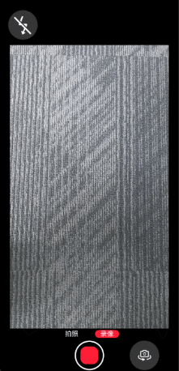
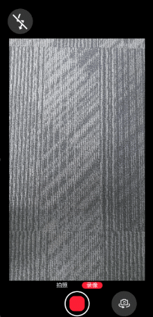
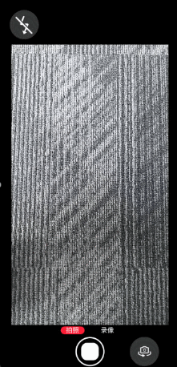

# Basic Camera Animation (ArkTS)
<!--Kit: Camera Kit-->
<!--Subsystem: Multimedia-->
<!--Owner: @qano-->
<!--Designer: @leo_ysl-->
<!--Tester: @xchaosioda-->
<!--Adviser: @zengyawen-->

When using the camera, transitions such as changing camera modes or switching between front and rear cameras will always involve replacing the preview stream. To enhance user experience, smooth animations can be effectively incorporated. This topic describes how to use preview stream snapshots and ArkUI's [explicit animations](../../reference/apis-arkui/arkui-ts/ts-explicit-animatetoimmediately.md) to implement three key scene transitions:

- Mode switching: Use preview stream snapshots to create a blur effect for transition.
  
   The following depicts the transition from video mode to photo mode.

   

- Front/Rear camera switching: Use preview stream snapshots to create a blur-and-flip effect for transition.

   The following demonstrates the transition from using the front camera to the rear camera.

   

- Photo capture blackout: Use a blackout component to overlay the preview stream to create a blackout transition.
  
  The following depicts the moment of photo capture.

  

## Blackout Animation

Use component overlay to implement the blackout effect.

The sample code in the following steps is the internal method or logic of a custom component (component decorated by @Component).

1. Import dependencies. Specifically, import the camera, image, and ArkUI modules.

   ```ts
   import { curves } from '@kit.ArkUI';
   ```

2. Build a blackout component.

   Define a blackout component, which is displayed during camera blackouts for photo capture or front/rear camera switching. This component will block the XComponent.

   Define the component's properties as follows:

   ```ts
   @State isShowBlack: boolean = false; // Whether to show the blackout component.
   @StorageLink('captureClick') @Watch('onCaptureClick') captureClickFlag: number = 0; // Entry for the blackout animation.
   @State flashBlackOpacity: number = 1; // Opacity of the blackout component.
   ```

   Implement the logic of the blackout component as follows:

   ```ts
   // The component is displayed during camera blackouts for photo capture or camera switching and is used to block the XComponent.
   if (this.isShowBlack) {
     Column()
       .key('black')
       .width(this.getUIContext().px2vp(1080)) // The width and height must be the same as those of the XComponent of the preview stream. The layer is above the preview stream and below the snapshot component.
       .height(this.getUIContext().px2vp(1920))
       .backgroundColor(Color.Black)
       .opacity(this.flashBlackOpacity)
   }
   ```

3. Implement the blackout effect.

   ```ts
   // Internal methods of the component decorated by @Component.
   flashBlackAnim() {
     console.info('flashBlackAnim E');
     this.flashBlackOpacity = 1; // The blackout component is opaque.
     this.isShowBlack = true; // Show the blackout component.
     animateToImmediately({
       curve: curves.interpolatingSpring(1, 1, 410, 38),
       delay: 50, // A black screen is displayed after a delay of 50 ms.
       onFinish: () => {
         this.isShowBlack = false; // Hide the blackout component.
         this.flashBlackOpacity = 1;
         console.info('flashBlackAnim X');
       }
     }, () => {
       this.flashBlackOpacity = 0; // The blackout component is changed from opaque to transparent.
     })
   }
   ```

4. Trigger the blackout effect.

   When a user touches the **PHOTO** button, the value of **CaptureClick** bound to the StorageLink is updated, and **onCaptureClick** is invoked. In this case, the animation starts to play.

   ```ts
   onCaptureClick(): void {
     console.info('onCaptureClick');
     this.flashBlackAnim();
   }
   ```


## Blur Animation

You can use preview stream snapshots to create a blur effect for mode switching or front/rear camera switching.

The sample code in the following steps (except step 2) is the internal method or logic of a custom component (component decorated by @Component).

1. Import dependencies. Specifically, import the camera, image, and ArkUI modules.

   ```ts
   import { camera } from '@kit.CameraKit';
   import { image } from '@kit.ImageKit';
   import { curves } from '@kit.ArkUI';
   ```

2. Obtain a preview stream snapshot.

   Preview stream snapshots are obtained by calling [image.createPixelMapFromSurface](../../reference/apis-image-kit/arkts-apis-image-f.md#imagecreatepixelmapfromsurface11) provided by the image module. In this API, **surfaceId** is the surface ID of the current preview stream, and **size** is the width and height of the current preview stream profile. Create a snapshot utility class (TS file), import the dependency, and export the snapshot retrieval API for the page to use. The code snippet below shows the implementation of the snapshot utility class:

   ```ts
   export class BlurAnimateUtil {
     public static surfaceShot: image.PixelMap;
   
     /**
      * Obtain a surface snapshot.
      * @param surfaceId
      * @returns
      */
     public static async doSurfaceShot(surfaceId: string) {
       console.info(`doSurfaceShot surfaceId:${surfaceId}.`);
       if (surfaceId === '') {
         console.error('surface not ready!');
         return;
       }
       try {
         if (BlurAnimateUtil.surfaceShot) {
           await BlurAnimateUtil.surfaceShot.release();
         }
         BlurAnimateUtil.surfaceShot = await image.createPixelMapFromSurface(surfaceId, {
           size: { width: 1920, height: 1080 }, // Obtain the width and height of the preview stream profile.
           x: 0,
           y: 0
         });
         let imageInfo: image.ImageInfo = await BlurAnimateUtil.surfaceShot.getImageInfo();
         console.info('doSurfaceShot surfaceShot:' + JSON.stringify(imageInfo.size));
       } catch (err) {
         console.error(err);
       }
     }
   
     /**
      * Obtain the snapshot captured by calling doSurfaceShot.
      * @returns
      */
    public static getSurfaceShot(): image.PixelMap | undefined {
       if (BlurAnimateUtil.surfaceShot === null || BlurAnimateUtil.surfaceShot === undefined) {
          console.error("SurfaceShot is null!");
          return undefined;
        }
        return BlurAnimateUtil.surfaceShot;
     }
  
   }
   ```

3. Build a snapshot component.

   Define a snapshot component, and place it above the XComponent of the preview stream to block the XComponent.

   Define the component's properties as follows:

   ```ts
   @State isShowBlur: boolean = false; // Whether to show the snapshot component.
   @StorageLink('modeChange') @Watch('onModeChange') modeChangeFlag: number = 0; // Entry for triggering the mode switching animation.
   @StorageLink('switchCamera') @Watch('onSwitchCamera') switchCameraFlag: number = 0; // Entry for triggering the front/rear camera switching animation.
   @StorageLink('frameStart') @Watch('onFrameStart') frameStartFlag: number = 0; // Entry for the fade-out animation.
   @State screenshotPixelMap: image.PixelMap | undefined = undefined; // PixelMap of the snapshot component.
   @State surfaceId: string ="; // Surface ID of the XComponent of the current preview stream.
   @StorageLink('curPosition') curPosition: number = 0; // Current camera position (front or rear).
   @State shotImgBlur: number = 0; // Blur degree of the snapshot component.
   @State shotImgOpacity: number = 1; // Opacity of the snapshot component.
   @State shotImgScale: ScaleOptions = {x: 1, y: 1}; // Scale ratio of the snapshot component.
   @State shotImgRotation: RotateOptions = { y: 0.5, angle: 0 } // Rotation angle of the snapshot component.
   ```

   Implement the snapshot component as follows:

   ```ts
   // Snapshot component is placed above the XComponent of the preview stream.
   if (this.isShowBlur) {
     Column() {
       Image(this.screenshotPixelMap)
         .blur(this.shotImgBlur)
         .opacity(this.shotImgOpacity)
         .rotate(this.shotImgRotation) // Provided by ArkUI for component rotation.
         .scale(this.shotImgScale)
         .width(this.getUIContext().px2vp(1080)) // The width and height must be the same as those of the XComponent of the preview stream. The layer is above the preview stream.
         .height(this.getUIContext().px2vp(1920))
         .syncLoad(true)
     }
     .width(this.getUIContext().px2vp(1080))
     .height(this.getUIContext().px2vp(1920))
   }
   ```

4. (Optional) Implement the fade-in blur effect.

   The mode switching animation is implemented in two phases: fade-in blur animation and fade-out blur animation.

   When a user touches a button, and the camera takes a snapshot of the preview stream. The snapshot component is displayed, which gradually blurs over the existing preview stream, implementing the fade-in blur animation.

   > **NOTE**
   >
   > The **image.createPixelMapFromSurface** API, which is used to extract the surface content into a PixelMap, operates differently from the rendering logic of the XComponent. As such, different rotation compensations must be applied to both the image content and the component for the front and rear cameras.

   ```ts
   async showBlurAnim() {
     console.info('showBlurAnim E');
     // Obtain the surface snapshot.
     let shotPixel = BlurAnimateUtil.getSurfaceShot();
     // The rear camera is used.
     if (this.curPosition === 0) {
       console.info('showBlurAnim BACK');
       // For candy bar phones, a 90° rotation compensation is applied to the content for a snapshot taken with the rear camera.
       await shotPixel.rotate(90); // Provided by Image Kit for image content rotation.
       // For candy bar phones, a 0° rotation compensation is applied to the component for a snapshot taken with the rear camera.
       this.shotImgRotation = { y: 0.5, angle: 0 };
     } else {
       console.info('showBlurAnim FRONT');
       // For candy bar phones, a 270° rotation compensation is applied to the content for a snapshot taken with the front camera.
       await shotPixel.rotate(270);
       // For candy bar phones, a 180° rotation compensation is applied to the component for a snapshot taken with the front camera.
       this.shotImgRotation = { y: 0.5, angle: 180 };
     }
     this.screenshotPixelMap = shotPixel;
     // Initialize animation parameters.
     this.shotImgBlur = 0; // No blur.
     this.shotImgOpacity = 1; // Opaque.
     this.isShowBlur = true; // Show the snapshot component.
     animateToImmediately(
       {
         duration: 200,
         curve: Curve.Friction,
         onFinish: async () => {
           console.info('showBlurAnim X');
         }
       },
       () => {
         this.shotImgBlur = 48; // Blur intensity of the snapshot component.
       }
     );
   }
   ```

5. Implement the fade-out blur animation.

   The fade-out blur animation is triggered by the event [on('frameStart')](../../reference/apis-camera-kit/arkts-apis-camera-PreviewOutput.md#onframestart) of the new preview stream. During this effect, the snapshot component gradually becomes clear, revealing the new preview stream.

   ```ts
   hideBlurAnim(): void {
     this.isShowBlack = false;
     console.info('hideBlurAnim E');
     animateToImmediately({
       duration: 200,
       curve: Curve.FastOutSlowIn,
       onFinish: () => {
         this.isShowBlur = false; // Hide the blur component.
         this.shotImgBlur = 0;
         this.shotImgOpacity = 1;
         console.info('hideBlurAnim X');
       }
     }, () => {
       // Change the opacity of the snapshot component.
       this.shotImgOpacity = 0; // Opacity change of the snapshot component.
     });
   }
   ```

6. (Optional) Implement the blur-and-flip animation.

   The animation is carried out in two phases: blur-and-flip and fade-out blur, where fade-out blur is the same as that in step 5.

   The blur-and-flip animation is realized through two stages of component rotation—initially a 90° rotation outwards, and then a 90° rotation inwards—accompanied by additional effects such as blur, opacity changes, and scaling.

   To ensure that the preview stream is not exposed during flip, you must also build a blackout component to mask the XComponent, following the instructions provided in step 2 in [Blackout Animation](#blackout-animation).

   ```ts
   /**
    * A 90° rotation outwards first for transition between the front and real cameras.
    */
   async rotateFirstAnim() {
     console.info('rotateFirstAnim E');
     // Obtain the surface snapshot.
     let shotPixel = BlurAnimateUtil.getSurfaceShot();
     // Switch from the rear camera to the front camera.
     if (this.curPosition === 1) {
       console.info('rotateFirstAnim BACK');
       // For candy bar phones, a 90° rotation compensation is applied to the content for a snapshot when switching from the rear camera to the front camera.
       await shotPixel.rotate(90); // Provided by Image Kit for image content rotation.
       // For candy bar phones, a 0° rotation compensation is applied to the component for a snapshot when switching from the rear camera to the front camera.
       this.shotImgRotation = { y: 0.5, angle: 0 };
     } else {
       console.info('rotateFirstAnim FRONT');
       // For candy bar phones, a 270° rotation compensation is applied to the content for a snapshot when switching from the front camera to the rear camera.
       await shotPixel.rotate(270);
       // For candy bar phones, a 180° rotation compensation is applied to the component for a snapshot when switching from the front camera to the rear camera.
       this.shotImgRotation = { y: 0.5, angle: 180 };
     }
     this.screenshotPixelMap = shotPixel;
     this.isShowBlack = true; // Show the blackout component to mask the preview stream.
     this.isShowBlur = true; // Show the snapshot component.
     animateToImmediately(
       {
         duration: 200,
         delay: 50, // This delay ensures that the component's scaling and blur effects are triggered in prior to the flip effect.
         curve: curves.cubicBezierCurve(0.20, 0.00, 0.83, 1.00),
         onFinish: () => {
           console.info('rotateFirstAnim X');
           // Trigger the second-phase flip effect after onFinish.
           this.rotateSecondAnim();
         }
       },
       () => {
         // Flip outwards.
         if (this.curPosition === 1) {
           this.shotImgRotation = { y: 0.5, angle: 90 };
         } else {
           this.shotImgRotation = { y: 0.5, angle: 270 };
         }
       }
     )
   }
   
   /**
    * Flip inwards by 90°.
    */
   async rotateSecondAnim() {
     console.info('rotateSecondAnim E');
     // Obtain the surface snapshot.
     let shotPixel = BlurAnimateUtil.getSurfaceShot();
     // The rear camera is used.
     if (this.curPosition === 1) {
       // For candy bar phones, a 90° rotation compensation is applied to the content for a snapshot taken with the rear camera.
       await shotPixel.rotate(90);
       // A -90° rotation compensation is applied to the component to ensure that the image is not mirrored after the second-phase flip.
       this.shotImgRotation = { y: 0.5, angle: 90 };
     } else { // The front camera is used.
       // For candy bar phones, a 270° rotation compensation is applied to the content for a snapshot taken with the front camera.
       await shotPixel.rotate(270);
       // For candy bar phones, a 180° rotation compensation is applied to the component for a snapshot taken with the front camera.
       this.shotImgRotation = { y: 0.5, angle: 180 };
     }
     this.screenshotPixelMap = shotPixel;
     animateToImmediately(
       {
         duration: 200,
         curve: curves.cubicBezierCurve(0.17, 0.00, 0.20, 1.00),
         onFinish: () => {
           console.info('rotateSecondAnim X');
         }
       },
       () => {
         // Flip inwards to the initial state.
         if (this.curPosition === 1) {
           this.shotImgRotation = { y: 0.5, angle: 0 };
         } else {
           this.shotImgRotation = { y: 0.5, angle: 180 };
         }
       }
     )
   }
   
   /**
    * Flip outwards by 90°.
    */
   blurFirstAnim() {
     console.info('blurFirstAnim E');
     // Initialize animation parameters.
     this.shotImgBlur = 0; // No blur.
     this.shotImgOpacity = 1; // Opaque.
     this.shotImgScale = { x: 1, y: 1 };
     animateToImmediately(
       {
         duration: 200,
         curve: Curve.Sharp,
         onFinish: () => {
           console.info('blurFirstAnim X');
           this.blurSecondAnim();
         }
       },
       () => {
         // Blur.
         this.shotImgBlur = 48;
         // Scale out.
         this.shotImgScale = { x: 0.75, y: 0.75 };
       }
     );
   }
   
   /**
    * Flip inwards by 90°.
    */
   blurSecondAnim() {
     console.info('blurSecondAnim E');
     animateToImmediately(
       {
         duration: 200,
         curve: Curve.Sharp,
         onFinish: () => {
           console.info('blurSecondAnim X');
         }
       },
       () => {
         // Scale in to the initial size.
         this.shotImgScale = { x: 1, y: 1 };
       }
     )
   }
   ```

7. Trigger the animations on demand.

   For the mode switching animation, once a user touches the mode button, the **doSurfaceShot** API is invoked, the value of **modeChange** bound to the StorageLink is updated, and the **onModeChange** callback is triggered. In this case, the animation starts to play.

   ```ts
   onModeChange(): void {
     console.info('onModeChange');
     this.showBlurAnim();
   }
   ```

   For the front/rear camera switching animation, once a user touches the button to switch between the front and rear cameras, the **doSurfaceShot** API is invoked, the value of **switchCamera** bound to the StorageLink is updated, and the **onSwitchCamera** callback is triggered. In this case, the animation starts to play.

   ```ts
   onSwitchCamera(): void {
     console.info('onSwitchCamera');
     this.blurFirstAnim();
     this.rotateFirstAnim();
   }
   ```

   For the fade-out blur animation, you must listen for the event [on('frameStart')](../../reference/apis-camera-kit/arkts-apis-camera-PreviewOutput.md#onframestart) of the preview stream. Once the value of **frameStart** bound to the StorageLink is updated, and the **onFrameStart** callback is triggered, the animation starts.

   ```ts
   onFrameStart(): void {
     console.info('onFrameStart');
     this.hideBlurAnim();
   }
   ```
