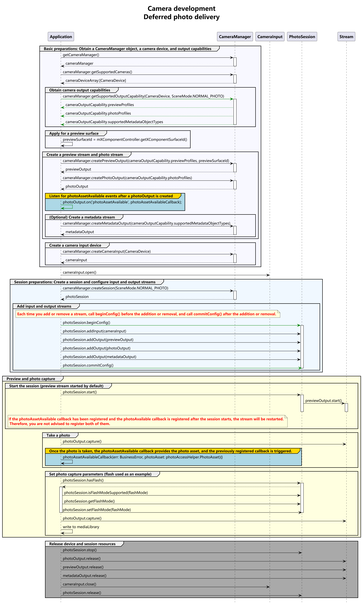

# Deferred Photo Delivery Sample (ArkTS)

This topic provides sample code that covers the complete deferred photo delivery process to help you understand the complete API calling sequence.

Before referring to the sample code, you are advised to read [Deferred Photo Delivery (ArkTS)](camera-deferred-capture.md), [Device Input Management](camera-device-input.md), [Camera Session Management](camera-session-management.md), and [Photo Capture](camera-shooting.md).

## Development Process

After obtaining the output stream capabilities supported by the camera, create a photo stream. The development process is as follows:



## Sample Code

For details about how to obtain the context, see [Obtaining the Context of UIAbility](../../application-models/uiability-usage.md#obtaining-the-context-of-uiability).

```ts
import { camera } from '@kit.CameraKit';
import { BusinessError } from '@kit.BasicServicesKit';
import { common } from '@kit.AbilityKit';
import { photoAccessHelper } from '@kit.MediaLibraryKit';

let context = getContext(this);
let phAccessHelper = photoAccessHelper.getPhotoAccessHelper(context);

class MediaDataHandler implements photoAccessHelper.MediaAssetDataHandler<ArrayBuffer> {
  onDataPrepared(data: ArrayBuffer) {
    if (data === undefined) {
      console.error('Error occurred when preparing data');
      return;
    }
    console.info('on image data prepared');
  }
}

async function mediaLibRequestBuffer(photoAsset: photoAccessHelper.PhotoAsset) {
  let requestOptions: photoAccessHelper.RequestOptions = {
    deliveryMode: photoAccessHelper.DeliveryMode.HIGH_QUALITY_MODE,
  }
  const handler = new MediaDataHandler();
  await photoAccessHelper.MediaAssetManager.requestImageData(context, photoAsset, requestOptions, handler);
  console.info('requestImageData successfully');
}

async function mediaLibSavePhoto(photoAsset: photoAccessHelper.PhotoAsset): Promise<void> {
  try {
    let assetChangeRequest: photoAccessHelper.MediaAssetChangeRequest = new photoAccessHelper.MediaAssetChangeRequest(photoAsset);
    assetChangeRequest.saveCameraPhoto();
    await phAccessHelper.applyChanges(assetChangeRequest);
    console.info('apply saveCameraPhoto successfully');
  } catch (err) {
    console.error(`apply saveCameraPhoto failed with error: ${err.code}, ${err.message}`);
  }
}

function setPhotoOutputCb(photoOutput: camera.PhotoOutput): void {
  // After the callback is set, call capture() of photoOutput to trigger the callback upon the receiving of a low-quality image.
  photoOutput.on('photoAssetAvailable', (err: BusinessError, photoAsset: photoAccessHelper.PhotoAsset): void => {
    console.info('getPhotoAsset start');
    console.info(`err: ${JSON.stringify(err)}`);
    if ((err !== undefined && err.code !== 0) || photoAsset === undefined) {
      console.error('getPhotoAsset failed');
      return;
    }
    // Call the mediaLibrary flush API to save the low-quality image in the first phase. After the real image in the second phase is ready, the mediaLibrary proactively replaces the image flushed.
    mediaLibSavePhoto(photoAsset);
    // Call the mediaLibrary API to register the buffer callback to receive low-quality or high-quality images for custom processing.
    mediaLibRequestBuffer(photoAsset);
  });
}

async function deferredCaptureCase(baseContext: common.BaseContext, surfaceId: string): Promise<void> {
  // Create a CameraManager object.
  let cameraManager: camera.CameraManager = camera.getCameraManager(baseContext);
  if (!cameraManager) {
    console.error("camera.getCameraManager error");
    return;
  }
  // Listen for camera status changes.
  cameraManager.on('cameraStatus', (err: BusinessError, cameraStatusInfo: camera.CameraStatusInfo) => {
    if (err !== undefined && err.code !== 0) {
      console.error('cameraStatus with errorCode = ' + err.code);
      return;
    }
    console.info(`camera : ${cameraStatusInfo.camera.cameraId}`);
    console.info(`status: ${cameraStatusInfo.status}`);
  });

  // Obtain the camera list.
  let cameraArray: Array<camera.CameraDevice> = cameraManager.getSupportedCameras();
  if (cameraArray.length <= 0) {
    console.error("cameraManager.getSupportedCameras error");
    return;
  }

  for (let index = 0; index < cameraArray.length; index++) {
    console.info('cameraId : ' + cameraArray[index].cameraId);                          // Obtain the camera ID.
    console.info('cameraPosition : ' + cameraArray[index].cameraPosition);              // Obtain the camera position.
    console.info('cameraType : ' + cameraArray[index].cameraType);                      // Obtain the camera type.
    console.info('connectionType : ' + cameraArray[index].connectionType);              // Obtain the camera connection type.
  }

  // Create a camera input stream.
  let cameraInput: camera.CameraInput | undefined = undefined;
  try {
    cameraInput = cameraManager.createCameraInput(cameraArray[0]);
  } catch (error) {
    let err = error as BusinessError;
    console.error('Failed to createCameraInput errorCode = ' + err.code);
  }
  if (cameraInput === undefined) {
    return;
  }

  // Listen for camera input errors.
  let cameraDevice: camera.CameraDevice = cameraArray[0];
  cameraInput.on('error', cameraDevice, (error: BusinessError) => {
    console.error(`Camera input error code: ${error.code}`);
  })

  // Open a camera.
  await cameraInput.open();

  // Obtain the supported modes.
  let sceneModes: Array<camera.SceneMode> = cameraManager.getSupportedSceneModes(cameraArray[0]);
  let isSupportPhotoMode: boolean = sceneModes.indexOf(camera.SceneMode.NORMAL_PHOTO) >= 0;
  if (!isSupportPhotoMode) {
    console.error('photo mode not support');
    return;
  }
  // Obtain the output streams supported by the camera.
  let cameraOutputCap: camera.CameraOutputCapability = cameraManager.getSupportedOutputCapability(cameraArray[0], camera.SceneMode.NORMAL_PHOTO);
  if (!cameraOutputCap) {
    console.error("cameraManager.getSupportedOutputCapability error");
    return;
  }
  console.info("outputCapability: " + JSON.stringify(cameraOutputCap));

  let previewProfilesArray: Array<camera.Profile> = cameraOutputCap.previewProfiles;
  if (!previewProfilesArray) {
    console.error("createOutput previewProfilesArray == null || undefined");
  }

  let photoProfilesArray: Array<camera.Profile> = cameraOutputCap.photoProfiles;
  if (!photoProfilesArray) {
    console.error("createOutput photoProfilesArray == null || undefined");
  }

  // Create a preview output stream. For details about the surfaceId parameter, see the XComponent. The preview stream uses the surface provided by the XComponent.
  let previewOutput: camera.PreviewOutput | undefined = undefined;
  try {
    previewOutput = cameraManager.createPreviewOutput(previewProfilesArray[0], surfaceId);
  } catch (error) {
    let err = error as BusinessError;
    console.error(`Failed to create the PreviewOutput instance. error code: ${err.code}`);
  }
  if (previewOutput === undefined) {
    return;
  }
  // Listen for preview output errors.
  previewOutput.on('error', (error: BusinessError) => {
    console.error(`Preview output error code: ${error.code}`);
  });

  // Create a photo output stream.
  let photoOutput: camera.PhotoOutput | undefined = undefined;
  try {
    photoOutput = cameraManager.createPhotoOutput(photoProfilesArray[0]);
  } catch (error) {
    let err = error as BusinessError;
    console.error('Failed to createPhotoOutput errorCode = ' + err.code);
  }
  if (photoOutput === undefined) {
    return;
  }

  // Register the photoAssetAvailable callback.
  setPhotoOutputCb(photoOutput);

  // Create a session.
  let photoSession: camera.PhotoSession | undefined = undefined;
  try {
    photoSession = cameraManager.createSession(camera.SceneMode.NORMAL_PHOTO) as camera.PhotoSession;
  } catch (error) {
    let err = error as BusinessError;
    console.error('Failed to create the session instance. errorCode = ' + err.code);
  }
  if (photoSession === undefined) {
    return;
  }
  // Listen for session errors.
  photoSession.on('error', (error: BusinessError) => {
    console.error(`Capture session error code: ${error.code}`);
  });

  // Start configuration for the session.
  try {
    photoSession.beginConfig();
  } catch (error) {
    let err = error as BusinessError;
    console.error('Failed to beginConfig. errorCode = ' + err.code);
  }

  // Add the camera input stream to the session.
  try {
    photoSession.addInput(cameraInput);
  } catch (error) {
    let err = error as BusinessError;
    console.error('Failed to addInput. errorCode = ' + err.code);
  }

  // Add the preview output stream to the session.
  try {
    photoSession.addOutput(previewOutput);
  } catch (error) {
    let err = error as BusinessError;
    console.error('Failed to addOutput(previewOutput). errorCode = ' + err.code);
  }

  // Add the photo output stream to the session.
  try {
    photoSession.addOutput(photoOutput);
  } catch (error) {
    let err = error as BusinessError;
    console.error('Failed to addOutput(photoOutput). errorCode = ' + err.code);
  }

  // Commit the session configuration.
  await photoSession.commitConfig();

  // Start the session.
  await photoSession.start().then(() => {
    console.info('Promise returned to indicate the session start success.');
  });
  // Check whether the camera has flash.
  let flashStatus: boolean = false;
  try {
    flashStatus = photoSession.hasFlash();
  } catch (error) {
    let err = error as BusinessError;
    console.error('Failed to hasFlash. errorCode = ' + err.code);
  }
  console.info('Returned with the flash light support status:' + flashStatus);

  if (flashStatus) {
    // Check whether the auto flash mode is supported.
    let flashModeStatus: boolean = false;
    try {
      let status: boolean = photoSession.isFlashModeSupported(camera.FlashMode.FLASH_MODE_AUTO);
      flashModeStatus = status;
    } catch (error) {
      let err = error as BusinessError;
      console.error('Failed to check whether the flash mode is supported. errorCode = ' + err.code);
    }
    if(flashModeStatus) {
      // Set the flash mode to auto.
      try {
        photoSession.setFlashMode(camera.FlashMode.FLASH_MODE_AUTO);
      } catch (error) {
        let err = error as BusinessError;
        console.error('Failed to set the flash mode. errorCode = ' + err.code);
      }
    }
  }

  // Check whether the continuous auto focus is supported.
  let focusModeStatus: boolean = false;
  try {
    let status: boolean = photoSession.isFocusModeSupported(camera.FocusMode.FOCUS_MODE_CONTINUOUS_AUTO);
    focusModeStatus = status;
  } catch (error) {
    let err = error as BusinessError;
    console.error('Failed to check whether the focus mode is supported. errorCode = ' + err.code);
  }

  if (focusModeStatus) {
    // Set the focus mode to continuous auto focus.
    try {
      photoSession.setFocusMode(camera.FocusMode.FOCUS_MODE_CONTINUOUS_AUTO);
    } catch (error) {
      let err = error as BusinessError;
      console.error('Failed to set the focus mode. errorCode = ' + err.code);
    }
  }

  // Obtain the zoom ratio range supported by the camera.
  let zoomRatioRange: Array<number> = [];
  try {
    zoomRatioRange = photoSession.getZoomRatioRange();
  } catch (error) {
    let err = error as BusinessError;
    console.error('Failed to get the zoom ratio range. errorCode = ' + err.code);
  }
  if (zoomRatioRange.length <= 0) {
    return;
  }
  // Set a zoom ratio.
  try {
    photoSession.setZoomRatio(zoomRatioRange[0]);
  } catch (error) {
    let err = error as BusinessError;
    console.error('Failed to set the zoom ratio value. errorCode = ' + err.code);
  }
  let photoCaptureSetting: camera.PhotoCaptureSetting = {
    quality: camera.QualityLevel.QUALITY_LEVEL_HIGH, // Set the photo quality to high.
    rotation: camera.ImageRotation.ROTATION_0 // Set the rotation angle of the photo to 0.
  }
  // Use the current photo capture settings to take photos.
  photoOutput.capture(photoCaptureSetting, (err: BusinessError) => {
    if (err) {
      console.error(`Failed to capture the photo ${err.message}`);
      return;
    }
    console.info('Callback invoked to indicate the photo capture request success.');
  });

  // After the photo capture is complete, call the following APIs to close the camera and release the session. Do not release the session before the photo capture is complete.
  // Stop the session.
  await photoSession.stop();

  // Release the camera input stream.
  await cameraInput.close();

  // Release the preview output stream.
  await previewOutput.release();

  // Release the photo output stream.
  await photoOutput.release();

  // Release the session.
  await photoSession.release();

  // Set the session to null.
  photoSession = undefined;
}
```
