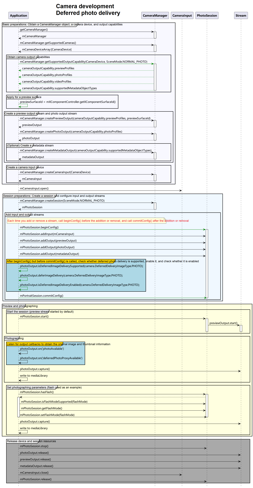

# Practices for High-Performance Photo Capture (for System Applications Only) (ArkTS)

Before developing a camera application, request permissions by following the instructions provided in [Requesting Camera Development Permissions](camera-preparation.md).

This topic provides sample code that covers the complete high-performance photo capture process to help you understand the complete API calling sequence.

Before referring to the sample code, you are advised to read [High-Performance Photo Capture (for System Applications Only) (ArkTS)](camera-deferred-photo.md), [Device Input Management](camera-device-input.md), [Camera Session Management](camera-session-management.md), and [Photo Capture](camera-shooting.md).

## Development Process

After obtaining the output stream capabilities supported by the camera, create a photo stream. The development process is as follows:



## Sample Code

For details about how to obtain the context, see [Obtaining the Context of UIAbility](../../application-models/uiability-usage.md#obtaining-the-context-of-uiability).

```ts
import { camera } from '@kit.CameraKit';
import { image } from '@kit.ImageKit';
import { BusinessError } from '@kit.BasicServicesKit';
import { fileIo, fileUri } from '@kit.CoreFileKit';
import { photoAccessHelper } from '@kit.MediaLibraryKit';

// Flush the original image in write-file mode.
async function savePicture(photoObj: camera.Photo, context: Context, showSaveToMediaLibrary: boolean = true): Promise<void> {
  let filePath = `${context.filesDir}/${Date.now()}.jpg`;
  let file = fileIo.openSync(filePath, fileIo.OpenMode.READ_WRITE | fileIo.OpenMode.CREATE);
  let buffer: ArrayBuffer | undefined = undefined;
  let component = await photoObj.main.getComponent(image.ComponentType.JPEG);
  if (component === undefined) {
    console.error('getComponent failed');
    return;
  }
  if (component.byteBuffer) {
    buffer = component.byteBuffer;
  } else {
    console.error('byteBuffer is null');
    return;
  }
  if (buffer) {
    fileIo.writeSync(file.fd, buffer);
    if (showSaveToMediaLibrary) {
      await saveToMediaLibrary(context, filePath, file.fd);
    } else {
      fileIo.closeSync(file.fd);
    }
  }
}

async function saveToMediaLibrary(context: Context, filePath: string, fd: number): Promise<void> {
  let phAccessHelper = photoAccessHelper.getPhotoAccessHelper(context);
  try {
    let res = fileIo.accessSync(filePath);
    if (res) {
      await fileIo.unlink(filePath);
    }
    // Specify the URI of the image in the application sandbox directory to be saved.
    let srcFileUri = fileUri.getUriFromPath(filePath); // Obtain the absolute path of the resource.
    let srcFileUris: Array<string> = [
      srcFileUri // Pass the absolute path.
    ];
    // Set parameters such as the file name extension, image file type, title (optional) and image subtype (optional) of the image to save.
    let photoCreationConfigs: Array<photoAccessHelper.PhotoCreationConfig> = [
      {
        title: 'test', // This parameter is optional.
        fileNameExtension: 'jpg',
        photoType: photoAccessHelper.PhotoType.IMAGE,
        subtype: photoAccessHelper.PhotoSubtype.DEFAULT, // This parameter is optional.
      }
    ];
    // Obtain the target URI in the media library based on pop-up authorization.
    let desFileUris: Array<string> = await phAccessHelper.showAssetsCreationDialog(srcFileUris, photoCreationConfigs);
    // Write the image content from the application sandbox directory to the file specified by the target URI in the media library.
    let desFile: fileIo.File = await fileIo.open(desFileUris[0], fileIo.OpenMode.WRITE_ONLY);
    await fileIo.copyFile(fd, desFile.fd);
    fileIo.closeSync(fd);
    fileIo.closeSync(desFile);
    console.info('create asset by dialog successfully');
  } catch (err) {
    console.error(`failed to create asset by dialog successfully errCode is: ${err.code}, ${err.message}`);
  }
}

// Flush the thumbnail by calling the media library API.
async function saveDeferredPhoto(proxyObj: camera.DeferredPhotoProxy, context: Context): Promise<void> {    
  try {
    // Create a photoAsset.
    let accessHelper = photoAccessHelper.getPhotoAccessHelper(context);
    let testFileName = 'testFile' + Date.now() + '.jpg';
    let photoAsset = await accessHelper.createAsset(testFileName);
    // Pass the thumbnail proxy class object to the media library.
    let mediaRequest: photoAccessHelper.MediaAssetChangeRequest = new photoAccessHelper.MediaAssetChangeRequest(photoAsset);
    mediaRequest.addResource(photoAccessHelper.ResourceType.PHOTO_PROXY, proxyObj);
    let res = await accessHelper.applyChanges(mediaRequest);
    console.info('saveDeferredPhoto success.');
  } catch (err) {
    console.error(`Failed to saveDeferredPhoto. error: ${err}`);
  }
}

async function deferredPhotoCase(context: Context, surfaceId: string): Promise<void> {
  // Create a CameraManager object.
  let cameraManager: camera.CameraManager = camera.getCameraManager(context);
  if (!cameraManager) {
    console.error("camera.getCameraManager error");
    return;
  }
  // Listen for camera status changes.
  cameraManager.on('cameraStatus', (err: BusinessError, cameraStatusInfo: camera.CameraStatusInfo) => {
    if (err !== undefined && err.code !== 0) {
      console.error(`cameraStatus with errorCode: ${err.code}`);
      return;
    }
    console.info(`camera : ${cameraStatusInfo.camera.cameraId}`);
    console.info(`status: ${cameraStatusInfo.status}`);
  });

  // Obtain the camera list.
  let cameraArray: Array<camera.CameraDevice> = cameraManager.getSupportedCameras();
  if (cameraArray.length <= 0) {
    console.error("cameraManager.getSupportedCameras error");
    return;
  }

  for (let index = 0; index < cameraArray.length; index++) {
    console.info('cameraId : ' + cameraArray[index].cameraId);                          // Obtain the camera ID.
    console.info('cameraPosition : ' + cameraArray[index].cameraPosition);              // Obtain the camera position.
    console.info('cameraType : ' + cameraArray[index].cameraType);                      // Obtain the camera type.
    console.info('connectionType : ' + cameraArray[index].connectionType);              // Obtain the camera connection type.
  }

  // Create a camera input stream.
  let cameraInput: camera.CameraInput | undefined = undefined;
  try {
    cameraInput = cameraManager.createCameraInput(cameraArray[0]);
  } catch (error) {
    let err = error as BusinessError;
    console.error('Failed to createCameraInput errorCode = ' + err.code);
  }
  if (cameraInput === undefined) {
    return;
  }

  // Listen for camera input errors.
  let cameraDevice: camera.CameraDevice = cameraArray[0];
  cameraInput.on('error', cameraDevice, (error: BusinessError) => {
    console.error(`Camera input error code: ${error.code}`);
  })

  // Open the camera.
  await cameraInput.open();

  // Obtain the supported modes.
  let sceneModes: Array<camera.SceneMode> = cameraManager.getSupportedSceneModes(cameraArray[0]);
  let isSupportPhotoMode: boolean = sceneModes.indexOf(camera.SceneMode.NORMAL_PHOTO) >= 0;
  if (!isSupportPhotoMode) {
    console.error('photo mode not support');
    return;
  }
  // Obtain the output stream capability supported by the camera.
  let cameraOutputCap: camera.CameraOutputCapability = cameraManager.getSupportedOutputCapability(cameraArray[0], camera.SceneMode.NORMAL_PHOTO);
  if (!cameraOutputCap) {
    console.error("cameraManager.getSupportedOutputCapability error");
    return;
  }
  console.info("outputCapability: " + JSON.stringify(cameraOutputCap));

  let previewProfilesArray: Array<camera.Profile> = cameraOutputCap.previewProfiles;
  if (!previewProfilesArray) {
    console.error("createOutput previewProfilesArray == null || undefined");
  }

  let photoProfilesArray: Array<camera.Profile> = cameraOutputCap.photoProfiles;
  if (!photoProfilesArray) {
    console.error("createOutput photoProfilesArray == null || undefined");
  }

  // Create a preview output stream. For details about the surfaceId parameter, see the XComponent. The preview stream uses the surface provided by the XComponent.
  let previewOutput: camera.PreviewOutput | undefined = undefined;
  try {
    previewOutput = cameraManager.createPreviewOutput(previewProfilesArray[0], surfaceId);
  } catch (error) {
    let err = error as BusinessError;
    console.error(`Failed to create the PreviewOutput instance. error code: ${err.code}`);
  }
  if (previewOutput === undefined) {
    return;
  }
  // Listen for preview output errors.
  previewOutput.on('error', (error: BusinessError) => {
    console.error(`Preview output error code: ${error.code}`);
  });
  // Create a photo output stream.
  let photoOutput: camera.PhotoOutput | undefined = undefined;
  try {
    photoOutput = cameraManager.createPhotoOutput(photoProfilesArray[0]);
  } catch (error) {
    let err = error as BusinessError;
    console.error('Failed to createPhotoOutput errorCode = ' + err.code);
  }
  if (photoOutput === undefined) {
    return;
  }
  // Create a session.
  let photoSession: camera.PhotoSession | undefined = undefined;
  try {
    photoSession = cameraManager.createSession(camera.SceneMode.NORMAL_PHOTO) as camera.PhotoSession;
  } catch (error) {
    let err = error as BusinessError;
    console.error('Failed to create the photoSession instance. errorCode = ' + err.code);
  }
  if (photoSession === undefined) {
    return;
  }
  // Listen for session errors.
  photoSession.on('error', (error: BusinessError) => {
    console.error(`Capture session error code: ${error.code}`);
  });

  // Start configuration for the session.
  try {
    photoSession.beginConfig();
  } catch (error) {
    let err = error as BusinessError;
    console.error('Failed to beginConfig. errorCode = ' + err.code);
  }

  // Add the camera input stream to the session.
  try {
    photoSession.addInput(cameraInput);
  } catch (error) {
    let err = error as BusinessError;
    console.error('Failed to addInput. errorCode = ' + err.code);
  }

  // Add the preview output stream to the session.
  try {
    photoSession.addOutput(previewOutput);
  } catch (error) {
    let err = error as BusinessError;
    console.error('Failed to addOutput(previewOutput). errorCode = ' + err.code);
  }

  // Add the photo output stream to the session.
  try {
    photoSession.addOutput(photoOutput);
  } catch (error) {
    let err = error as BusinessError;
    console.error('Failed to addOutput(photoOutput). errorCode = ' + err.code);
  }

  // Register a callback to listen for original images.
  photoOutput.on('photoAvailable', (err: BusinessError, photoObj: camera.Photo): void => {
    if (err) {
      console.info(`photoAvailable error: ${err}.`);
      return;
    }
    savePicture(photoObj, context).then(() => {
      // Release the photo object after the flushing is complete.
      photoObj.release();
    });
  });

  // Register a callback to listen for thumbnail proxies.
  photoOutput.on('deferredPhotoProxyAvailable', (err: BusinessError, proxyObj: camera.DeferredPhotoProxy): void => {
    if (err) {
      console.info(`deferredPhotoProxyAvailable error: ${err}.`);
      return;
    }
    console.info('photoOutPutCallBack deferredPhotoProxyAvailable');
    // Obtain the PixelMap of a thumbnail.
    proxyObj.getThumbnail().then((thumbnail: image.PixelMap) => {
      AppStorage.setOrCreate('proxyThumbnail', thumbnail); 
    });
    // Call the media library API to flush the thumbnail.
    saveDeferredPhoto(proxyObj, context).then(() => {
      // Release the thumbnail proxy class object after the flushing is complete.
      proxyObj.release();
    });
  });
    
  // Check whether deferred photo delivery is supported.
  let isSupportDeferred: boolean = photoOutput.isDeferredImageDeliverySupported(camera.DeferredDeliveryImageType.PHOTO);
  console.info('isDeferredImageDeliverySupported res:' + isSupportDeferred);
  if (isSupportDeferred) {
    // Enable deferred photo delivery.
	photoOutput.deferImageDelivery(camera.DeferredDeliveryImageType.PHOTO);
    // Check whether deferred photo delivery is enabled.
    let isSupportEnabled: boolean = photoOutput.isDeferredImageDeliveryEnabled(camera.DeferredDeliveryImageType.PHOTO);
    console.info('isDeferredImageDeliveryEnabled res:' + isSupportEnabled);
  }

  // Commit the session configuration.
  await photoSession.commitConfig();

  // Start the session.
  await photoSession.start().then(() => {
    console.info('Promise returned to indicate the session start success.');
  });
  // Check whether the camera has flash.
  let flashStatus: boolean = false;
  try {
    flashStatus = photoSession.hasFlash();
  } catch (error) {
    let err = error as BusinessError;
    console.error('Failed to hasFlash. errorCode = ' + err.code);
  }
  console.info('Returned with the flash light support status:' + flashStatus);

  if (flashStatus) {
    // Check whether the auto flash mode is supported.
    let flashModeStatus: boolean = false;
    try {
      let status: boolean = photoSession.isFlashModeSupported(camera.FlashMode.FLASH_MODE_AUTO);
      flashModeStatus = status;
    } catch (error) {
      let err = error as BusinessError;
      console.error('Failed to check whether the flash mode is supported. errorCode = ' + err.code);
    }
    if(flashModeStatus) {
      // Set the flash mode to auto.
      try {
        photoSession.setFlashMode(camera.FlashMode.FLASH_MODE_AUTO);
      } catch (error) {
        let err = error as BusinessError;
        console.error('Failed to set the flash mode. errorCode = ' + err.code);
      }
    }
  }

  // Check whether the continuous auto focus is supported.
  let focusModeStatus: boolean = false;
  try {
    let status: boolean = photoSession.isFocusModeSupported(camera.FocusMode.FOCUS_MODE_CONTINUOUS_AUTO);
    focusModeStatus = status;
  } catch (error) {
    let err = error as BusinessError;
    console.error('Failed to check whether the focus mode is supported. errorCode = ' + err.code);
  }

  if (focusModeStatus) {
    // Set the focus mode to continuous auto focus.
    try {
      photoSession.setFocusMode(camera.FocusMode.FOCUS_MODE_CONTINUOUS_AUTO);
    } catch (error) {
      let err = error as BusinessError;
      console.error('Failed to set the focus mode. errorCode = ' + err.code);
    }
  }

  // Obtain the zoom ratio range supported by the camera.
  let zoomRatioRange: Array<number> = [];
  try {
    zoomRatioRange = photoSession.getZoomRatioRange();
  } catch (error) {
    let err = error as BusinessError;
    console.error('Failed to get the zoom ratio range. errorCode = ' + err.code);
  }
  if (zoomRatioRange.length <= 0) {
    return;
  }
  // Set a zoom ratio.
  try {
    photoSession.setZoomRatio(zoomRatioRange[0]);
  } catch (error) {
    let err = error as BusinessError;
    console.error('Failed to set the zoom ratio value. errorCode = ' + err.code);
  }
  let photoCaptureSetting: camera.PhotoCaptureSetting = {
    quality: camera.QualityLevel.QUALITY_LEVEL_HIGH, // Set the photo quality to high.
    rotation: camera.ImageRotation.ROTATION_0 // Set the rotation angle of the photo to 0.
  }
  // Use the current photo capture settings to take photos.
  photoOutput.capture(photoCaptureSetting, (err: BusinessError) => {
    if (err) {
      console.error(`Failed to capture the photo ${err.message}`);
      return;
    }
    console.info('Callback invoked to indicate the photo capture request success.');
  });

  // After the photo capture is complete, call the following APIs to close the camera and release the session. Do not release the session before the photo capture is complete.
  // Stop the session.
  await photoSession.stop();

  // Release the camera input stream.
  await cameraInput.close();

  // Release the preview output stream.
  await previewOutput.release();

  // Release the photo output stream.
  await photoOutput.release();

  // Release the session.
  await photoSession.release();

  // Set the session to null.
  photoSession = undefined;
}
```
