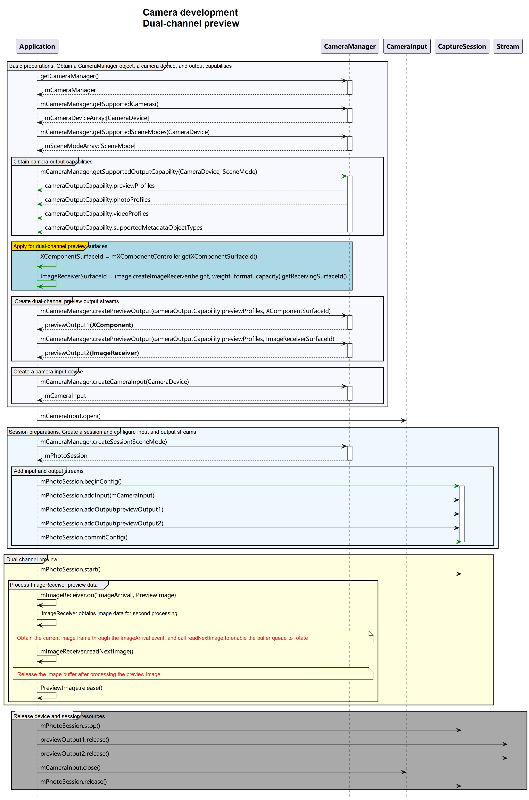

# Dual-Channel Preview (ArkTS)

Dual-channel preview means that an application can use two preview streams at the same time. One preview stream is used for display on the screen, and the other is used for other operations such as image processing, so as to improve the processing efficiency.

The camera application controls the camera hardware to implement basic operations such as image display (preview), photo saving (photographing), and video recording. The camera model is developed on the surface model. That is, an application transfers data through the surface. Specifically, it obtains the photo stream through the surface of an **ImageReceiver** object and the preview stream through the surface of an **\<XComponent>** object.

To implement dual-channel preview (there are two preview streams instead of one preview stream plus one photo stream), you must create a **previewOutput** object through the surface of an **ImageReceiver** object. Other processes are the same as those of the photo stream and preview stream.

Read [Camera](../../reference/apis-camera-kit/js-apis-camera.md) for the API reference.

## Constraints

- Currently, streams cannot be dynamically added. In other words, you cannot call [addOutput](../../reference/apis-camera-kit/js-apis-camera.md#addoutput11) to add streams without calling [session.stop](../../reference/apis-camera-kit/js-apis-camera.md#stop11) first.
- After an **ImageReceiver** object processes image data obtained, it must release the image buffer so that the buffer queue of the surface properly rotates.

## API Calling Process

The figure below shows the recommended API calling process of the dual-channel preview solution.



## How to Develop

1. Import the image module.

   Create a surface for the dual-channel preview stream. In addition to the surface of an **\<XComponent>** object, the surface ID generated by an **ImageReceiver** object is needed. The APIs provided by the image module are also needed.

   ```ts
   import { image } from '@kit.ImageKit';
   ```
2. Create an **ImageReceiver** object.
   ```ts
   let size: image.Size = {
       width: 640,
       height: 480
     }
   let receiver: image.ImageReceiver = image.createImageReceiver(size, image.ImageFormat.JPEG, 8);
   ```
3. Obtain the surface ID of the **ImageReceiver** object.

   ```ts
   async function getImageReceiverSurfaceId(receiver: image.ImageReceiver): Promise<string | undefined> {
     let ImageReceiverSurfaceId: string | undefined = undefined;
     if (receiver !== undefined) {
       console.info('receiver is not undefined');
       let ImageReceiverSurfaceId: string = await receiver.getReceivingSurfaceId();
       console.info(`ImageReceived id: ${ImageReceiverSurfaceId}`);
     } else {
       console.error('createImageReceiver failed');
     }
     return ImageReceiverSurfaceId;
   }
   ```

4. Create a surface of an **\<XComponent>** object.

   The **\<XComponent>**, the capabilities of which are provided by the UI, offers the surface for preview streams. For details about how to obtain the surface ID, see [getXcomponentSurfaceId](../../reference/apis-arkui/arkui-ts/ts-basic-components-xcomponent.md#getxcomponentsurfaceid). For details about the component, see [XComponent](../../reference/apis-arkui/arkui-ts/ts-basic-components-xcomponent.md).
   > **NOTE**
   > The preview stream and video output stream must have the same aspect ratio of the resolution. For example, the aspect ratio of the surface of the **\<XComponent>** is 1920:1080 (which is equal to 16:9), then the aspect ratio of the resolution of the preview stream must also be 16:9. This means that the resolution can be 640:360, 960:540, 1920:1080, or the like.

5. Implement dual-channel preview.

   Call [createPreviewOutput](../../reference/apis-camera-kit/js-apis-camera.md#createpreviewoutput) to transfer the two surface IDs generated in steps 2 and 3 to the camera service to create two preview streams. Develop other processes based on the normal preview process.

   ```ts
   import { camera } from '@kit.CameraKit';

   async function createDualChannelPreview(cameraManager: camera.CameraManager, XComponentSurfaceId: string, receiver: image.ImageReceiver): Promise<void> {
     // Obtain the supported camera devices.
     let camerasDevices: Array<camera.CameraDevice> = cameraManager.getSupportedCameras();

     // Obtain the supported modes.
     let sceneModes: Array<camera.SceneMode> = cameraManager.getSupportedSceneModes(camerasDevices[0]);
     let isSupportPhotoMode: boolean = sceneModes.indexOf(camera.SceneMode.NORMAL_PHOTO) >= 0;
     if (!isSupportPhotoMode) {
       console.error('photo mode not support');
       return;
     }

     // Obtain the profile object.
     let profiles: camera.CameraOutputCapability = cameraManager.getSupportedOutputCapability(camerasDevices[0], camera.SceneMode.NORMAL_PHOTO); // Obtain the profiles of the camera.
     let previewProfiles: Array<camera.Profile> = profiles.previewProfiles;

     // Preview stream 1.
     let previewProfilesObj: camera.Profile = previewProfiles[0];

     // Preview stream 2.
     let previewProfilesObj2: camera.Profile = previewProfiles[0];

     // Create an output object for preview stream 1.
     let previewOutput: camera.PreviewOutput = cameraManager.createPreviewOutput(previewProfilesObj, XComponentSurfaceId);

     // Create an output object for preview stream 2.
     let imageReceiverSurfaceId: string = await receiver.getReceivingSurfaceId();
     let previewOutput2: camera.PreviewOutput = cameraManager.createPreviewOutput(previewProfilesObj2, imageReceiverSurfaceId);

     // Create a CameraInput object.
     let cameraInput: camera.CameraInput = cameraManager.createCameraInput(camerasDevices[0]);

     // Open the camera.
     await cameraInput.open();

     // Create a session.
     let photoSession: camera.PhotoSession = cameraManager.createSession(camera.SceneMode.NORMAL_PHOTO) as camera.PhotoSession;

     // Start configuration for the session.
     photoSession.beginConfig();

     // Add the CameraInput object to the session.
     photoSession.addInput(cameraInput);

     // Add preview stream 1 to the session.
     photoSession.addOutput(previewOutput);

     // Add preview stream 2 to the session.
     photoSession.addOutput(previewOutput2);

     // Commit the configuration.
     await photoSession.commitConfig();

     // Start the session.
     await photoSession.start();
   }
   ```

6. Obtain preview images in real time through the **ImageReceiver** object.

   Use the **imageArrival** event of the **ImageReceiver** object to listen for and obtain image data returned by the bottom layer. For details, see [Image](../../reference/apis-image-kit/js-apis-image.md).

   ```ts
   import { BusinessError } from '@kit.BasicServicesKit';

   function onImageArrival(receiver: image.ImageReceiver): void {
     receiver.on('imageArrival', () => {
       receiver.readNextImage((err: BusinessError, nextImage: image.Image) => {
         if (err || nextImage === undefined) {
           console.error('readNextImage failed');
           return;
         }
         nextImage.getComponent(image.ComponentType.JPEG, (err: BusinessError, imgComponent: image.Component) => {
           if (err || imgComponent === undefined) {
             console.error('getComponent failed');
           }
           if (imgComponent && imgComponent.byteBuffer as ArrayBuffer) {
             // do something...
             // If an asynchronous operation is performed on the buffer, call nextImage.release() to release the resource after the asynchronous operation is complete.
           } else {
             console.error('byteBuffer is null');
           }
           // Release the resource when the buffer is not in use.
           nextImage.release();
         })
       })
     })
   }
   ```
