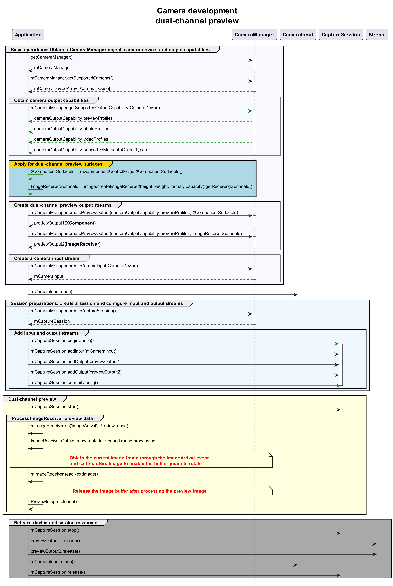

# Dual-Channel Preview (ArkTS)

<!--Kit: Camera Kit-->
<!--Subsystem: Multimedia-->
<!--Owner: @qano-->
<!--Designer: @leo_ysl-->
<!--Tester: @xchaosioda-->
<!--Adviser: @w_Machine_cc-->
<!-- md-trans-meta sourceCommit=425e79ed59a841b19860caacc0b050f68405d43e translatedAt=2026-08-10T09:14:02.538Z pushedAt=2026-08-10T11:35:31.763Z -->

Before developing a camera application, you must [request required permissions](camera-preparation.md).

Dual-channel preview means that an application can use two preview streams at the same time. One preview stream is used for display on the screen, and the other is used for other operations such as image processing, so as to improve the processing efficiency.

The camera application controls the camera device to implement basic operations such as image display (preview), photo saving (photo capture), and video recording. The camera development model is the Surface model, where the app transfers data through surfaces. Specifically, the app obtains photo stream data through the surface of [ImageReceiver](../../reference/apis-image-kit/arkts-apis-image-ImageReceiver.md) and preview stream data through the surface of XComponent.

To implement dual-channel preview, you can refer to [Photo Capture](camera-shooting.md) and replace the photo stream with another preview stream. Create another previewOutput through the surface of [ImageReceiver](../../reference/apis-image-kit/arkts-apis-image-ImageReceiver.md). The rest of the process is the same as that for photo capture.

For detailed API descriptions, see [@ohos.multimedia.camera (Camera Management)](../../reference/apis-camera-kit/arkts-apis-camera.md).

## Constraints

- Currently, streams cannot be dynamically added. In other words, you cannot call [addOutput](../../reference/apis-camera-kit/arkts-apis-camera-Session.md#addoutput11) to add streams without calling [session.stop](../../reference/apis-camera-kit/arkts-apis-camera-Session.md#stop11) first.

- After an ImageReceiver object processes image data obtained, it must release the image buffer so that the buffer queue of the surface properly rotates.

## API Calling Process

The figure below shows the recommended API calling process of the dual-channel preview solution.



## How to Develop

- For the first preview stream used for image processing, create an ImageReceiver object, obtain the surface ID to create the first preview stream, register an image listener, and process each frame of image data in the preview stream as required.

- For the second preview stream used for image display, create an **XComponent**, obtain the surface ID to create the second preview stream, and render the preview stream data in the component.

- To enable both preview streams to obtain data, configure a camera session for both preview streams, and start the session.

The following code snippets are partial examples. You can click the link at the bottom right of each code snippet to obtain the complete project example.

### First Preview Stream Used for Image Processing

1. Import dependencies, including dependencies related to image and camera framework.

   <!-- @[dual_preview_imports](https://gitcode.com/openharmony/applications_app_samples/blob/master/code/DocsSample/Media/Camera/DualPreview/camera/src/main/ets/cameramanagers/ImageReceiverManager.ets) -->

   ``` TypeScript
   import { image } from '@kit.ImageKit';
   import { camera } from '@kit.CameraKit';
   import { display } from '@kit.ArkUI';
   import { BusinessError } from '@kit.BasicServicesKit';
   ```

2. Obtain the surface ID for the first preview stream. Specifically, create an ImageReceiver object, and obtain the surface ID through the object.

   <!-- @[init_image_receiver](https://gitcode.com/openharmony/applications_app_samples/blob/master/code/DocsSample/Media/Camera/DualPreview/camera/src/main/ets/cameramanagers/ImageReceiverManager.ets) -->

   ``` TypeScript
   async init(size: Size, format = image.ImageFormat.JPEG, capacity = 8) {
     const receiver = image.createImageReceiver(size, format, capacity);
     const surfaceId = await receiver.getReceivingSurfaceId();
     this.onImageArrival(receiver);
     return surfaceId;
   }
   ```

3. Obtain the image or PixelMap formats of the preview stream received by ImageReceiver. For details about the image format, see the **format** parameter in [Image](../../reference/apis-image-kit/arkts-apis-image-Image.md). For details about the [PixelMap](../../reference/apis-image-kit/arkts-apis-image-PixelMap.md) format, see [PixelMapFormat](../../reference/apis-image-kit/arkts-apis-image-e.md#pixelmapformat7).

   ```ts
   // Mapping between Image format and PixelMap format.
   let formatToPixelMapFormatMap = new Map<number, image.PixelMapFormat>([
     [12, image.PixelMapFormat.RGBA_8888],
     [25, image.PixelMapFormat.NV21],
     [35, image.PixelMapFormat.YCBCR_P010],
     [36, image.PixelMapFormat.YCRCB_P010]
   ]);
   // Mapping of single pixel size in PixelMapFormat format.
   let pixelMapFormatToSizeMap = new Map<image.PixelMapFormat, number>([
     [image.PixelMapFormat.RGBA_8888, 4],
     [image.PixelMapFormat.NV21, 1.5],
     [image.PixelMapFormat.YCBCR_P010, 3],
     [image.PixelMapFormat.YCRCB_P010, 3]
   ]);
   ```

4. Register a listener to process each frame of image data from the preview stream: Listen for the imageArrival event of the ImageReceiver component to obtain the image data returned by the underlying layer. For detailed API descriptions, see [ImageReceiver](../../reference/apis-image-kit/arkts-apis-image-ImageReceiver.md).

   > **NOTE**
   >
   > - When creating a [PixelMap](../../reference/apis-image-kit/arkts-apis-image-PixelMap.md) instance through the [createPixelMap](../../reference/apis-image-kit/arkts-apis-image-f.md#imagecreatepixelmap8) API, the `Size`, `srcPixelFormat`, and other properties must match the `Size` and `Format` properties configured in the preview profile of the camera preview output stream. For the image pixel format of ImageReceiver, see [PixelMapFormat](../../reference/apis-image-kit/arkts-apis-image-e.md#pixelmapformat7). For the output format of the camera preview output stream `previewProfile`, see [CameraFormat](../../reference/apis-camera-kit/arkts-apis-camera-e.md#cameraformat).
   > - Due to differences between device models, before creating a camera preview output stream, you must call [getSupportedOutputCapability](../../reference/apis-camera-kit/arkts-apis-camera-CameraManager.md#getsupportedoutputcapability11) to obtain the preview profiles supported by the current device. Then, select a preview profile with the appropriate [CameraFormat](../../reference/apis-camera-kit/arkts-apis-camera-e.md#cameraformat) and [Size](../../reference/apis-camera-kit/arkts-apis-camera-i.md#size) based on your service requirements.
   > - The actual format of the preview stream image data received by `ImageReceiver` is determined by the format parameter in the preview profile that you select when creating the camera preview output stream. For detailed steps, see [Enabling a Preview Stream to Obtain Data](camera-dual-channel-preview.md#enabling-a-preview-stream-to-obtain-data).

   <!-- @[onImageArrival](https://gitcode.com/openharmony/applications_app_samples/blob/master/code/DocsSample/Media/Camera/DualPreview/camera/src/main/ets/cameramanagers/ImageReceiverManager.ets) -->

   ``` TypeScript
   onImageArrival(receiver: image.ImageReceiver): void {
     receiver.on('imageArrival', () => {
       Logger.info(TAG, 'image arrival');
       receiver.readNextImage((err: BusinessError, nextImage: image.Image) => {
         if (err || nextImage === undefined) {
           Logger.error(TAG, 'readNextImage failed');
           return;
         }
         nextImage.getComponent(image.ComponentType.JPEG, async (err: BusinessError, imgComponent: image.Component) => {
           if (err || imgComponent === undefined) {
             Logger.error(TAG, 'getComponent failed');
           }
           if (imgComponent.byteBuffer) {
             // ...
           } else {
             Logger.error(TAG, 'byteBuffer is null');
           }
           // ...
         });
       });
     });
   }
   ```

   The following is an example of parsing image buffer data through [image.Component](../../reference/apis-image-kit/arkts-apis-image-i.md#component9):

   > **NOTE**
   >
   > Check whether the width of the image is the same as `rowStride`. If they are different, perform the following operations.

   Method 1: Remove the stride data from `imgComponent.byteBuffer`, obtain a new buffer by means of copy, and process the buffer by calling the API that does not support stride.

   <!-- @[getPixelMap](https://gitcode.com/openharmony/applications_app_samples/blob/master/code/DocsSample/Media/Camera/DualPreview/camera/src/main/ets/cameramanagers/ImageReceiverManager.ets) -->

   ``` TypeScript
   async getPixelMap(imgComponent: image.Component, width: number, height: number, stride: number) {
     if (stride === width) {
       return await image.createPixelMap(imgComponent.byteBuffer, {
         size: { height: height, width: width },
         srcPixelFormat: image.PixelMapFormat.NV21,
       });
     }
     const dstBufferSize = width * height * 1.5;
     const dstArr = new Uint8Array(dstBufferSize);
     for (let j = 0; j < height * 1.5; j++) {
       const srcBuf = new Uint8Array(imgComponent.byteBuffer, j * stride, width);
       dstArr.set(srcBuf, j * width);
     }
     return await image.createPixelMap(dstArr.buffer, {
       size: { height: height, width: width },
       srcPixelFormat: image.PixelMapFormat.NV21,
     });
   }
   ```

   Method 2: Create a PixelMap based on the value of stride * height, and call **cropSync** of the PixelMap to crop redundant pixels.

   ```ts
   // Create a pixelMap with width set to the stride value.
   let pixelMap = await image.createPixelMap(imgComponent.byteBuffer, {
     size:{height: height, width: stride}, srcPixelFormat: pixelMapFormat});
   // Crop the excess pixels.
   pixelMap.cropSync({size:{width:width, height:height}, x:0, y:0});
   ```

   Method 3: Pass the original `imgComponent.byteBuffer` and stride information together to the API that supports stride.

### Second Preview Stream Used for Image Display

Obtain the surface ID of the second preview stream: Create an XComponent for displaying the preview stream. To obtain the surface ID, call [getXComponentSurfaceId](../../reference/apis-arkui/arkui-ts/ts-basic-components-xcomponent.md#getxcomponentsurfaceid9) provided by the XComponent. The capabilities of XComponent are provided by the UI. For more information, see [XComponent](../../reference/apis-arkui/arkui-ts/ts-basic-components-xcomponent.md).

<!-- @[XComponent](https://gitcode.com/openharmony/applications_app_samples/blob/master/code/DocsSample/Media/Camera/DualPreview/entry/src/main/ets/pages/Index.ets) -->

``` TypeScript
XComponent({
  type: XComponentType.SURFACE,
  controller: this.previewVM.xComponentController
})
  .size({ height: '100%', width: '100%' })
  .onLoad(async () => {
    // ...
    this.previewVM.surfaceId = this.previewVM.xComponentController.getXComponentSurfaceId();
    this.previewVM.setPreviewSize();
    this.previewVM.xComponentController.setXComponentSurfaceRotation({ lock: true });
    // ...
  })
```

### Enabling a Preview Stream to Obtain Data

Create two preview outputs with two surface IDs, add the outputs to a camera session, and start the camera session to obtain the preview stream data.

<!-- @[createOutput](https://gitcode.com/openharmony/applications_app_samples/blob/master/code/DocsSample/Media/Camera/DualPreview/camera/src/main/ets/cameramanagers/PreviewManager.ets) -->

``` TypeScript
async createOutput(config: CreateOutputConfig) {
  const cameraOutputCap = config.cameraManager.getSupportedOutputCapability(config.device, config.sceneMode);
  const displayRatio = config.profile.size.width / config.profile.size.height;
  const profileWidth = config.profile.size.width;
  const previewProfile = cameraOutputCap.previewProfiles
    .sort((a, b) => Math.abs(a.size.width - profileWidth) - Math.abs(b.size.width - profileWidth))
    .find(pf => {
      const pfDisplayRatio = pf.size.width / pf.size.height;
      return pf.format === config.profile.format &&
        Math.abs(pfDisplayRatio - displayRatio) <= CameraConstant.PROFILE_DIFFERENCE;
    });
  if (!previewProfile) {
    Logger.error(TAG_LOG, 'Failed to get preview profile');
    return;
  }
  this.output = config.cameraManager.createPreviewOutput(previewProfile, config.surfaceId);
  this.addOutputListener(this.output);
  return this.output;
}
```

## Complete Sample Code

<!-- @[dual_preview_case](https://gitcode.com/openharmony/applications_app_samples/blob/master/code/DocsSample/Media/Camera/DualPreview/camera/src/main/ets/cameramanagers/ImageReceiverManager.ets) -->

``` TypeScript
import { image } from '@kit.ImageKit';
import { camera } from '@kit.CameraKit';
import { display } from '@kit.ArkUI';
import { BusinessError } from '@kit.BasicServicesKit';
import { Logger } from 'commons';
import OutputManager, { CreateOutputConfig } from './OutputManager';
import CameraConstant from '../constants/CameraConstants';

const TAG = 'ImageReceiverManager';

export class ImageReceiverManager implements OutputManager {
  public output?: camera.PreviewOutput;
  public isActive: boolean = true;
  public callback: (px: PixelMap) => void;
  private position: camera.CameraPosition = camera.CameraPosition.CAMERA_POSITION_BACK;

  constructor(cb: (px: PixelMap) => void) {
    this.callback = cb;
  }

  async createOutput(config: CreateOutputConfig) {
    const cameraOutputCap = config.cameraManager.getSupportedOutputCapability(config.device, config.sceneMode);
    const displayRatio = config.profile.size.width / config.profile.size.height;
    const profileWidth = config.profile.size.width;
    const previewProfile = cameraOutputCap.previewProfiles
      .sort((a, b) => Math.abs(a.size.width - profileWidth) - Math.abs(b.size.width - profileWidth))
      .find(pf => {
        const pfDisplayRatio = pf.size.width / pf.size.height;
        return pf.format === config.profile.format &&
          Math.abs(pfDisplayRatio - displayRatio) <= CameraConstant.PROFILE_DIFFERENCE;
      });
    if (!previewProfile) {
      Logger.error(TAG, 'Failed to get preview profile');
      return;
    }
    const surfaceId = await this.init(config.profile.size);
    this.output = config.cameraManager.createPreviewOutput(previewProfile, surfaceId);
    this.position = config.device.cameraPosition;
    return this.output;
  }

  async release() {
    await this.output?.release();
    this.output = undefined;
  }

  async init(size: Size, format = image.ImageFormat.JPEG, capacity = 8) {
    const receiver = image.createImageReceiver(size, format, capacity);
    const surfaceId = await receiver.getReceivingSurfaceId();
    this.onImageArrival(receiver);
    return surfaceId;
  }

  async getPixelMap(imgComponent: image.Component, width: number, height: number, stride: number) {
    if (stride === width) {
      return await image.createPixelMap(imgComponent.byteBuffer, {
        size: { height: height, width: width },
        srcPixelFormat: image.PixelMapFormat.NV21,
      });
    }
    const dstBufferSize = width * height * 1.5;
    const dstArr = new Uint8Array(dstBufferSize);
    for (let j = 0; j < height * 1.5; j++) {
      const srcBuf = new Uint8Array(imgComponent.byteBuffer, j * stride, width);
      dstArr.set(srcBuf, j * width);
    }
    return await image.createPixelMap(dstArr.buffer, {
      size: { height: height, width: width },
      srcPixelFormat: image.PixelMapFormat.NV21,
    });
  }

  onImageArrival(receiver: image.ImageReceiver): void {
    receiver.on('imageArrival', () => {
      Logger.info(TAG, 'image arrival');
      receiver.readNextImage((err: BusinessError, nextImage: image.Image) => {
        if (err || nextImage === undefined) {
          Logger.error(TAG, 'readNextImage failed');
          return;
        }
        nextImage.getComponent(image.ComponentType.JPEG, async (err: BusinessError, imgComponent: image.Component) => {
          if (err || imgComponent === undefined) {
            Logger.error(TAG, 'getComponent failed');
          }
          if (imgComponent.byteBuffer) {
            const width = nextImage.size.width;
            const height = nextImage.size.height;
            const stride = imgComponent.rowStride;
            Logger.info(TAG, `getComponent with width:${width} height:${height} stride:${stride}`);
            const pixelMap = await this.getPixelMap(imgComponent, width, height, stride);
            const displayRotation = display.getDefaultDisplaySync().rotation * camera.ImageRotation.ROTATION_90;
            const rotation = this.output!.getPreviewRotation(displayRotation);
            if (this.position === camera.CameraPosition.CAMERA_POSITION_FRONT) {
              if (displayRotation === 90 || displayRotation === 270) {
                await pixelMap.rotate((rotation + 180) % 360);
              } else {
                await pixelMap.rotate(rotation);
              }
              await pixelMap.flip(true, false);
            } else {
              await pixelMap.rotate(rotation);
            }
            this.callback(pixelMap);
          } else {
            Logger.error(TAG, 'byteBuffer is null');
          }
          nextImage.release().then(() => {Logger.info(TAG, 'image release done');}).catch((error: BusinessError) => {
            Logger.error(TAG, `Release failed! Code ${error.code},message is ${error.message}`);
          });
          Logger.info(TAG, 'image process done');
        });
      });
    });
  }
}
```