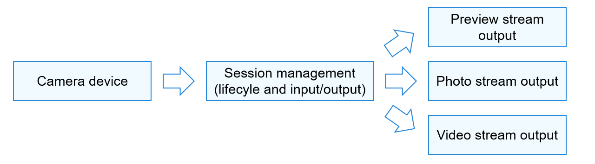
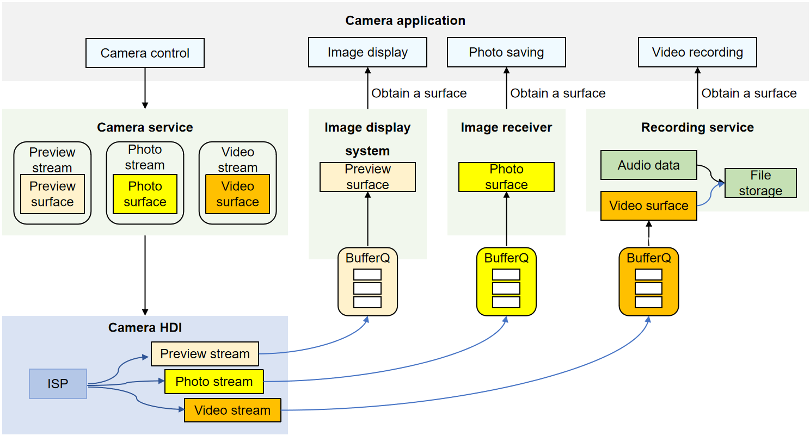

# Introduction to Camera Kit

With the APIs provided by Camera Kit, you can develop a camera application. The application accesses and operates the camera hardware to implement basic operations, such as preview, photo capture, and video recording. It can also perform more operations, for example, controlling the flash and exposure time, and focusing or adjusting the focus.

## When to Use

When you want to develop a camera application or develop a camera module in an application, you can refer to the development model described below to understand the working process of the camera before the development. For details, see [Camera Development Preparations](camera-preparation.md).

If you only need to start the system camera to take a photo or record a video, you can directly use the CameraPicker module, without applying for the camera permission. For details, see [Camera Picker](../../reference/apis-camera-kit/js-apis-cameraPicker.md).

## Development Model

The camera application invokes the camera hardware to collect and process image and video data, and output images and videos. It can be used when there are multiple lenses (such as wide-angle lens, long-focus lens, and ToF lens) in various service scenarios (such as different requirements on the resolution, format, and effect).

The figure below illustrates the working process of the camera module. The working process can be summarized into three parts: input device management, session management, and output management.

- During input device management, the camera application invokes the camera hardware to collect data and uses the data as an input stream.

- During session management, you can configure an input stream to determine the camera to be used. You can also set parameters, such as the flash, exposure time, focus, and focus adjustment, to implement different shooting effects in various service scenarios. The application can switch between sessions to meet service requirements in different scenarios.

- During output management, you can configure an output stream, which can be a preview stream, photo stream, or video stream.

**Figure 1** Camera working process 

For better application development, you are also advised understanding the camera development model.

**Figure 2** Camera development model 

The camera application controls the camera hardware to implement basic operations such as image display (preview), photo saving (photo capture), and video recording. During the implementation, the camera service controls the camera hardware to collect and output data, and transmits the data to a specific module for processing through a BufferQueue at the bottom camera device hardware interface (HDI) layer. You can ignore the BufferQueue during application development. It is used to send the data processed by the bottom layer to the upper layer for image display.

For example, in a video recording scenario, the recording service creates a video surface and provides it to the camera service for data transmission. The camera service controls the camera device to collect video data and generate a video stream. After processing the collected data at the HDI layer, the camera service transmits the video stream to the recording service through the surface. The recording service processes the video stream and saves it as a video file. Now video recording is complete.
