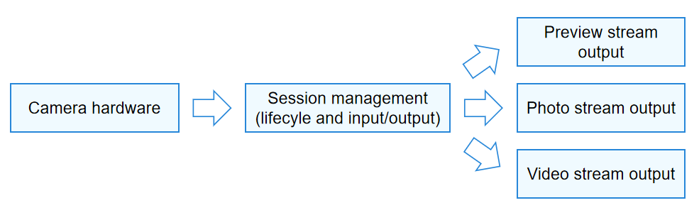
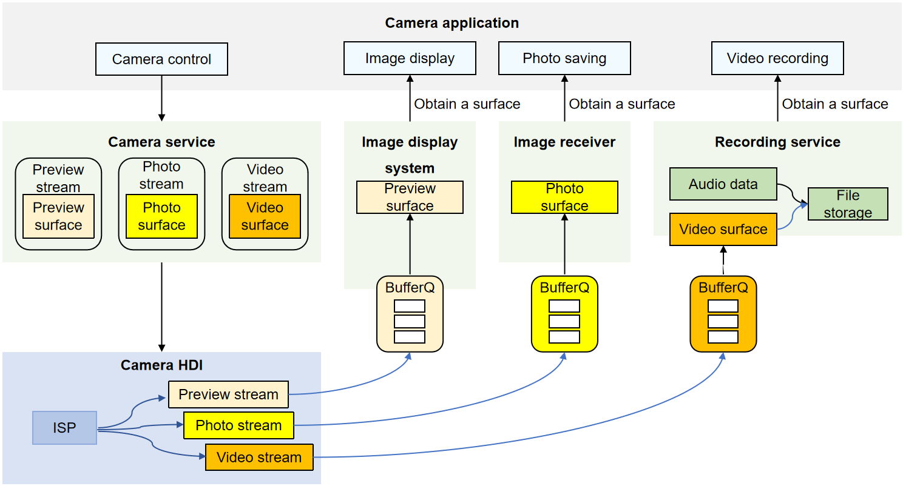

# About This Kit

<!--Kit: Camera Kit-->
<!--Subsystem: Multimedia-->
<!--Owner: @qano-->
<!--Designer: @leo_ysl-->
<!--Tester: @xchaosioda-->
<!--Adviser: @w_Machine_cc-->
<!-- md-trans-meta sourceCommit=612b882ee4bd16025d43bbddfd67628eab795c95 translatedAt=2026-08-10T14:05:13.844Z pushedAt=2026-08-10T14:09:03.030Z -->

By calling the APIs provided by Camera Kit (camera service), you can develop a camera app. The app accesses and operates camera hardware to implement basic operations such as preview, photo capture, and video recording. Through API combinations, you can also perform additional operations such as controlling the flash and exposure time, focusing, or adjusting focus.

## When to Use

When you need to develop a camera app (or a camera module within an app), you can refer to the following development model to understand the camera workflow and then proceed with camera app development.

If you only need to launch the system camera to take a photo or record a video, you can directly use `CameraPicker`, which does not require camera permissions and directly invokes the system camera to complete the capture. For details, see [CameraPicker](../../reference/apis-camera-kit/js-apis-cameraPicker.md).

## Development Model

A camera app invokes camera devices to capture and process image and video data, precisely controls the corresponding hardware, and flexibly outputs image and video content. This meets the requirements of multi-lens hardware adaptation (such as wide-angle, telephoto, and TOF) and multi-scenario service adaptation (such as different resolutions, formats, and effects).

The workflow of camera app development is shown in Figure 1, which can be summarized into three parts: camera device, camera session management, and camera output management.

- The camera app invokes a camera device to capture data, which serves as the camera input stream.

- Camera session management allows you to configure the input stream, that is, to select an appropriate camera lens (such as front or rear) for shooting. In addition, you can configure parameters such as flash, exposure time, focus, and zoom to achieve different shooting effects, thereby adapting to different service scenarios. An app can switch between sessions to meet the shooting requirements of different scenarios.

- Camera output management configures the output streams of the camera, that is, outputting image content as a preview stream, photo stream, or video stream.

**Figure 1** Camera workflow

To help you better develop camera apps, it is recommended that you first understand the camera development workflow and then the camera development model (as shown in Figure 2).

A camera app controls the camera to implement basic operations such as image display (preview), photo saving (capture), and video recording. During these operations, the Camera Service controls the camera device to capture and output data. The captured image data is processed by the Image Signal Processor (ISP) and then passed directly to specific functional modules through buffer queues via the underlying Hardware Device Interfaces (HDI) of the camera. The buffer queues, which you do not need to manage during app development, are used to deliver the data processed at the lower layer to the upper layer for image display in a timely manner.

Take video recording as an example: The camera service controls the camera device to capture video data and generate a video stream. After the captured data is processed by the underlying camera HDI, the video stream is passed to the media recording service through a Surface. Finally, the media recording service processes the video data and saves it as a video file, completing the video recording.

**Figure 2** Camera development model

## Samples

The following sample is available for camera development:

- [Camera and Media Library (ArkTS) (Full SDK) (API10)](https://gitcode.com/openharmony/applications_app_samples/tree/master/code/SystemFeature/Media/Camera)

<!--RP1--><!--RP1End-->