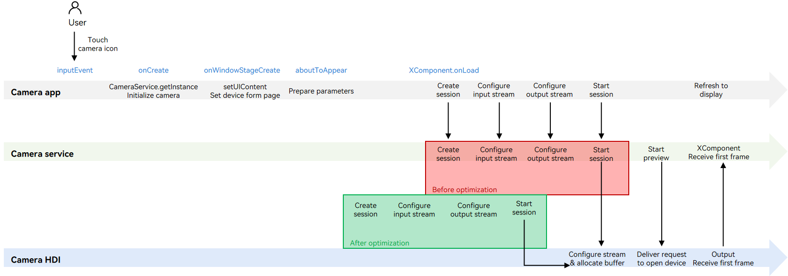
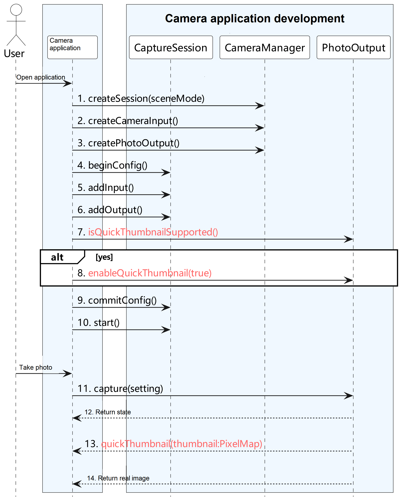

# Performance Optimization Practices (for System Applications Only) (ArkTS)
<!--Kit: Camera Kit-->
<!--Subsystem: Multimedia-->
<!--Owner: @qano-->
<!--Designer: @leo_ysl-->
<!--Tester: @xchaosioda-->
<!--Adviser: @zengyawen-->

Before developing a camera application, you must [request required permissions](camera-preparation.md).

The camera startup performance is affected by time-consuming operations such as power-on of underlying components and initialization of the process pipeline. To improve the camera startup speed and thumbnail display speed, OpenHarmony introduces some features. The capabilities of these features are related to underlying components. You need to check whether your underlying components support these capabilities before using the capabilities.

​These features are involved in the processes of starting the camera device, configuring streams, and taking photos. This topic describes the three scenarios.

## Deferred Stream Configuration

A typical camera startup process includes starting the camera device, configuring a data stream, and starting the data stream. Before configuring the data stream, you need to obtain the surface ID of the **XComponent**.

The deferred stream configuration feature decouples stream configuration and start from the surface. Before the **XComponent** provides the surface for the camera application, the system configures and starts the stream. This way, the surface only needs to be available before the stream is started. This improves the startup speed and prevents the implementation of other startup optimization schemas from being affected.



Before optimization: Stream configuration depends on a Surface object, which is available after UI loading is complete. In other words, you can create a session, configure input and output streams, and start the session only after the UI is loaded. The camera HDI is responsible for stream configuration.

After optimization: Stream configuration does not depend on the Surface object. UI loading and stream configuration are executed concurrently. After the parameters are prepared, you can create a session.

### Available APIs

Read [Camera](../../reference/apis-camera-kit/arkts-apis-camera.md) for the API reference.

| API| Description|
| ---- | ---- |
| createDeferredPreviewOutput(profile: Profile): Promise\<PreviewOutput> | Creates a deferred PreviewOutput instance and adds it, instead of a common PreviewOutput instance, to the data stream during stream configuration.|
| addDeferredSurface(surfaceId: string): Promise\<void> | Adds a surface for delayed preview. This API can run after [session.commitConfig](../../reference/apis-camera-kit/arkts-apis-camera-Session.md#commitconfig11) or [session.start](../../reference/apis-camera-kit/arkts-apis-camera-Session.md#start11) is called.|

### Development Example

The figure below shows the recommended API call process.


For details about how to obtain the context, see [Obtaining the Context of UIAbility](../../application-models/uiability-usage.md#obtaining-the-context-of-uiability).

```ts
import { camera } from '@kit.CameraKit';
import { common } from '@kit.AbilityKit';

async function preview(baseContext: common.BaseContext, cameraInfo: camera.CameraDevice, previewProfile: camera.Profile, photoProfile: camera.Profile, previewSurfaceId: string): Promise<void> {
  if (!baseContext || !cameraInfo || !previewProfile || !photoProfile || !previewSurfaceId) {
    return;
  }
  try {
    const cameraManager: camera.CameraManager = camera.getCameraManager(baseContext);
    if (!cameraManager) {
      console.error('cameraManager is null');
      return;
    }
    const cameraInput: camera.CameraInput = cameraManager.createCameraInput(cameraInfo);
    if (!cameraInput) {
      console.error('cameraInput is null');
      return;
    }
    const previewOutput: camera.PreviewOutput = cameraManager.createDeferredPreviewOutput(previewProfile);
    if (!previewOutput) {
      console.error('previewOutput is null');
      return;
    }
    const photoOutput: camera.PhotoOutput = cameraManager.createPhotoOutput(photoProfile);
    if (!photoOutput) {
      console.error('photoOutput is null');
      return;
    }
    let session = cameraManager.createSession(camera.SceneMode.NORMAL_PHOTO);
    if (!session) {
      console.error('session is null');
      return;
    }
    const photoSession: camera.PhotoSession = session as camera.PhotoSession;
    photoSession.beginConfig();
    photoSession.addInput(cameraInput);
    photoSession.addOutput(previewOutput);
    photoSession.addOutput(photoOutput);
    await photoSession.commitConfig();
    await photoSession.start();
    previewOutput.addDeferredSurface(previewSurfaceId);
  } catch (err) {
    console.error(`preview call failed. error: ${JSON.stringify(err)}`);
  }
}
```

## Quick Thumbnail

The photo capture performance depends on the algorithm processing speed. A complex algorithm chain provides better image effect while requiring longer processing time.

To improve the photo capture speed perceived by end users, the quick thumbnail feature is introduced. When the user takes a photo, a thumbnail is output and reported to the camera application for display before a real image is reported.

In this way, the photo capture process is optimized, which fulfills the processing requirements of the post-processing algorithm without blocking the photo capture speed of the foreground.

### Available APIs

Read [Camera](../../reference/apis-camera-kit/arkts-apis-camera.md) for the API reference.

| API| Description|
| ---- | ---- |
| isQuickThumbnailSupported() : boolean | Checks whether the quick thumbnail feature is supported. The value **true** means that the feature is supported, and **false** means the opposite.|
| enableQuickThumbnail(enabled:bool): void | Enables or disables the quick thumbnail feature.|
| on(type: 'quickThumbnail', callback: AsyncCallback\<image.PixelMap>): void | Listens for camera thumbnails.|

> **NOTE**
>
> - [isQuickThumbnailSupported](../../reference/apis-camera-kit/js-apis-camera-sys.md#isquickthumbnailsupported) and [enableQuickThumbnail](../../reference/apis-camera-kit/js-apis-camera-sys.md#enablequickthumbnail) must be called after [addOutput](../../reference/apis-camera-kit/arkts-apis-camera-Session.md#addoutput11) and [addInput](../../reference/apis-camera-kit/arkts-apis-camera-Session.md#addinput11) but before [commitConfig](../../reference/apis-camera-kit/arkts-apis-camera-Session.md#commitconfig11)
.
> - The **on** API takes effect after [enableQuickThumbnail(true)](../../reference/apis-camera-kit/js-apis-camera-sys.md#enablequickthumbnail) is called.

### Development Example

The figure below shows the recommended API call process.



For details about how to obtain the context, see [Obtaining the Context of UIAbility](../../application-models/uiability-usage.md#obtaining-the-context-of-uiability).
```ts
import { camera } from '@kit.CameraKit';
import { BusinessError } from '@kit.BasicServicesKit';
import { image } from '@kit.ImageKit';
import { common } from '@kit.AbilityKit';

async function enableQuickThumbnail(baseContext: common.BaseContext, photoProfile: camera.Profile): Promise<void> {
  if (!baseContext || !photoProfile) {
    console.error('baseContext is null or photoProfile is null');
    return;
  }
  try {
    let cameraManager: camera.CameraManager = camera.getCameraManager(baseContext);
    if (!cameraManager) {
      console.error('cameraManager is null');
      return;
    }
    let cameras: Array<camera.CameraDevice> = cameraManager.getSupportedCameras();
    if (!cameras || cameras.length == 0) {
      console.error('cameras is null or []');
      return;
    }
    let cameraInput: camera.CameraInput = cameraManager.createCameraInput(cameras[0]);
    if (!cameraInput) {
      console.error('cameraInput is null');
      return;
    }
    await cameraInput.open();
    let photoOutPut: camera.PhotoOutput = cameraManager.createPhotoOutput(photoProfile);
    if (!photoOutPut) {
      console.error('photoOutPut is null');
      return;
    }
    // Create a PhotoSession instance.
    let session = cameraManager.createSession(camera.SceneMode.NORMAL_PHOTO);
    if (!session) {
      console.error('session is null');
      return;
    }
    let photoSession: camera.PhotoSession = session as camera.PhotoSession;
    // Start configuration for the session.
    photoSession.beginConfig();
    // Add a CameraInput instance to the session.
    photoSession.addInput(cameraInput);
    // Add a PhotoOutput instance to the session.
    photoSession.addOutput(photoOutPut);
    let isSupported: boolean = photoOutPut.isQuickThumbnailSupported();
    if (isSupported) {
      // Enable the quick thumbnail feature.
      photoOutPut.enableQuickThumbnail(true);
      photoOutPut.on('quickThumbnail', (err: BusinessError, pixelMap: image.PixelMap) => {
        if (err || pixelMap === undefined) {
          console.error('photoOutPut on thumbnail failed');
          return;
        }
        // Display or save the PixelMap instance.
        showOrSavePicture(pixelMap);
      });
    }
  } catch (err) {
    console.error(`enableQuickThumbnail call failed. error: ${JSON.stringify(err)}`);
  }
}

function showOrSavePicture(pixelMap: image.PixelMap): void {
  // Do something.
}
```

## Prelaunch

Generally, the startup of the camera application is triggered when the user touches the camera icon on the home screen. The home screen senses the touch event and instructs the application manager to start the camera application. This takes a relatively long time. After the camera application is started, the camera startup process starts. A typical camera startup process includes starting the camera device, configuring a data stream, and starting the data stream, which is also time-consuming.


​The prelaunch feature triggers the action of starting the camera device before the camera application is started. In other words, when the user touches the camera icon on the home screen, the system starts the camera device. At this time, the camera application is not started yet. The figure below shows the camera application process before and after the prelaunch feature is introduced.


### Available APIs

Read [Camera](../../reference/apis-camera-kit/arkts-apis-camera.md) for the API reference.

| API| Description|
| ---- | ---- |
| isPrelaunchSupported(camera: CameraDevice) : boolean |  Checks whether the camera supports prelaunch. The value **true** means that the camera supports prelaunch, and **false** means the opposite.|
| setPrelaunchConfig(prelaunchConfig: PrelaunchConfig) : void | Sets the prelaunch parameters.|
| prelaunch() : void | Prelaunches the camera. This API is called when a user touches the system camera icon to start the camera application.|

### Development Example

The figure below shows the recommended API call process.


For details about how to obtain the context, see [Obtaining the Context of UIAbility](../../application-models/uiability-usage.md#obtaining-the-context-of-uiability).

- **Home screen**

  ```ts
  import { camera } from '@kit.CameraKit';
  import { BusinessError } from '@kit.BasicServicesKit';
  import { common } from '@kit.AbilityKit';

  function preLaunch(baseContext: common.BaseContext): void {
    let cameraManager: camera.CameraManager | undefined = undefined;
    try {
      cameraManager = camera.getCameraManager(baseContext);
    } catch (error) {
      console.error(`enableQuickThumbnail call failed. error: ${JSON.stringify(error)}`);
    }
    if (!cameraManager) {
      return;
    }
    try {
      cameraManager.prelaunch();
    } catch (error) {
      let err = error as BusinessError;
      console.error(`catch error: Code: ${err.code}, message: ${err.message}`);
    }
  }
  ```

- **Camera application**

  To use the prelaunch feature, the camera application must configure the ohos.permission.CAMERA permission.

  For details about how to request and verify the permissions, see [Requesting User Authorization](../../security/AccessToken/request-user-authorization.md).

  ```ts
  import { camera } from '@kit.CameraKit';
  import { BusinessError } from '@kit.BasicServicesKit';
  import { common } from '@kit.AbilityKit';

  function setPreLaunchConfig(baseContext: common.BaseContext): void {
    let cameraManager: camera.CameraManager | undefined = undefined;
    try {
      cameraManager = camera.getCameraManager(baseContext);
    } catch (error) {
      console.error(`enableQuickThumbnail call failed. error: ${JSON.stringify(error)}`);
    }
    if (!cameraManager) {
      return;
    }
    let cameras: Array<camera.CameraDevice> = [];
    try {
      cameras = cameraManager.getSupportedCameras();
    } catch (error) {
      let err = error as BusinessError;
      console.error(`getSupportedCameras catch error: Code: ${err.code}, message: ${err.message}`);
    }
    if (!cameras || cameras.length == 0) {
      return;
    }
    if(cameraManager.isPrelaunchSupported(cameras[0])) {
      try {
        cameraManager.setPrelaunchConfig({cameraDevice: cameras[0]});
      } catch (error) {
        let err = error as BusinessError;
        console.error(`setPrelaunchConfig catch error: Code: ${err.code}, message: ${err.message}`);
      }
    }
  }
  ```
