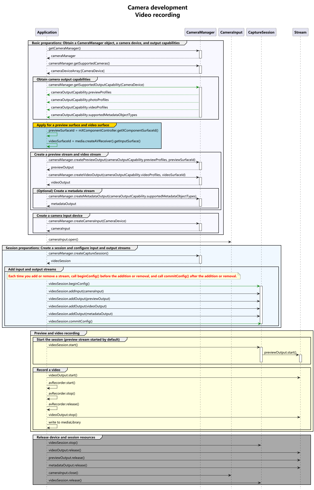

# Video Recording Sample (ArkTS)

Before developing a camera application, request permissions by following the instructions provided in [Camera Development Preparations](camera-preparation.md).

This topic provides sample code that covers the complete recording process to help you understand the complete API calling sequence.

Before referring to the sample code, you are advised to read [Device Input Management](camera-device-input.md), [Camera Session Management](camera-session-management.md), [Video Recording](camera-recording.md), and other related topics in [Camera Development (ArkTS)](camera-preparation.md).

To save videos to the media library, follow the instructions provided in [Saving Media Assets](../medialibrary/photoAccessHelper-savebutton.md).
## Development Process

After obtaining the output stream capabilities supported by the camera, create a video stream. The development process is as follows:




## Sample Code
For details about how to obtain the context, see [Obtaining the Context of UIAbility](../../application-models/uiability-usage.md#obtaining-the-context-of-uiability).

```ts
import { camera } from '@kit.CameraKit';
import { BusinessError } from '@kit.BasicServicesKit';
import { media } from '@kit.MediaKit';
import { common } from '@kit.AbilityKit';
import { fileIo as fs } from '@kit.CoreFileKit';

async function videoRecording(context: common.Context, surfaceId: string): Promise<void> {
  // Create a CameraManager object.
  let cameraManager: camera.CameraManager = camera.getCameraManager(context);
  if (!cameraManager) {
    console.error("camera.getCameraManager error");
    return;
  }

  // Listen for camera status changes.
  cameraManager.on('cameraStatus', (err: BusinessError, cameraStatusInfo: camera.CameraStatusInfo) => {
    if (err !== undefined && err.code !== 0) {
      console.error('cameraStatus with errorCode = ' + err.code);
      return;
    }
    console.info(`camera : ${cameraStatusInfo.camera.cameraId}`);
    console.info(`status: ${cameraStatusInfo.status}`);
  });

  // Obtain the camera list.
  let cameraArray: Array<camera.CameraDevice> = [];
  try {
    cameraArray = cameraManager.getSupportedCameras();
  } catch (error) {
    let err = error as BusinessError;
    console.error(`getSupportedCameras call failed. error code: ${err.code}`);
  }

  if (cameraArray.length <= 0) {
    console.error("cameraManager.getSupportedCameras error");
    return;
  }

  // Obtain the supported modes.
  let sceneModes: Array<camera.SceneMode> = cameraManager.getSupportedSceneModes(cameraArray[0]);
  let isSupportVideoMode: boolean = sceneModes.indexOf(camera.SceneMode.NORMAL_VIDEO) >= 0;
  if (!isSupportVideoMode) {
    console.error('video mode not support');
    return;
  }

  // Obtain the output stream capability supported by the camera.
  let cameraOutputCap: camera.CameraOutputCapability = cameraManager.getSupportedOutputCapability(cameraArray[0], camera.SceneMode.NORMAL_VIDEO);
  if (!cameraOutputCap) {
    console.error("cameraManager.getSupportedOutputCapability error")
    return;
  }
  console.info("outputCapability: " + JSON.stringify(cameraOutputCap));

  let previewProfilesArray: Array<camera.Profile> = cameraOutputCap.previewProfiles;
  if (!previewProfilesArray) {
    console.error("createOutput previewProfilesArray == null || undefined");
  }

  let photoProfilesArray: Array<camera.Profile> = cameraOutputCap.photoProfiles;
  if (!photoProfilesArray) {
    console.error("createOutput photoProfilesArray == null || undefined");
  }

  let videoProfilesArray: Array<camera.VideoProfile> = cameraOutputCap.videoProfiles;
  if (!videoProfilesArray || videoProfilesArray.length === 0) {
    console.error("createOutput videoProfilesArray == null || undefined");
  }

  // The width and height of videoProfile must be the same as those of AVRecorderProfile.
  // In this sample code, the first video profile is selected. You need to select a video profile as required.
  let videoProfile: camera.VideoProfile = videoProfilesArray[0];
  let isHdr = videoProfile.format === camera.CameraFormat.CAMERA_FORMAT_YCBCR_P010 || videoProfile.format === camera.CameraFormat.CAMERA_FORMAT_YCRCB_P010;
  // Configure the parameters based on those supported by the hardware device.
  let aVRecorderProfile: media.AVRecorderProfile = {
    audioBitrate: 48000,
    audioChannels: 2,
    audioCodec: media.CodecMimeType.AUDIO_AAC,
    audioSampleRate: 48000,
    fileFormat: media.ContainerFormatType.CFT_MPEG_4,
    videoBitrate: 2000000,
    videoCodec: isHdr ? media.CodecMimeType.VIDEO_HEVC : media.CodecMimeType.VIDEO_AVC,
    videoFrameWidth: videoProfile.size.width,
    videoFrameHeight: videoProfile.size.height,
    videoFrameRate: 30,
    isHdr: isHdr
  };
  let videoUri: string = `file://${context.filesDir}/${Date.now()}.mp4`; // Local sandbox path.
  let file: fs.File = fs.openSync(videoUri, fs.OpenMode.READ_WRITE | fs.OpenMode.CREATE);
  let aVRecorderConfig: media.AVRecorderConfig = {
    audioSourceType: media.AudioSourceType.AUDIO_SOURCE_TYPE_MIC,
    videoSourceType: media.VideoSourceType.VIDEO_SOURCE_TYPE_SURFACE_YUV,
    profile: aVRecorderProfile,
    url: `fd://${file.fd.toString()}`, // Before passing in a file descriptor to this parameter, the file must be created by the caller and granted with the read and write permissions. Example value: fd://45--file:///data/media/01.mp4.
    rotation: 0, // The value can be 0, 90, 180, or 270. If any other value is used, prepare() reports an error.
    location: { latitude: 30, longitude: 130 }
  };

  let avRecorder: media.AVRecorder | undefined = undefined;
  try {
    avRecorder = await media.createAVRecorder();
  } catch (error) {
    let err = error as BusinessError;
    console.error(`createAVRecorder call failed. error code: ${err.code}`);
  }

  if (avRecorder === undefined) {
    return;
  }

  try {
    await avRecorder.prepare(aVRecorderConfig);
  } catch (error) {
    let err = error as BusinessError;
    console.error(`prepare call failed. error code: ${err.code}`);
  }

  let videoSurfaceId: string | undefined = undefined; // The surfaceID is passed in to the camera API to create a VideoOutput instance.
  try {
    videoSurfaceId = await avRecorder.getInputSurface();
  } catch (error) {
    let err = error as BusinessError;
    console.error(`getInputSurface call failed. error code: ${err.code}`);
  }
  if (videoSurfaceId === undefined) {
    return;
  }
  // Create a VideoOutput instance.
  let videoOutput: camera.VideoOutput | undefined = undefined;
  try {
    videoOutput = cameraManager.createVideoOutput(videoProfile, videoSurfaceId);
  } catch (error) {
    let err = error as BusinessError;
    console.error(`Failed to create the videoOutput instance. error: ${JSON.stringify(err)}`);
  }
  if (videoOutput === undefined) {
    return;
  }
  // Listen for video output errors.
  videoOutput.on('error', (error: BusinessError) => {
    console.error(`Preview output error code: ${error.code}`);
  });

  // Create a session.
  let videoSession: camera.VideoSession | undefined = undefined;
  try {
    videoSession = cameraManager.createSession(camera.SceneMode.NORMAL_VIDEO) as camera.VideoSession;
  } catch (error) {
    let err = error as BusinessError;
    console.error(`Failed to create the session instance. error: ${JSON.stringify(err)}`);
  }
  if (videoSession === undefined) {
    return;
  }
  // Listen for session errors.
  videoSession.on('error', (error: BusinessError) => {
    console.error(`Video session error code: ${error.code}`);
  });

  // Start configuration for the session.
  try {
    videoSession.beginConfig();
  } catch (error) {
    let err = error as BusinessError;
    console.error(`Failed to beginConfig. error: ${JSON.stringify(err)}`);
  }

  // Create a camera input stream.
  let cameraInput: camera.CameraInput | undefined = undefined;
  try {
    cameraInput = cameraManager.createCameraInput(cameraArray[0]);
  } catch (error) {
    let err = error as BusinessError;
    console.error(`Failed to createCameraInput. error: ${JSON.stringify(err)}`);
  }
  if (cameraInput === undefined) {
    return;
  }
  // Listen for camera input errors.
  let cameraDevice: camera.CameraDevice = cameraArray[0];
  cameraInput.on('error', cameraDevice, (error: BusinessError) => {
    console.error(`Camera input error code: ${error.code}`);
  });

  // Open the camera.
  try {
    await cameraInput.open();
  } catch (error) {
    let err = error as BusinessError;
    console.error(`Failed to open cameraInput. error: ${JSON.stringify(err)}`);
  }

  // Add the camera input stream to the session.
  try {
    videoSession.addInput(cameraInput);
  } catch (error) {
    let err = error as BusinessError;
    console.error(`Failed to add cameraInput. error: ${JSON.stringify(err)}`);
  }

  // Create a preview output stream. For details about the surfaceId parameter, see the XComponent. The preview stream is the surface provided by the XComponent.
  let previewOutput: camera.PreviewOutput | undefined = undefined;
  let previewProfile = previewProfilesArray.find((previewProfile: camera.Profile) => {
    return Math.abs((previewProfile.size.width / previewProfile.size.height) - (videoProfile.size.width / videoProfile.size.height)) < Number.EPSILON;
  }); // Select the preview resolution with the same aspect ratio as the recording resolution.
  if (previewProfile === undefined) {
    return;
  }
  try {
    previewOutput = cameraManager.createPreviewOutput(previewProfile, surfaceId);
  } catch (error) {
    let err = error as BusinessError;
    console.error(`Failed to create the PreviewOutput instance. error: ${JSON.stringify(err)}`);
  }
  if (previewOutput === undefined) {
    return;
  }

  // Add the preview output stream to the session.
  try {
    videoSession.addOutput(previewOutput);
  } catch (error) {
    let err = error as BusinessError;
    console.error(`Failed to add previewOutput. error: ${JSON.stringify(err)}`);
  }

  // Add the video output stream to the session.
  try {
    videoSession.addOutput(videoOutput);
  } catch (error) {
    let err = error as BusinessError;
    console.error(`Failed to add videoOutput. error: ${JSON.stringify(err)}`);
  }

  // Commit the session configuration.
  try {
    await videoSession.commitConfig();
  } catch (error) {
    let err = error as BusinessError;
    console.error(`videoSession commitConfig error: ${JSON.stringify(err)}`);
  }

  // Start the session.
  try {
    await videoSession.start();
  } catch (error) {
    let err = error as BusinessError;
    console.error(`videoSession start error: ${JSON.stringify(err)}`);
  }

  // Start the video output stream.
  videoOutput.start((err: BusinessError) => {
    if (err) {
      console.error(`Failed to start the video output. error: ${JSON.stringify(err)}`);
      return;
    }
    console.info('Callback invoked to indicate the video output start success.');
  });

  // Start video recording.
  try {
    await avRecorder.start();
  } catch (error) {
    let err = error as BusinessError;
    console.error(`avRecorder start error: ${JSON.stringify(err)}`);
  }

  // Stop the video output stream.
  videoOutput.stop((err: BusinessError) => {
    if (err) {
      console.error(`Failed to stop the video output. error: ${JSON.stringify(err)}`);
      return;
    }
    console.info('Callback invoked to indicate the video output stop success.');
  });

  // Stop video recording.
  try {
    await avRecorder.stop();
  } catch (error) {
    let err = error as BusinessError;
    console.error(`avRecorder stop error: ${JSON.stringify(err)}`);
  }

  // Stop the session.
  await videoSession.stop();

  // Close the file.
  fs.closeSync(file);

  // Release the camera input stream.
  await cameraInput.close();

  // Release the preview output stream.
  await previewOutput.release();

  // Release the video output stream.
  await videoOutput.release();

  // Release the session.
  await videoSession.release();

  // Set the session to null.
  videoSession = undefined;
}
```
