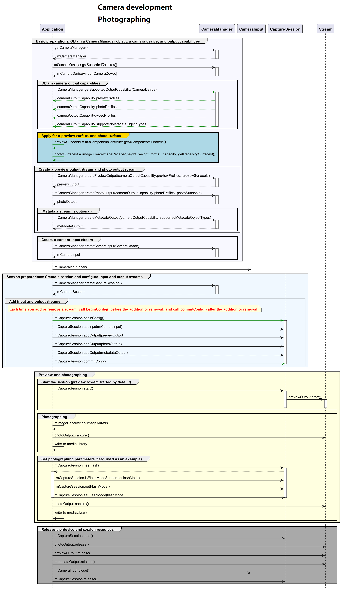

# Photo Capture Practices (ArkTS)
<!--Kit: Camera Kit-->
<!--Subsystem: Multimedia-->
<!--Owner: @qano-->
<!--Designer: @leo_ysl-->
<!--Tester: @xchaosioda-->
<!--Adviser: @zengyawen-->

Before developing a camera application, you must [request required permissions](camera-preparation.md).

This topic provides sample code that covers the complete photo capture process to help you understand the complete API calling sequence.

Before referring to the sample code, you are advised to read [Device Input Management](camera-device-input.md), [Camera Session Management](camera-session-management.md), [Photo Capture](camera-shooting.md), and other related topics in [Camera Development (ArkTS)](camera-device-management.md).

## Development Process

After obtaining the output stream capabilities supported by the camera, create a photo stream. The development process is as follows:



## Complete Sample Code

For details about how to obtain the context, see [Obtaining the Context of UIAbility](../../application-models/uiability-usage.md#obtaining-the-context-of-uiability).

To view the saved images and videos in Gallery, you must save them to the media library. For details, see [Saving Media Assets](../medialibrary/photoAccessHelper-savebutton.md).

Specifically, when [photoOutput.on('photoAvailable')](../../reference/apis-camera-kit/arkts-apis-camera-PhotoOutput.md#onphotoavailable11) is called and a buffer is obtained, the buffer must be stored in the security component to the media library.
```ts
import { camera } from '@kit.CameraKit';
import { image } from '@kit.ImageKit';
import { BusinessError } from '@kit.BasicServicesKit';

interface ShootingResources {
  cameraInput?: camera.CameraInput;
  previewOutput?: camera.PreviewOutput;
  photoOutput?: camera.PhotoOutput;
  photoSession?: camera.PhotoSession;
}

const resources: ShootingResources = {};

function setPhotoOutputCb(photoOutput: camera.PhotoOutput): void {
  if (!photoOutput) {
    console.error('photoOutput is null');
    return;
  }
  // After the callback is set, call capture() of photoOutput to transfer the photo buffer back to the callback.
  photoOutput?.on('photoAvailable', (err: BusinessError, photo: camera.Photo): void => {
    console.info('getPhoto start');
    console.error(`err: ${err}`);
    if (err && err.code != 0) {
      console.error('getPhoto failed');
      return;
    }
    if (!photo || !photo.main) {
      console.error('photo is null');
      return;
    }
    let imageObj = photo.main;
    imageObj.getComponent(image.ComponentType.JPEG, (errCode: BusinessError, component: image.Component): void => {
      console.info('getComponent start');
      if (errCode && errCode.code != 0 ) {
        console.error('getComponent failed');
        imageObj.release();
        return;
      }
      let buffer: ArrayBuffer;
      if (component && component.byteBuffer) {
        buffer = component.byteBuffer;
      } else {
        console.error('byteBuffer is null');
        imageObj.release();
        return;
      }
      // To view the saved image and video resources in Gallery, use a security component to create media assets.

      // After the buffer processing is complete, the buffer must be released. Otherwise, no buffer is available for subsequent photo capture.
      imageObj.release();
    });
  });
}

async function cameraShootingCase(context: Context, surfaceId: string): Promise<void> {
  // Create a CameraManager object.
  try {
    let cameraManager: camera.CameraManager = camera.getCameraManager(context);
  } catch (error) {
    let err = error as BusinessError;
    console.error(`camera.getCameraManager failed, err: ${err.code}`);
    return;
  }

  // Listen for camera status changes.
  cameraManager.on('cameraStatus', (err: BusinessError, cameraStatusInfo: camera.CameraStatusInfo) => {
    if (err !== undefined && err.code !== 0) {
      console.error('cameraStatus with errorCode = ' + err.code);
      return;
    }
    console.info(`camera : ${cameraStatusInfo.camera.cameraId}`);
    console.info(`status: ${cameraStatusInfo.status}`);
  });

    // Obtain the camera list.
    let cameraArray: Array<camera.CameraDevice> = cameraManager.getSupportedCameras();
    if (!cameraArray || cameraArray.length <= 0) {
      console.error("cameraManager.getSupportedCameras error");
      return;
    }

    for (let index = 0; index < cameraArray.length; index++) {
      console.info('cameraId : ' + cameraArray[index].cameraId);                          // Obtain the camera ID.
      console.info('cameraPosition : ' + cameraArray[index].cameraPosition);              // Obtain the camera position.
      console.info('cameraType : ' + cameraArray[index].cameraType);                      // Obtain the camera type.
      console.info('connectionType : ' + cameraArray[index].connectionType);              // Obtain the camera connection type.
    }

    // Create a camera input stream.
    resources.cameraInput = cameraManager.createCameraInput(cameraArray[0]);
    if (!resources.cameraInput) {
      console.error('cameraInput is null');
      return;
    }

    // Listen for camera input errors.
    let cameraDevice: camera.CameraDevice = cameraArray[0];
    resources.cameraInput.on('error', cameraDevice, (error: BusinessError) => {
      console.error(`Camera input error code: ${error.code}`);
    })

    // Open the camera.
    await resources.cameraInput.open();

    // Obtain the supported modes.
    let sceneModes: Array<camera.SceneMode> = cameraManager.getSupportedSceneModes(cameraArray[0]);
    let isSupportPhotoMode: boolean = sceneModes.indexOf(camera.SceneMode.NORMAL_PHOTO) >= 0;
    if (!isSupportPhotoMode) {
      console.error('photo mode not support');
      releaseResources();
      return;
    }
    // Obtain the output stream capability supported by the camera.
    let cameraOutputCap: camera.CameraOutputCapability = cameraManager.getSupportedOutputCapability(cameraArray[0], camera.SceneMode.NORMAL_PHOTO);
    if (!cameraOutputCap) {
      console.error("cameraManager.getSupportedOutputCapability error");
      return;
    }
    console.info("outputCapability: " + JSON.stringify(cameraOutputCap));

    let previewProfilesArray: Array<camera.Profile> = cameraOutputCap.previewProfiles;
    if (!previewProfilesArray || previewProfilesArray.length <= 0) {
      console.error("previewProfilesArray is null or []");
      releaseResources();
      return;
    }

    let photoProfilesArray: Array<camera.Profile> = cameraOutputCap.photoProfiles;
    if (!photoProfilesArray || photoProfilesArray.length <= 0) {
      console.error("photoProfilesArray is null or []");
      releaseResources();
      return;
    }

    // Create a preview output stream. For details about the surfaceId parameter, see the XComponent. The preview stream uses the surface provided by the XComponent.
    resources.previewOutput = cameraManager.createPreviewOutput(previewProfilesArray[0], surfaceId);
    if (!resources.previewOutput) {
      console.error('previewOutput is null');
      releaseResources();
      return;
    }
    try {
      // Listen for preview output errors.
      resources.previewOutput.on('error', (error: BusinessError) => {
        console.error(`Preview output error code: ${error.code}`);
      });
    } catch (e) {
      console.error(`previewOutput.on call failed, error: ${JSON.stringify(e)}`);
    }

    // Create a photo output stream.
    resources.photoOutput = cameraManager.createPhotoOutput(photoProfilesArray[0]);
    if (!resources.photoOutput) {
      console.error('photoOutput is null');
      releaseResources();
      return;
    }

    // Call the preceding callback to save the image.
    setPhotoOutputCb(resources.photoOutput);

    // Create a session.
    let photoSession = cameraManager.createSession(camera.SceneMode.NORMAL_PHOTO);
    if (!photoSession) {
      console.error('photoSession is null');
      releaseResources();
      return;
    }
    resources.photoSession =  photoSession as camera.PhotoSession;
    try {
      // Listen for session errors.
      resources.photoSession.on('error', (error: BusinessError) => {
        console.error(`Capture session error code: ${error.code}`);
      });
    } catch (e) {
      console.error(`photoSession.on call failed, error: ${JSON.stringify(e)}`);
    }

    // Start configuration for the session.
    resources.photoSession.beginConfig();

    // Add the camera input stream to the session.
    resources.photoSession.addInput(resources.cameraInput);

    // Add the preview output stream to the session.
    resources.photoSession.addOutput(resources.previewOutput);

    // Add the photo output stream to the session.
    resources.photoSession.addOutput(resources.photoOutput);

    // Commit the session configuration.
    await resources.photoSession.commitConfig();

    // Start the session.
    await resources.photoSession.start()
    // Check whether the camera has flash.
    let flashStatus: boolean = false;
    flashStatus = resources.photoSession.hasFlash();
    console.info('Returned with the flash light support status:' + flashStatus);

    if (flashStatus) {
      // Check whether the auto flash mode is supported.
      let flashModeStatus: boolean = resources.photoSession.isFlashModeSupported(camera.FlashMode.FLASH_MODE_AUTO);
      if(flashModeStatus) {
        // Set the flash mode to auto.
        resources.photoSession.setFlashMode(camera.FlashMode.FLASH_MODE_AUTO);
      }
    }

    // Check whether the continuous auto focus is supported.
    let focusModeStatus: boolean = resources.photoSession.isFocusModeSupported(camera.FocusMode.FOCUS_MODE_CONTINUOUS_AUTO);

    if (focusModeStatus) {
      // Set the focus mode to continuous auto focus.
      resources.photoSession.setFocusMode(camera.FocusMode.FOCUS_MODE_CONTINUOUS_AUTO);
    }

    // Obtain the zoom ratio range supported by the camera.
    let zoomRatioRange: Array<number> = [];
    try {
      zoomRatioRange = resources.photoSession.getZoomRatioRange();
    } catch (error) {
      let err = error as BusinessError;
      console.error('Failed to get the zoom ratio range. errorCode = ' + err.code);
    }
    if (zoomRatioRange.length > 0) {
      // Set a zoom ratio.
      try {
        resources.photoSession.setZoomRatio(zoomRatioRange[0]);
      } catch (error) {
        let err = error as BusinessError;
        console.error('Failed to set the zoom ratio value. errorCode = ' + err.code);
      }
    }

    let photoCaptureSetting: camera.PhotoCaptureSetting = {
      quality: camera.QualityLevel.QUALITY_LEVEL_HIGH, // Set the photo quality to high.
      rotation: camera.ImageRotation.ROTATION_0 // Set the rotation angle of the photo to 0.
    }
    // Use the current photo capture settings to take photos.
    try {
      await resources.photoOutput.capture(photoCaptureSetting);
    } catch (error) {
      let err = error as BusinessError;
      console.error(`capture call failed, err: ${JSON.stringify(err)}`);
    }

    // After the photo capture is complete, call the following APIs to close the camera and release the session. Do not release the session before the photo capture is complete.


    // Set the session to null.
    resources.photoSession = undefined;
  } catch (error) {
    console.error(`cameraShootingCase call failed, error: ${JSON.stringify(error)}`);
    releaseResources();
  }
}

async function releaseResources(): Promise<void> {
  // Stop the session.
  await resources.photoSession?.stop().catch((e: BusinessError) => {console.error('Failed to stop session: ', e)});

  // Release the camera input stream.
  await resources.cameraInput?.close().catch((e: BusinessError) => {console.error('Failed to close the camera: ', e)});

  // Release the preview output stream.
  await resources.previewOutput?.release().catch((e: BusinessError) => {console.error('Failed to stop the preview stream: ', e)});

  // Release the photo output stream.
  await resources.photoOutput?.release().catch((e: BusinessError) => {console.error('Stop Photo Stream Failure: ', e)});

  // Release the session.
  await resources.photoSession?.release().catch((e: BusinessError) => {console.error('Failed to release session: ', e)});
}
```
