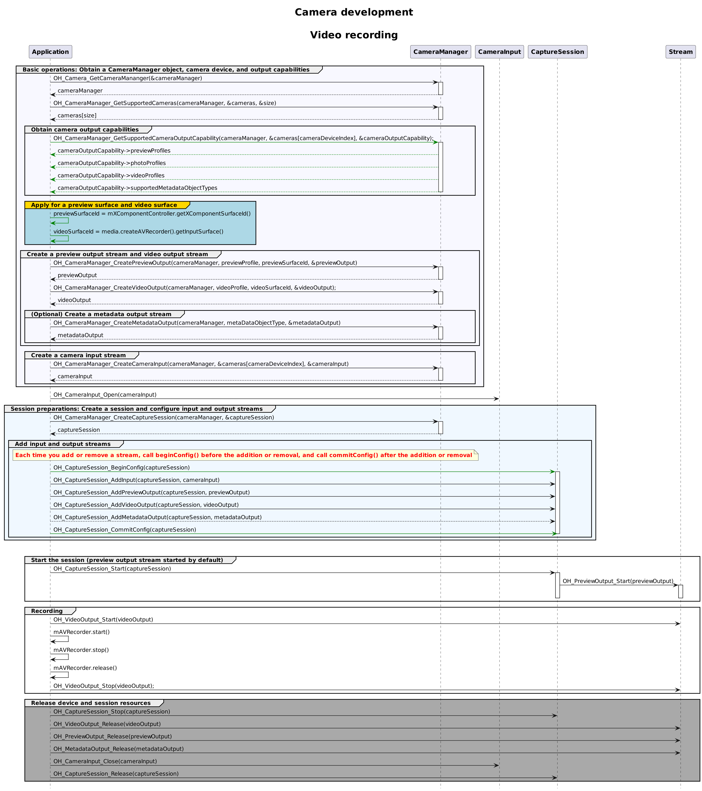

# Video Recording Sample (C/C++)

Before developing a camera application, request permissions by following the instructions provided in [Camera Development Preparations](camera-preparation.md).

This topic provides sample code that covers the complete video recording process and the API calling sequence. For details about a single process (such as device input, session management, and video recording), see the corresponding C/C++ development guide links provided in [Camera Development Preparations](camera-preparation.md).

## Development Process

After obtaining the output stream capabilities supported by the camera, create a video stream. The development process is as follows:



## Sample Code

1. Link the dynamic library in the CMake script.
    ```txt
        target_link_libraries(entry PUBLIC libohcamera.so libhilog_ndk.z.so)
    ```

2. Import the NDK APIs on the C++ side, and perform video recording based on the surface ID passed in.
    ```c++
    #include "hilog/log.h"
    #include "ohcamera/camera.h"
    #include "ohcamera/camera_input.h"
    #include "ohcamera/capture_session.h"
    #include "ohcamera/photo_output.h"
    #include "ohcamera/preview_output.h"
    #include "ohcamera/video_output.h"
    #include "ohcamera/camera_manager.h"

    void OnCameraInputError(const Camera_Input* cameraInput, Camera_ErrorCode errorCode)
    {
        OH_LOG_INFO(LOG_APP, "OnCameraInput errorCode = %{public}d", errorCode);
    }

    CameraInput_Callbacks* GetCameraInputListener(void)
    {
        static CameraInput_Callbacks cameraInputCallbacks = {
            .onError = OnCameraInputError
        };
        return &cameraInputCallbacks;
    }

    void CaptureSessionOnFocusStateChange(Camera_CaptureSession* session, Camera_FocusState focusState)
    {
        OH_LOG_INFO(LOG_APP, "CaptureSessionOnFocusStateChange");
    }

    void CaptureSessionOnError(Camera_CaptureSession* session, Camera_ErrorCode errorCode)
    {
        OH_LOG_INFO(LOG_APP, "CaptureSessionOnError = %{public}d", errorCode);
    }

    CaptureSession_Callbacks* GetCaptureSessionRegister(void)
    {
        static CaptureSession_Callbacks captureSessionCallbacks = {
            .onFocusStateChange = CaptureSessionOnFocusStateChange,
            .onError = CaptureSessionOnError
        };
        return &captureSessionCallbacks;
    }

    void VideoOutputOnFrameStart(Camera_VideoOutput* videoOutput)
    {
        OH_LOG_INFO(LOG_APP, "VideoOutputOnFrameStart");
    }

    void VideoOutputOnFrameEnd(Camera_VideoOutput* videoOutput, int32_t frameCount)
    {
        OH_LOG_INFO(LOG_APP, "VideoOutput frameCount = %{public}d", frameCount);
    }

    void VideoOutputOnError(Camera_VideoOutput* videoOutput, Camera_ErrorCode errorCode)
    {
        OH_LOG_INFO(LOG_APP, "VideoOutput errorCode = %{public}d", errorCode);
    }

    VideoOutput_Callbacks* GetVideoOutputListener(void)
    {
        static VideoOutput_Callbacks videoOutputListener = {
            .onFrameStart = VideoOutputOnFrameStart,
            .onFrameEnd = VideoOutputOnFrameEnd,
            .onError = VideoOutputOnError
        };
        return &videoOutputListener;
    }

    void CameraManagerStatusCallback(Camera_Manager* cameraManager, Camera_StatusInfo* status)
    {
        OH_LOG_INFO(LOG_APP, "CameraManagerStatusCallback is called");
    }

    CameraManager_Callbacks* GetCameraManagerListener()
    {
        static CameraManager_Callbacks cameraManagerListener = {
            .onCameraStatus = CameraManagerStatusCallback
        };
        return &cameraManagerListener;
    }

    NDKCamera::NDKCamera(char *previewId, char *videoId)
    {
        Camera_Manager* cameraManager = nullptr;
        Camera_Device* cameras = nullptr;
        Camera_CaptureSession* captureSession = nullptr;
        Camera_OutputCapability* cameraOutputCapability = nullptr;
        Camera_VideoOutput* videoOutput = nullptr;
        const Camera_Profile* previewProfile = nullptr;
        const Camera_Profile* photoProfile = nullptr;
        const Camera_VideoProfile* videoProfile = nullptr;
        Camera_PreviewOutput* previewOutput = nullptr;
        Camera_PhotoOutput* photoOutput = nullptr;
        Camera_Input* cameraInput = nullptr;
        uint32_t size = 0;
        uint32_t cameraDeviceIndex = 0;
        char* videoSurfaceId = videoId;
        char* previewSurfaceId = previewId;
        // Create a CameraManager object.
        Camera_ErrorCode ret = OH_Camera_GetCameraManager(&cameraManager);
        if (cameraManager == nullptr || ret != CAMERA_OK) {
            OH_LOG_ERROR(LOG_APP, "OH_Camera_GetCameraMananger failed.");
        }
        // Listen for camera status changes.
        ret = OH_CameraManager_RegisterCallback(cameraManager, GetCameraManagerListener());
        if (ret != CAMERA_OK) {
            OH_LOG_ERROR(LOG_APP, "OH_CameraManager_RegisterCallback failed.");
        }

        // Obtain the camera list.
        ret = OH_CameraManager_GetSupportedCameras(cameraManager, &cameras, &size);
        if (cameras == nullptr || size < 0 || ret != CAMERA_OK) {
            OH_LOG_ERROR(LOG_APP, "OH_CameraManager_GetSupportedCameras failed.");
        }

        for (int index = 0; index < size; index++) {
            OH_LOG_ERROR(LOG_APP, "cameraId  =  %{public}s ", cameras[index].cameraId);              // Obtain the camera ID.
            OH_LOG_ERROR(LOG_APP, "cameraPosition  =  %{public}d ", cameras[index].cameraPosition);  // Obtain the camera position.
            OH_LOG_ERROR(LOG_APP, "cameraType  =  %{public}d ", cameras[index].cameraType);          // Obtain the camera type.
            OH_LOG_ERROR(LOG_APP, "connectionType  =  %{public}d ", cameras[index].connectionType);  // Obtain the camera connection type.
        }

        // Obtain the output streams supported by the camera.
        ret = OH_CameraManager_GetSupportedCameraOutputCapability(cameraManager, &cameras[cameraDeviceIndex],
                                                                &cameraOutputCapability);
        if (cameraOutputCapability == nullptr || ret != CAMERA_OK) {
            OH_LOG_ERROR(LOG_APP, "OH_CameraManager_GetSupportedCameraOutputCapability failed.");
        }

        if (cameraOutputCapability->previewProfilesSize < 0) {
            OH_LOG_ERROR(LOG_APP, "previewProfilesSize == null");
        }
        previewProfile = cameraOutputCapability->previewProfiles[0];

        if (cameraOutputCapability->photoProfilesSize < 0) {
            OH_LOG_ERROR(LOG_APP, "photoProfilesSize == null");
        }
        photoProfile = cameraOutputCapability->photoProfiles[0];

        if (cameraOutputCapability->videoProfilesSize < 0) {
            OH_LOG_ERROR(LOG_APP, "videorofilesSize == null");
        }
        videoProfile = cameraOutputCapability->videoProfiles[0];

        // Create a VideoOutput instance.
        ret = OH_CameraManager_CreateVideoOutput(cameraManager, videoProfile, videoSurfaceId, &videoOutput);
        if (videoProfile == nullptr || videoOutput == nullptr || ret != CAMERA_OK) {
            OH_LOG_ERROR(LOG_APP, "OH_CameraManager_CreateVideoOutput failed.");
        }

        // Listen for video output errors.
        ret = OH_VideoOutput_RegisterCallback(videoOutput, GetVideoOutputListener());
        if (ret != CAMERA_OK) {
            OH_LOG_ERROR(LOG_APP, "OH_VideoOutput_RegisterCallback failed.");
        }

        // Create a session.
        ret = OH_CameraManager_CreateCaptureSession(cameraManager, &captureSession);
        if (captureSession == nullptr || ret != CAMERA_OK) {
            OH_LOG_ERROR(LOG_APP, "OH_CameraManager_CreateCaptureSession failed.");
        }
        // Listen for session errors.
        ret = OH_CaptureSession_RegisterCallback(captureSession, GetCaptureSessionRegister());
        if (ret != CAMERA_OK) {
            OH_LOG_ERROR(LOG_APP, "OH_CaptureSession_RegisterCallback failed.");
        }

        // Start configuration for the session.
        ret = OH_CaptureSession_BeginConfig(captureSession);
        if (ret != CAMERA_OK) {
            OH_LOG_ERROR(LOG_APP, "OH_CaptureSession_BeginConfig failed.");
        }

        // Create a camera input stream.
        ret = OH_CameraManager_CreateCameraInput(cameraManager, &cameras[cameraDeviceIndex], &cameraInput);
        if (cameraInput == nullptr || ret != CAMERA_OK) {
            OH_LOG_ERROR(LOG_APP, "OH_CameraManager_CreateCameraInput failed.");
        }

        // Listen for camera input errors.
        ret = OH_CameraInput_RegisterCallback(cameraInput, GetCameraInputListener());
        if (ret != CAMERA_OK) {
            OH_LOG_ERROR(LOG_APP, "OH_CameraInput_RegisterCallback failed.");
        }

        // Open the camera.
        ret = OH_CameraInput_Open(cameraInput);
        if (ret != CAMERA_OK) {
            OH_LOG_ERROR(LOG_APP, "OH_CameraInput_Open failed.");
        }

        // Add the camera input stream to the session.
        ret = OH_CaptureSession_AddInput(captureSession, cameraInput);
        if (ret != CAMERA_OK) {
            OH_LOG_ERROR(LOG_APP, "OH_CaptureSession_AddInput failed.");
        }

        // Create a preview output stream. For details about the surfaceId parameter, see the XComponent. The preview stream is the surface provided by the XComponent.
        ret = OH_CameraManager_CreatePreviewOutput(cameraManager, previewProfile, 0, &previewOutput);
        if (previewProfile == nullptr || previewOutput == nullptr || ret != CAMERA_OK) {
            OH_LOG_ERROR(LOG_APP, "OH_CameraManager_CreatePreviewOutput failed.");
        }

        // Add the preview output stream to the session.
        ret = OH_CaptureSession_AddPreviewOutput(captureSession, previewOutput);
        if (ret != CAMERA_OK) {
            OH_LOG_ERROR(LOG_APP, "OH_CaptureSession_AddPreviewOutput failed.");
        }

        // Add the video output stream to the session.
        ret = OH_CaptureSession_AddVideoOutput(captureSession, videoOutput);
        if (ret != CAMERA_OK) {
            OH_LOG_ERROR(LOG_APP, "OH_CaptureSession_AddVideoOutput failed.");
        }

        // Commit the session configuration.
        ret = OH_CaptureSession_CommitConfig(captureSession);
        if (ret != CAMERA_OK) {
            OH_LOG_ERROR(LOG_APP, "OH_CaptureSession_CommitConfig failed.");
        }

        // Start the session.
        ret = OH_CaptureSession_Start(captureSession);
        if (ret != CAMERA_OK) {
            OH_LOG_ERROR(LOG_APP, "OH_CaptureSession_Start failed.");
        }

        // Start the video output stream.
        ret = OH_VideoOutput_Start(videoOutput);
        if (ret != CAMERA_OK) {
            OH_LOG_ERROR(LOG_APP, "OH_VideoOutput_Start failed.");
        }

        // Call avRecorder.start() on the TS side to start video recording.

        // Stop the video output stream.
        ret = OH_VideoOutput_Stop(videoOutput);
        if (ret != CAMERA_OK) {
            OH_LOG_ERROR(LOG_APP, "OH_VideoOutput_Stop failed.");
        }

        // Call avRecorder.stop() on the TS side to stop video recording.

        // Stop the session.
        ret = OH_CaptureSession_Stop(captureSession);
        if (ret == CAMERA_OK) {
            OH_LOG_INFO(LOG_APP, "OH_CaptureSession_Stop success ");
        } else {
            OH_LOG_ERROR(LOG_APP, "OH_CaptureSession_Stop failed. %d ", ret);
        }

        // Release the camera input stream.
        ret = OH_CameraInput_Close(cameraInput);
        if (ret == CAMERA_OK) {
            OH_LOG_INFO(LOG_APP, "OH_CameraInput_Close success ");
        } else {
            OH_LOG_ERROR(LOG_APP, "OH_CameraInput_Close failed. %d ", ret);
        }

        // Release the preview output stream.
        ret = OH_PreviewOutput_Release(previewOutput);
        if (ret == CAMERA_OK) {
            OH_LOG_INFO(LOG_APP, "OH_PreviewOutput_Release success ");
        } else {
            OH_LOG_ERROR(LOG_APP, "OH_PreviewOutput_Release failed. %d ", ret);
        }

        // Release the video output stream.
        ret = OH_VideoOutput_Release(videoOutput);
        if (ret == CAMERA_OK) {
            OH_LOG_INFO(LOG_APP, "OH_VideoOutput_Release success ");
        } else {
            OH_LOG_ERROR(LOG_APP, "OH_VideoOutput_Release failed. %d ", ret);
        }

        // Release the session.
        ret = OH_CaptureSession_Release(captureSession);
        if (ret == CAMERA_OK) {
            OH_LOG_INFO(LOG_APP, "OH_CaptureSession_Release success ");
        } else {
            OH_LOG_ERROR(LOG_APP, "OH_CaptureSession_Release failed. %d ", ret);
        }

        // Release the resources.
        ret = OH_CameraManager_DeleteSupportedCameras(cameraManager, cameras, size);
        if (ret != CAMERA_OK) {
          OH_LOG_ERROR(LOG_APP, "Delete Cameras failed.");
        } else {
          OH_LOG_ERROR(LOG_APP, "OH_CameraManager_DeleteSupportedCameras. ok");
        }
        ret = OH_CameraManager_DeleteSupportedCameraOutputCapability(cameraManager, cameraOutputCapability);
        if (ret != CAMERA_OK) {
          OH_LOG_ERROR(LOG_APP, "Delete Cameras failed.");
        } else {
          OH_LOG_ERROR(LOG_APP, "OH_CameraManager_DeleteSupportedCameraOutputCapability. ok");
        }
        ret = OH_Camera_DeleteCameraManager(cameraManager);
        if (ret != CAMERA_OK) {
          OH_LOG_ERROR(LOG_APP, "Delete Cameras failed.");
        } else {
          OH_LOG_ERROR(LOG_APP, "OH_Camera_DeleteCameraManager. ok");
        }
    }
    ```
