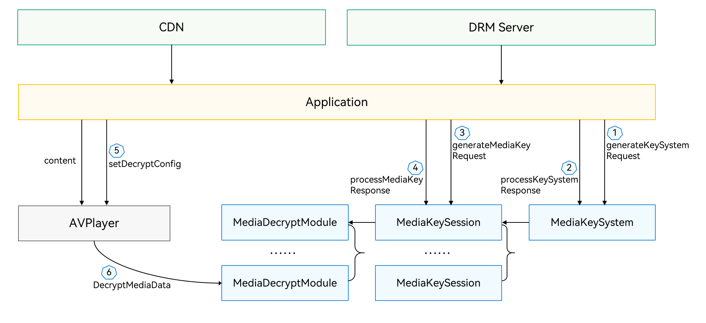

# About This Kit

<!--Kit: Drm Kit-->
<!--Subsystem: Multimedia-->
<!--Owner: @hanzhengshi-->
<!--Designer: @chris2981-->
<!--Tester: @xdlinc-->
<!--Adviser: @qin_wei_jie-->
<!-- md-trans-meta sourceCommit=6dec6b14cb206fe02a5ddd5033caa3930c0dd80f translatedAt=2026-08-18T11:03:14.695Z pushedAt=2026-08-18T11:38:55.210Z -->

Digital Rights Management (DRM) Kit provides digital rights protection services, offering capabilities for authorizing and decrypting DRM-encrypted content. It includes features such as DRM plugin management, certificate management, license management, content authorization, and content decryption, enabling the integration of DRM solutions, certificate provisioning, and content authorization and decryption.

## Capabilities

Through DRM Kit, DRM solution integrators can implement DRM solution integration, whereas application developers can call the corresponding DRM solutions to authorize and decrypt DRM-encrypted content, enabling playback of DRM-protected media.

- DRM plugin management: By implementing the DRM HDI interfaces provided by DRM Kit, support for different DRM solutions can be achieved. This is typically implemented by DRM solution integrators.

- DRM certificate management: supports requesting and processing device certificates for DRM solutions, enabling certificate provisioning for the corresponding DRM solutions.

- DRM license management: supports requesting, processing, and deleting offline licenses.

- DRM content authorization: supports online license requests and processing, loading offline licenses, querying media key status, and authorizing DRM content according to the permissions specified in the DRM license.

- DRM content decryption: supports HLS and DASH media protocols; MP4 and TS container formats; H.264<!--RP2--><!--RP2End--> video encoding format; AAC audio encoding format.

> **NOTE**
>
> DRM certificate management, license management, content authorization, and content decryption depend on the implementation of the corresponding DRM solutions. Application developers can extend support for additional media protocols, container formats, and audio/video encoding formats.

## Features

- **License and decryption session management**

  Supports multiple MediaKeySession instances, allowing licenses to be requested and configured within sessions, and binding decryption sessions to licenses.

- **Secure video path**

  Supports a secure video path to enable secure decryption, decoding, rendering, and output. DRM Kit provides only APIs for secure decryption. The actual secure decryption, decoding, rendering, and output depend on the DRM solution and operating system implementation.

## Basic Concepts

Before you start, understand the following key concepts:

- DRM plugin

  A DRM solution driver integrated into the system. It implements the DRM HDI interfaces to provide DRM-related functionality.

<!--RP1--><!--RP1End-->

- MediaKeySystem

  Used for DRM certificate management and MediaKeySession lifecycle management.

- MediaKeySession

  Used for license management and media content decryption. Its lifecycle is managed by MediaKeySystem.

- DRM information (MediaKeySystemInfo)

  Descriptive information about DRM content encryption, including the DRM solution UUID and Protection System Specific Header (PSSH) data.

- PSSH

  Data used by the DRM solution to describe how DRM content is encrypted.

- DRM certificate

  A certificate required for the DRM solution to function properly. Different DRM solutions use different certificates.

- DRM certificate provisioning

  The process used by a DRM solution to download certificates. The process varies by solution. For specific requirements, refer to the implementation guidelines of the DRM solution.

- License

  Used by the DRM solution to authorize devices. Typical license control policies include security level, output control, playback start time, and playback end time. Different DRM solutions may use different license formats and support different control policies.

- Audio/Video Data Frame Encryption Information (cencInfo)

  Descriptive information about audio/video data frame encryption, including the encryption algorithm and mode, KeyId, IV, and subsample information.

## Workflow

DRM plugin management is typically implemented by DRM solution integrators.<!--Del--> For details, see[DRM Solution Development](drm-solution-dev-guide.md).<!--DelEnd-->

The following figure illustrates the workflow for integrating DRM Kit into an application.

The workflow includes:

1. Creating MediaKeySystem and MediaKeySession instances: The application obtains the DRM information of the content and creates MediaKeySystem and MediaKeySession instances based on the solution UUID in the DRM information. The DRM information can be obtained from service-provided DRM descriptions, or from the **mediaKeySystemInfoUpdate** event or **MediaKeySystemInfo** callback provided by Media Kit or AVCodec Kit.

2. Certificate provisioning: During the creation of a MediaKeySession instance, if no DRM certificate is available or the certificate is invalid, DRM Kit triggers an event requiring certificate provisioning (**keySystemRequired**). The application can then call certificate provisioning APIs of MediaKeySystem to complete the process. Alternatively, the application can check the DRM certificate status according to the DRM solution's requirements and proactively call the provisioning APIs if no valid certificate is available. This step can be skipped if the DRM solution has a valid certificate or does not require provisioning.

3. License acquisition: The application calls license-related APIs of MediaKeySession using the PSSH data from DRM events to request and process DRM licenses.

4. DRM content decryption: The application sets the MediaKeySession in Media Kit or AVCodec Kit to support DRM content decryption. When using AVCodec Kit, the application can set the cencInfo for audio/video data frames in AVBuffer, enabling decryption and decoding when calling **PushInputBuffer**.

5. License update or expiration: During playback, if a license needs updating, MediaKeySession triggers a license update event (**keyRequired**), requiring the application to request a new DRM license. If MediaKeySession triggers a license expiration event (**keyExpired**), DRM content playback must be stopped.

<!--RP3--><!--RP3End-->