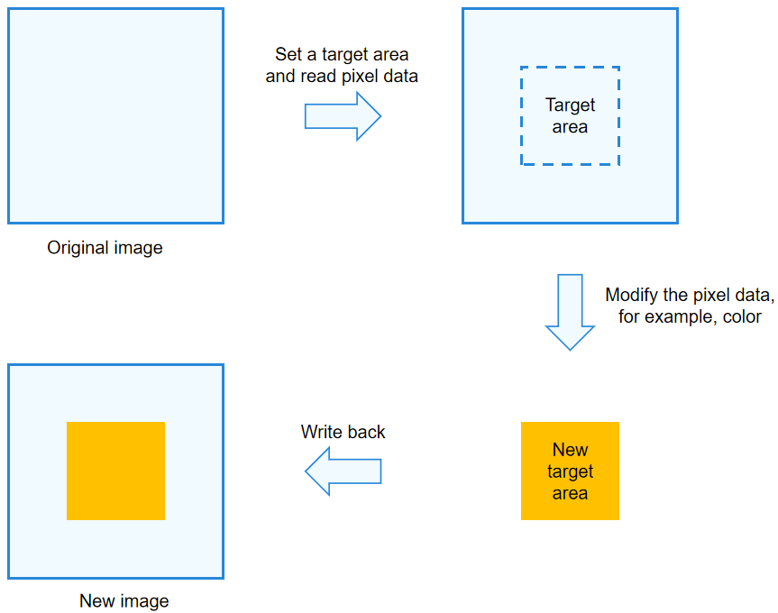

# Pixel Map Operation

To process a certain area in an image, you can perform pixel map operations, which are usually used to beautify the image.

As shown in the figure below, the pixel data of a rectangle in an image is read, modified, and then written back to the corresponding area of the original image.

**Figure 1** Pixel map operation 


## How to Develop

Read [Image](../reference/apis/js-apis-image.md#pixelmap7) for APIs related to pixel map operations.

1. Complete [image decoding](image-decoding.md#how-to-develop) and obtain a **PixelMap** object.

2. Obtain information from the **PixelMap** object.
   
   ```ts
   // Obtain the total number of bytes of this pixel map.
   let pixelBytesNumber = pixelMap.getPixelBytesNumber();
   // Obtain the number of bytes per row of this pixel map.
   let rowCount = pixelMap.getBytesNumberPerRow();
   // Obtain the pixel density of the image. Pixel density refers to the number of pixels per inch of an image. A larger value of the pixel density indicates a finer image.
   let getDensity = pixelMap.getDensity();
   ```

3. Read and modify the pixel data of the target area, and write the modified data back to the original image.
   
   ```ts
   // Scenario 1: Read the pixel data of the entire image and write the modified data to an array buffer.
   const readBuffer = new ArrayBuffer(pixelBytesNumber);
   pixelMap.readPixelsToBuffer(readBuffer).then(() => {
     console.info('Succeeded in reading image pixel data.');
   }).catch(error => {
     console.error('Failed to read image pixel data. And the error is: ' + error);
   })
   
   // Scenario 2: Read the pixel data in a specified area and write the modified data to area.pixels.
   const area = {
     pixels: new ArrayBuffer(8),
     offset: 0,
     stride: 8,
     region: { size: { height: 1, width: 2 }, x: 0, y: 0 }
   }
   pixelMap.readPixels(area).then(() => {
     console.info('Succeeded in reading the image data in the area.');
   }).catch(error => {
     console.error('Failed to read the image data in the area. And the error is: ' + error);
   })
   
   // The read image data can be used independently (by creating a pixel map) or modified as required.
   // Write area.pixels to the specified area.
   pixelMap.writePixels(area).then(() => {
     console.info('Succeeded to write pixelMap into the specified area.');
   })
   
   // Write the image data result to a pixel map.
   const writeColor = new ArrayBuffer(96);
   pixelMap.writeBufferToPixels(writeColor, () => {});
   ```
