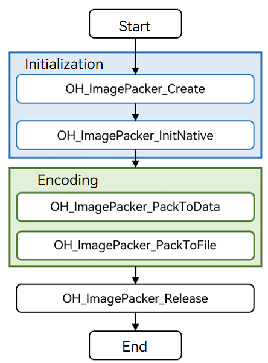

# Image Encoding
<!--Kit: Image Kit-->
<!--Subsystem: Multimedia-->
<!--Owner: @aulight02-->
<!--SE: @liyang_bryan-->
<!--TSE: @xchaosioda-->

You can call the native APIs provided by the ImagePacker module to encode images, that is, to compress a PixelMap object into an image in the desired format.

Currently, images can be encoded only into the JPEG, WebP, PNG, or HEIF format (depending on the hardware).

**Usage Scenario**

- Image codec conversion

  Import an image source, and encapsulate it into the desired format.
- Image editing

  Edit a PixelMap object, and export an image in the desired format.

## How to Develop

Read the [API reference](../../reference/apis-image-kit/capi-image-packer-mdk-h.md) for APIs related to image encoding.

Refer to the code snippet below to complete the entire image encoding process, including creating an encoder, initializing resources, performing encoding, and destroying the encoder.

During application development, you must call the APIs in the defined sequence. Otherwise, an exception or undefined behavior may occur.  

The figure below shows the call relationship of image encoding.



### Linking the Dynamic Library in the CMake Script

``` cmake
target_link_libraries(sample PUBLIC libimage_packer_ndk.z.so)
```

### How to Develop

1. Add the header file **image_packer_mdk.h**.

   ```cpp
   // Add the header file image_packer_mdk.h.
   #include "multimedia/image_framework/image_packer_mdk.h"
   ```

2. Create an encoder instance.

   You must use napi_env to create an encoder.

   ```cpp
   // Use napi_value to undertake the created encoder instance.
   napi_value packer;
   // Use napi_env to create an encoder. If result is IMAGE_RESULT_SUCCESS, the encoder is created.
   int32_t result = OH_ImagePacker_Create(env, &packer);
   ```

3. Initialize resources.

   Call **OH_ImagePacker_InitNative** to initialize the encoder instance.

   ```cpp
   // Initialize the instance through napi_env and the created encoder instance.
   ImagePacker_Native* nativePacker = OH_ImagePacker_InitNative(env, packer);
   ```

4. Perform encoding.

   The following input parameters are provided for the encoding APIs:

   - ImagePacker_Native instance obtained

   - Image source (napi_value), PixelMap object, or ImageSource object (when **CreatePixelMap** is not called yet) to be encoded

   - Encoding parameters, including the encoding format and encoding quality

      > **NOTE**
      >
      > According to the MIME protocol, the standard encoding format is image/jpeg. When the APIs provided by the image module are used for encoding, **format** of the encoding parameters must be set to **image/jpeg**. The file name extension of the encoded image file can be .jpg or .jpeg, and the file can be used on platforms that support image/jpeg decoding.

   The encoding APIs can output data to the buffer (memory) or a file. They have the same input parameters, as described previously. You can select either of them as required.

   Example: output data to the buffer (memory)

   ```cpp
   // Encoding parameters.
   struct ImagePacker_Opts_ opts;
   // (Mandatory) Configure the encoding format.
   opts.format = "image/jpeg";
   // (Mandatory) Configure the encoding quality.
   opts.quality = 100;
   // Set the output buffer size, for example, to 4 KB.
   size_t bufferSize = 4*1024;
   // Apply for a buffer for image encoding.
   uint8_t* outData = (uint8_t *)(malloc(bufferSize));
   // Start to encode the input source. If IMAGE_RESULT_SUCCESS is returned, the encoding is successful. In this case, bufferSize indicates the size of the buffer used for encoding.
   int32_t result = OH_ImagePacker_PackToData(nativePacker, source, &opts, outData, &bufferSize);
   ```

   Example: output data to a file

   ```cpp
   // Encoding parameters.
   struct ImagePacker_Opts_ opts;
   // (Mandatory) Configure the encoding format.
   opts.format = "image/jpeg";
   // (Mandatory) Configure the encoding quality.
   opts.quality = 100;
   // Open the file to which the data will be written. (Ensure that the application has the permission to access the file path.)
   int fd = open("/data/test.jpg", O_RDWR | O_CREAT, S_IRUSR | S_IWUSR);
   if (fd >= 0) {
      // Start to encode the input source. If IMAGE_RESULT_SUCCESS is returned, the encoding is successful.
      int32_t result = OH_ImagePacker_PackToFile(nativePacker, source, &opts, fd);  
      // Close the file.
      close(fd);
   }
   ```

5. Destroy the encoder instance and release resources.

   > **NOTE**
   >
   > You only need to call the API once.

   ```c++
   // Call OH_ImagePacker_Release to destroy the encoder.
   int32_t ret = OH_ImagePacker_Release(nativePacker);
   if (result != IMAGE_RESULT_SUCCESS) {
       // Handle exceptions.
   } else {
       nativePacker = NULL; // The encoder cannot be destroyed repeatedly.
   }
   ```
