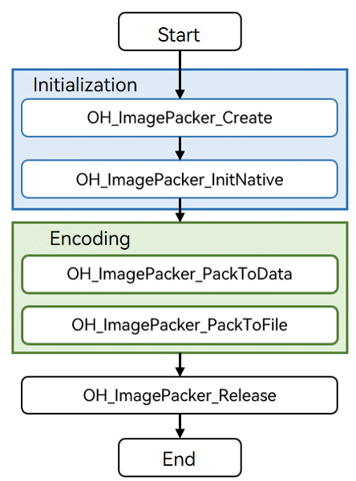

# Image Encoding

<!--Kit: Image Kit-->
<!--Subsystem: Multimedia-->
<!--Owner: @aulight02-->
<!--Designer: @XiaoYao555-->
<!--Tester: @xchaosioda-->
<!--Adviser: @w_Machine_cc-->
<!-- md-trans-meta sourceCommit=425e79ed59a841b19860caacc0b050f68405d43e translatedAt=2026-08-11T01:43:24.890Z pushedAt=2026-08-11T03:50:50.079Z -->

> **NOTE**
>
> The APIs used in this development guide are C APIs provided by the [Image](../../reference/apis-image-kit/capi-image.md) module, which support image encoding/decoding, image receiver, image data processing, and other functions. These APIs were released before API version 11 and will not receive new features in subsequent versions. They are **no longer recommended**.<br>
> You can use the C APIs provided by the [Image_NativeModule](../../reference/apis-image-kit/capi-image-nativemodule.md) module, which not only offer the basic image framework functions mentioned above but also support new features such as multi-image encoding/decoding. For related development guidance, see the content under [Using Image_NativeModule to Decode Images](image-source-c.md). These APIs are supported since API version 12 and will continue to evolve. They are **recommended for use**.<br>
> Using both sets of C APIs at the same time is not recommended, as they may be incompatible in certain scenarios.

You can call the native APIs provided by the ImagePacker module to encode images, that is, to compress a PixelMap object into an image in the desired format.

Currently, images can be encoded only into the JPEG, WebP, PNG, or HEIF format (depending on the hardware).

**Usage Scenario**

- Image codec conversion

  Import an image source, and encapsulate it into the desired format.

- Image editing

  Edit a PixelMap object, and export an image in the desired format.

## How to Develop

For detailed API descriptions, see [image_packer_mdk.h](../../reference/apis-image-kit/capi-image-packer-mdk-h.md).

Refer to the code snippet below to complete the entire image encoding process, including creating an encoder, initializing resources, performing encoding, and destroying the encoder.

During application development, you must call the APIs in the defined sequence. Otherwise, an exception or undefined behavior may occur.  

The figure below shows the call relationship of image encoding.



### Linking the Dynamic Library in the CMake Script

``` cmake
target_link_libraries(entry PUBLIC libace_napi.z.so)
target_link_libraries(entry PUBLIC libimage_packer_ndk.z.so)
```

### How to Develop

1. Add the header file **image_packer_mdk.h**.

   ```cpp
   // Add the header file image_packer_mdk.h.
   #include <multimedia/image_framework/image_packer_mdk.h>
   ```

2. Create an encoder instance.

   You must use napi_env to create an encoder.

   ```cpp
   // Use napi_value to undertake the created encoder instance.
   napi_value packer;
   // Use napi_env to create an encoder. If result is IMAGE_RESULT_SUCCESS, the encoder is created.
   int32_t result = OH_ImagePacker_Create(env, &packer);
   ```

3. Initialize resources.

   Call **OH_ImagePacker_InitNative** to initialize the encoder instance.

   ```cpp
   // Initialize the instance through napi_env and the created encoder instance.
   ImagePacker_Native* nativePacker = OH_ImagePacker_InitNative(env, packer);
   ```

4. Perform encoding.

   The following input parameters are provided for the encoding APIs:

   - ImagePacker_Native instance obtained

   - Image source to be encoded (napi_value), which can be an instance of PixelMap or ImageSource (for which CreatePixelMap has not been called).

   - Encoding parameters, including the encoding format and encoding quality

      > **NOTE**
      >
      > According to the MIME protocol, the standard encoding format is image/jpeg. When the APIs provided by the image module are used for encoding, **format** of the encoding parameters must be set to **image/jpeg**. The file name extension of the encoded image file can be .jpg or .jpeg, and the file can be used on platforms that support image/jpeg decoding.

   The encoding APIs can output data to the buffer (memory) or a file. They have the same input parameters, as described previously. You can select either of them as required.

   You can select an encoding API based on your output requirements.

   Output data to the buffer (memory).

   ```cpp
   #include <cstdlib>
   #include <multimedia/image_framework/image_packer_mdk.h>

   int32_t packImageToData(napi_env env, napi_callback_info info)
   {
       napi_value source;
       // Use napi_value to undertake the created encoder instance.
       napi_value packer;
       // Use napi_env to create an encoder. If result is IMAGE_RESULT_SUCCESS, the encoder is created.
       int32_t errorCode = OH_ImagePacker_Create(env, &packer);
       if (errorCode != IMAGE_RESULT_SUCCESS) {
           return errorCode;
       }
       // Initialize the instance through napi_env and the created encoder instance.
       ImagePacker_Native* nativePacker = OH_ImagePacker_InitNative(env, packer);
       // Encoding parameters.
       struct ImagePacker_Opts_ opts;
       // (Mandatory) Configure the encoding format.
       opts.format = "image/jpeg";
       // (Mandatory) Configure the encoding quality.
       // The default value of quality is 0. It is recommended to set it to no less than 80. In this example, it is uniformly set to 90 to balance image quality and file size.
       opts.quality = 90;
       // Set the output buffer size, for example, to 4 KB.
       size_t bufferSize = 4*1024;
       // Apply for a buffer for image encoding.
       uint8_t* outData = (uint8_t *)(malloc(bufferSize));
       if (outData == NULL) {
           errorCode = OH_ImagePacker_Release(nativePacker);
           if (errorCode != IMAGE_RESULT_SUCCESS) {
               return errorCode;
           } else {
               nativePacker = NULL; // The encoder cannot be destroyed repeatedly.
           }
           return IMAGE_RESULT_MALLOC_ABNORMAL;
       }
       // Start to encode the input source. If IMAGE_RESULT_SUCCESS is returned, the encoding is successful. In this case, bufferSize indicates the size of the buffer used for encoding.
       int32_t result = OH_ImagePacker_PackToData(nativePacker, source, &opts, outData, &bufferSize);
       free(outData);
       outData = NULL;
       errorCode = OH_ImagePacker_Release(nativePacker);
       if (errorCode != IMAGE_RESULT_SUCCESS) {
           return errorCode;
       } else {
           nativePacker = NULL; // The encoder cannot be destroyed repeatedly.
       }
       return result;
   }
   ```

   Output data to a file.

   ```cpp
   #include <fcntl.h>
   #include <unistd.h>
   #include <cstdlib>
   #include <multimedia/image_framework/image_packer_mdk.h>

   int32_t packImageToFile(napi_env env, napi_callback_info info)
   {
       napi_value source;
       // Use napi_value to undertake the created encoder instance.
       napi_value packer;
       // Use napi_env to create an encoder. If result is IMAGE_RESULT_SUCCESS, the encoder is created.
       int32_t errorCode = OH_ImagePacker_Create(env, &packer);
       if (errorCode != IMAGE_RESULT_SUCCESS) {
           return errorCode;
       }
       // Initialize the instance through napi_env and the created encoder instance.
       ImagePacker_Native* nativePacker = OH_ImagePacker_InitNative(env, packer);
       // Encoding parameters.
       struct ImagePacker_Opts_ opts;
       // (Mandatory) Configure the encoding format.
       opts.format = "image/jpeg";
       // (Mandatory) Configure the encoding quality.
       // The default value of quality is 0. It is recommended to be no less than 80. In this example, it is uniformly set to 90 to balance image quality and file size.
       opts.quality = 90;
       // Open the file to which the data will be written. (Ensure that the application has the permission to access the file path.)
       int fd = open("/data/test.jpg", O_RDWR | O_CREAT, S_IRUSR | S_IWUSR);
       int result;
       if (fd >= 0) {
           // Start to encode the input source. If IMAGE_RESULT_SUCCESS is returned, the encoding is successful.
           result = OH_ImagePacker_PackToFile(nativePacker, source, &opts, fd);
           // Close the file.
           close(fd);
       }
       errorCode = OH_ImagePacker_Release(nativePacker);
       if (errorCode != IMAGE_RESULT_SUCCESS) {
           return errorCode;
       } else {
           nativePacker = NULL; // The encoder cannot be destroyed repeatedly.
       }
       return result;
   }
   ```