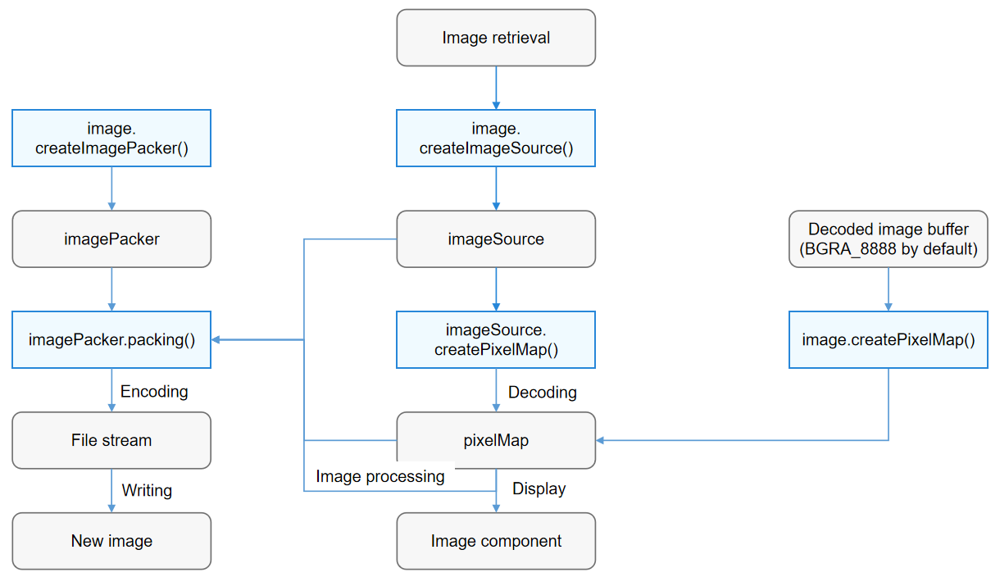

# Introduction to Image Kit

Image development is the process of parsing, processing, and constructing image pixel data to achieve the required image effect. Image development mainly involves image decoding, processing, and encoding.

Before image development, be familiar with the following basic concepts:

- Image decoding
  
  The operation of decoding an archived image in a supported format into a pixel map for image display or processing. Currently, the following image formats are supported: JPEG, PNG, GIF, WebP, BMP, SVG, ICO, and DNG.

- Pixel map
  
  A bitmap that is not compressed after being decoded. It is used for image display or processing.

- Image processing
  
  A series of operations on the pixel map, such as rotation, scaling, opacity setting, image information obtaining, and pixel data reading and writing.

- Image encoding
  
  The operation of encoding a pixel map into an archived image in different formats (only in JPEG, WebP, and PNG currently) for subsequent processing, such as storage and transmission.

The figure below illustrates the image development process.

**Figure 1** Image development process

1. Image retrieval: Obtain a raw image through the application sandbox.

2. Instance creation: Create an **ImageSource** instance, which is the source class of decoded images and is used to obtain or modify image information.

3. [Image decoding](image-decoding.md): Decode the image source to generate a pixel map.

4. [Image processing](image-transformation.md): Process the pixel map by modifying the image attributes to implement image rotation, scaling, and cropping, and then use the [Image component](../../ui/arkts-graphics-display.md) to display the image.

5. [Image encoding](image-encoding.md): Use the **ImagePacker** class to compress and encode the pixel map or image source to generate a new image.

In addition to the preceding basic image development capabilities, OpenHarmony provides the [image tool](image-tool.md) to ease your development.

## Highlights

Image Kit supports multiple image formats and uses efficient algorithms and optimization policies to speed up image processing.

## Constraints

During image processing, applications may need to request the read and write permissions from users on images.

## Related Kits

The image framework provides the image encoding and decoding capabilities for the **\<image>** component and the Gallery application. The decoding result can be sent to the [**\<image>** component](../../ui/arkts-graphics-display.md) for display.
