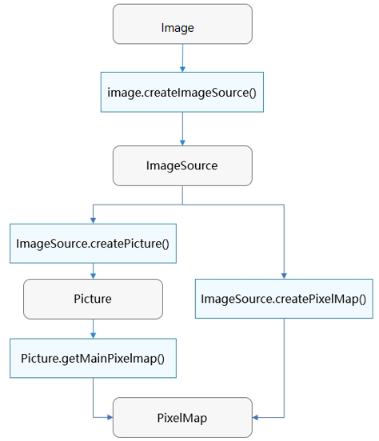
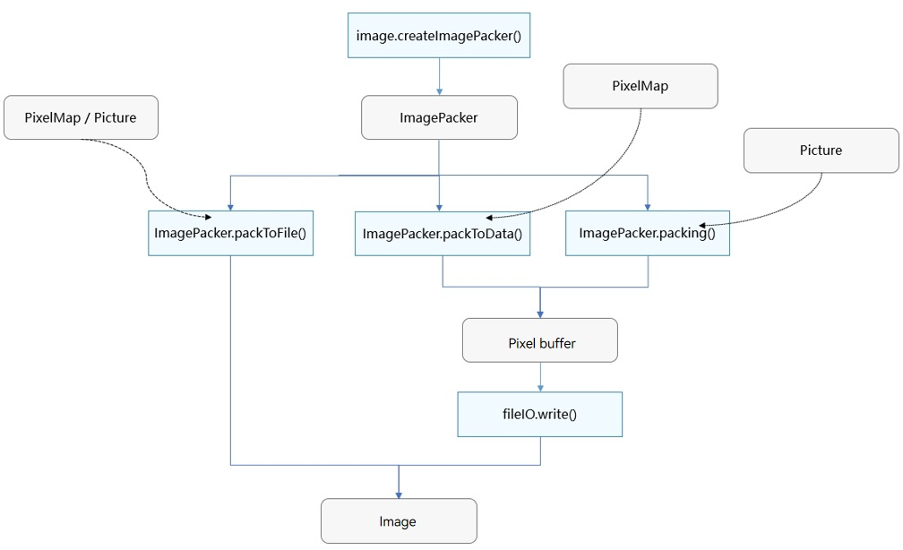

# Introduction to Image Kit
<!--Kit: Image Kit-->
<!--Subsystem: Multimedia-->
<!--Owner: @aulight02-->
<!--Designer: @liyang_bryan-->
<!--Tester: @xchaosioda-->
<!--Adviser: @zengyawen-->

Image Kit provides APIs for you to decode, encode, edit, and receive images, as well as processing metadata of images.

## Highlights

- Supports encoding and decoding of popular image formats, such as HEIF, JPEG, PNG, and WebP.
- Supports HDR image encoding and decoding, providing users with a better color experience; leveraging AI to convert SDR images into HDR images.
- Provides a variety of image editing and processing capabilities, including image transformation, PixelMap operations, and filter effects.
- Uses efficient algorithms and optimization policies to make image processing faster and more efficient.

## Basic Concepts
Be familiar with the following basic concepts before development:

- PixelMap

  PixelMap object. It can be used for reading/writing pixel data and performing operations such as cropping, scaling, translating, rotating, and mirroring. It can also be directly passed to the [Image component](../../ui/arkts-graphics-display.md) for display. Additionally, it provides APIs for obtaining image information, and obtaining and setting the color gamut and HDR metadata of images.

- Picture
  
  An object that includes a main picture, auxiliary picture, and metadata. The main picture contains the primary image information; auxiliary pictures store additional information related to the main picture; metadata stores other information related to the image. Picture provides methods for obtaining the main picture, compositing HDR images, obtaining and setting auxiliary pictures, and obtaining and setting metadata.

- Image decoding
  
  The operation of decoding an image in a supported format into a PixelMap or Picture for image display or processing.

- Image editing and processing

  A series of operations on the PixelMap, such as rotation, scaling, opacity setting, image information obtaining, and pixel data reading and writing. The origin of the coordinate system is at the upper left corner.

- Image encoding

  The operation of encoding a PixelMap or Picture into an image in different formats for subsequent processing, such as storage and transmission.

## How to Use

Image Kit provides abundant image processing capabilities. You can use the entire process of image decoding, editing, processing, and encoding, or you can just pass the decoded PixelMap to the [Image component](../../ui/arkts-graphics-display.md) for display without extra processing. Both decoding and encoding offer many options to fit different development needs.

You can manipulate specific parts of an image by performing [PixelMap operations](../image/image-pixelmap-operation.md) on the decoded PixelMap. Additionally, you can apply [image transformations](../image/image-transformation.md) such as cropping, scaling, translating, rotating, flipping, and opacity setting.

You can add filter effects to images using [ImageEffect](../image/image-effect-guidelines.md) and enhance image details, convert color spaces, and process HDR images with **ImageProcessing**.

You can read and edit image EXIF data, which means you can obtain and set extra properties in image files, like basic image information (width, height, rotation), photography settings (aperture, focal length), and GPS information (longitude, latitude).

Figure 1 and Figure 2 show the image decoding and encoding processes. The PixelMap obtained after decoding can be used for image display, editing, and processing.

**Figure 1** Image decoding process

**Figure 2** Image encoding process

## Constraints

- **Constraints on read and write permissions**

  During image processing, applications may need to request the read and write permissions from users on images. For details about how to request the permissions, see [Requesting User Authorization](../../security/AccessToken/request-user-authorization.md).

- **Selecting appropriate C APIs**
  
  Image Kit provides two sets of C APIs: [C APIs dependent on JS objects](../../reference/apis-image-kit/capi-image.md) and [C APIs independent of JS objects](../../reference/apis-image-kit/capi-image-nativemodule.md).
  - C APIs that depend on JS objects
  
    These APIs are used to encode and decode images, receive images, and process image data. Example code related to these functionalities is provided in [Using Image to Decode Images (C/C++)](image-decoding-native.md). You can find these APIs in [Image](../../reference/apis-image-kit/capi-image.md). These APIs are introduced prior to API version 11, and no additional features will be included in later versions. Therefore, these APIs are not recommended.

  - C APIs independent of JS objects
  
    In addition to the functionalities mentioned above, these APIs implements new features such as picture encoding and decoding. For details about the development guide, see [Using Image_NativeModule to Decode Images](image-source-c.md). You can find these APIs in [Image_NativeModule](../../reference/apis-image-kit/capi-image-nativemodule.md). These APIs are available since API version 12 and are expected to keep evolving. You are encouraged to use them.

  > **NOTE**
  >
  > You are not advised to use both sets of C APIs in your code. It may cause compatibility issues in some scenarios.

## Related Kits

Image Kit handles image encoding, decoding, receiving, editing, and processing. It supports the **Image** component, Gallery, and other applications that have image-related requirements. The PixelMap obtained after image decoding can be passed to the [Image component](../../ui/arkts-graphics-display.md) for display. The ImageReceiver can be used to implement [secondary processing of preview streams](../camera/native-camera-preview-imageReceiver.md).

